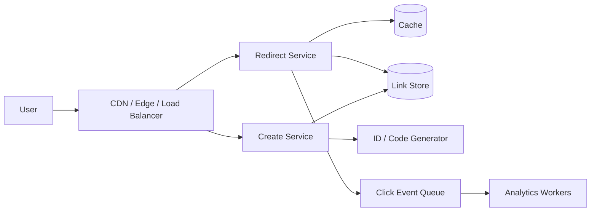

# Case Study: URL Shortener

## Prompt

Design a service that converts a long URL into a short URL and redirects users from the short URL to the original destination.

## Clarifying Questions

- Are aliases immutable after creation?
- Are custom aliases required?
- Do links expire?
- Do we need click analytics?
- Is redirect latency more important than create latency?
- Is malicious URL detection in scope?

## Requirements

### Functional

- Create a short URL.
- Redirect by short code.
- Optional expiration.
- Optional custom alias.
- Capture click events asynchronously.

### Non-functional

- Redirect path is highly available and low latency.
- Generated codes must be unique.
- Redirects may tolerate short-lived cache staleness if mappings are immutable.
- Analytics must not block redirects.

## Back-of-the-Envelope Estimates

Assume 100 million new links/month, a 100:1 redirect-to-create ratio, 500-byte stored records, and five years of retention.

```text
creates average  ~= 100M / 30 days ~= 39 writes/s
redirect average ~= 3,900 reads/s; design peak at 10x ~= 39,000 reads/s
records in 5 y   ~= 6B
raw mapping data ~= 6B * 500 B ~= 3 TB before indexes/replicas
```

The read/write asymmetry justifies a cache and CDN-friendly redirect path. The dataset size and hot-link skew matter more than average create throughput.

## APIs

```http
POST /v1/links
Content-Type: application/json

{
  "url": "https://example.com/very/long/path",
  "expiresAt": null,
  "customAlias": null
}
```

```json
{
  "code": "aZ91Kx",
  "shortUrl": "https://sho.rt/aZ91Kx"
}
```

Redirect:

```http
GET /aZ91Kx
```

## Data Model

```text
Link
- code             primary lookup key
- destination_url
- created_at
- expires_at
- owner_id         optional
```

The dominant access pattern is `code -> destination_url`, so the storage key should support direct point lookup.

## High-Level Architecture



## Create Flow

1. Validate the destination URL.
2. If a custom alias exists, reserve it conditionally.
3. Otherwise generate a unique ID/code.
4. Persist the mapping.
5. Return the short URL.

### Code Generation Options

**Random code**

- Simple and decentralized.
- Requires collision handling.
- Sufficient entropy makes collisions rare.

**Sequence ID + Base62**

- Collision-free once an ID is allocated.
- Predictable codes can reveal traffic volume unless obfuscated.
- Centralized sequence allocation can become a bottleneck unless ranges are leased.

The choice depends on predictability/security requirements and write scale.

## Redirect Flow

1. Read mapping from cache.
2. On miss, query the link store.
3. Populate cache.
4. Emit analytics asynchronously.
5. Return a `301` or `302` based on product semantics.

## Caching

Caching is valuable because redirects are read-heavy and the mapping is small.

Design decisions:

- key: short code;
- value: destination + expiry metadata;
- long TTL when links are immutable;
- negative-cache missing codes briefly to reduce repeated abuse;
- protect hot links from cache stampedes.

## Partitioning

Partition by a hash of the short code when one node can no longer hold or serve the dataset.

Avoid range partitioning on monotonically increasing IDs if it creates a hot newest partition.

## Failure Modes

### Cache unavailable

Fall back to the database while protecting it with stricter load shedding. Do not let every cache failure become an uncontrolled database stampede.

### Analytics queue unavailable

Do not fail redirects. Buffer only within bounded limits; dropping low-value analytics may be preferable to harming the critical path.

### Database replica lag

A newly created link may not exist on a lagging read replica. Use read-your-write routing, primary read fallback, or write-through cache for the creation response path.

## Security and Abuse

- malware/phishing checks;
- block unsafe schemes such as `javascript:`;
- per-user/IP rate limits;
- custom alias ownership;
- prevent open internal-network SSRF if the service previews destinations.

## Observability

Track:

- redirect p50/p95/p99;
- cache hit ratio;
- database read latency;
- not-found rate;
- create collision/retry rate;
- click-event backlog;
- redirect error rate.

## Trade-offs

The key design choice is optimizing the read path without making cache availability a hard dependency. The database remains the source of truth; the cache is an acceleration layer.

## Request Walkthrough

For a redirect, the edge routes by geography, the service validates the code format, reads a positive or short negative cache entry, and falls back to the authoritative store on miss. It checks expiry before returning the redirect. A click event with code, coarse client context, event ID, and occurrence time is published asynchronously under a strict time budget; analytics failure never changes the redirect outcome.

## Bottlenecks and Evolution Triggers

- Cache hit ratio falls or store read latency threatens the redirect SLO: add request coalescing, prewarming for known hot links, and cache isolation.
- One link exceeds a cache node or region: replicate that key broadly and serve at the edge; keep analytics sampling/aggregation separate.
- Store size or write maintenance exceeds one partition: hash-partition by code and version routing for online movement.
- Editable links become common: replace effectively immutable long TTLs with versioned invalidation and reconsider `301` caching semantics.
- Global availability requires regional writes: give each code one home authority or allocate collision-free code namespaces; define failover ownership.

## Interview Check

Explain why short-lived negative caching is useful but dangerous immediately after create, why a cache outage needs database admission control, and why globally unique IDs do not by themselves solve regional ownership.

## Follow-ups

- Support 10 billion links.
- A celebrity link receives 1 million redirects/second.
- Links must be editable.
- Redirects must work globally under regional failure.
- Add per-click fraud detection without adding 100 ms to redirect latency.
