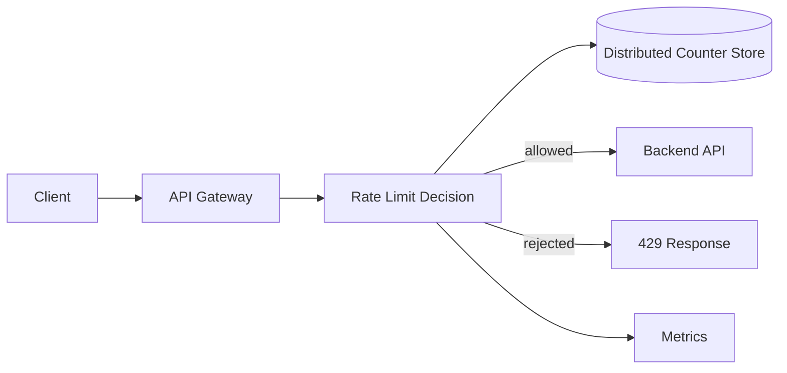

# Case Study: Distributed Rate Limiter

## Prompt

Design a rate limiter for a public API used by many application servers across multiple availability zones.

## Requirements

- Apply limits by API key, user, IP, endpoint, or tenant.
- Return a clear rejection when the limit is exceeded.
- Support different plans and limits.
- Work across many stateless API servers.
- Add minimal latency to the request path.
- Fail in a deliberate way if the limiter dependency is unhealthy.

## Where It Runs

Common placements:

- CDN/edge for coarse abuse protection;
- API gateway for shared API limits;
- application for domain-specific quotas.

Large systems often use multiple layers.

## Algorithms

### Fixed Window

Simple counter per time window.

Pros: cheap and easy.

Con: allows bursts around window boundaries.

### Sliding Log

Store each request timestamp.

Pros: accurate.

Con: expensive at high traffic.

### Sliding Window Counter

Approximate a sliding window using neighboring counters.

Good balance of accuracy and storage.

### Token Bucket

Tokens replenish at a configured rate and requests consume tokens.

Supports controlled bursts and is a strong general-purpose choice.

## High-Level Architecture



## Key Model

```text
rate:{tenant}:{route}:{policy-version}
```

The key must match the policy boundary. Avoid a key that causes unrelated tenants or endpoints to contend on the same hot counter.

## Atomicity

A read-then-write sequence is unsafe:

```text
GET counter
counter = counter + 1
SET counter
```

Concurrent requests can oversubscribe the limit.

Use an atomic increment/expiry operation, server-side script, transaction, or purpose-built rate-limit primitive.

## Consistency

Perfect global consistency can be expensive and add cross-region latency.

Decide what the quota protects:

- login/brute-force control may favor stricter enforcement;
- ordinary API fairness may tolerate bounded overshoot;
- billing quotas may require a durable accounting path separate from fast admission control.

## Multi-Region Options

### Regional budgets

Allocate each region part of the global quota.

Pros: low latency and region independence.

Cons: unused quota in one region cannot immediately be used elsewhere.

### Central global counter

Pros: precise global policy.

Cons: cross-region latency and availability dependency.

### Hybrid

Lease quota to regions and periodically reconcile. Often a strong compromise for large global systems.

## Failure Policy

Explicitly choose:

### Fail open

Allow traffic when the limiter is unavailable.

Use when availability is more important and downstream systems can protect themselves.

### Fail closed

Reject traffic when the limiter is unavailable.

Use for sensitive operations where abuse risk exceeds availability cost.

Different endpoints may use different policies.

## Hot Keys

A massive tenant can create one hot counter. Mitigations include:

- hierarchical limits;
- regional/local token buckets;
- counter sharding with bounded approximation;
- tenant-specific partitions;
- edge enforcement before centralized enforcement.

## Response Contract

```http
HTTP/1.1 429 Too Many Requests
Retry-After: 12
```

Expose limit metadata when useful, but do not reveal unnecessary anti-abuse details.

## Observability

Track:

- limiter latency;
- allowed/rejected counts by policy;
- dependency error rate;
- fail-open/fail-closed events;
- hot-key concentration;
- store saturation;
- policy configuration errors.

## Trade-offs

Rate limiting is not just an algorithm question. The important design decisions are enforcement scope, atomicity, acceptable overshoot, failure policy, and hot-key behavior.

## Follow-ups

- Enforce one global quota across 20 regions.
- A single tenant sends 30% of all requests.
- The counter store is down for 3 minutes.
- Add dynamic limits based on server load.
- Add a monthly billing quota without putting the billing database on the request path.
