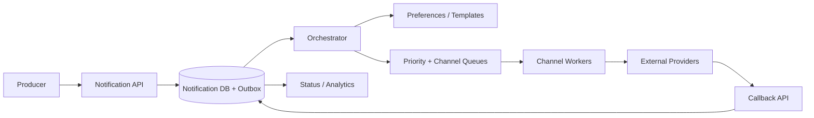

# Case Study: Multi-Channel Notification System

## Prompt

Design a service that sends transactional and bulk notifications through push, SMS, email, and in-app channels while respecting user preferences, provider limits, and delivery objectives.

## Clarifying Questions and Requirements

- Transactional messages such as OTPs and receipts are higher priority than campaigns.
- The caller receives durable acceptance, not a promise of end-user delivery.
- Users can opt out by category/channel; legally required messages have separate policy.
- Templates are versioned and localized.
- Duplicate provider requests should be minimized and reconciled.
- Target: 99.9% of accepted priority messages handed to a provider within 10 seconds; campaigns may take hours.

## Estimates

Assume 500 million notifications/day, 10x peak, average 1 KB event, and three channel attempts per logical notification in the worst case.

```text
average logical rate ~= 5,800/s; peak ~= 58,000/s
peak attempts        ~= 174,000/s
raw event volume     ~= 500 GB/day before replication/metadata
```

Attempt amplification and provider quotas drive channel isolation and scheduling more than raw storage.

## API and Events

```http
POST /v1/notifications
Idempotency-Key: order-91-receipt-v1

{
  "recipientId": "u123",
  "category": "ORDER_RECEIPT",
  "templateId": "receipt-v4",
  "channels": ["push", "email"],
  "variables": {"orderId": "91"},
  "priority": "transactional"
}
```

Return `202` with a stable `notificationId`. Emit immutable `NotificationAccepted`, `ChannelAttempted`, and `DeliveryStatusChanged` events.

## Data Model and Authority

```text
Notification(id, idempotency_key, recipient_id, category, template_version,
             priority, state, created_at, expires_at)
ChannelAttempt(notification_id, channel, attempt_no, provider,
               provider_operation_id, state, next_attempt_at, error_class)
Preference(recipient_id, category, channel, allowed, version)
ProviderCallback(provider, callback_id, operation_id, status, received_at)
```

A unique `(caller, idempotency_key)` prevents duplicate logical requests. Preference state is authoritative at orchestration time; sending services receive the evaluated decision plus version for audit.

## Architecture and Flow



The API commits notification plus outbox and returns. The orchestrator resolves preferences, locale, template version, channel fallback, expiry, and scheduled time. It publishes channel work keyed by notification. Workers enforce provider quotas, reuse one operation key for retries, classify results, and persist attempt state before acknowledgement. Callbacks are deduplicated and may advance but not regress the state machine.

## Ordering, Retries, and Ambiguity

Strict global order is unnecessary. Per-notification state transitions use versions. OTPs expire rather than waiting behind bulk mail. Transient errors retry with jitter within the notification deadline; permanent address errors suppress further unchanged attempts. A timeout after provider submission is ambiguous: query provider status or retry with the same provider idempotency key.

DLQs are separated by channel and reason with an owned, targeted replay workflow. Campaign retry traffic cannot consume transactional capacity.

## Failure Handling

- Preference service unavailable: use a recent version only where policy permits; fail closed for marketing consent.
- One provider degraded: circuit-break it and route to a configured provider, preserving per-provider operation identity.
- Queue backlog rises: shed expired/low-priority campaigns and reserve transactional capacity.
- Callback duplicated/out of order: deduplicate callback ID and apply monotonic status transitions.
- Database committed but publish failed: transactional outbox relays at least once.

## Security and Privacy

Encrypt contact addresses, restrict template variables, prevent header/HTML injection, sign and verify provider callbacks, and avoid message bodies in logs. Consent changes, template publication, and operator replay are audited. Retention and deletion policies cover payloads, provider metadata, and analytics.

## Observability and SLOs

Measure durable acceptance, oldest queue age by priority/channel, provider handoff latency, attempt amplification, provider response classes, callback lag, expired-before-send, preference suppression, and terminal delivery state. Trace with notification and attempt IDs without attaching personal content.

## Tradeoffs and Evolution Triggers

- One queue is simple but permits campaigns to starve OTPs; split by priority/channel as volume grows.
- Pre-rendering fixes the exact content for audit but stores sensitive/large payloads; render late from immutable template and variables when acceptable.
- Provider abstraction improves failover, but least-common-denominator APIs hide channel-specific capabilities.
- Move orchestration to an explicit durable workflow engine when multi-step fallback, delays, and compensation become difficult to recover from database state.

## Interview Follow-ups

- A provider accepted an SMS but timed out. How do you avoid double-send?
- A user opts out while a campaign is queued. Which preference version wins?
- How do you drain a two-hour email backlog without delaying OTPs?
- What does “delivered” mean for each channel?

## Two-Minute Answer

Durably accept an idempotent logical notification into a database plus outbox, then orchestrate immutable template version, preference, expiry, priority, and channel policy asynchronously. Isolate priority/channel queues and provider pools. Workers persist attempt state, use stable provider operation keys, retry classified transient failures within an age budget, and reconcile ambiguous outcomes/callbacks. Reserve critical capacity, expire stale messages, protect consent, and measure oldest age and accepted-to-provider SLO separately from provider or device delivery.

