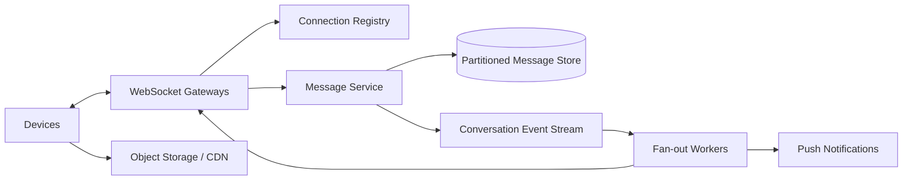

# Case Study: Real-Time Chat

## Prompt

Design one-to-one and group chat with multi-device delivery, message history, offline synchronization, typing indicators, presence, and attachments.

## Requirements and Assumptions

- Message history is durable; presence and typing indicators may be lossy.
- Order is stable within a conversation, not globally.
- A sender can retry without creating another visible message.
- Online recipients should see messages within 300 ms at p99 in-region.
- Offline devices synchronize from a durable cursor.
- Groups initially support 500 members; very large broadcasts are a later design.

## Estimates

Assume 50 million daily users, 5 million concurrent connections, 2 billion messages/day, 5x peak, 500-byte average stored message, and 30-day hot retention.

```text
average messages ~= 23,000/s; peak ~= 115,000/s
raw message data ~= 1 TB/day
concurrent socket memory at 20 KB ~= 100 GB across gateways
```

Persistent connection state, per-conversation write authority, and history storage dominate.

## APIs and Protocol

```text
SEND {conversation_id, client_message_id, expected_membership_version,
      body_or_attachment_ref}
ACK  {client_message_id, message_id, conversation_sequence}
SYNC {device_id, conversation_cursors[]} -> messages + next cursors
```

Gateway frames carry authentication context, connection ID, and bounded payload size. Attachments upload separately to object storage using short-lived signed URLs.

## Data Model

```text
Conversation(id, type, home_shard, next_sequence, membership_version)
Membership(conversation_id, user_id, role, joined_sequence, left_sequence)
Message(conversation_id, sequence, message_id, sender_id,
        client_message_id, body_ref, created_at)
DeviceCursor(device_id, conversation_id, last_delivered_sequence)
```

Unique `(conversation_id, sender_id, client_message_id)` gives idempotent sends. `(conversation_id, sequence)` is the history key and stable order.

## Architecture



Gateways authenticate and maintain sockets but are not message authorities. A conversation routes to one logical write shard, which validates membership, assigns the next sequence, and commits message plus outbox/event. Fan-out locates online device connections; offline devices later sync from durable history.

## Ordering and Delivery

Server-assigned conversation sequence defines display order. The client may render a pending local message and replace it on ACK. Missing sequences trigger a history fetch. Delivery is at least once; devices deduplicate by message ID. Read receipts are separate idempotent, monotonic cursors rather than one row per message per device.

Large groups make write-time fan-out expensive. For ordinary groups, fan-out to online connections plus push is reasonable. For broadcast-scale rooms, subscribers pull from a conversation stream and gateways multiplex delivery.

## Presence and Ephemeral Signals

Presence is a soft lease per device with heartbeat expiry and aggregation to user state. It can be stale and should not share the durable message log. Typing indicators are rate-limited, lossy, and expire within seconds. Do not retry them after their useful window.

## Failure Handling

- Gateway dies: clients reconnect with jitter and resume from cursors; no durable message is lost.
- Sender times out after commit: retry same client message ID and receive the original sequence.
- Fan-out fails: durable event remains and online delivery repeats; history sync is the correctness fallback.
- Hot conversation: isolate its partition, batch frames, and switch to pull/multicast-style fan-out.
- Regional partition: route writes to conversation home or make the conversation read-only; do not create two sequence authorities casually.

## Security and Privacy

Check membership on send and history read, rate-limit abuse, scan attachments asynchronously, encrypt transport and storage, and use short-lived object URLs. End-to-end encryption materially changes server search, moderation, key distribution, multi-device history, and recovery; clarify it rather than bolting it onto this design.

## Observability

Track connected sessions, reconnect rate, send-to-commit and commit-to-online-delivery latency, sequence gaps, sync lag, fan-out retries, hot conversations, push backlog, and membership authorization failures. Sample traces because socket/message volume is high.

## Tradeoffs and Evolution Triggers

- One sequence authority per conversation gives clear order but a hot-room ceiling.
- Storing per-device delivery rows is precise but explodes writes; cursors compress monotonic state.
- Global home routing adds remote latency; migrating conversation ownership needs an epoch and fenced cutover.
- Add search through an asynchronous index whose lag is explicit; history store remains authoritative.

## Interview Follow-ups

- How do multiple devices avoid duplicate visible messages?
- What happens if membership changes concurrently with send?
- How would 1 million users join a live event room?
- How does end-to-end encryption change notifications and history recovery?

## Two-Minute Answer

Use stateless WebSocket gateways backed by a connection registry, but make a partitioned message service authoritative. Route each conversation to one write owner, validate a membership version, assign a sequence, and commit message plus event idempotently. Fan-out is at least once; clients dedupe and fill gaps from durable history cursors. Keep presence/typing as expiring lossy state, store attachments separately, isolate hot rooms, and recover gateway loss by reconnect plus sync rather than relying on socket delivery.

