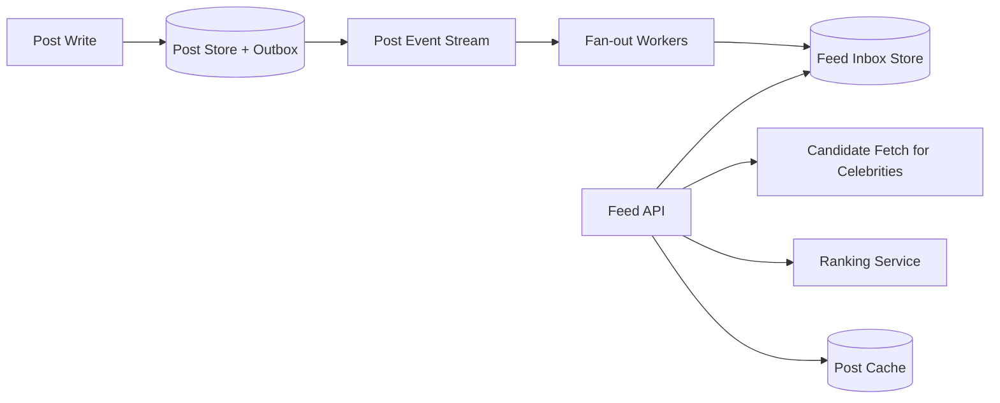

# Case Study: News Feed

## Prompt

Design a personalized home feed containing posts from followed accounts, ranked with freshness, supporting pagination, deletes, privacy changes, and celebrity publishers.

## Requirements and Assumptions

- Users create posts, follow/unfollow, and read a ranked feed.
- Normal posts appear for most followers within 5 seconds.
- Feed reads target 300 ms at p99.
- Deletes and visibility changes must propagate with higher priority than ranking refresh.
- Exact global ordering is unnecessary; pagination should be stable enough to avoid loops.

## Estimates

Assume 100 million daily users, 20 feed reads/user/day, 50 million posts/day, average 300 follows, 10x read peak, and 2 KB post metadata.

```text
feed reads average ~= 23,000/s; peak ~= 230,000/s
post writes average ~= 580/s
naive fan-out writes ~= 15B feed references/day at 300 followers/post
```

Fan-out amplification and celebrity skew are the primary constraints.

## APIs

```http
POST /v1/posts
GET /v1/feed?cursor=opaque&limit=30
DELETE /v1/posts/{postId}
PUT /v1/follows/{authorId}
```

The cursor encodes ranking/model version, last score/tie-breaker, and snapshot/freshness boundary; it is signed and treated as opaque.

## Data Model

```text
Post(post_id, author_id, content_ref, visibility_version, state, created_at)
Follow(follower_id, author_id, state, version)
Inbox(user_id, candidate_score_bucket, post_id, source_version, inserted_at)
AuthorOutbox(author_id, created_at, post_id)
FeedCursor(user_id, generation, model_version, built_through)
```

The post service is authoritative for post existence/visibility; follow service owns graph edges. Feed inboxes are derived and rebuildable.

## Architecture



For ordinary authors, fan-out-on-write inserts lightweight post references into follower inboxes. For celebrities, the system avoids millions of immediate writes and merges recent author posts at read time. The feed API retrieves candidates, filters current visibility, ranks, hydrates posts, and returns a cursor.

## Ranking and Pagination

Ranking combines freshness, relationship, predicted engagement, diversity, and policy constraints. Store model/version and candidate provenance for debugging. Use score plus unique post ID as a stable tie-breaker. Because feeds change, promise cursor continuity rather than a perfectly immutable snapshot unless the product requires it.

Cache hydrated posts, not final personalized pages with uncontrolled invalidation. Apply block/privacy/delete filters on the serving path even if async fan-out has not removed stale candidates.

## Failure Handling

- Fan-out backlog: serve recent candidates from author outboxes and expose freshness lag; prioritize delete/privacy events.
- Ranking service slow: use a simpler deterministic freshness/affinity ranker under its own deadline.
- Inbox partition hot: partition by user, isolate enormous inboxes, cap retained candidates.
- Duplicate events: feed insertion keyed by `(user_id, post_id, source_version)` is idempotent.
- Follow change races: serving-time relationship/visibility validation prevents unauthorized content.

## Security and Abuse

Authorization is not delegated to a stale feed row. Enforce blocks, audience, moderation state, and tenant boundary during hydration/serving. Rate-limit scraping and recommendation manipulation. Minimize sensitive features in ranking logs and give deletion a bounded propagation objective.

## Observability

Measure read latency, candidate count, cache hit ratio, fan-out and delete propagation age, empty/partial feeds, ranking fallback rate, hot-author amplification, stale-reference filtering, model distribution, and user-facing freshness/quality guardrails.

## Tradeoffs and Evolution Triggers

- Fan-out-on-write gives fast reads but massive write/storage amplification.
- Fan-out-on-read avoids inbox writes but makes every read expensive and dependent on the graph.
- Hybrid threshold handles celebrity skew but adds two candidate paths and merge complexity.
- Move graph adjacency to a specialized/sharded store when follow lookup dominates; keep graph updates evented and versioned.

## Interview Follow-ups

- How do you handle an author with 100 million followers?
- A private post was made public and private again. What can stale inboxes expose?
- How do you keep pagination from duplicating or skipping everything as scores change?
- How would you run a ranking experiment safely?

## Two-Minute Answer

Keep posts and follow edges authoritative and feeds derived. Use fan-out-on-write for ordinary authors, storing lightweight idempotent references per user, and fan-out-on-read for celebrity posts. At read time merge candidates, re-check current visibility, rank under a deadline, hydrate via cache, and paginate with a signed score/model cursor. Prioritize deletion/privacy propagation, provide a cheap ranking fallback, and monitor fan-out lag, hot-author amplification, stale filtering, latency, and quality.

