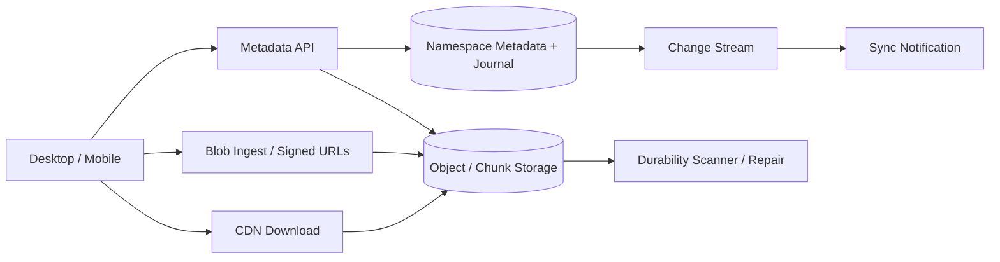

# Case Study: Object Storage and Dropbox-Style Synchronization

## Prompt

Design a file synchronization service supporting large uploads, folders, multi-device change sync, sharing, versions, deduplication, and reliable blob storage.

## Requirements and Assumptions

- Files up to 100 GB use resumable multipart upload.
- Metadata operations are strongly consistent per namespace.
- Blob bytes are immutable and addressed by content/chunk identifiers.
- Devices receive an ordered change cursor and can recover after being offline.
- Conflicting offline edits are preserved, not silently overwritten.
- Downloads target high availability; metadata changes target no acknowledged loss.

## Estimates

Assume 50 million users, 2 PB of new logical data/day, average stored chunk 4 MB, 3x blob replication/erasure overhead equivalent of 1.5x, and 10 metadata changes per active user/day.

```text
new chunks/day upper bound ~= 2 PB / 4 MB ~= 500M before dedupe
metadata mutations          ~= 500M/day ~= 5,800/s average
physical new bytes          depends on dedupe and durability coding
```

The data plane must bypass application servers; metadata, upload sessions, and change journals are the transactional core.

## APIs

```text
POST /uploads {path, size, base_revision, chunk_hashes} -> session + missing chunks
PUT  signed-chunk-url
POST /uploads/{id}/commit {manifest_hash, idempotency_key}
GET  /changes?namespace_id=...&cursor=...
GET  /files/{id}/download -> signed URL / manifest
```

## Data Model and Invariants

```text
Node(namespace_id, node_id, parent_id, name, type, current_revision, state)
Revision(node_id, revision, manifest_id, size, author_device, created_at)
Manifest(manifest_id, ordered_chunk_hashes, total_size)
Chunk(hash, size, storage_locations, durability_state, ref_state)
Change(namespace_id, sequence, operation, node_id, revision)
UploadSession(id, namespace_id, target, base_revision, state, expires_at)
```

A unique `(namespace, parent, normalized_name)` enforces directory naming. Commit checks `base_revision`; a race creates a conflict copy or returns an explicit conflict. Blob reference accounting is asynchronous and conservative so a reachable chunk is never garbage-collected.

## Architecture



The client chunks locally and hashes content. The API returns which chunks are missing. Clients upload directly, then commit a manifest and metadata mutation atomically with a namespace change sequence. Other devices receive a wake-up hint and pull journal entries after their cursor; the journal, not the push, is correctness.

## Durability and Garbage Collection

A commit becomes visible only after required chunk durability is confirmed or the manifest references a durable staging state. Background scrubbing verifies checksums and repairs lost fragments across failure domains.

Deletion creates a tombstone and version-retention deadline. Garbage collection traces or reference-counts manifests conservatively, waits through upload/version/replay grace periods, and rechecks reachability before deleting chunks. Deduplication may be scoped per tenant to avoid cross-tenant information leakage.

## Failure Handling

- Interrupted upload: resume missing chunks using the session; expire abandoned staging safely.
- Commit response lost: retry same idempotency key and return committed revision.
- Device cursor too old: return a namespace snapshot plus new journal position.
- Concurrent edits: conditional base revision preserves both versions and signals conflict.
- Blob region degraded: route to another durable location; metadata must not advertise unavailable durability.
- Corrupt chunk: checksum fails, quarantine replica, repair from an independent fragment/copy.

## Security and Privacy

Authorize every namespace/node operation; signed URLs are short-lived, method- and object-scoped. Encrypt in transit and at rest, isolate tenant dedupe if needed, scan shared content under policy, audit sharing/restore, and make deletion/retention semantics explicit. Convergent encryption enables dedupe but leaks equality and needs careful threat modeling.

## Observability

Track upload commit latency, chunk reuse, incomplete sessions, journal lag, sync cursor age, conflicts, download success, checksum failures, repair backlog, durability-domain coverage, garbage-collection candidates versus deletions, and metadata hot namespaces.

## Tradeoffs and Evolution Triggers

- Fixed chunks are simple; content-defined chunks improve reuse after insertions but cost CPU and complexity.
- Whole-file blobs simplify manifests but make resume/delta sync expensive.
- Metadata strongly consistent per namespace preserves rename/path invariants while blob replication remains asynchronous.
- Very large shared folders may require namespace subdivision and a versioned directory index.

## Interview Follow-ups

- How do you prevent garbage collection from deleting a chunk during commit?
- What happens when two offline devices edit the same revision?
- How would end-to-end encryption change dedupe, previews, and sharing?
- How is a billion-file namespace listed and synchronized?

## Two-Minute Answer

Separate a strongly consistent metadata plane from an immutable blob data plane. Clients hash/chunk, upload missing chunks directly with resumable sessions, then atomically commit a manifest, file revision, and per-namespace change sequence using an idempotency key and base revision. Devices pull changes from durable cursors; push only wakes them. Replicate/encode chunks across failure domains, checksum and repair continuously, preserve conflicts, and garbage-collect only after tombstones, retention, and reachability revalidation.

