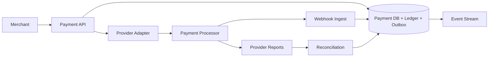

# Case Study: Payment System

## Prompt

Design a payment platform that accepts card payments through external processors, supports authorization, capture, refund, webhooks, a double-entry ledger, and reconciliation.

## Requirements and Invariants

- Clients can safely retry every mutation.
- A payment has an explicit state machine; responses are queryable after timeouts.
- Money is represented in integer minor units with an explicit currency.
- Ledger entries balance: total debits equal total credits per transaction and currency.
- Captured amount never exceeds authorized amount; refunded amount never exceeds captured amount.
- Provider outcome and internal state are reconciled; no “exactly once” claim crosses the provider boundary.
- Card data is tokenized by a compliant provider; this service minimizes sensitive scope.

## Estimates

Assume 10,000 payment operations/second at peak, 5 ledger postings per operation, seven years of ledger retention, and 2 KB total transactional metadata.

```text
ledger line peak ~= 50,000 writes/s
raw operation data at 10k/s ~= 1.7 TB/day if sustained (peak is not average)
```

The write path is modest relative to internet-scale feeds but correctness, audit, and provider throttling dominate.

## API and State

```http
POST /v1/payments
Idempotency-Key: checkout-781-payment-1
{"amount": 1299, "currency": "USD", "paymentMethodToken": "pm_..."}

POST /v1/payments/{id}/capture
POST /v1/payments/{id}/refunds
GET  /v1/payments/{id}
```

Return a stable payment ID and states such as `REQUIRES_ACTION`, `PROCESSING`, `AUTHORIZED`, `CAPTURED`, `FAILED`, or `UNKNOWN_PENDING_RECONCILIATION`. Never turn an ambiguous timeout into a definitive failure.

## Data Model

```text
Payment(id, merchant_id, idempotency_key, amount, currency,
        state, version, provider, provider_operation_id)
PaymentAttempt(id, payment_id, attempt_generation, provider_key,
               request_hash, state, response_ref, created_at)
LedgerTransaction(id, business_operation_id, currency, created_at)
LedgerEntry(transaction_id, account_id, direction, amount)
ProviderEvent(provider, event_id, operation_id, type, occurred_at)
ReconciliationItem(provider_record_id, internal_id, status, reason)
```

Unique merchant/idempotency key maps the same request body to the same payment; a different body under that key is rejected. Ledger rows are append-only, with corrections expressed as new reversing entries.

## Architecture and Critical Flow



For create, validate money/currency and idempotency, persist an attempt, then call the provider with a stable provider idempotency key. Persist the result and required balanced ledger transaction under an optimistic state version. If the call times out, mark the attempt unknown, query the provider, and let webhook/reconciliation converge it. The API exposes the queryable state throughout.

Exactly which step posts ledger entries depends on whether the ledger models pending authorization, settled funds, fees, and merchant liability. Define accounts before drawing entries.

## Concurrency and Saga

Capture and refund use conditional state/version updates and unique business operation IDs. Concurrent refunds serialize on payment authority and check remaining refundable amount. A checkout saga may reserve inventory before payment and release it on terminal failure; compensation is a business action, not a database rollback.

Use the [canonical transaction and saga chapter](../databases/sql/transactions.md) for the underlying patterns.

## Failure Handling and Reconciliation

- Response lost after provider acceptance: query by stable operation key; do not create a new payment.
- Webhook duplicate/out of order: unique provider event ID and valid monotonic state transitions.
- Database unavailable after provider response: provider idempotency plus reconciliation repairs the internal record.
- Event publication fails after commit: transactional outbox retries.
- Provider degraded: circuit breaker and durable processing state; switching providers mid-intent may double charge unless the first outcome is resolved.
- Ledger imbalance: reject the whole local transaction and page; never “fix” it with an in-place edit.

Daily reconciliation compares provider transaction/settlement reports with attempts and ledger totals, classifies unmatched records, and creates auditable repair work.

## Security and Observability

Tokenize payment methods, encrypt sensitive metadata, apply least privilege and dual control to money-moving operations, sign/verify webhooks, prevent replay, and audit every state/ledger transition. Track authorization/capture/refund success, unknown outcomes, provider latency/errors, duplicate suppression, webhook lag, reconciliation breaks/age, ledger-balance checks, and end-to-end checkout SLOs without logging credentials.

## Tradeoffs and Evolution Triggers

- Synchronous provider call gives immediate UX but creates ambiguous latency; an async intent model improves resilience with more client state.
- One relational authority simplifies payment/ledger invariants; shard by merchant/payment when throughput or isolation requires it, keeping each money invariant local.
- Multi-provider routing improves availability, but token portability, differing semantics, reconciliation, and ambiguous failover are substantial.

## Interview Follow-ups

- Provider says success but your database has no record. What happens?
- Two refunds race for the final refundable amount.
- How do you migrate a merchant to another region without two payment authorities?
- Which ledger accounts change on authorization versus settlement?

## Two-Minute Answer

Make every mutation an idempotent, queryable payment operation with a versioned state machine. Use integer minor units and a local transactional authority that commits state, balanced append-only ledger entries, and outbox events. Call providers with stable idempotency keys; timeouts become unknown, then webhooks, status queries, and reconciliation converge the result. Conditional updates protect capture/refund limits, switching providers waits for ambiguity resolution, and security/audit controls cover tokens, webhooks, operators, and ledger corrections.

