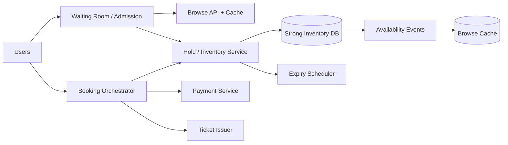

# Case Study: Ticket Booking System

## Prompt

Design a system for browsing an event, selecting reserved seats, holding them temporarily, paying, and issuing tickets under extreme on-sale contention.

## Requirements and Invariants

- A seat has at most one active hold or confirmed booking.
- Holds expire after a product-defined interval, such as five minutes.
- Payment can complete near hold expiry without selling the same seat twice.
- Browse availability can be slightly stale; the booking authority cannot.
- Users receive fair, bounded admission during major drops.
- Confirmation is durable and queryable after client timeout.

## Estimates

Assume a 50,000-seat event, 2 million users arriving in 2 minutes, 10 seat-map refreshes per admitted user, and 5% eventually attempting a hold.

```text
edge arrival peak       ~= 16,700 users/s before refresh amplification
hold attempts total     ~= 100,000, highly concentrated
inventory write keys    = 50,000 seats for this event
```

The challenge is contention and admission fairness, not dataset size.

## APIs

```text
GET  /events/{event}/availability?section=...
POST /holds {event_id, seat_ids, idempotency_key} -> hold_id, expires_at
POST /bookings {hold_id, payment_method_token, idempotency_key}
GET  /bookings/{id}
DELETE /holds/{id}
```

## Data Model and State

```text
Seat(event_id, seat_id, state, hold_id, hold_expires_at, booking_id, version)
Hold(id, user_id, event_id, state, expires_at, version)
Booking(id, hold_id, user_id, amount, state, payment_id, version)
Ticket(id, booking_id, seat_id, signed_token, state)
AdmissionToken(event_id, user_id, epoch, expires_at, max_operations)
```

The inventory partition containing a seat is authoritative. A conditional transition `AVAILABLE -> HELD` with the same hold ID must succeed for every requested seat or none. Keep seats requested together on one event partition where practical.

## Architecture



The waiting room limits active buyers using signed, short-lived admission tokens and a transparent ordering policy. Browsing uses derived availability. Hold creation executes one conditional transaction at the inventory authority and returns authoritative expiry. Booking moves the hold into `CONFIRMING`, executes payment as a saga, then atomically confirms seats and issues ticket records.

## Hold Expiry and Payment Race

Do not rely solely on a delayed “release hold” job. Every inventory transaction evaluates expiry at the authoritative store. When booking begins before expiry, conditionally transition the hold to `CONFIRMING` and extend ownership for a bounded payment window. An expiry worker includes hold ID/version so it cannot release a renewed or confirmed seat.

If payment succeeds but confirmation fails, keep the seat fenced by the confirming operation and retry; if the invariant cannot be completed, refund/void through a compensating action. The booking state remains queryable.

## Failure Handling

- Client retries hold: same idempotency key returns the same hold.
- Availability cache says free but conditional hold loses: return conflict and nearby alternatives.
- Expiry worker delayed: read/write path still treats expired holds as available under an atomic takeover rule.
- Payment response lost: query the payment operation; never create a new charge identity.
- Inventory partition unavailable: reject booking for that event rather than accept an unprovable reservation.
- Hot event overload: waiting room, per-user operation cap, bounded queue, no aggressive retries.

## Security and Abuse

Admission tokens are signed and bound to event/user/expiry. Prevent bot amplification with risk-based challenges, request cost limits, and purchase caps. Price and seat ownership are server-derived, not client-trusted. Tickets use rotating signed identifiers and a scan state that prevents replay while allowing controlled offline validation policy.

## Observability

Track queue wait/admission rate, hold latency/conflicts, seat hot spots, active/expired/confirming holds, expiry lag, payment ambiguity, oversell invariant checks, bookings per admitted user, bot signals, refund compensation, and event-partition saturation.

## Tradeoffs and Evolution Triggers

- Pessimistic row locks are direct but long transactions destroy throughput; short conditional transitions keep remote payment outside locks.
- Per-seat precision supports reserved seating; general admission may use atomic counters or leased inventory blocks.
- One event partition simplifies atomic multi-seat holds but becomes a hot authority; subdivide sections only if cross-section holds have a coordination rule.
- Fair queueing trades immediate access for predictable capacity and auditability.

## Interview Follow-ups

- A payment succeeds one millisecond after the hold expires.
- Users select seats across two inventory shards.
- How do you prevent an expiry job from releasing a confirmed seat?
- How would general-admission tickets change the model?

## Two-Minute Answer

Keep authoritative seat state in a strongly consistent event partition. Admit a bounded number of buyers through a signed waiting-room token; serve browse availability from a derived cache. Create all requested holds with one conditional, idempotent state transition and authoritative expiry. Booking first fences the hold in `CONFIRMING`, then runs payment outside the inventory transaction and confirms or compensates through a queryable saga. Every expiry action carries hold version, all paths recheck expiry at the authority, and overload is rejected before inventory collapses.

