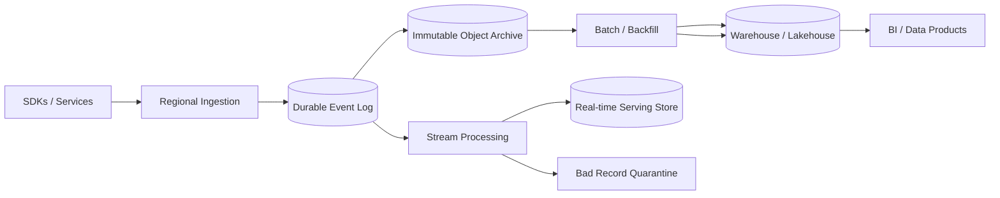

# Case Study: Analytics Event Pipeline

## Prompt

Design a pipeline that accepts product events, supports near-real-time dashboards and daily aggregates, permits schema evolution and replay, and tolerates late, duplicated, and out-of-order events.

## Requirements and Assumptions

- Producers emit immutable events with stable IDs and occurrence time.
- Ingestion acknowledges durable acceptance within 200 ms at p99.
- Operational dashboards are fresh within one minute; corrected daily numbers within 24 hours.
- Raw events are retained for 90 days; curated aggregates longer.
- Duplicate ingestion and at-least-once processing are expected.
- Personal data is minimized and deletions propagate through defined datasets.

## Estimates

Assume 2 million events/second peak, 1 KB compressed average, 7-day hot stream retention, and 100 logical event types.

```text
ingress peak ~= 2 GB/s
raw/day at sustained peak ~= 173 TB (actual daily sizing uses traffic curve)
7-day replicated stream can be petabyte scale
```

Partition count, network, retention tiering, and downstream write amplification must be tested with the real traffic curve.

## Event Contract

```json
{
  "eventId": "uuid",
  "eventType": "CheckoutCompleted",
  "schemaVersion": 3,
  "occurredAt": "...",
  "producer": "checkout",
  "tenantId": "...",
  "partitionKey": "...",
  "payload": {},
  "traceContext": "..."
}
```

The ingestion API validates authentication, size, required envelope, and registered schema, then appends to a durable partitioned log. It does not perform analytical transformations synchronously.

## Architecture



The raw archive is the replay source. Stream jobs validate/enrich, deduplicate within a declared window, aggregate by event time, and write idempotent/versioned results. Batch jobs produce authoritative corrected aggregates and can rebuild serving tables into a new version before atomic cutover.

## Partitioning, Time, and Semantics

Partition by a key needed for per-entity order, while salting or isolating known hot tenants. Global arrival order is neither required nor feasible. Preserve occurrence, ingestion, and processing time separately.

Watermarks estimate event-time completeness. A window accepts late updates through an allowed-lateness policy; later records go to a correction stream or next batch. Exactly-once platform claims are scoped: sinks use transactional commits, unique `(job, input range, output key/version)`, or idempotent upserts.

## Schema Evolution and Data Quality

Use additive evolution, explicit defaults, compatibility gates, ownership, and a supported version window. Quarantine syntactically valid but semantically impossible records with reason and sample controls. Quality rules measure missing fields, range violations, volume discontinuity, referential gaps, and freshness.

Do not expose raw internal table CDC as a permanent analytics contract without curation. See [Schema evolution and replay](../messaging/schema-evolution-and-replay.md).

## Failure Handling

- Ingest region fails: SDK buffers within bounds or routes to another region with same event ID.
- Consumer falls behind: retention headroom and lag alert; scale without overwhelming sinks.
- Job deploy is wrong: stop, reset to checkpoint, rebuild outputs under a new version.
- Poison record: quarantine without blocking its whole partition where semantics permit.
- Object archive delayed: do not delete stream retention until durable archive checkpoint is confirmed.
- Replay competes with live data: separate quotas/pools and rate-limit sinks.

## Security and Governance

Authenticate producers, authorize event types, encrypt transport/storage, classify fields, tokenize identifiers, and block secrets at ingestion. Catalog lineage from producer through transformations to dashboards. Deletion requests need discoverable subject mappings or privacy-preserving design; immutable retention is not an excuse to ignore policy.

## Observability

Track accepted/rejected event rates, partition skew, end-to-end event-time freshness, consumer lag, watermark delay, duplicates, quarantine rate/reasons, schema versions, archive checkpoint, checkpoint duration, sink errors, data-quality SLOs, and replay consumption.

## Tradeoffs and Evolution Triggers

- One universal event schema is easy to query but becomes a weak contract; typed events with a stable envelope preserve domain meaning.
- Longer lateness improves completeness but delays finality and grows state.
- Stream results improve freshness; batch correction improves completeness. A single versioned transformation definition reduces divergence.
- Introduce separate regional ingestion and central archive when latency/resilience demands it; define duplicate and residency policy.

## Interview Follow-ups

- A mobile device uploads events three days late. Which dashboards change?
- How do you replay 30 days without resending external effects or crushing the warehouse?
- One tenant owns 40% of one partition.
- How do you honor deletion across raw and derived data?

## Two-Minute Answer

Regional ingestion validates a stable envelope and durably appends immutable, uniquely identified events to a partitioned log. Archive raw data before retention expires. Stream processing uses event time, watermarks, bounded dedupe, and idempotent/versioned sinks for fresh views; batch/backfill creates corrected outputs and atomically replaces versions. Enforce schema compatibility and lineage, quarantine bad records, isolate replay capacity, and measure freshness, lag, skew, quality, archive safety, and privacy workflows end to end.

