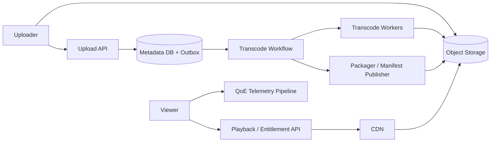

# Case Study: Video Streaming Platform

## Prompt

Design video upload, processing, catalog publication, and global adaptive playback through a CDN, including resumability, content protection, and quality-of-experience measurement.

## Requirements and Assumptions

- Large uploads are resumable and idempotent.
- A video becomes playable only after required renditions and manifests are ready.
- Playback starts within 2 seconds at p95 and minimizes rebuffering.
- Clients adapt bitrate to changing bandwidth/device capability.
- Origin failure should not interrupt already cached popular content.
- Private/paid video uses short-lived authorization and optional DRM.

## Estimates

Assume 10 million uploads/day averaging 500 MB and 5 million concurrent viewers averaging 4 Mbps.

```text
ingest logical bytes ~= 5 PB/day
viewer egress peak   ~= 20 Tbps
```

This makes direct origin delivery impossible economically and operationally; CDN hit ratio, rendition ladder, and encoding/storage amplification are first-order choices.

## APIs

```text
POST /videos -> video_id, multipart upload session
PUT  signed upload part URL
POST /videos/{id}/complete {parts, idempotency_key}
GET  /videos/{id}/playback -> signed manifest URL, policy
POST /playback-events -> batched QoE telemetry
```

## Data Model

```text
Video(id, owner_id, source_object, state, policy_version, metadata)
Asset(video_id, rendition, codec, segment_prefix, checksum, state)
Manifest(video_id, packaging, version, object_key, published_at)
TranscodeJob(id, video_id, profile, generation, state, attempt)
Entitlement(subject_id, video_id_or_catalog, rights, expires_at, version)
```

Source and rendition objects are immutable. A publish transaction advances the catalog to one manifest version only after its required assets are durable.

## Architecture



The uploader sends parts directly to object storage and commits an upload manifest. A durable workflow probes the file, scans it, transcodes a codec/bitrate ladder, packages short media segments, validates checksums, and atomically publishes the manifest. Playback authorizes the viewer and returns a signed manifest. The client fetches segments through CDN and changes rendition based on measured throughput and buffer.

## Processing Idempotency

Each job key includes video, source generation, rendition profile version, and output generation. Retrying writes the same immutable output or a new unpublished generation. Workflow completion derives from durable job states; a lost queue acknowledgement cannot double-publish. Failed renditions may be retried independently, while the publish policy declares the minimum playable set.

## CDN and Playback

Segments are immutable, content-versioned, and cacheable for long periods. Manifests are versioned and shorter-lived. Multi-CDN routing can use measured regional performance and cost, but rapid traffic shifts risk overloading an origin or alternate CDN.

Signed URLs/cookies constrain asset, viewer/session, region if required, and expiry. Authorization at manifest issuance is insufficient for very long sessions unless segment tokens or license renewal enforce continuing rights.

## Failure Handling

- Upload interrupted: list committed parts and resume; abandoned sessions expire.
- Transcoder crashes: lease expires and another worker retries same job generation.
- One rendition corrupt: checksum/probe fails it before publication.
- Origin unavailable: CDN serves cached immutable segments; misses fail over to a replicated origin.
- Viral video: prewarm top segments/manifests, request-collapse origin misses, shield caches, and protect origin with admission limits.
- Telemetry pipeline unavailable: batch locally within a bound; playback continues.

## Security and Abuse

Validate media formats in sandboxed workers, scan content, constrain signed upload/download URLs, enforce tenant object prefixes, rotate signing keys, protect DRM/license services, rate-limit scraping, and keep authorization fail-closed for paid content. Takedown must invalidate catalog/authorization quickly even though immutable bytes remain cached until purge/expiry.

## Observability

Track upload success/resume, processing queue age, time-to-playable, per-stage failures, rendition validation, CDN hit/egress/origin load, playback startup, rebuffer ratio, bitrate switches, fatal playback errors, entitlement latency, token failures, and QoE by device/network/region. Client telemetry is sampled and privacy-limited.

## Tradeoffs and Evolution Triggers

- More renditions improve adaptation but multiply compute/storage and cache fragmentation.
- Short segments adapt/recover faster but add request/manifest overhead.
- Pre-encoding all formats simplifies playback; just-in-time packaging reduces storage with origin compute risk.
- Move from one CDN to multi-CDN when availability/performance/cost evidence justifies routing and operational complexity.

## Interview Follow-ups

- A video goes viral before its segments are cached.
- How do you update a bad rendition without stale mixed manifests?
- How does live streaming change ingest, latency, and DVR retention?
- A user's entitlement is revoked during playback.

## Two-Minute Answer

Upload directly and resumably to immutable object storage, then drive probe, scan, transcode, package, validate, and publish through a durable idempotent workflow. Only one manifest generation becomes visible after required renditions are durable. Serve immutable versioned segments through shielded CDN origins; authorize playback with short-lived tokens and adapt bitrate client-side. Protect origin from viral misses, retry processing by stable job generation, and monitor time-to-playable plus client startup/rebuffer QoE, not just server uptime.

