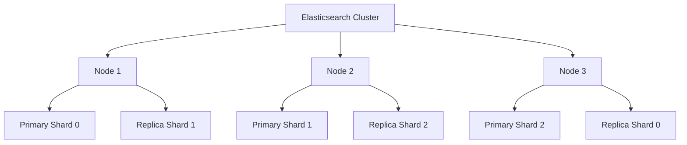
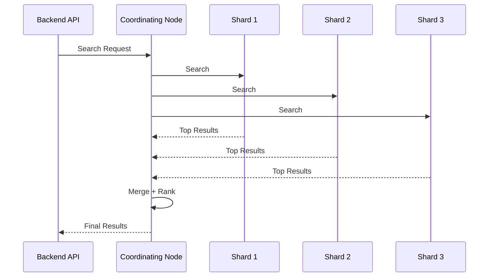
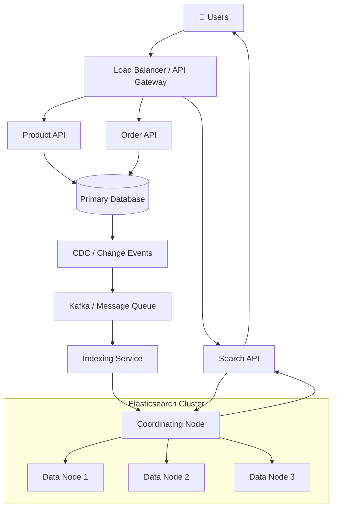
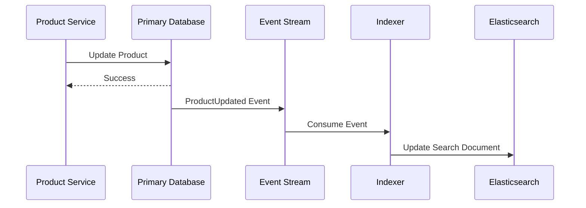
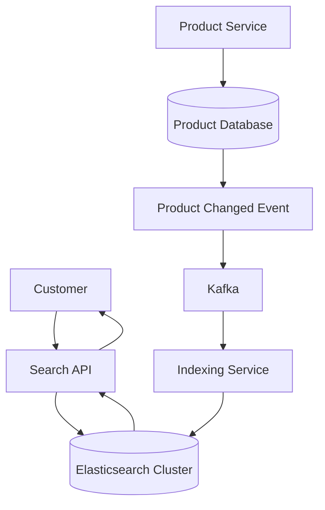

# 🔎 Elasticsearch

Elasticsearch helps systems search millions of products, logs, documents, or users in milliseconds.

Elasticsearch is a distributed **search and analytics engine** built for fast retrieval, relevance-based search, filtering, aggregations, and large-scale data exploration.

It is commonly used for:

* 🔍 Full-text search
* 🛒 Product search
* 📊 Analytics
* 📜 Log search
* 🔎 Autocomplete
* 🎯 Relevance ranking
* 🏷️ Filtering & faceted search
* 📈 Observability
* 🤖 Vector / semantic search
* 🌍 Geo search

This document focuses on **how Elasticsearch fits into backend system design**, not just how to write search queries.

---

## 🧠 Core Concepts

### 1. Document

Elasticsearch stores data as **JSON documents**.

Example product:

```json
{
  "id": "product_101",
  "name": "Mechanical Keyboard",
  "description": "Wireless RGB mechanical keyboard",
  "category": "electronics",
  "brand": "KeyPro",
  "price": 5999,
  "rating": 4.7
}
```

A document is similar conceptually to:

```text
MongoDB → Document

PostgreSQL → Row

Elasticsearch → Searchable Document
```

But Elasticsearch is designed around **search and analytics workloads**.

---

### 2. Index

Documents are stored inside an **index**.

For example:

```text
products
├── product_101
├── product_102
├── product_103
└── product_104
```

Other indices might be:

```text
users
orders
products
application-logs
search-events
```

Think of an index as a logical collection of related searchable documents.

---

### 3. Mapping

A mapping defines how document fields should be indexed and interpreted.

Example:

```json
{
  "mappings": {
    "properties": {
      "name": {
        "type": "text"
      },
      "category": {
        "type": "keyword"
      },
      "price": {
        "type": "double"
      },
      "createdAt": {
        "type": "date"
      }
    }
  }
}
```

Choosing the correct field type matters.

#### `text`

Use for full-text search:

```text
"Wireless Mechanical Keyboard"
```

Elasticsearch analyzes the text before indexing it.

---

#### `keyword`

Use for exact values:

```text
electronics
premium
ACTIVE
IN_STOCK
```

Ideal for:

* Filters
* Sorting
* Aggregations
* Exact matches

---

#### Numeric Fields

Examples:

```text
integer
long
float
double
```

Useful for:

```text
Price
Quantity
Rating
Score
```

---

#### Date

Useful for:

```text
createdAt
updatedAt
timestamp
```

---

### 4. Inverted Index

The **inverted index** is one of the most important Elasticsearch concepts.

Suppose we have:

```text
Document 1:
"Wireless Mechanical Keyboard"

Document 2:
"Wireless Gaming Mouse"

Document 3:
"Mechanical Gaming Keyboard"
```

Instead of searching every document individually, Elasticsearch builds something conceptually similar to:

```text
Wireless
   ├── Document 1
   └── Document 2

Mechanical
   ├── Document 1
   └── Document 3

Keyboard
   ├── Document 1
   └── Document 3

Gaming
   ├── Document 2
   └── Document 3
```

Now searching:

```text
mechanical keyboard
```

can quickly identify matching documents.

Conceptually:

```text
Query
  ↓
Find matching terms
  ↓
Lookup documents
  ↓
Calculate relevance
  ↓
Rank results
```

This is why Elasticsearch can perform full-text search efficiently at scale.

---

### 5. Analysis

Before text becomes searchable, Elasticsearch can process it through an **analyzer**.

Conceptually:

```text
"The Wireless KEYBOARD"
          ↓
       Analyzer
          ↓
the
wireless
keyboard
```

An analyzer commonly includes stages such as:

```text
Character Filters
       ↓
Tokenizer
       ↓
Token Filters
```

For example:

```text
"Wireless Mechanical Keyboard"

          ↓

wireless
mechanical
keyboard
```

Analysis makes natural-language search possible.

---

### 6. Full-Text Search

Suppose the user searches:

```text
wireless mechanical keyboard
```

Elasticsearch can search analyzed text fields and rank matching documents.

Example:

```json
{
  "query": {
    "match": {
      "name": "wireless mechanical keyboard"
    }
  }
}
```

Results may look conceptually like:

```text
1. Wireless Mechanical Keyboard      Score: 9.8
2. Mechanical Gaming Keyboard        Score: 7.1
3. Wireless Keyboard                 Score: 6.5
```

Unlike a simple database lookup, search is often about:

> **Which result is most relevant?**

not only:

> **Does this exact value exist?**

---

### 7. Relevance Scoring

Elasticsearch assigns search results a relevance score.

For example:

```text
Search:
"mechanical keyboard"

          ↓

Product A → 9.3
Product B → 7.8
Product C → 4.2
```

The highest-scoring documents generally appear first.

Relevance can also be influenced by business requirements.

For an e-commerce search:

```text
Text Relevance
      +
Popularity
      +
Rating
      +
Availability
      +
Business Rules
```

could contribute to ranking.

Search quality is therefore both:

```text
Information Retrieval
        +
Business Logic
```

---

### 8. Query vs Filter

This distinction is important.

#### Query

Usually asks:

> **How well does this document match?**

Example:

```text
Search for:
"gaming keyboard"
```

Relevance matters.

---

#### Filter

Usually asks:

> **Does this document satisfy this condition?**

Example:

```text
category = electronics
price < 10000
brand = KeyPro
inStock = true
```

There is usually no need to calculate relevance for these conditions.

A product search could combine both:

```text
Search:
"mechanical keyboard"

AND

category = electronics

AND

price <= ₹10,000

AND

rating >= 4
```

---

### 9. Aggregations

Elasticsearch is not limited to returning search results.

It can also calculate analytics over matching documents.

Imagine searching:

```text
"running shoes"
```

The UI may show:

```text
Brand
├── Nike       1,250
├── Adidas       980
├── Puma          620
└── New Balance   410

Price
├── ₹0–₹2,000      540
├── ₹2,000–₹5,000  1,320
└── ₹5,000+         880
```

These counts can be generated using **aggregations**.

This powers features such as:

```text
Faceted Search
Dashboards
Analytics
Histograms
Category Counts
Price Buckets
```

---

## 🧩 Distributed Architecture

### 10. Shards

An Elasticsearch index can be split into multiple **primary shards**.

Imagine:

```text
products index

10,000,000 documents
```

Instead of placing everything in one shard:

```text
             products

     ┌──────────┼──────────┐
     ↓          ↓          ↓

  Shard 0    Shard 1    Shard 2
```

Each shard holds part of the index.

Conceptually:

```text
10M Products

      ↓

Shard 0 → Part A

Shard 1 → Part B

Shard 2 → Part C
```

This allows Elasticsearch to distribute storage and work across multiple nodes.

---

### 11. Replica Shards

A **replica shard** is a copy of a primary shard.

```text
Primary Shard 0
       ↓
Replica Shard 0
```

Replicas help with:

```text
High Availability
+
Failure Recovery
+
Read Capacity
```

For example:

```text
Node A
└── Primary Shard 0

Node B
└── Replica Shard 0
```

If Node A becomes unavailable, Elasticsearch still has another copy of the shard.

---

### 12. Nodes and Cluster

A group of Elasticsearch nodes forms a **cluster**.



The cluster distributes shards across nodes.

The high-level idea is:

```text
Index
  ↓
Shards
  ↓
Nodes
  ↓
Cluster
```

---

### 13. Search Execution

Imagine a query reaches Node 1.

Node 1 might need data stored on several other shards.

Conceptually:



At a high level:

```text
Search Request
      ↓
Coordinating Node
      ↓
Fan out to relevant shards
      ↓
Each shard searches locally
      ↓
Results returned
      ↓
Merge + Rank
      ↓
Final Response
```

This distributed search model is one reason Elasticsearch can scale search workloads horizontally.

---

## ⏱️ Near Real-Time Search

Elasticsearch search is generally **near real-time**, not necessarily immediately visible after every write.

Conceptually:

```text
Document Indexed
      ↓
Not necessarily searchable immediately
      ↓
Refresh
      ↓
Document becomes searchable
```

This is an important system-design trade-off.

Elasticsearch optimizes for:

```text
Search Performance
+
Indexing Throughput
+
Distributed Scalability
```

rather than behaving exactly like a strongly transactional relational database.

---

## 🏗️ Backend Architecture

A common production architecture does **not** make Elasticsearch the only copy of important business data.

A typical pattern looks like this:



The key idea is:

```text
PostgreSQL / MongoDB
        =
Source of Truth

        ↓

Events / CDC

        ↓

Indexing Pipeline

        ↓

Elasticsearch
        =
Search-Optimized Read Model
```

This separation is extremely useful.

The transactional database handles:

```text
Orders
Payments
Inventory
User Updates
Transactions
```

while Elasticsearch handles:

```text
Search
Filtering
Ranking
Aggregations
Autocomplete
Analytics
```

---

## 🔄 Data Synchronization Architecture

Imagine a product price changes.

```text
₹5,999
  ↓
₹4,999
```

A common flow is:



This creates **eventual consistency** between the transactional database and Elasticsearch.

For many search systems, that is an acceptable trade-off.

---

## ⚔️ Elasticsearch vs PostgreSQL

Elasticsearch and PostgreSQL solve different problems.

| Area                      | Elasticsearch                | PostgreSQL             |
| ------------------------- | ---------------------------- | ---------------------- |
| Primary strength          | Search & analytics           | Transactional data     |
| Full-text relevance       | ⭐ Excellent                  | Good                   |
| Exact CRUD                | Supported                    | ⭐ Excellent            |
| Complex transactions      | Not primary strength         | ⭐ Excellent            |
| Joins                     | Limited / modeling-dependent | ⭐ Excellent            |
| Aggregations              | ⭐ Excellent                  | Excellent              |
| Horizontal search scaling | ⭐ Excellent                  | Architecture-dependent |
| Search ranking            | ⭐ Excellent                  | More limited           |
| Flexible search           | ⭐ Excellent                  | Good                   |
| Source of truth           | Usually not first choice     | ⭐ Excellent            |
| Search autocomplete       | ⭐ Excellent                  | Possible               |
| Distributed indexing      | Native design                | Architecture-dependent |

#### Use PostgreSQL when you need:

```text
Payments
Orders
Bank balances
Transactions
Strong relational constraints
Complex joins
Business-critical state
```

#### Use Elasticsearch when you need:

```text
Product search
Log search
Autocomplete
Filtering
Search relevance
Aggregations
Large-scale text retrieval
```

Very commonly:

```text
PostgreSQL
    +
Elasticsearch
```

is more appropriate than choosing only one.

> **Use your database to store truth. Use Elasticsearch to find that truth quickly.**

---

## 🌍 Real-World Example — E-Commerce Search

Imagine an e-commerce platform with:

```text
10M+ products
5M+ users
Thousands of searches per second
Multiple categories
Hundreds of brands
Frequent price changes
```

Users expect searches such as:

```text
"wireless gaming keyboard under 5000"
```

and want results instantly.

---

### Without Elasticsearch

You might try:

```sql
SELECT *
FROM products
WHERE name LIKE '%wireless gaming keyboard%'
AND price < 5000;
```

This may be insufficient when the product experience also requires:

```text
Typo tolerance
Relevance
Autocomplete
Synonyms
Facets
Brand filtering
Category filtering
Price ranges
Popularity ranking
Millions of searchable documents
```

---

## 🛒 E-Commerce Search Architecture



The read path remains simple:

```text
Customer
   ↓
Search API
   ↓
Elasticsearch
   ↓
Ranked Products
```

while updates happen separately:

```text
Product DB
   ↓
Change Event
   ↓
Kafka
   ↓
Indexer
   ↓
Elasticsearch
```

---

## 🔎 Example Search

User searches:

```text
wireless mechanical keyboard
```

The backend might send:

```json
{
  "query": {
    "bool": {
      "must": [
        {
          "match": {
            "name": "wireless mechanical keyboard"
          }
        }
      ],
      "filter": [
        {
          "term": {
            "category.keyword": "electronics"
          }
        },
        {
          "range": {
            "price": {
              "lte": 10000
            }
          }
        }
      ]
    }
  }
}
```

Conceptually:

```text
Full-Text Search
      +
Category Filter
      +
Price Filter
      ↓
Relevant Products
```

---

## 🎯 Search Ranking

Search ranking might consider:

```text
Text Relevance
      +
Product Popularity
      +
Customer Rating
      +
Availability
      +
Recency
```

For example:

```text
Query:
"mechanical keyboard"

             SCORE

Product A     9.6
Product B     8.4
Product C     7.1
Product D     5.3
```

The challenge is not merely:

> **Find matching documents.**

It is:

> **Put the best result first.**

---

## 🔤 Autocomplete

Suppose the user types:

```text
mech
```

The application may suggest:

```text
mechanical keyboard
mechanical gaming keyboard
mechanical keyboard wireless
mechanical keyboard red switches
```

Conceptually:


Autocomplete should normally use search structures designed for autocomplete instead of repeatedly running expensive unrestricted wildcard searches.

---

## 🏷️ Faceted Search

Users often expect:

```text
Search Results

Filters
│
├── Brand
│   ├── Logitech  320
│   ├── Razer     260
│   └── Corsair   180
│
├── Price
│   ├── Under ₹2K       210
│   ├── ₹2K–₹5K         390
│   └── Above ₹5K       160
│
└── Rating
    ├── 4★+             510
    └── 3★+             690
```

Elasticsearch aggregations are well suited to generating these counts alongside search results.

---

## 📈 Scaling the Search System

Start simple:

```text
Backend
   ↓
Elasticsearch
```

Then:

```text
Backend
   ↓
Elasticsearch Cluster
   ↓
Multiple Nodes
```

At greater scale:

```text
                     Search Traffic
                           ↓
                    Search Service
                           ↓
                Elasticsearch Cluster
                  /        |        \
                 ↓         ↓         ↓
              Node A     Node B    Node C
              P0 + R2    P1 + R0   P2 + R1
```

where:

```text
P = Primary Shard
R = Replica Shard
```

Scaling Elasticsearch requires thinking about:

```text
Shard count
Shard size
Heap
Disk
CPU
Query patterns
Indexing rate
Replica count
Search traffic
```

---

## ✅ Best Practices

### 1. Don't Automatically Use Elasticsearch as Your Primary Database

For many backend systems:

```text
Primary Database
       ↓
Source of Truth

Elasticsearch
       ↓
Search Projection
```

This gives each system a job it performs well.

---

### 2. Design Mappings Intentionally

Do not rely blindly on automatic field detection for important production indices.

Define fields based on how they will be queried.

For example:

```text
productName → text
productId   → keyword
category    → keyword
price       → double
createdAt   → date
```

The mapping is part of your system design.

---

### 3. Understand `text` vs `keyword`

One of the most important Elasticsearch distinctions:

```text
text
 ↓
Full-text search
```

versus:

```text
keyword
 ↓
Exact match
Filtering
Sorting
Aggregations
```

Using the wrong type can lead to confusing search behavior and inefficient queries.

---

### 4. Use Bulk Indexing

Bad:

```text
Document 1 → request
Document 2 → request
Document 3 → request
Document 4 → request
...
```

Better:

```text
Document 1 ┐
Document 2 │
Document 3 ├── Bulk Request
Document 4 │
Document 5 ┘
```

For large ingestion workloads, batching documents can significantly reduce request overhead.

---

### 5. Avoid Too Many Shards

More shards do not automatically mean more performance.

Too many shards create:

```text
More metadata
More memory overhead
More coordination
More open files
More recovery work
```

Think:

> **Enough shards for capacity and scalability — not as many shards as possible.**

---

### 6. Choose Replica Count Based on Requirements

Replicas improve:

```text
Availability
+
Recovery options
+
Search capacity
```

but replicas also require:

```text
Additional disk
+
Additional indexing work
```

Choose them based on availability and workload requirements.

---

### 7. Separate Search Queries From Exact Filters

Instead of treating everything as full-text search:

```text
category
brand
status
country
productId
```

usually belong in exact filters when appropriate.

Use relevance scoring only where relevance is actually useful.

---

### 8. Avoid Deep Offset Pagination

This:

```text
page = 10000
size = 20
```

can become expensive because Elasticsearch may need to process large numbers of earlier results.

For deep pagination, prefer approaches such as:

```text
search_after
```

where appropriate.

---

### 9. Use Aliases for Safe Index Changes

Imagine production reads from:

```text
products_search
```

which points to:

```text
products_v1
```

After rebuilding the index:

```text
products_v2
```

switch the alias:

```text
products_search
       ↓
products_v2
```

Conceptually:

```text
Before

products_search
      ↓
products_v1


After

products_search
      ↓
products_v2
```

This is useful for migrations, reindexing, and zero/low-downtime index transitions.

---

### 10. Keep Search Documents Search-Oriented

Your database entity might contain:

```text
70 fields
```

but the search experience may only need:

```text
id
name
description
category
brand
price
rating
availability
```

Do not blindly copy every internal field into the search index.

Design documents around:

```text
Search Requirements
        +
Ranking Requirements
        +
Filtering Requirements
```

---

### 11. Tune Refresh Behavior for the Workload

More frequent refreshes improve how quickly newly indexed data becomes searchable.

But aggressively forcing refreshes also adds work.

Ask:

```text
Does this document need to be searchable immediately?

or

Is a short delay acceptable?
```

Search systems often tolerate slight indexing delay in exchange for better throughput.

---

### 12. Monitor Cluster Health

Monitor:

```text
Cluster health
Search latency
Indexing latency
CPU
Heap usage
Disk usage
GC pressure
Shard distribution
Rejected requests
Query failures
Indexing failures
Node availability
```

A distributed search system needs operational visibility.

---

### 13. Test Search With Real Data

Search that looks great with:

```text
100 products
```

may behave completely differently with:

```text
10,000,000 products
```

Test:

```text
Query latency
Index size
Indexing throughput
Relevance
Hot queries
Shard distribution
Aggregation cost
```

using realistic workloads.

---

## ❌ Common Mistakes

### 1. Using Elasticsearch as a Drop-In Replacement for a Transactional Database

Elasticsearch excels at:

```text
Search
Analytics
Filtering
Ranking
```

That does not automatically make it the best system for:

```text
Payments
Money transfers
Inventory transactions
Relational integrity
Complex multi-entity transactions
```

Choose storage based on requirements.

---

### 2. Creating Too Many Shards

Bad assumption:

```text
More Shards
    =
More Performance
```

Reality:

```text
Too Many Shards
      ↓
More Coordination
      +
More Memory
      +
More Operational Complexity
```

Shard planning matters.

---

### 3. Using `text` for Everything

Fields such as:

```text
status
countryCode
productId
category
```

often require exact matching rather than full-text analysis.

Do not make everything a full-text field.

---

### 4. Using `keyword` for Everything

The opposite is also bad.

If:

```text
product_description
```

is stored only as a keyword-like exact field, searching natural language becomes ineffective.

Model fields according to query behavior.

---

### 5. Ignoring Mapping Explosion

Uncontrolled dynamic fields can lead to huge mappings.

Imagine indexing arbitrary JSON like:

```text
attribute_1
attribute_2
attribute_3
...
attribute_100000
```

This creates unnecessary cluster-state and memory pressure.

Control the shape of indexed documents.

---

### 6. Deep Pagination With Large `from`

Avoid patterns conceptually like:

```text
from = 500000
size = 20
```

for large result sets.

Deep pagination causes Elasticsearch to do unnecessary work.

Use an appropriate cursor-style approach such as `search_after` when necessary.

---

### 7. Running Expensive Wildcard Queries Everywhere

Queries conceptually like:

```text
*keyboard*
```

may become expensive at scale.

Instead, design:

```text
Analyzers
Autocomplete fields
Prefix strategies
Search-as-you-type behavior
```

for the actual product experience.

---

### 8. Force Refreshing After Every Write

Bad architecture:

```text
Index document
      ↓
Force refresh

Index document
      ↓
Force refresh

Index document
      ↓
Force refresh
```

This sacrifices indexing throughput just to make every document immediately searchable.

Decide whether the business actually needs that level of freshness.

---

### 9. Ignoring Relevance

A search system is not successful merely because it returns matching documents.

Bad:

```text
Search:
"iphone case"

Top Result:
USB Cable
```

even if some irrelevant text happens to match.

Measure:

```text
Click-through rate
Zero-result searches
Search abandonment
Conversion
Query reformulation
```

Search quality is a product problem as well as an engineering problem.

---

### 10. No Recovery Strategy

Ask:

```text
What happens if a node dies?

What happens if an index becomes corrupted?

Can the index be rebuilt?

Where is the source data?

How long does recovery take?
```

Distributed systems must be designed around failure.

---

## 🎤 Interview Questions

### 1. What is an inverted index?

**Answer:**
An inverted index maps terms to the documents containing those terms, allowing Elasticsearch to locate matching documents without scanning every document.

```text
Term
 ↓
Documents containing term
```

---

### 2. What is the difference between a primary shard and a replica shard?

**Answer:**

A primary shard contains an authoritative partition of an index.

A replica shard is a copy of a primary shard used for redundancy and additional read/search capacity.

```text
Primary
   ↓
Replica
```

---

### 3. Why shouldn't Elasticsearch automatically replace PostgreSQL or MongoDB?

**Answer:**
Elasticsearch is optimized primarily for search and analytics, while transactional databases are generally better suited to authoritative business data, transactions, constraints, and transactional consistency.

A common architecture is:

```text
Database
   ↓
Source of Truth

Elasticsearch
   ↓
Search Index
```

---

### 4. What is the difference between a query and a filter?

**Answer:**

A query typically asks:

```text
How relevant is this document?
```

while a filter asks:

```text
Does this document satisfy this condition?
```

Use filters for exact conditions such as:

```text
brand = Apple
price < 50000
inStock = true
```

---

### 5. How would you scale Elasticsearch for millions of documents?

**Answer:**
Distribute the index using appropriately sized primary shards across multiple data nodes, use replicas for availability/read capacity, monitor shard sizes and cluster resources, and scale nodes according to indexing and search workloads.

Do not simply increase the shard count blindly.

---

## 🎯 Key Takeaways

### 1. Elasticsearch Is a Search Engine, Not Just Another Database

Think:

```text
Database
    ↓
Store Correct Business State

Elasticsearch
    ↓
Find Relevant Information Fast
```

Its biggest strengths are:

```text
Search
+
Relevance
+
Filtering
+
Aggregations
+
Distributed Retrieval
```

---

### 2. Good Search Starts With Good Data Modeling

Search performance is heavily influenced by:

```text
Mappings
+
Analyzers
+
Shard Strategy
+
Query Design
+
Document Structure
```

Do not wait until production traffic arrives to think about them.

---

### 3. Scale Search Based on Workload

Start:

```text
Application
     ↓
Database
```

Add search when needed:

```text
Application
     ↓
Search Service
     ↓
Elasticsearch

Database
     ↓
Indexing Pipeline
     ↓
Elasticsearch
```

At scale:

```text
                    Search API

                        ↓

              Elasticsearch Cluster

          ┌─────────────┼─────────────┐
          ↓             ↓             ↓

       Node A         Node B        Node C

      P0 + R2        P1 + R0       P2 + R1
```

The goal is not to create the most complicated architecture.

The goal is to create the **simplest architecture that satisfies your search, scale, availability, and freshness requirements.**

---

## 🧠 Elasticsearch System Design Mental Model

When Elasticsearch appears in a system-design interview, think through:

```text
                  ELASTICSEARCH
                        │
        ┌───────────────┼───────────────┐
        │               │               │
        ↓               ↓               ↓

       DATA           SEARCH          SCALE

        │               │               │

        ↓               ↓               ↓

     Mapping         Analyzer         Shards
     Documents       Query            Replicas
     Fields          Filters          Nodes
     Index           Ranking          Cluster
                     Aggregations
```

Then ask:

```text
1. What data needs to be searchable?

2. What is the source of truth?

3. How quickly must updates appear in search?

4. How will documents be indexed and updated?

5. What queries and filters will users run?

6. How will relevance be measured?

7. How large will the index become?

8. How many searches per second are expected?

9. What happens when a node fails?

10. Can the search index be rebuilt?
```

If you can answer those questions, you're no longer just learning Elasticsearch APIs.

You're **designing a search system**.

---

If this document helped you understand Elasticsearch from a system-design perspective, **⭐ star the repository and follow for more backend system-design breakdowns.**
