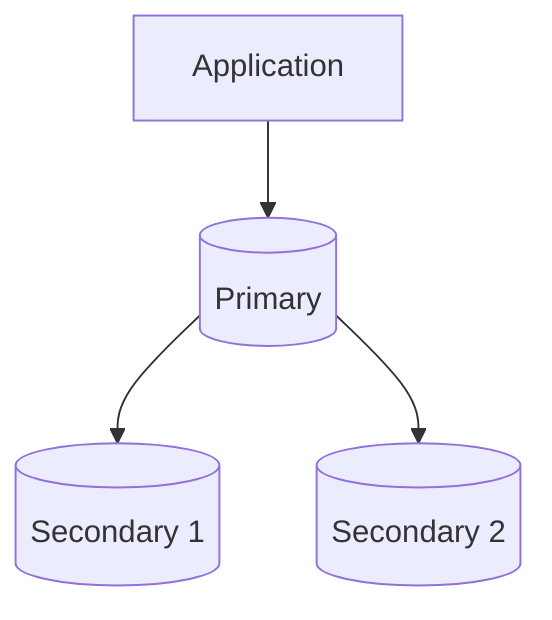
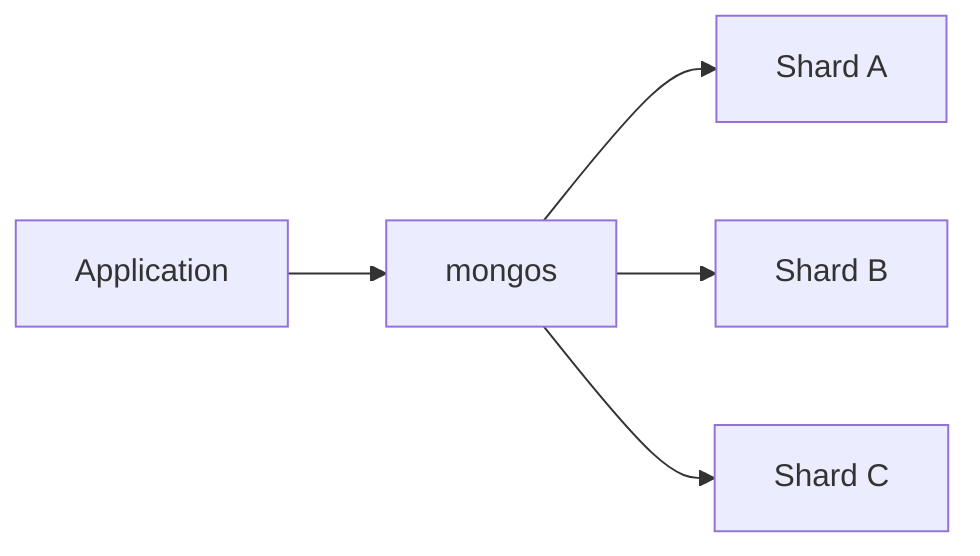

# MongoDB for System Design

MongoDB is a document database with replica sets, sharding, secondary indexes, aggregation, transactions, change streams, and configurable read/write concerns.

Its strongest system-design value appears when the **document is the natural consistency and access boundary**.

Do not choose MongoDB because “the schema is flexible” or “NoSQL scales.” Choose it because the document model and distribution strategy fit the workload.

---

## Interview TL;DR

1. Model around **access patterns and ownership boundaries**, not a direct table-to-collection translation.
2. Single-document operations are atomic; embedding can reduce cross-document coordination.
3. Multi-document and distributed transactions exist, but they have higher cost and should not replace good schema design.
4. Replica sets provide high availability; read concern, write concern, and read preference determine important consistency/durability behavior.
5. Default read concern is commonly `local`; data read at that level can later roll back in some failure scenarios.
6. Majority write concern and majority read concern provide stronger durability/consistency properties; linearizable read concern is stronger and can be slower.
7. Sharding distributes data, but a bad shard key creates hot chunks or scatter/gather queries.
8. High shard-key cardinality is insufficient by itself; consider **frequency, monotonicity, and query targeting**.
9. Secondary reads can be stale. Read preference is a routing policy, not a consistency guarantee.
10. MongoDB and PostgreSQL are workload choices, not “scale vs transactions.”

---

# 1. Document Model

Example:

```json
{
  "_id": "order-1001",
  "customerId": "user-10",
  "status": "PAID",
  "items": [
    {
      "productId": "p-1",
      "nameAtPurchase": "Keyboard",
      "priceAtPurchase": 5999,
      "quantity": 1
    }
  ],
  "createdAt": "..."
}
```

Ask:

> What data must be read and changed together?

The document is a natural atomicity boundary.

---

# 2. Embedding vs Referencing

## Embed when

- child belongs to one aggregate/owner
- data is usually read together
- updates are naturally coordinated
- collection is bounded
- atomic single-document update is valuable

## Reference when

- child grows without bound
- many parents share the entity
- it changes independently
- separate query lifecycle is useful
- duplication cost is high

Avoid “always embed” and “normalize everything.”

---

# 3. Bounded Documents

MongoDB documents have finite size and practical update/read costs.

Avoid:

```json
{
  "userId": "...",
  "allEventsEver": [
    "...",
    "millions more"
  ]
}
```

Use separate collections/bucketing for unbounded relationships:

- events
- notifications
- comments
- transactions
- logs

---

# 4. Intentional Denormalization

Order snapshots are a good fit:

```json
{
  "productId": "p-1",
  "nameAtPurchase": "Keyboard",
  "priceAtPurchase": 5999
}
```

The duplicated value is historically correct and should not change when the product catalog changes.

Denormalization is not merely a performance hack; it can encode domain semantics.

---

# 5. Single-Document Atomicity

MongoDB guarantees atomicity at the single-document operation boundary.

If the invariant can be modeled inside one document, you often avoid a multi-document transaction.

Example:

```javascript
db.inventory.updateOne(
  { _id: "product-1", stock: { $gt: 0 } },
  { $inc: { stock: -1 } }
)
```

Check the modification result.

---

# 6. Multi-Document Transactions

MongoDB supports transactions across:

- documents
- collections
- databases
- shards

Use them when one business invariant truly spans those boundaries.

Trade-offs:

- more coordination
- higher latency
- retry/error handling
- transaction lifetime limits
- more sensitivity to shard topology

Do not redesign a relational aggregate into dozens of collections just to “avoid joins” and then rebuild every request as a distributed transaction.

---

# 7. Replica Sets

Typical topology:



The primary normally accepts writes.

Replica sets provide:

- redundancy
- election/failover
- optional secondary reads

But “replica set” does not by itself define the application's consistency guarantee.

---

# 8. Write Concern

Write concern controls acknowledgement.

Conceptually:

```text
w: 1
  ↓
ack from primary path

w: "majority"
  ↓
stronger replica acknowledgement requirement
```

The exact durability guarantee also interacts with journaling and deployment configuration.

Use stronger write concern when acknowledged-write loss is less acceptable.

Cost:

- latency
- sensitivity to replica/network health

---

# 9. Read Concern

Important levels include:

- `local`
- `available`
- `majority`
- `linearizable`
- `snapshot`

The correct choice depends on:

- stale/rollback tolerance
- transaction semantics
- causal consistency
- latency

Do not say:

> “Reading from primary means strongly consistent.”

Read concern still matters, and primary leadership can change during failures.

---

# 10. Read Preference

Read preference determines eligible replica-set members.

Modes include primary, secondary-oriented, and nearest-style policies.

It does **not** guarantee freshness.

Using secondaries can improve locality/read distribution while introducing stale reads.

---

# 11. Causal Consistency

Causally consistent sessions can provide guarantees such as read-your-writes when configured with appropriate acknowledged writes/read concerns.

Useful when:

```text
client writes profile
      ↓
client immediately reads profile
```

and seeing the previous state would be confusing.

---

# 12. Linearizable Reads

Linearizable read concern is a strong single-document read semantic.

It can require additional coordination and can be significantly slower than weaker reads.

Use timeouts and only pay for it when the invariant requires it.

Do not make all reads linearizable because the word sounds safest.

---

# 13. Indexing

Single-field:

```javascript
db.users.createIndex({ email: 1 })
```

Compound:

```javascript
db.orders.createIndex({
  userId: 1,
  createdAt: -1
})
```

Design indexes from:

- equality filters
- sort
- range
- projection
- cardinality
- write rate

Indexes increase:

- storage
- memory
- write cost

---

# 14. Compound Index Order

MongoDB compound-index field order matters.

A useful heuristic is to think about:

- equality
- sort
- range

but do not apply a mnemonic mechanically.

Validate with:

```javascript
.explain("executionStats")
```

and production-like distributions.

---

# 15. Query Explain

Watch:

- documents examined
- keys examined
- documents returned
- winning plan
- sort behavior
- index bounds

If a query returns 20 documents after examining 5 million, you have an access-path problem even if the local development dataset looked fast.

---

# 16. Sharding

A sharded cluster distributes a collection across shards.



Each shard is typically a replica set.

Replication solves availability/redundancy.

Sharding solves capacity/distribution.

---

# 17. Shard-Key Design

Evaluate:

### Cardinality

Can the key split data into enough independent ranges?

### Frequency

Do a few values dominate?

```text
tenant = "global"
```

can be a hotspot even if the field has many other possible values.

### Monotonicity

A monotonically increasing ranged shard key can route new inserts toward one end of the keyspace.

### Query targeting

Does the common query include the shard key or its useful prefix?

Without it, `mongos` may broadcast to many/all shards.

---

# 18. Hashed vs Ranged Sharding

## Hashed

Can spread writes more evenly.

Cost:

- loses natural range locality for that key
- range queries may fan out

## Ranged

Preserves locality and targeted range queries.

Risk:

- monotonically increasing keys can hotspot
- uneven ranges can create skew

Choose from workload.

---

# 19. Scatter/Gather

Query without a usable shard key:

```text
mongos
  ├─ shard A
  ├─ shard B
  ├─ shard C
  └─ shard D
```

Tail latency becomes tied to fan-out.

Adding shards can make a scatter/gather workload more expensive.

“Sharding scales horizontally” is only true when routing and workload distribute well.

---

# 20. Resharding

Shard-key mistakes are not necessarily permanent, but resharding is a major operation.

Modern MongoDB supports resharding/refining capabilities, but this does not make initial shard-key design unimportant.

Migration consumes:

- I/O
- network
- storage
- operational attention

---

# 21. Transactions on Sharded Clusters

Cross-shard transactions are supported, but they are more expensive than single-shard/document operations.

For a transaction requiring a consistent snapshot across multiple shards, read-concern choice matters.

Model for locality first.

---

# 22. Change Streams

Change streams expose data changes without directly tailing internal replication logs.

Useful for:

- search indexing
- cache invalidation
- event-driven projections
- integrations

Still design:

- resume/recovery
- idempotency
- version ordering
- downstream retry
- reconciliation

---

# 23. MongoDB vs PostgreSQL

Do not frame as:

```text
MongoDB = scale
PostgreSQL = transactions
```

Both support serious transactional and distributed workloads.

Choose from shape:

| Driver | MongoDB | PostgreSQL |
|---|---|---|
| Natural unit | document aggregate | relational rows/constraints |
| Cross-entity joins | possible, not primary modeling style | first-class |
| Single-aggregate atomicity | natural document boundary | transaction/row boundary |
| Flexible nested shape | native | JSONB + relational model |
| Sharding | built-in cluster architecture | requires different approaches/extensions/distributed products |
| SQL ecosystem | no | yes |

---

# 24. E-commerce Example

MongoDB might be a good fit for a product/catalog aggregate with flexible category-specific attributes.

But checkout should still separate:

```text
search/browse representation
```

from:

```text
authoritative inventory/payment invariant
```

Do not trust a cached/catalog document's stale stock field as final inventory authority.

---

# 25. Operational Metrics

Track:

- query p50/p95/p99
- documents examined / returned
- index usage
- working-set/cache behavior
- connections
- replication lag
- election/failover events
- write concern latency
- rollback events
- shard distribution
- chunk migration/resharding load
- scatter/gather rate
- slow operations
- transaction abort/retry rate

---

# 26. Common Mistakes

### “MongoDB has no schema”

Wrong. The schema exists whether enforced/documented or accidental.

### “NoSQL means eventual consistency”

MongoDB provides configurable read/write concerns.

### “Secondary read means scalable and safe”

It can be stale.

### “High-cardinality shard key is enough”

Frequency, monotonicity, and query routing matter too.

### “Transactions mean schema design does not matter”

Distributed transactions are more expensive than single-document atomicity.

### “Embed everything”

Unbounded documents become a scaling problem.

---

# 27. Interview Questions

## Replication vs sharding?

Replication copies data for availability/redundancy. Sharding divides data for capacity/distribution.

## What makes a good shard key?

Enough cardinality, low hotspot frequency, suitable monotonicity behavior, and alignment with common query routing.

## Why is read preference not a consistency setting?

It chooses eligible members. Freshness depends on replication state and read concern.

## When should you use a transaction?

When one invariant truly requires atomic changes across multiple documents; otherwise prefer a model that keeps atomic work within one document where practical.

## Why can a primary read still be insufficient for strong semantics?

Read concern defines additional guarantees; topology/failover state also matters.

---

# Senior-Level Checklist

```text
1. What is the aggregate/document boundary?
2. Embed or reference — why?
3. Can arrays grow without bound?
4. Which invariant is single-document?
5. Which operations truly require a transaction?
6. What read concern?
7. What write concern?
8. What read preference?
9. What is the shard key?
10. Can queries target shards?
11. What is the hotspot risk?
12. How is change-stream replay handled?
13. What is the backup/restore plan?
14. Which metric proves sharding is necessary?
```

---

## References

- https://www.mongodb.com/docs/manual/core/transactions/
- https://www.mongodb.com/docs/manual/reference/read-concern/
- https://www.mongodb.com/docs/manual/reference/write-concern/
- https://www.mongodb.com/docs/manual/core/read-preference/
- https://www.mongodb.com/docs/manual/sharding/
- https://www.mongodb.com/docs/manual/core/sharding-choose-a-shard-key/
- https://www.mongodb.com/docs/manual/core/indexes/index-types/index-compound/
