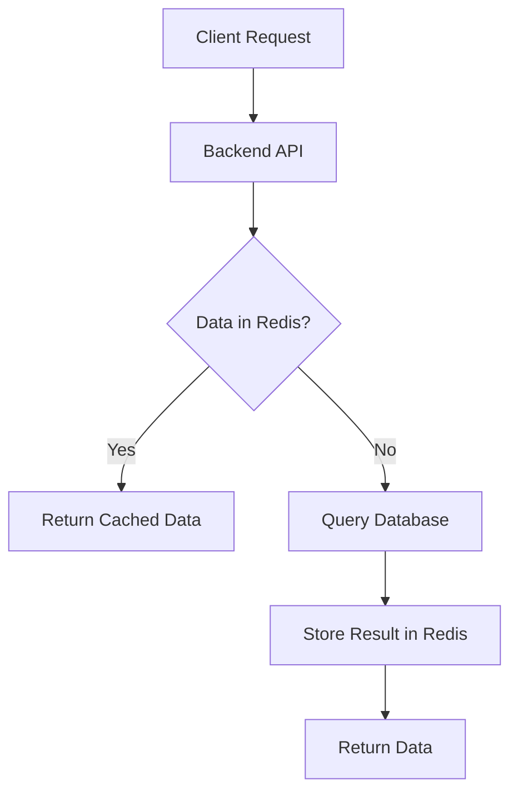
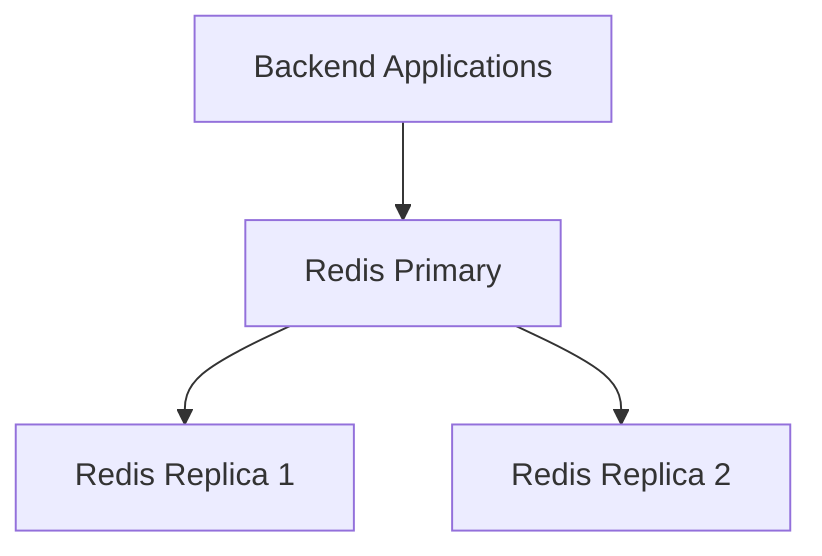
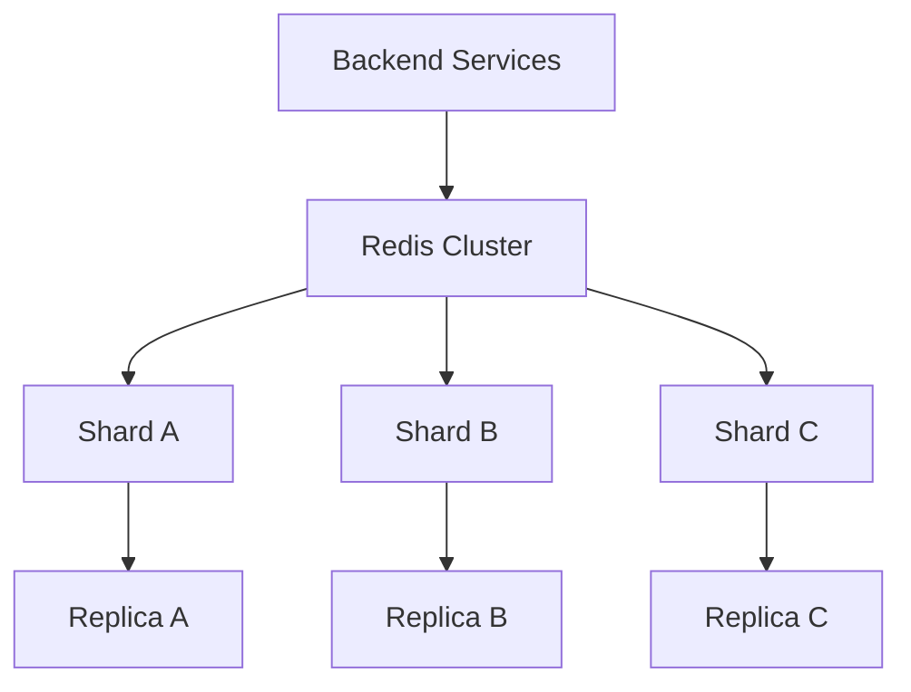
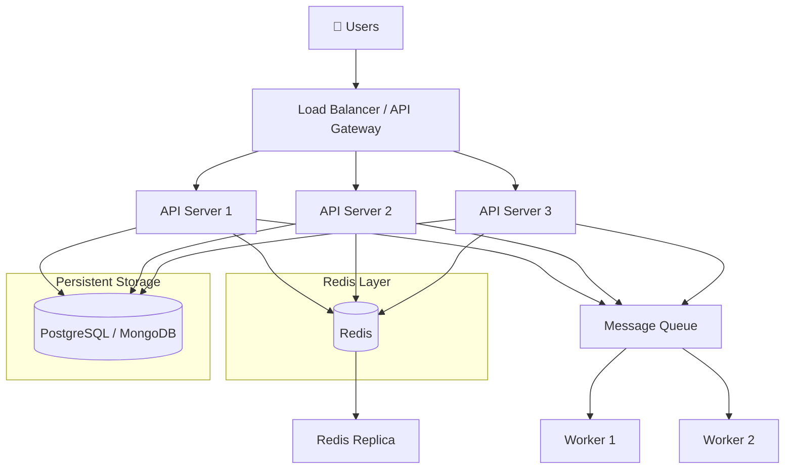
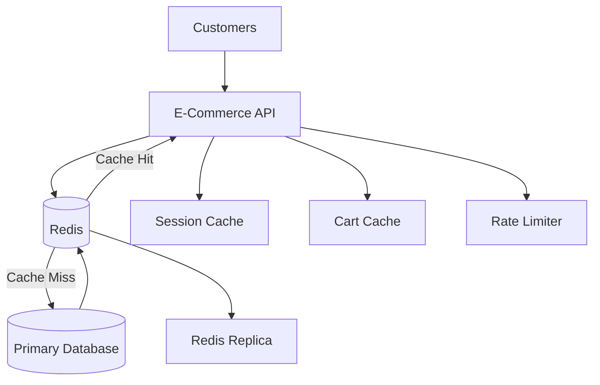

# Redis

Redis helps high-scale systems respond quickly without hitting the database for every request.

Redis is much more than a simple cache.

In backend system design, Redis is commonly used for:

* ⚡ Caching
* 🔐 Session storage
* 🚦 Rate limiting
* 🔒 Distributed coordination
* 📊 Counters & leaderboards
* ⏳ Expiring data
* 📢 Pub/Sub
* 📨 Event streams
* 🛒 Temporary application state

This document  focuses on **how to think about Redis in real backend systems** — not just Redis commands.

---

# 🧠 Core Concepts

## 1. What is Redis?

Redis is an **in-memory data store** designed for fast access to frequently used data.

Instead of repeatedly doing this:

```text
Application → Database → Disk → Result
```

we can often do:

```text
Application → Redis → Result
```

Redis usually sits **between the application and the primary database**.

```text
Client
  ↓
Backend API
  ↓
Redis Cache
  ↓
Primary Database
```

The database remains the source of truth in many architectures, while Redis helps reduce:

* Database load
* Repeated computation
* Network latency
* Response time

---

## 2. Key-Value Model

At its simplest, Redis stores:

```text
KEY → VALUE
```

Example:

```text
user:101:name → "Alex"
```

Redis keys are typically designed using namespaces:

```text
user:101
user:102

product:5001
product:5002

session:abc123

cart:user:101
```

A clear naming strategy makes large Redis deployments much easier to understand.

---

## 3. Redis Data Structures

Redis is powerful because values are not limited to plain strings.

### String

Good for:

* Cached API responses
* Tokens
* Counters
* Flags

```bash
SET product:1001:price 5999
GET product:1001:price
```

---

### Hash

Good for objects with multiple fields.

```bash
HSET user:101 name "Alex" country "India" plan "PRO"
```

Conceptually:

```text
user:101
   ├── name    → Alex
   ├── country → India
   └── plan    → PRO
```

---

### List

Useful when ordered elements are needed.

```text
notifications:user:101

↓
Notification 3
Notification 2
Notification 1
```

---

### Set

Stores unique values.

Useful for:

* Unique users
* Tags
* Permissions
* Membership

```text
online_users

{101, 102, 205, 301}
```

---

### Sorted Set

Each value has a score.

Perfect for things such as:

```text
Gaming leaderboard
Trending posts
Priority ranking
Score ranking
```

Example:

```text
player_101 → 9500
player_205 → 8700
player_404 → 8100
```

Result:

```text
🥇 player_101
🥈 player_205
🥉 player_404
```

---

### Streams

Redis Streams can represent an append-oriented sequence of events.

Example:

```text
order_created
      ↓
payment_completed
      ↓
inventory_reserved
      ↓
order_shipped
```

They are useful when consumers need to process event-style data rather than simply receive transient notifications.

---

## 4. TTL — Time To Live

Redis can automatically expire keys.

Example:

```bash
SET session:abc123 user_101 EX 3600
```

Conceptually:

```text
session:abc123
      │
      ├── value → user_101
      │
      └── TTL → 1 hour
```

After the expiration time:

```text
session:abc123 → deleted
```

TTL is extremely useful for:

* Sessions
* OTPs
* Verification codes
* Cached responses
* Temporary locks
* Rate-limit counters

---

## 5. Cache Hit vs Cache Miss

Imagine an application requesting product `1001`.

### Cache Hit

```text
Request
   ↓
Redis
   ↓
Value exists
   ↓
Return immediately
```

The database is not queried.

### Cache Miss

```text
Request
   ↓
Redis
   ↓
Value missing
   ↓
Database
   ↓
Store result in Redis
   ↓
Return result
```

The goal is usually to achieve a healthy **cache hit ratio** for workloads where caching makes sense.

---

## 6. Cache-Aside Pattern

One of the most important Redis patterns in system design is **Cache Aside**.

### Read



Pseudo-code:

```javascript
async function getProduct(productId) {
  const key = `product:${productId}`;

  const cachedProduct = await redis.get(key);

  if (cachedProduct) {
    return JSON.parse(cachedProduct);
  }

  const product = await database.getProduct(productId);

  await redis.set(
    key,
    JSON.stringify(product),
    { EX: 300 }
  );

  return product;
}
```

This pattern is easy to understand and works well for many read-heavy systems.

---

## 7. Cache Invalidation

Caching creates one difficult question:

> **What happens when the database changes but Redis still contains the old value?**

Example:

```text
Database:
product price = ₹4999

Redis:
product price = ₹5999
```

Now the cache is stale.

A common strategy is:

```text
Update Database
      ↓
Delete Cache Key
      ↓
Next Read
      ↓
Cache Miss
      ↓
Read New Value from Database
      ↓
Populate Redis Again
```

Example:

```javascript
await database.updateProduct(productId, data);

await redis.del(`product:${productId}`);
```

Cache invalidation should be part of the architecture — not an afterthought.

---

## 8. Eviction Policies

Redis usually cannot grow forever.

Once configured memory limits are reached, Redis can evict keys according to the selected policy.

Common strategies include ideas such as:

```text
LRU
↓
Remove less recently used data
```

and:

```text
LFU
↓
Remove less frequently used data
```

The correct eviction policy depends on the workload.

For a cache:

```text
Hot Data → Keep

Cold Data → Candidate for eviction
```

Memory limits and eviction behavior should be explicitly configured for production caching systems.

---

## 9. Persistence

Redis is memory-oriented, but it can also persist data to disk.

Two important persistence approaches are:

### RDB

Periodic snapshots.

```text
Redis Memory
     ↓
Snapshot
     ↓
RDB File
```

Think:

> "Take a snapshot of my dataset periodically."

---

### AOF

AOF records write operations that can later be replayed to rebuild the dataset.

```text
SET user:1 Alex
INCR views
HSET cart:10 ...
```

Think:

> "Record changes so the dataset can be reconstructed."

---

### Which should you use?

It depends on the role Redis plays.

If Redis is purely a disposable cache:

```text
Database = Source of Truth
Redis = Rebuildable
```

Persistence may be less important.

If Redis stores important application state:

```text
Sessions
Queues
Counters
Critical temporary state
```

durability requirements deserve much more attention.

---

## 10. Replication

A single Redis instance creates a single point of failure.

Replication adds copies of the data.



Conceptually:

```text
          Primary
         /       \
        ↓         ↓
   Replica 1   Replica 2
```

Replication helps provide:

* Data redundancy
* Read-scaling options for suitable workloads
* A foundation for higher availability

---

## 11. High Availability

In production, Redis is often deployed with mechanisms that detect failures and promote another node when needed.

Conceptually:

```text
Primary Redis
     │
     │ failure
     X
     │
     ↓
Replica promoted
     │
     ↓
New Primary
```

The important system-design principle is:

> Never assume one Redis machine will always be available.

Plan for failures.

---

## 12. Redis Cluster

Eventually one machine may not have enough:

```text
RAM
CPU
Network capacity
```

Redis Cluster allows the keyspace to be distributed across multiple nodes.



Conceptually:

```text
                 Redis Cluster

          ┌──────────┬──────────┐
          ↓          ↓          ↓

       Shard A    Shard B    Shard C

       user:*     order:*    product:*
        keys       keys        keys
```

Actual key distribution is determined by Redis Cluster's hashing strategy rather than manually separating keys by business entity as this simplified diagram suggests.

The important idea is:

> **Replication improves availability.
> Sharding increases capacity.**

---

## 13. Atomic Operations

Redis provides atomic operations that are extremely useful in distributed systems.

Imagine two requests updating a counter.

Bad design:

```text
Read counter
    ↓
counter + 1
    ↓
Write counter
```

Two concurrent requests may read the same old value.

Instead:

```bash
INCR video:5001:views
```

Redis performs the increment atomically.

Excellent use cases include:

```text
Counters
Rate limiting
Inventory guards
Sequence numbers
Usage tracking
```

---

# 🏗️ Redis Backend Architecture

Here is a common Redis architecture for a scalable backend.



### Read Flow

```text
Client
  ↓
Load Balancer
  ↓
API Server
  ↓
Redis
  ↓

HIT ──────────────→ Return Response

MISS
  ↓
Database
  ↓
Populate Redis
  ↓
Return Response
```

### Write Flow

```text
Client
  ↓
API Server
  ↓
Update Database
  ↓
Invalidate Redis Key
  ↓
Return Response
```

The key principle is:

```text
Database
   =
Source of Truth

Redis
   =
Fast Access Layer
```

for architectures where Redis is being used primarily as a cache.

---

# ⚔️ Redis vs Memcached

Both can be used as distributed caches, but Redis supports a much broader set of data structures and backend patterns.

| Feature                  | Redis     | Memcached                       |
| ------------------------ | --------- | ------------------------------- |
| Basic caching            | ✅         | ✅                               |
| Strings                  | ✅         | ✅                               |
| Hashes                   | ✅         | ❌                               |
| Lists                    | ✅         | ❌                               |
| Sets                     | ✅         | ❌                               |
| Sorted Sets              | ✅         | ❌                               |
| Streams                  | ✅         | ❌                               |
| Persistence options      | ✅         | ❌                               |
| Replication              | ✅         | Limited / external architecture |
| Pub/Sub                  | ✅         | ❌                               |
| Counters                 | ✅         | ✅                               |
| Complex backend patterns | Excellent | Mostly caching                  |

### Choose Memcached when

You primarily need:

```text
Simple
+
Distributed
+
Disposable caching
```

### Choose Redis when

You need caching plus capabilities such as:

```text
Sessions
+
Rate Limiting
+
Leaderboards
+
Counters
+
Streams
+
Pub/Sub
+
Distributed coordination
```

In most system-design discussions, the question should not be:

> "Which one is more popular?"

Ask:

> **"Which features does my workload actually require?"**

---

# 🌍 Real-World Example — E-Commerce Platform

Imagine an e-commerce application with:

```text
5M+ users
1M+ products
Thousands of requests per second
Frequent product-page reads
Flash sales
User sessions
Shopping carts
```

Without caching:

```text
10,000 requests/sec
        ↓
     Database
        ↓
🔥 Database becomes bottleneck
```

Introduce Redis:



---

## Use Case 1: Product Cache

Frequently accessed product:

```text
product:5001
```

Value:

```json
{
  "id": 5001,
  "name": "Mechanical Keyboard",
  "price": 5999,
  "rating": 4.8
}
```

Flow:

```text
GET /products/5001

        ↓

Redis GET product:5001

        ↓

      HIT?

   Yes     No
    ↓       ↓
Return    Database
           ↓
         Cache
           ↓
         Return
```

Instead of querying the database thousands of times for the same popular product, many requests can be served from Redis.

---

## Use Case 2: User Sessions

After login:

```text
session:a81bc920
```

might represent:

```json
{
  "userId": 101,
  "role": "customer"
}
```

with an expiration time.

```text
session
   ↓
30 minute TTL
   ↓
automatically expires
```

---

## Use Case 3: Shopping Cart

```text
cart:user:101
```

Conceptually:

```json
{
  "product_5001": 1,
  "product_1020": 2
}
```

Redis can make frequently modified temporary cart state quickly accessible.

Whether the cart also needs durable persistence depends on the business requirements.

---

## Use Case 4: Rate Limiting

Suppose the API permits:

```text
100 requests / minute / user
```

A simplified Redis strategy:

```text
rate:user:101:minute

1
2
3
...
100
```

After the limit:

```text
Request 101
    ↓
429 Too Many Requests
```

The counter expires after its configured window.

Redis works well here because counters and expiration are core primitives.

---

## Use Case 5: Flash-Sale Protection

Imagine:

```text
10,000 users
     ↓
trying to buy
     ↓
100 available items
```

The backend must handle extremely high concurrency.

Redis can help implement fast atomic counters or reservation mechanisms.

Conceptually:

```text
inventory:iphone:remaining = 100
```

Each valid reservation reduces the value.

```text
100
 ↓
99
 ↓
98
 ↓
...
 ↓
0
```

Once:

```text
inventory = 0
```

new reservation attempts can be rejected.

For real commerce systems, Redis should complement—not replace—the durable inventory and order correctness strategy.

---

# ✅ Best Practices

## 1. Always Design a Cache Invalidation Strategy

Do not just ask:

> "How will I cache the data?"

Also ask:

> **"How will this cache become fresh when the data changes?"**

Common approach:

```text
Database Updated
      ↓
Delete Redis Key
      ↓
Next Request
      ↓
Reload Latest Data
```

---

## 2. Use TTLs

Avoid accidentally keeping cache entries forever.

Instead of:

```text
product:5001 → forever
```

prefer intentional expiration:

```text
product:5001
     ↓
TTL = 5 minutes
```

TTL also creates a safety mechanism if explicit invalidation fails.

---

## 3. Add Jitter to TTLs

Suppose one million keys all have:

```text
TTL = 3600 seconds
```

If they were created at approximately the same time, many may expire together.

That can create:

```text
Mass expiration
      ↓
Mass cache misses
      ↓
Database traffic spike
```

Instead:

```text
TTL = base TTL + random jitter
```

For example:

```text
300 sec
+
random 0–60 sec
```

This spreads expirations over time.

---

## 4. Prevent Cache Stampede

Imagine a very popular key expires.

```text
product:iphone
      ↓
     EXPIRES
      ↓
10,000 requests arrive
      ↓
10,000 database queries
```

Redis did not protect the database anymore.

This is known as a **cache stampede**.

Possible strategies include:

```text
Request coalescing
Distributed locking
TTL jitter
Stale-while-revalidate
Background refresh
```

The goal is:

```text
10,000 cache misses
       ↓
Only one/few requests rebuild cache
       ↓
Others reuse result
```

---

## 5. Set Memory Limits

Redis is memory-based.

Do not operate production caches with the assumption:

```text
Memory = infinite
```

Define:

```text
Memory limit
+
Eviction strategy
+
Monitoring
```

before traffic increases.

---

## 6. Choose the Right Data Structure

Do not automatically serialize everything into one giant JSON string.

Sometimes:

```text
Hash
Set
Sorted Set
Stream
Counter
```

matches the workload much better.

Choose data structures based on the operations you actually perform.

---

## 7. Keep Values Reasonably Small

Avoid turning Redis into storage for giant objects.

Bad:

```text
huge-user-object → several MB
```

Better:

```text
Cache only frequently needed fields
```

Smaller values generally mean:

```text
Less memory
+
Less network transfer
+
Less serialization work
```

---

## 8. Avoid Hot Keys

Imagine:

```text
trending:homepage
```

receives a huge portion of all traffic.

Even with a cluster, one extremely popular key may concentrate traffic.

Possible mitigations depend on the workload:

```text
Application-level local caching
Read replicas
Request coalescing
Key partitioning where semantics allow
```

Design for **traffic distribution**, not only data distribution.

---

## 9. Avoid Unbounded Collections

Do not allow:

```text
recent_notifications:user:101
```

to grow forever.

Instead, keep bounded data.

Conceptually:

```text
Keep newest 100 notifications
```

rather than:

```text
Keep every notification ever
```

Long-term historical data usually belongs in durable storage.

---

## 10. Batch Network Operations

Avoid unnecessary network round trips.

Instead of conceptually doing:

```text
GET key1
GET key2
GET key3
GET key4
GET key5
```

consider batching or pipelining when appropriate.

At scale, network round trips matter.

---

## 11. Monitor Redis

Track things such as:

```text
Cache hit ratio
Memory usage
Evictions
Expired keys
Latency
Connected clients
CPU usage
Network traffic
Replication health
Hot keys
Slow operations
```

A cache that nobody monitors can quietly become the next bottleneck.

---

## 12. Design for Redis Failure

Ask:

> "What happens if Redis becomes unavailable?"

For a non-critical cache, a reasonable fallback may be:

```text
Redis unavailable
      ↓
Temporarily query database
```

But be careful:

```text
Redis Failure
      ↓
All traffic hits Database
      ↓
Database overload
      ↓
Entire system fails
```

Use:

```text
Timeouts
Circuit breakers
Rate limiting
Failover
Load shedding
```

where appropriate.

---

# ❌ Common Mistakes

## 1. Using Redis as the Database Without Thinking About Durability

Redis **can** persist data, but using it as a cache and using it as the authoritative data store are different architectural decisions.

Always define:

```text
What happens if this data disappears?
```

If the answer is:

```text
"The business loses money"
```

your durability and recovery design needs serious attention.

---

## 2. Forgetting TTL

Bad:

```text
SET otp:user:101 839201
```

The OTP may remain much longer than intended.

Better:

```text
OTP
 ↓
TTL
 ↓
Automatic expiration
```

Temporary data should normally have intentional expiration behavior.

---

## 3. Caching Everything

Not every query benefits from caching.

Bad candidates can include:

```text
Rarely accessed data
Highly volatile data
One-time queries
Huge objects
Data requiring immediate consistency
```

Cache data when:

```text
Read frequency
      ×
Cost of recomputation
```

makes caching worthwhile.

---

## 4. Using `KEYS *` in Production Workflows

Operations that scan huge keyspaces can become expensive.

Design production key discovery carefully rather than assuming the entire keyspace can always be inspected at once.

---

## 5. Ignoring Cache Invalidation

This is one of the easiest ways to return incorrect data.

```text
Database = ₹4999

Redis = ₹5999
```

The system is fast...

but wrong.

Correctness comes before cache speed.

---

## 6. No Protection Against Cache Stampede

Popular key expires.

```text
Thousands of Requests
        ↓
Cache Miss
        ↓
Database
```

The database becomes overloaded.

Plan for hot-key expiration.

---

## 7. No Memory Policy

If memory behavior is undefined, the system may eventually hit memory pressure in ways you did not expect.

Decide:

```text
How much memory?

What gets evicted?

Which data must never be evicted?
```

before production traffic answers those questions for you.

---

## 8. Creating One Giant Redis Key

Bad:

```text
entire_application_state
     ↓
Giant object
```

This makes:

```text
Updates expensive
Network payloads larger
Invalidation harder
Memory usage less predictable
```

Prefer smaller keys aligned with actual access patterns.

---

## 9. Treating Redis as Infinitely Scalable

Redis is fast.

That does not mean:

```text
Unlimited memory
Unlimited network
Unlimited throughput
Unlimited connections
```

Every system eventually has bottlenecks.

Measure them.

---

## 10. Adding Redis Without Measuring the Database

Architecture should not become:

```text
"My API feels slow."
       ↓
"Add Redis."
```

First identify the bottleneck.

It might be:

```text
Missing database index
N+1 queries
Poor SQL
Slow external API
Large payload
Bad application code
```

Redis should solve a known problem.

---

# 🎤 Interview Questions

## 1. Why is Redis commonly used for caching?

**Answer:**
Redis keeps frequently accessed data in memory, allowing applications to avoid repeatedly querying slower persistent storage.

---

## 2. What is the cache-aside pattern?

**Answer:**
The application first checks Redis. On a cache miss, it reads from the database, returns the result, and stores a copy in Redis for future requests.

```text
Redis → Miss → Database → Redis
```

---

## 3. What is a cache stampede?

**Answer:**
A cache stampede happens when a popular key expires and many requests simultaneously hit the database to rebuild the same cached value.

Typical defenses include:

```text
Locks
TTL jitter
Request coalescing
Background refresh
```

---

## 4. What is the difference between Redis replication and Redis Cluster?

**Answer:**

```text
Replication
     ↓
Copies data
     ↓
High availability / redundancy
```

while:

```text
Cluster
     ↓
Partitions the keyspace
     ↓
Horizontal capacity
```

They solve different scaling problems and can work together.

---

## 5. When should you NOT use Redis?

**Answer:**
Do not add Redis just because the system needs to be "fast."

Avoid unnecessary caching when:

```text
Database performance is already sufficient
Data changes constantly
Cache hit ratio would be low
Memory cost is unjustified
Strong immediate consistency is required
```

Use Redis when its benefits justify the additional operational complexity.

---

# 🎯 Key Takeaways

## 1. Redis is More Than a Cache

Think beyond:

```text
key → value
```

Redis can support:

```text
Caching
Sessions
Counters
Leaderboards
Rate limiting
Expiring data
Streams
Pub/Sub
Distributed coordination
```

Understanding the data structures is more important than memorizing commands.

---

## 2. Caching Is a Consistency Problem Too

Adding Redis gives you:

```text
Faster reads
```

but also introduces questions about:

```text
Stale data
Invalidation
Expiration
Memory
Failures
Stampedes
Hot keys
```

A strong system designer discusses both **performance and correctness**.

---

## 3. Add Redis Because the Workload Needs It

Start with:

```text
Application
     ↓
Database
```

Measure.

Then, when needed:

```text
Application
     ↓
Redis
     ↓
Database
```

At larger scale:

```text
Application
     ↓
Redis Cluster
     ↓
Replicas
     ↓
Database Cluster
```

The principle is simple:

> **Don't scale architecture because it looks impressive. Scale because measurements and requirements justify it.**

---

# 🧩 Redis System Design Mental Model

When Redis appears in a system-design interview, think through this checklist:

```text
                    REDIS
                      │
        ┌─────────────┼─────────────┐
        │             │             │
        ↓             ↓             ↓
      WHY?          WHAT?          HOW?
        │             │             │
        ↓             ↓             ↓
     Cache?        Strings?       TTL?
     Session?      Hashes?        Eviction?
     Counter?      Sets?          Replication?
     Rate Limit?   Sorted Sets?   Cluster?
     Stream?       Streams?       Persistence?
                                  Monitoring?
```

Then ask five questions:

```text
1. What data am I caching?

2. How long should it live?

3. How will I invalidate it?

4. What happens when Redis fails?

5. What happens when traffic becomes 100× larger?
```

If you can answer those five questions clearly, you're no longer simply **using Redis**.

You're **designing a system around it**.

---

If this document helped you understand Redis from a system-design perspective, **⭐ star the repository and follow for more backend system-design breakdowns.**
