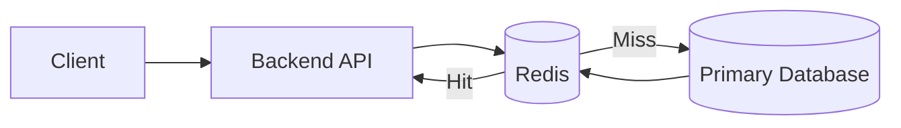
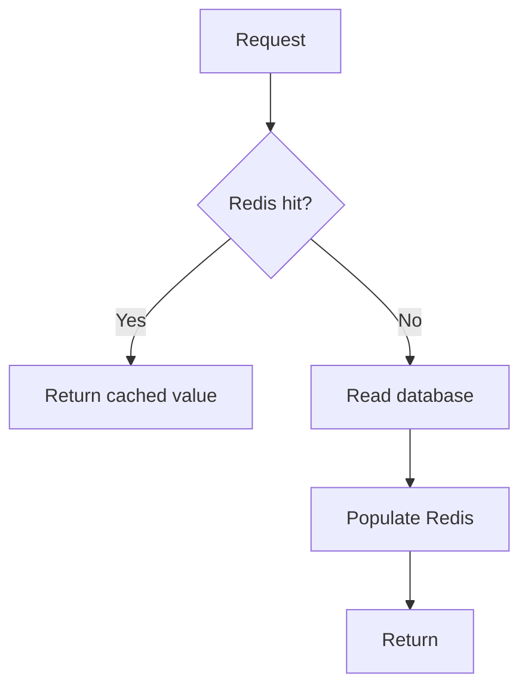
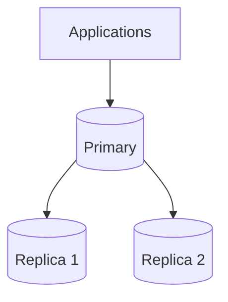
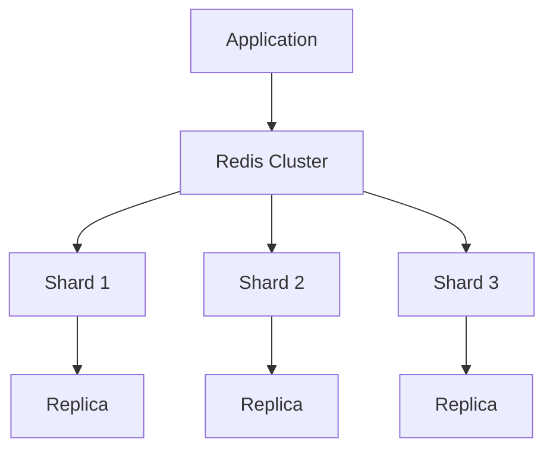

# Redis

Redis is a high-performance in-memory data store that can act as a cache, session store, coordination primitive, rate-limit state store, queue/stream substrate, counter store, leaderboard, and more.

For system design interviews, the key is not memorizing Redis commands. It is understanding:

> **Which guarantee you need, which guarantee Redis actually provides in that deployment mode, and what happens when Redis is slow, unavailable, full, partitioned, or failing over.**

---

## Interview TL;DR

1. Use Redis when the workload benefits from low-latency in-memory access or Redis-native data structures.
2. A cache is a **derived copy**, so invalidation and stale data are correctness concerns.
3. Set explicit **TTL, memory limits, and eviction policy**.
4. Protect hot misses with **request coalescing, TTL jitter, background refresh, or bounded stale serving**.
5. Design for Redis failure so fallback traffic does not destroy the database.
6. Redis replication is normally **asynchronous**; failover can lose recently acknowledged writes depending on persistence and configuration.
7. Redis Cluster adds capacity by sharding the keyspace, but hot keys and cross-slot operations can remain bottlenecks.
8. Atomic commands and scripts are useful, but Redis atomicity is not the same as durable cross-service transaction semantics.
9. Distributed locks require careful lease semantics; for correctness-critical work, include **fencing tokens** or another authoritative concurrency control.
10. Use Redis because a measured workload needs it—not as a reflexive “make it fast” layer.

---

# 1. Where Redis Fits

A common cache-aside architecture is:



In this architecture:

```text
Database = source of truth
Redis = rebuildable derived copy
```

But Redis can also be authoritative for selected workloads if the durability and recovery model is intentionally designed.

Do not assume every Redis deployment is “just a cache.”

---

# 2. Common Uses

Redis is frequently used for:

- response/object caching
- sessions
- rate limiting
- counters
- leaderboards
- expiring tokens
- distributed coordination
- Pub/Sub
- Streams
- presence
- deduplication state
- job metadata
- temporary reservations

Each use case has different correctness requirements.

---

# 3. Core Data Structures

## Strings

Useful for:

- cached blobs
- counters
- tokens
- flags

```bash
SET product:1001:price 5999
GET product:1001:price
```

## Hashes

Useful for field-based objects.

```bash
HSET user:101 name "Alex" country "India" plan "PRO"
```

## Lists

Useful for ordered sequences where list semantics match the access pattern.

## Sets

Useful for uniqueness and membership.

## Sorted Sets

Useful for:

- leaderboards
- score/rank queries
- priority-like ordering
- time-ranked windows

## Streams

Useful for append-oriented event processing where consumers need more than transient Pub/Sub delivery.

---

# 4. TTL and Expiration

TTL is central to many Redis designs.

Example:

```bash
SET session:abc123 user_101 EX 3600
```

TTL is useful for:

- sessions
- OTPs
- temporary deduplication
- rate-limit windows
- cache freshness
- leases

But TTL is not a complete invalidation strategy.

Ask:

- What if the value becomes wrong before TTL expires?
- What if millions of keys expire together?
- What if a hot key expires during peak traffic?
- Does a TTL represent business semantics or only cache freshness?

Use jitter where synchronized expiry could create a traffic spike.

---

# 5. Cache-Aside

Typical read path:



Pseudo-code:

```javascript
async function getProduct(id) {
  const key = `product:${id}`;

  const cached = await redis.get(key);
  if (cached !== null) {
    return JSON.parse(cached);
  }

  const product = await database.getProduct(id);

  await redis.set(key, JSON.stringify(product), {
    EX: 300
  });

  return product;
}
```

---

# 6. Cache Invalidation Is a Consistency Problem

A common write path is:

```text
Update database
      ↓
Delete cache
```

This is simple, but there are races.

## Example race

1. Request A misses the cache and reads old database value.
2. Request B updates the database.
3. Request B deletes the cache.
4. Request A writes the old value into Redis.

Now the cache is stale even though invalidation happened.

Mitigations depend on correctness requirements:

- short bounded TTL
- versioned cache entries
- compare versions before populating
- event/CDC-based invalidation
- transactional outbox for reliable invalidation events
- write-through or write-behind only when semantics justify it
- delayed second invalidation in selected architectures
- single-flight/request coalescing

The point is not to memorize one pattern. The point is to recognize that **database and cache cannot be updated atomically by default**.

---

# 7. Cache Stampede

A popular key expires:

```text
hot key expires
      ↓
10,000 simultaneous misses
      ↓
10,000 database reads
```

Possible defenses:

- per-key request coalescing
- short-lived rebuild lock
- stale-while-revalidate
- probabilistic early refresh
- background refresh
- TTL jitter

The objective is:

```text
many misses
   ↓
one/few rebuilds
   ↓
others wait or use bounded-stale data
```

---

# 8. Cache Penetration and Negative Caching

Repeated requests for missing records can bypass a cache.

Example:

```text
GET /product/does-not-exist
```

If misses are never cached, the database absorbs every request.

Possible defenses:

- short-lived negative cache
- Bloom filter for selected workloads
- rate limiting
- abuse detection

Be careful not to negative-cache a value for so long that newly created data remains invisible.

---

# 9. Memory and Eviction

Redis memory is finite.

Define:

```text
max memory
eviction policy
key TTL strategy
value size limits
monitoring thresholds
```

Important operational metrics include:

- used memory
- fragmentation
- evictions
- hit ratio
- latency
- client connections
- network bandwidth
- CPU
- replication lag
- slow commands
- hot keys

A cache with no memory policy eventually turns capacity pressure into an incident.

---

# 10. Hot Keys

Sharding the keyspace does not automatically distribute traffic.

One key can dominate a shard:

```text
homepage:trending
      ↓
40% of all reads
      ↓
one Redis node
```

Possible mitigations:

- application-local cache
- replicas for suitable reads
- request coalescing
- precomputed variants
- key replication/sharding where semantics permit
- redesigning the access pattern

Distinguish:

```text
data distribution
```

from:

```text
traffic distribution
```

---

# 11. Persistence

Redis can persist data.

Two major mechanisms are:

## RDB snapshots

Periodic point-in-time snapshots.

## AOF

Records write operations for replay.

The correct configuration depends on the role Redis plays.

### Disposable cache

If Redis can be rebuilt safely:

```text
persistence importance = lower
```

### Important state

If Redis contains authoritative or hard-to-recreate state:

```text
persistence
+
replication
+
backup
+
restore testing
+
RPO/RTO
```

must be part of the design.

Do not equate “Redis has persistence” with “no acknowledged write can be lost.”

---

# 12. Replication and Failover

Redis commonly uses primary-replica replication.



A critical interview detail:

> **Redis replication is normally asynchronous.**

That means a primary can acknowledge a write before every replica has received it.

If the primary fails immediately afterward, a promoted replica may not contain the latest acknowledged write.

Commands/configuration such as replication acknowledgement controls can reduce the risk, but they do not automatically transform Redis into a linearizable consensus database.

For correctness-critical data, ask:

- what is the acceptable RPO?
- how is persistence configured?
- what happens during failover?
- can the application tolerate lost or duplicated work?
- should another durable system remain authoritative?

---

# 13. Redis Sentinel vs Redis Cluster

These solve different problems.

## Sentinel-style high availability

Useful when you need:

- primary monitoring
- failover
- discovery of the current primary

It does not shard one logical dataset across many primaries.

## Redis Cluster

Useful when one node is insufficient for:

- memory
- CPU
- network throughput

Cluster partitions the keyspace across shards and can replicate each shard for availability.



---

# 14. Redis Cluster: Hash Slots and Cross-Slot Constraints

In Redis Open Source Cluster, keys map into hash slots.

A cluster-aware client routes commands to the node responsible for the slot.

Multi-key operations can require all involved keys to be in the same slot.

Example concept:

```text
user:1
user:2
```

may land in different slots.

Hash tags can deliberately colocate keys:

```text
{user:1}:profile
{user:1}:settings
```

But overusing hash tags can create hot shards.

The data model should minimize cross-slot coordination while preserving good distribution.

---

# 15. Atomic Operations

Redis commands such as:

```bash
INCR video:5001:views
```

avoid a client-side read-modify-write race.

Lua/scripts or server-side functions can atomically combine related operations on the relevant Redis execution context.

Useful examples:

- counters
- fixed-window rate limiting
- conditional updates
- reservation guards
- deduplication checks

But remember:

> Redis atomicity does not make a Redis update and a separate SQL/Kafka/payment update one atomic distributed transaction.

Cross-system workflows still need:

- idempotency
- outbox/inbox patterns
- compensation
- authoritative state
- reconciliation

---

# 16. Rate Limiting

Redis is a common rate-limit state store because of atomic operations and TTLs.

Algorithms include:

- fixed window
- sliding log
- sliding window counter
- token bucket
- leaky bucket

A simple fixed-window counter is easy but allows bursts around the window boundary.

A strong interview answer discusses:

- key cardinality
- TTL
- atomic increment+expiry
- distributed clock assumptions
- hot tenants
- failure policy: fail-open or fail-closed
- multi-region consistency
- approximate vs strict limits

---

# 17. Distributed Locks

A basic Redis lease might conceptually use:

```text
SET lock-key random-owner-value NX PX <ttl>
```

and release only if the stored owner value still matches.

But correctness-critical distributed locks are more subtle than “SET NX.”

Failure cases include:

- client pauses longer than lease TTL
- network partition
- process resumes after lease expired
- Redis failover
- clock behavior
- duplicated work after lock expiry

For important external side effects, use **fencing tokens** or an authoritative version/epoch checked by the protected resource.

Conceptually:

```text
Client A lock token = 41
Client B lock token = 42

Protected resource remembers 42
      ↓
Reject stale token 41
```

Do not rely on a lease alone to prove that stale clients can no longer act.

For interview purposes:

> Use Redis locks for coordination when the failure semantics are acceptable. Use stronger concurrency control when violating mutual exclusion can corrupt authoritative state.

---

# 18. Sessions

Redis is useful for server-side session state when:

- sessions need shared access across application instances
- expiration is important
- low latency is useful

Questions:

- What happens if Redis loses the session?
- Is forced logout acceptable?
- Is session data sensitive?
- What is the TTL/refresh policy?
- How is region failover handled?
- Is the cookie/session identifier protected?

Do not store more session data than necessary.

---

# 19. Shopping Cart

Redis can make cart access fast, but a cart is often more valuable than a disposable cache.

If losing a cart is unacceptable, consider:

```text
Redis = fast working copy
Durable DB/event log = recovery source
```

or use Redis as authoritative only with an explicit durability/recovery design.

State the business requirement first.

---

# 20. Flash-Sale Reservations

Redis atomic operations can help gate enormous bursts.

Example:

```text
available = 100
```

But “decrement Redis and call it inventory correctness” is incomplete.

A real design needs:

- idempotency key
- reservation TTL
- durable order record
- payment outcome
- reservation release
- reconciliation with authoritative inventory
- oversell/undersell policy
- recovery after Redis failover

Redis can protect the hot path while a durable system owns the final invariant.

---

# 21. Pub/Sub vs Streams

## Pub/Sub

Good for transient fan-out where consumers listening at that moment receive messages.

If a subscriber is disconnected, plain Pub/Sub is not a durable backlog.

## Streams

Useful when consumers need:

- persisted entries
- consumer groups
- acknowledgements
- replay within retained history

Neither automatically replaces a dedicated message platform for every workload.

Evaluate:

- throughput
- retention
- ordering
- replay
- durability
- cross-region architecture
- operational ecosystem

---

# 22. Pipelining and Batching

Network round trips matter.

Instead of:

```text
GET key1
wait
GET key2
wait
GET key3
```

pipelining/batching can reduce round-trip overhead.

Do not confuse pipelining with an atomic transaction.

---

# 23. Redis Failure and Cache Meltdown

A dangerous fallback:

```text
Redis fails
    ↓
all traffic falls through
    ↓
database receives 20× normal load
    ↓
database fails
```

Design the fallback.

Possible controls:

- tight Redis timeouts
- circuit breaker
- request shedding
- database concurrency limit
- stale local cache
- partial feature degradation
- priority classes
- failover
- precomputed fallback

A cache outage should not automatically become a database outage.

---

# 24. Observability

Monitor at least:

```text
latency
errors/timeouts
hit ratio
memory
evictions
expired keys
CPU
network throughput
connections
replication lag
failovers
hot keys
slow commands
cluster health
```

Application-level telemetry should also distinguish:

```text
cache hit
cache miss
cache bypass
cache timeout
database fallback
```

---

# 25. Redis vs Memcached

The useful interview comparison is workload fit.

## Memcached

Attractive for:

- simple disposable caching
- minimal data-structure requirements

## Redis

Attractive when you need:

- richer data structures
- persistence options
- replication/HA options
- counters
- sorted sets
- streams
- Pub/Sub
- server-side atomic operations

Do not pick Redis solely because it has more features. More capability also means more possible misuse.

---

# 26. When Not to Use Redis

Do not add Redis automatically when:

- the database already meets the latency target
- cache hit ratio would be poor
- values are huge
- memory cost is unjustified
- data changes so quickly that invalidation dominates
- the architecture requires a stronger durability/consistency model than the chosen Redis deployment provides

First identify the bottleneck.

It may actually be:

- missing index
- N+1 query
- slow downstream API
- oversized response
- inefficient serialization
- lock contention
- poor connection pooling

---

# 27. Senior-Level Decision Checklist

When Redis appears in a system-design interview, answer:

```text
1. Why Redis?
2. What data structure?
3. Is Redis source of truth or derived state?
4. What is the key?
5. What is the TTL?
6. How is invalidation handled?
7. What is the memory/eviction policy?
8. What happens on a hot key?
9. What happens when Redis is down?
10. What is the replication/failover data-loss policy?
11. Do we need Sentinel or Cluster?
12. Are there cross-slot operations?
13. Is the operation idempotent?
14. What does the authoritative database/service guarantee?
15. Which metrics trigger the next scaling step?
```

---

# 28. Interview Questions

## Why use Redis for caching?

To reduce repeated expensive reads or computation when the workload has enough locality to produce a useful hit rate.

## What is cache-aside?

The application reads Redis first. On miss it reads the source of truth and populates Redis.

## What is a cache stampede?

Many concurrent requests rebuild the same expired/missing hot value, overloading the source.

## Replication vs Cluster?

Replication copies data for availability/read distribution. Cluster partitions the keyspace for capacity. A cluster can also replicate shards.

## Can acknowledged Redis writes be lost during failover?

Depending on replication, persistence, and failover configuration, yes. Redis commonly uses asynchronous replication.

## Why can Redis Cluster still have a hot spot?

Traffic can concentrate on one key or one slot even when the total dataset is well distributed.

## Is SET NX enough for a correctness-critical distributed lock?

Not by itself. Lease expiry and stale clients require careful ownership checks, and correctness-critical external resources should usually use fencing/version checks.

## When should you avoid Redis?

When it does not solve a measured bottleneck or when its chosen durability/consistency semantics do not meet the workload.

---

# Key Takeaways

1. Redis is a powerful building block, not a default architecture layer.
2. Caching creates consistency and failure questions.
3. Replication improves availability but commonly remains asynchronous.
4. Cluster adds capacity; it does not remove hot keys or cross-slot constraints.
5. Atomic Redis operations are local primitives, not cross-system transactions.
6. Distributed locks need explicit lease and fencing semantics.
7. Always design cache failure so the source database survives.
8. Measure before adding Redis.

---

## References

- [Redis replication documentation](https://redis.io/docs/latest/operate/oss_and_stack/management/replication/)
- [Redis Cluster specification](https://redis.io/docs/latest/operate/oss_and_stack/reference/cluster-spec/)
- [Redis multi-key operations](https://redis.io/docs/latest/develop/using-commands/multi-key-operations/)
- [Distributed Locks with Redis](https://redis.io/docs/latest/develop/clients/patterns/distributed-locks/)
