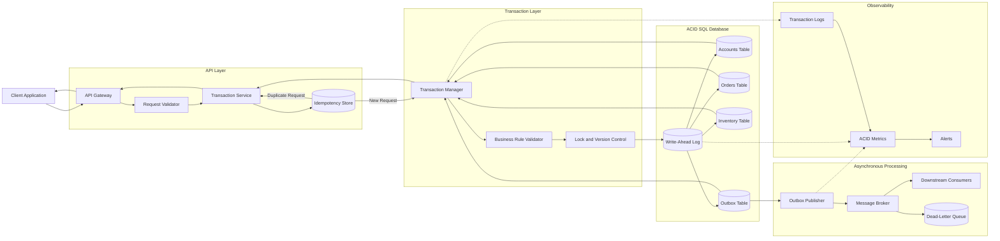
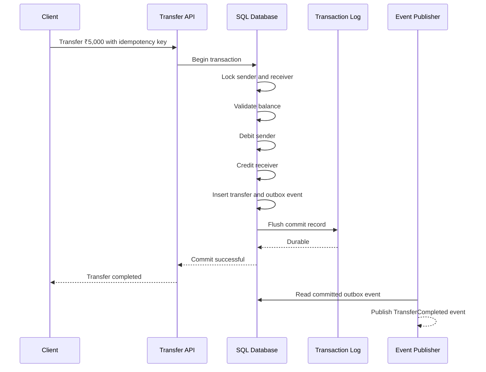

# ACID

ACID defines four properties that help databases process transactions safely: **Atomicity, Consistency, Isolation, and Durability**. These guarantees are critical in payments, banking, inventory, booking, order management, and other workflows where partial or conflicting updates can corrupt data.

---

## Core Concepts

### 1. What Is a Transaction?

A transaction is a group of database operations treated as one logical unit.

Consider a bank transfer:

```text
1. Deduct ₹500 from Account A
2. Add ₹500 to Account B
3. Record the transfer
```

These operations must succeed together. Applying only one or two steps would leave the system in an invalid state.

```sql
BEGIN;

UPDATE accounts
SET balance = balance - 500
WHERE id = 101;

UPDATE accounts
SET balance = balance + 500
WHERE id = 202;

INSERT INTO transfers(
    sender_id,
    receiver_id,
    amount,
    status
)
VALUES (
    101,
    202,
    500,
    'COMPLETED'
);

COMMIT;
```

When any operation fails:

```sql
ROLLBACK;
```

The rollback removes all uncommitted changes from that transaction.

---

## Atomicity

Atomicity means a transaction is completed entirely or not applied at all.

```text
All operations succeed → Commit
Any operation fails    → Rollback
```

### Example

An order checkout includes:

```text
Create order
Reserve inventory
Create payment record
```

If inventory reservation fails, the order and payment record should not remain partially created.

```sql
BEGIN;

INSERT INTO orders(id, user_id, status)
VALUES (5001, 101, 'PENDING');

UPDATE inventory
SET available_stock = available_stock - 1
WHERE product_id = 301
  AND available_stock > 0;

INSERT INTO payments(order_id, amount, status)
VALUES (5001, 2499, 'PENDING');

COMMIT;
```

The application must verify that the inventory update affected one row. If it affected zero rows, the transaction should be rolled back.

### How Databases Support Atomicity

Databases commonly use:

* Transaction logs
* Undo records
* Rollback segments
* Write-ahead logging
* Transaction managers

These mechanisms allow unfinished changes to be reversed after failures.

---

## Consistency

Consistency means a transaction moves the database from one valid state to another valid state.

The database and application must preserve defined rules.

Examples:

* Account balances cannot violate business constraints
* Inventory cannot become negative
* An order must reference an existing user
* Email addresses marked as unique cannot be duplicated
* A payment amount must be greater than zero

### Database-Level Consistency

Constraints can enforce basic rules:

```sql
CREATE TABLE accounts (
    id BIGINT PRIMARY KEY,
    balance DECIMAL(15, 2) NOT NULL,
    CHECK (balance >= 0)
);
```

Foreign keys protect relationships:

```sql
CREATE TABLE orders (
    id BIGINT PRIMARY KEY,
    user_id BIGINT NOT NULL,
    status VARCHAR(30) NOT NULL,
    FOREIGN KEY (user_id) REFERENCES users(id)
);
```

Unique constraints prevent duplicates:

```sql
ALTER TABLE users
ADD CONSTRAINT unique_user_email UNIQUE (email);
```

### Application-Level Consistency

Some business rules are too complex for a simple database constraint.

Examples:

* A coupon cannot be applied after it expires
* A user cannot book overlapping appointments
* A refund cannot exceed the captured payment
* An order cannot be shipped before payment approval

These rules should be validated inside the transaction when they depend on current database state.

---

## Isolation

Isolation controls how concurrent transactions interact with each other.

Without sufficient isolation, two individually valid transactions may produce an invalid combined result.

### Example: Final Product in Stock

Assume:

```text
Available stock = 1
```

Two customers attempt to purchase it at the same time.

```text
Transaction A reads stock = 1
Transaction B reads stock = 1

Transaction A creates order
Transaction B creates order
```

Without concurrency control, both purchases may succeed.

A conditional update prevents overselling:

```sql
UPDATE inventory
SET available_stock = available_stock - 1
WHERE product_id = 301
  AND available_stock > 0;
```

Only one transaction can successfully update the final unit.

---

### Common Concurrency Anomalies

#### Dirty Read

A transaction reads changes that another transaction has not committed.

```text
Transaction A updates balance to ₹500
Transaction B reads ₹500
Transaction A rolls back
```

Transaction B observed a value that never became permanent.

---

#### Non-Repeatable Read

A transaction reads the same row twice and gets different results.

```text
Transaction A reads balance = ₹1,000
Transaction B changes balance to ₹700 and commits
Transaction A reads balance again = ₹700
```

---

#### Phantom Read

A transaction repeats a range query and receives a different set of rows.

```text
Transaction A counts active reservations
Transaction B inserts a new reservation and commits
Transaction A repeats the query and sees another row
```

---

#### Lost Update

Two transactions read the same value and overwrite each other.

```text
Initial stock = 10

Transaction A reads 10
Transaction B reads 10

Transaction A writes 9
Transaction B writes 9
```

The correct final value should have been 8.

---

#### Write Skew

Two transactions read overlapping data and update different rows, together breaking a business rule.

Example:

```text
At least one doctor must remain on call.

Doctor A sees Doctor B on call and leaves.
Doctor B sees Doctor A on call and leaves.
```

Both transactions update different records, but the final state violates the rule.

---

### Isolation Levels

#### Read Uncommitted

Transactions may observe uncommitted changes.

Possible anomalies:

* Dirty reads
* Non-repeatable reads
* Phantom reads

It offers high concurrency but weak protection.

---

#### Read Committed

A transaction reads only committed data.

It prevents dirty reads but may still allow:

* Non-repeatable reads
* Phantom reads
* Lost updates, depending on the operation

This is a common default in relational databases.

---

#### Repeatable Read

Rows read during a transaction remain stable for repeated reads.

It prevents:

* Dirty reads
* Most non-repeatable reads

Phantom behavior depends on the database implementation.

---

#### Serializable

Transactions behave as though they were executed one at a time.

It provides the strongest isolation but may increase:

* Lock contention
* Transaction retries
* Deadlocks
* Latency
* Reduced throughput

Serializable isolation is useful when correctness requirements justify its cost.

---

## Durability

Durability means committed changes survive crashes, restarts, and power failures.

After the database confirms:

```sql
COMMIT;
```

the application expects the transaction to remain permanent.

### How Databases Support Durability

Databases may use:

* Write-ahead logs
* Redo logs
* Disk flushing
* Replication
* Checkpoints
* Backups
* Recovery procedures

### Write-Ahead Logging

With write-ahead logging, the database records the intended change in a durable log before modifying the main data pages.

```text
Write change to transaction log
          ↓
Confirm durable log write
          ↓
Update database pages
```

After a crash, the database can replay committed log entries.

### Durability Is Not the Same as Backup

Durability protects committed data from immediate system failures.

Backups protect against:

* Accidental deletion
* Data corruption
* Operator mistakes
* Security incidents
* Regional disasters

A durable database still needs tested backups and recovery plans.

---

## Transaction States

A transaction usually moves through several states:

```text
Active
  ↓
Partially Committed
  ↓
Committed
```

When an error occurs:

```text
Active
  ↓
Failed
  ↓
Rolled Back
```

### Active

Queries are currently running inside the transaction.

### Partially Committed

The final statement has completed, but the commit may not yet be durable.

### Committed

All changes have been permanently accepted.

### Failed

The transaction cannot continue because of an error, timeout, conflict, or deadlock.

### Rolled Back

All uncommitted changes have been reversed.

---

## Locking and Concurrency Control

ACID isolation requires a strategy for coordinating concurrent access.

### Pessimistic Locking

Pessimistic locking assumes conflicts are likely and locks data before changing it.

```sql
BEGIN;

SELECT available_stock
FROM inventory
WHERE product_id = 301
FOR UPDATE;

UPDATE inventory
SET available_stock = available_stock - 1
WHERE product_id = 301;

COMMIT;
```

Other transactions attempting to lock the same row must wait.

Best suited for:

* High-contention inventory
* Financial balances
* Limited-capacity booking
* Critical state transitions

Possible drawbacks:

* Lock waits
* Deadlocks
* Reduced concurrency
* Longer response times

---

### Optimistic Locking

Optimistic locking assumes conflicts are uncommon.

A version column detects concurrent changes:

```sql
UPDATE products
SET available_stock = available_stock - 1,
    version = version + 1
WHERE id = 301
  AND version = 12
  AND available_stock > 0;
```

If zero rows are updated, another transaction modified the record first.

The application may retry or return a conflict response.

Best suited for:

* Read-heavy workloads
* Low-contention records
* User profiles
* Content management systems
* Distributed APIs

---

## Deadlocks

A deadlock occurs when transactions wait for locks held by each other.

```text
Transaction A locks Account 101
Transaction B locks Account 202

Transaction A requests Account 202
Transaction B requests Account 101
```

Neither transaction can continue.

Databases usually detect the cycle and abort one transaction.

### Reducing Deadlocks

Acquire locks in a consistent order:

```text
Always lock the account with the smaller ID first.
```

For example:

```sql
SELECT *
FROM accounts
WHERE id IN (101, 202)
ORDER BY id
FOR UPDATE;
```

Applications should treat deadlock errors as retryable when the operation is idempotent.

---

## Architecture

A reliable ACID architecture keeps transactional work inside a clearly defined database boundary and moves slow external operations outside it.



### Transaction Flow

```text
Client request
      ↓
Validate request
      ↓
Check idempotency key
      ↓
Begin transaction
      ↓
Read and lock required records
      ↓
Validate current business state
      ↓
Apply database changes
      ↓
Write outbox event
      ↓
Commit durable log
      ↓
Release locks
      ↓
Publish event asynchronously
      ↓
Return response
```

---

### Main Components

#### 1. API Gateway

The API gateway handles:

* Authentication
* Rate limiting
* Request-size limits
* Request tracing
* Timeouts

Invalid traffic should be rejected before a transaction consumes database resources.

---

#### 2. Request Validator

The validator checks values that do not require a database transaction.

Examples:

* Required fields
* Valid identifiers
* Positive amounts
* Supported currencies
* Request format
* User authorization

Mutable business data such as balance and stock must still be validated inside the transaction.

---

#### 3. Transaction Service

The transaction service defines the transaction boundary.

Its responsibilities include:

* Starting the transaction
* Choosing an isolation level
* Applying business rules
* Committing successful operations
* Rolling back failed operations
* Handling retryable database errors
* Recording outcomes

Transaction ownership should be clear and centralized.

---

#### 4. Idempotency Store

Idempotency protects the system from duplicate requests.

Example:

```text
Idempotency key: transfer-user101-request900
```

Stored result:

```json
{
  "idempotency_key": "transfer-user101-request900",
  "status": "COMPLETED",
  "resource_id": "transfer-8001",
  "response_code": 201
}
```

When the same request is retried, the server returns the existing result.

---

#### 5. Transaction Manager

The transaction manager controls:

```text
BEGIN
COMMIT
ROLLBACK
```

It may also configure:

* Isolation level
* Statement timeout
* Lock timeout
* Savepoints
* Retry behavior
* Database connection lifecycle

---

#### 6. Business Rule Validator

Database constraints protect structural integrity, while the business validator enforces domain rules.

Examples:

* Sufficient balance
* Available stock
* Valid order transition
* Refund amount limit
* Booking capacity

Rules based on mutable state must be checked inside the transaction.

---

#### 7. Lock and Version Control

The system uses locks, versions, or conditional updates to prevent concurrency conflicts.

Possible approaches:

```text
Pessimistic lock
Optimistic version check
Atomic conditional update
Serializable isolation
```

The correct choice depends on contention, throughput, and correctness requirements.

---

#### 8. Write-Ahead Log

The write-ahead log supports atomicity and durability.

Before confirming a commit, the database records enough information to recover the transaction after a failure.

---

#### 9. Transactional Tables

All changes requiring atomic behavior should live inside the same database transaction when possible.

Example checkout transaction:

```text
Orders
Inventory
Payments
Outbox
```

If these records share one SQL database, they can be committed together.

---

#### 10. Transactional Outbox

The outbox pattern stores a business change and an outgoing event in the same database transaction.

```sql
BEGIN;

INSERT INTO orders(id, user_id, status)
VALUES (5001, 101, 'CREATED');

INSERT INTO outbox_events(
    id,
    event_type,
    aggregate_id,
    payload,
    status
)
VALUES (
    'evt-9001',
    'OrderCreated',
    '5001',
    '{"order_id":5001}',
    'PENDING'
);

COMMIT;
```

This prevents committed database changes from losing their associated events.

---

#### 11. Asynchronous Processing

Slow external operations should run after the database transaction commits.

Examples:

* Sending email
* Updating analytics
* Creating shipment tasks
* Updating search indexes
* Triggering notifications

The database transaction should not stay open while waiting for these systems.

---

#### 12. Observability

Monitor:

* Transaction duration
* Commit rate
* Rollback rate
* Deadlock count
* Lock wait time
* Serialization failures
* Retry count
* Long-running transactions
* Connection-pool usage
* Outbox publication delay
* Database recovery status

---

## Comparison: ACID vs BASE

| Area                   | ACID                                                   | BASE                                                       |
| ---------------------- | ------------------------------------------------------ | ---------------------------------------------------------- |
| Meaning                | Atomicity, Consistency, Isolation, Durability          | Basically Available, Soft State, Eventual Consistency      |
| Main goal              | Strong transactional correctness                       | High availability and distributed scalability              |
| Consistency model      | Immediate or strongly controlled                       | Often eventual                                             |
| Failure handling       | Rollback and transaction recovery                      | Retries, reconciliation, and conflict resolution           |
| Typical scope          | Relational transactions                                | Distributed services and data stores                       |
| Availability trade-off | May reject or delay operations to preserve correctness | May continue serving with temporarily stale data           |
| Common examples        | Bank transfers, inventory updates, payment records     | Social feeds, analytics, search indexes, activity counters |
| Complexity             | Transaction and lock management                        | Conflict resolution and asynchronous coordination          |

### Rule of Thumb

Use ACID when incorrect or partial data would create serious business consequences.

Use BASE-style behavior where availability and scale matter more than immediate consistency and temporary staleness is acceptable.

Many real systems use both:

```text
ACID for payment and order records
BASE for notifications, search, analytics, and feeds
```

---

## Real-World Example: Bank Transfer

Consider a transfer of ₹5,000 from Account A to Account B.

The workflow must:

1. Verify the sender has sufficient funds
2. Deduct money from the sender
3. Add money to the receiver
4. Record the transfer
5. Commit all changes together

### Tables

```sql
CREATE TABLE accounts (
    id BIGINT PRIMARY KEY,
    balance DECIMAL(15, 2) NOT NULL,
    version BIGINT NOT NULL DEFAULT 0,
    CHECK (balance >= 0)
);

CREATE TABLE transfers (
    id BIGINT PRIMARY KEY,
    sender_id BIGINT NOT NULL,
    receiver_id BIGINT NOT NULL,
    amount DECIMAL(15, 2) NOT NULL,
    status VARCHAR(30) NOT NULL,
    created_at TIMESTAMP NOT NULL,
    FOREIGN KEY (sender_id) REFERENCES accounts(id),
    FOREIGN KEY (receiver_id) REFERENCES accounts(id),
    CHECK (amount > 0)
);
```

---

### Safe Transfer Transaction

```sql
BEGIN;

SELECT id, balance
FROM accounts
WHERE id IN (101, 202)
ORDER BY id
FOR UPDATE;

UPDATE accounts
SET balance = balance - 5000
WHERE id = 101
  AND balance >= 5000;

UPDATE accounts
SET balance = balance + 5000
WHERE id = 202;

INSERT INTO transfers(
    id,
    sender_id,
    receiver_id,
    amount,
    status,
    created_at
)
VALUES (
    8001,
    101,
    202,
    5000,
    'COMPLETED',
    CURRENT_TIMESTAMP
);

COMMIT;
```

### Why Rows Are Locked in Order

```sql
ORDER BY id
FOR UPDATE;
```

Both accounts are locked in a predictable order, reducing the risk of deadlocks when transfers occur in opposite directions.

---

### How ACID Applies

#### Atomicity

The debit, credit, and transfer record commit together.

If the credit operation fails, the debit is rolled back.

#### Consistency

The transaction preserves:

* Non-negative balances
* Valid account references
* Positive transfer amount
* Balanced movement of funds

#### Isolation

Concurrent transfers cannot overwrite each other or spend the same balance without detection.

#### Durability

After commit, the transfer survives a database restart or application crash.

---

### Failure Scenario

Assume the application loses its connection immediately after sending `COMMIT`.

The client may not know whether the transaction succeeded.

```text
Client sees timeout
Database may have committed successfully
```

Blindly retrying could create a duplicate transfer.

Use an idempotency key:

```http
POST /transfers
Idempotency-Key: transfer-101-202-request-900
```

Store the key with the transfer result:

```text
transfer-101-202-request-900 → transfer 8001
```

A retry returns the original transfer instead of creating a new one.

---

### Transaction Sequence



---

## Best Practices

### 1. Keep Transactions Short

Do not keep transactions open while:

* Calling external APIs
* Sending emails
* Uploading files
* Running large computations
* Waiting for user confirmation

Long transactions hold locks and database connections.

---

### 2. Define One Clear Transaction Owner

The service layer should usually own the transaction boundary.

Avoid allowing controllers, repositories, and helper methods to independently begin or commit the same business transaction.

---

### 3. Validate Static Inputs Before Beginning

Check these before opening a transaction:

* Request format
* Required fields
* Authentication
* Amount format
* Identifier validity

This reduces transaction duration.

---

### 4. Validate Mutable State Inside the Transaction

Check current values such as:

* Account balance
* Available stock
* Booking capacity
* Payment status
* Order status

These values may change between initial validation and commit.

---

### 5. Use Database Constraints

Do not rely only on application code.

Use:

* Primary keys
* Foreign keys
* Unique constraints
* `NOT NULL`
* `CHECK` constraints

The database should protect its own invariants.

---

### 6. Choose Isolation Levels Deliberately

Use the weakest isolation level that still protects the required business rules.

Higher isolation can reduce throughput and increase retries.

---

### 7. Use Atomic Conditional Updates

Prefer:

```sql
UPDATE inventory
SET available_stock = available_stock - 1
WHERE product_id = 301
  AND available_stock > 0;
```

over:

```text
Read stock
Check in application
Write new stock
```

The conditional update reduces the race window.

---

### 8. Check Affected Row Counts

When a conditional update affects zero rows, the expected condition was not satisfied.

```text
1 row updated → Success
0 rows updated → Conflict or invalid state
```

Never assume an update succeeded without checking.

---

### 9. Acquire Locks in a Consistent Order

When locking multiple records, always follow the same ordering rule.

```text
Lock lower account ID first
Lock higher account ID second
```

This lowers deadlock probability.

---

### 10. Handle Deadlocks and Serialization Failures

These errors are normal under concurrency.

Use:

* Limited retries
* Exponential backoff
* Random jitter
* Idempotent operations
* Retry metrics

Do not retry indefinitely.

---

### 11. Use Idempotency for Retried Requests

Idempotency is especially important for:

* Payments
* Transfers
* Checkout
* Refunds
* Reservations
* Subscription creation

A timeout does not prove that the transaction failed.

---

### 12. Use the Transactional Outbox

Store outgoing events in the same transaction as the business update.

Publish them asynchronously after commit.

This protects against lost events.

---

### 13. Make Event Consumers Idempotent

Messages may be delivered more than once.

Track processed event IDs:

```text
Event already processed → Skip duplicate
```

---

### 14. Configure Timeouts

Use:

* Statement timeout
* Lock timeout
* Transaction timeout
* API timeout

Timeouts prevent one blocked transaction from consuming resources indefinitely.

---

### 15. Monitor Long-Running Transactions

Long transactions can block vacuuming, cleanup, replication, and other queries.

Track transaction age and terminate unsafe sessions when necessary.

---

### 16. Test Recovery Behavior

Test failures such as:

* Application crash before commit
* Application crash after commit
* Database restart
* Network timeout during commit
* Deadlock
* Duplicate client request
* Message broker outage
* Replica failure
* Outbox publisher crash

---

### 17. Keep Backups and Test Restores

Durability is incomplete without operational recovery.

Regularly test:

* Backup creation
* Point-in-time recovery
* Restore duration
* Data validation
* Disaster-recovery procedures

---

## Common Mistakes

### 1. Assuming Every Multi-Step Function Is Automatically Atomic

Application code does not become transactional unless all required database operations share an explicit transaction.

---

### 2. Keeping a Transaction Open During an External API Call

Incorrect:

```text
Begin transaction
Lock inventory
Call payment gateway
Wait several seconds
Commit
```

This holds database resources while depending on an unpredictable external system.

---

### 3. Validating Balance or Stock Only Before the Transaction

Another request may change the value before commit.

Revalidate mutable state inside the transaction.

---

### 4. Using Read-Then-Write Without Concurrency Protection

Unsafe:

```text
Read stock = 1
Subtract in application
Write stock = 0
```

Two transactions may both read the same value.

Use conditional updates, locks, or version checks.

---

### 5. Using Serializable Isolation Everywhere

Serializable isolation is powerful but can reduce throughput and increase aborts.

Use it for workflows that truly require it.

---

### 6. Ignoring Affected Row Counts

A conditional update may affect zero rows because the condition was no longer true.

Treat this as a business conflict rather than success.

---

### 7. Retrying Requests Without Idempotency

A client retry may duplicate:

* Payment capture
* Transfer
* Order
* Refund
* Reservation

Timeouts create uncertainty, not proof of failure.

---

### 8. Locking Records in Different Orders

Different lock orders increase deadlock risk.

Use one consistent ordering convention throughout the codebase.

---

### 9. Catching an Error Without Rolling Back

A failed transaction may remain open or unusable until rollback.

Every failure path must safely close the transaction.

---

### 10. Treating Application Validation as a Replacement for Constraints

Concurrent requests or other applications may bypass the same validation.

Important invariants should also be protected by the database.

---

### 11. Confusing Consistency With Correct Business Logic

ACID consistency means defined rules are preserved. It does not automatically make incorrect business rules correct.

The system must define and enforce the right invariants.

---

### 12. Assuming Commit Acknowledgment Is Always Clear

A network failure can occur after the database commits but before the client receives the response.

Use idempotency and transaction-status lookup endpoints.

---

### 13. Assuming Durability Eliminates the Need for Backups

Durability does not protect against accidental deletion, corruption, or malicious changes.

---

### 14. Publishing Events After Commit Without an Outbox

Unsafe flow:

```text
Commit database
Publish event
```

A crash between these steps can permanently lose the event.

---

### 15. Keeping Huge Batch Operations in One Transaction

Large transactions:

* Hold locks longer
* Create large logs
* Increase rollback cost
* Delay replicas
* Reduce concurrency

Process large independent workloads in bounded batches.

---

## Interview Questions with Short Answers

### 1. What does ACID stand for?

Atomicity means all transaction operations succeed or fail together. Consistency preserves defined rules. Isolation controls concurrent interactions. Durability ensures committed changes survive failures.

---

### 2. What is the difference between atomicity and consistency?

Atomicity controls whether a transaction is applied completely. Consistency ensures the completed transaction leaves the database in a valid state.

---

### 3. How does isolation prevent lost updates?

Isolation uses locks, versions, snapshots, conditional writes, or serialization to detect or prevent transactions from overwriting each other unexpectedly.

---

### 4. Does a successful commit guarantee the client received the response?

No. The database may commit successfully while the network response is lost. Idempotency keys help the client retry safely.

---

### 5. When would you choose ACID over eventual consistency?

Choose ACID when partial, stale, or conflicting data could cause financial loss, overselling, duplicate reservations, security issues, or invalid business state.

---

## Key Takeaways

1. **ACID protects transactional correctness.** Atomicity prevents partial updates, consistency protects rules, isolation manages concurrency, and durability preserves committed data.

2. **ACID guarantees require deliberate design.** Transaction boundaries, constraints, locking, isolation levels, retries, and idempotency must match the business workflow.

3. **Use strong transactions where correctness matters most.** Keep critical records ACID-compliant while moving slow or non-critical work to asynchronous, eventually consistent processes.
