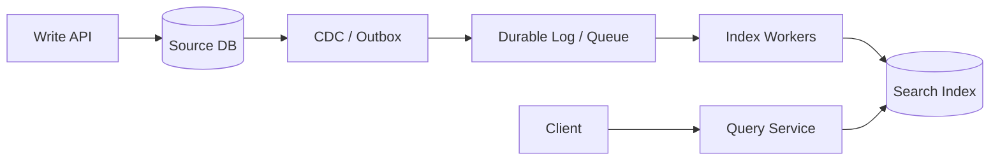

# Database Indexing and Search Indexes

The current term “indexing” covers two related but different system-design problems:

1. **database indexes** that accelerate access to authoritative transactional data;
2. **search indexes** that build a derived retrieval structure for text/relevance/discovery.

Do not mix their consistency and operational models.

---

## Interview TL;DR

1. Indexes trade **storage + write amplification + memory** for faster selected reads.
2. Build indexes from actual predicates, joins, sort order, and result shape.
3. Selectivity matters, but low-selectivity fields can still be useful in composite/partial/bitmap-style contexts depending on the engine.
4. Composite index order matters, but validate with the database optimizer rather than memorizing one universal rule.
5. Covering/index-only access is engine-specific and may still require base-table visibility checks.
6. Every extra index increases insert/update/delete cost and backup/storage footprint.
7. Search indexes are usually **derived stores**, commonly updated asynchronously from a source of truth.
8. Distributed search correctness requires versions, idempotency, delete handling, replay, and reconciliation.
9. A shard key and an index are related concepts but not equivalent.
10. Index design is also a concurrency issue because locking statements may lock the ranges they scan.

---

# Part I — Database Indexes

## 1. Why an Index Works

Without useful access structure:

```text
scan many rows/pages
```

With an index:

```text
navigate ordered/search structure
      ↓
locate matching tuple/document
```

Cost moved from read time into:

- storage
- writes
- maintenance
- cache footprint

---

# 2. B-tree / B+ Tree

General-purpose structure for:

- equality
- range
- ordering
- prefix-oriented composite access

Most relational OLTP indexing discussions start here.

---

# 3. Composite Indexes

Example:

```sql
CREATE INDEX idx_orders_tenant_status_created
ON orders(tenant_id, status, created_at DESC);
```

Design from query:

```sql
WHERE tenant_id = ?
  AND status = ?
ORDER BY created_at DESC
```

Consider:

- equality predicates
- range predicate
- sort
- join
- page/row selectivity
- returned columns
- update frequency

Do not create one enormous composite index for every possible query.

---

# 4. Covering / Included Columns

Some engines let an index contain non-key payload columns.

PostgreSQL:

```sql
CREATE INDEX idx_order_summary
ON orders(customer_id, created_at DESC)
INCLUDE (status, total_amount);
```

A covering index can reduce base-table access.

But “covered” does not always mean “zero table access”; visibility/storage-engine rules differ.

---

# 5. Partial / Filtered Index

Index only the subset the query repeatedly needs.

```sql
CREATE INDEX idx_pending_orders
ON orders(created_at)
WHERE status = 'pending';
```

Benefits:

- smaller index
- less write amplification
- better cache locality

Works only when the query predicate matches the index condition.

---

# 6. Expression / Functional Index

```sql
CREATE UNIQUE INDEX idx_users_lower_email
ON users(lower(email));
```

Useful when an expression is a stable recurring access path.

---

# 7. Specialized PostgreSQL Examples

## GIN

Useful for composite values such as:

- JSONB keys/values
- arrays
- full-text data structures

## GiST/SP-GiST

Useful for supported extensible geometric/range/search structures.

## BRIN

Useful for huge physically correlated tables such as append-time data.

BRIN is small because it summarizes block ranges rather than indexing every row precisely.

---

# 8. InnoDB Clustered vs Secondary Indexes

In InnoDB:

- table rows live in the clustered primary-key structure
- secondary indexes include the primary-key value

Therefore:

```text
large primary key
  ↓
larger every secondary index
```

Index design is tied to primary-key design.

---

# 9. Selectivity

A highly selective predicate usually narrows the data substantially.

Example:

```text
email = unique address
```

A boolean may be low selectivity.

But do not use:

> “Never index booleans.”

A partial index on a rare boolean state can be excellent:

```text
WHERE processed = false
```

Index value depends on **data distribution + query pattern**, not a field-type slogan.

---

# 10. Index and ORDER BY

An index can sometimes produce data in needed order and avoid a large sort.

Useful pattern:

```sql
WHERE customer_id = ?
ORDER BY created_at DESC
LIMIT 20
```

Index:

```text
(customer_id, created_at DESC)
```

This is especially valuable for keyset pagination.

---

# 11. Write Amplification

Each write may update:

```text
table
+
primary index
+
secondary index A
+
secondary index B
+
secondary index C
```

Costs:

- CPU
- I/O
- WAL/redo
- cache churn
- replication volume
- storage

Over-indexing can make a read-optimized schema fail under write load.

---

# 12. Index Maintenance

Indexes can become:

- unused
- redundant
- bloated
- poorly selective as data changes
- mismatched to new query patterns

Review:

- index usage
- size
- write cost
- planner selection
- duplicate prefixes
- data skew

---

# 13. Lock Footprint

Indexes affect concurrency.

A locking query that scans too broad a range can lock more records/ranges than intended.

So a missing index can cause:

```text
slow query
+
larger lock footprint
+
more contention
```

This is especially important in InnoDB next-key/range locking.

---

# 14. Explain Plans

Validate indexes with the engine.

Look for:

- scan type
- estimated vs actual rows
- rows examined
- sort
- temp/spill
- loop count
- heap/table fetch
- filter selectivity

Do not “force index” before understanding why the optimizer rejected it.

---

# Part II — Search Indexes

A dedicated search index is different.

Use one when you need:

- tokenization
- relevance
- fuzzy search
- faceting
- autocomplete
- text analysis
- search-specific ranking

The transactional DB typically remains authoritative.

---

# 15. Derived Search Architecture



This is normally eventually consistent.

---

# 16. Correctness of the Index Pipeline

You need:

- durable source events
- idempotent consumers
- versioned documents
- delete/tombstone handling
- out-of-order protection
- retry/DLQ
- replay
- periodic reconciliation

Example event:

```json
{
  "entityId": "product-10",
  "version": 42,
  "operation": "UPDATE"
}
```

Reject version 41 if version 42 is already indexed.

---

# 17. Reindexing

Safe pattern:

```text
create index v2
      ↓
backfill
      ↓
catch up incremental events
      ↓
validate
      ↓
switch alias/router
      ↓
retain v1 for rollback
```

Do not mutate an incompatible index schema in place without a rollback plan.

---

# 18. Sharding the Search Index

Choose a routing/partition strategy based on:

- document count
- query pattern
- tenant isolation
- hot categories
- write distribution

Scatter/gather across every shard increases tail latency.

A distributed index should support targeted routing where possible.

---

# 19. Pagination

Deep offset:

```text
skip 1,000,000
return next 20
```

can be expensive and unstable under change.

Prefer search-after/keyset/cursor techniques for deep continuous navigation.

---

# 20. Source of Truth

Never let a slightly stale search result become the final authority for:

- price
- payment
- authorization
- inventory allocation

Search can discover a product. Checkout should revalidate authoritative state.

---

# 21. Metrics

Database index:

- index usage
- size
- pages/rows scanned
- write latency
- cache hit
- plan regression

Search index:

- indexing lag
- queue depth
- stale-version reject count
- failed events
- shard balance
- search p95/p99
- partial-shard failures
- reindex progress
- source/index drift

---

# 22. Common Mistakes

### Index every field

Write amplification grows without guaranteed read benefit.

### “Low cardinality means never index”

Too absolute.

### Treat search index as source of truth

Wrong consistency model for critical decisions.

### Ignore deletes

Stale documents accumulate.

### Ignore version ordering

Old events overwrite new documents.

### Reindex in place

Risky migration and rollback.

### Unlimited shard fan-out

Tail latency grows with slowest shard.

---

# Interview Questions

## Database index vs search index?

A DB index is part of transactional query execution. A search index is commonly a derived retrieval system optimized for text/relevance/discovery.

## Why can an index hurt writes?

Every affected index must be maintained and replicated/logged.

## What is a partial index useful for?

A frequently queried small subset of a larger table.

## Why can a missing index cause contention?

Locking statements may scan and lock broader ranges.

## How do you safely rebuild a search index?

Versioned new index, backfill, catch up changes, validate, switch alias, retain rollback.

---

## References

- PostgreSQL indexes: https://www.postgresql.org/docs/current/indexes.html
- PostgreSQL GIN: https://www.postgresql.org/docs/current/gin.html
- MySQL InnoDB indexes: https://dev.mysql.com/doc/refman/8.4/en/innodb-index-types.html
