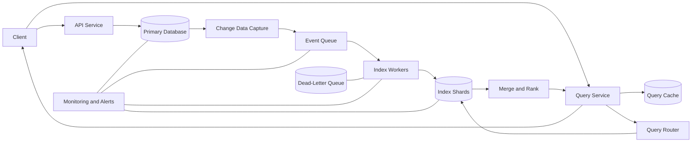

# Indexing

Indexing is the reason a system can find one useful record among millions without scanning everything. It powers database queries, product search, log analytics, autocomplete, recommendations, and many other latency-sensitive backend features.

---

## Core Concepts

### 1. What is an index?

An index is an additional data structure that helps a system locate data faster.

Without an index, a database may perform a full scan:

```text
Check row 1 → Check row 2 → Check row 3 → ... → Check row N
```

With an index, the system first looks up a smaller, organized structure and jumps directly to the required records.

```text
Index lookup → Record location → Fetch result
```

The trade-off is simple:

* **Faster reads**
* **More storage**
* **Slower writes**, because indexes must also be updated

### 2. Primary and secondary indexes

* **Primary index:** Built on the primary key or the main ordering key of the data.
* **Secondary index:** Built on another field used frequently in queries, such as `email`, `status`, or `created_at`.

A table usually has one primary index but may have several secondary indexes.

### 3. Clustered and non-clustered indexes

* **Clustered index:** Determines how the actual rows are physically organized. A table generally has only one.
* **Non-clustered index:** Stores indexed values separately and points to the original rows.

### 4. Composite indexes

A composite index includes multiple fields.

```sql
CREATE INDEX idx_orders_user_status
ON orders(user_id, status);
```

This index is useful for queries filtering by:

```sql
WHERE user_id = ?
```

or:

```sql
WHERE user_id = ? AND status = ?
```

It may not efficiently serve queries that filter only by `status`, because index column order matters.

### 5. Covering indexes

A covering index contains every field required by a query, allowing the database to return the result without reading the main table.

```sql
CREATE INDEX idx_orders_covering
ON orders(user_id, status, total_amount);
```

For a query that selects only these fields, the index itself may contain all the required data.

### 6. Selectivity and cardinality

* **Cardinality:** Number of distinct values in a field.
* **Selectivity:** How effectively a field narrows the result set.

An index on `email` is usually highly selective. An index on a boolean field such as `is_active` may provide limited value because many rows share the same value.

### 7. Common index data structures

* **B-Tree / B+ Tree:** Excellent for equality lookups, sorting, and range queries.
* **Hash index:** Excellent for exact-match lookups but not range queries.
* **Inverted index:** Maps terms to documents; commonly used by search engines.
* **Bitmap index:** Useful for low-cardinality analytical data.
* **LSM Tree:** Optimized for heavy write workloads by buffering and merging sorted data over time.

### 8. Index consistency

An index may be updated:

* **Synchronously:** The write succeeds only after both the source data and index are updated.
* **Asynchronously:** The source write succeeds first, and the index catches up later.

Synchronous indexing provides stronger consistency. Asynchronous indexing improves write throughput but can temporarily return stale results.

---

## Architecture

A scalable indexing platform usually separates the **source of truth** from the **searchable index**.



### Main components

#### 1. Primary database

Stores the authoritative version of each record. The index should normally be treated as a derived data store, not the source of truth.

#### 2. Change Data Capture

Change Data Capture, or CDC, publishes inserts, updates, and deletes from the database without requiring every application service to update the index directly.

#### 3. Event queue

A durable queue absorbs traffic spikes, decouples the database from index workers, and enables failed events to be retried.

Typical event:

```json
{
  "event_id": "evt_9821",
  "operation": "UPDATE",
  "entity_id": "product_483",
  "version": 17,
  "timestamp": "2026-08-01T10:15:00Z"
}
```

#### 4. Index workers

Workers transform source records into index documents. They may normalize text, tokenize fields, remove stop words, calculate ranking signals, or enrich records with related data.

Workers should be **idempotent**, meaning processing the same event more than once produces the same final state.

#### 5. Index shards

Large indexes are partitioned across multiple machines. A shard owns a subset of the indexed data.

Common sharding strategies:

* Hash by document ID
* Partition by tenant
* Partition by time
* Partition by geography
* Partition by business category

#### 6. Query router

The router decides which shards should receive a query. Good routing reduces unnecessary fan-out and lowers latency.

#### 7. Merge and rank layer

When several shards return matches, the system combines them, removes duplicates, applies ranking rules, and returns the best results.

#### 8. Cache

Frequently repeated queries can be cached. Cache keys should include every parameter that affects the result, including filters, sorting, pagination, tenant, and index version.

#### 9. Reindexing pipeline

Indexes occasionally need to be rebuilt because of schema changes, ranking changes, corruption, or a new tokenizer.

A safe reindexing process is:

```text
Create new index → Backfill data → Validate → Dual-write → Switch alias → Retire old index
```

This approach avoids long downtime and makes rollback easier.

### Write path

```text
1. Client sends a write request
2. API updates the primary database
3. CDC produces a change event
4. Event is stored in the queue
5. An index worker consumes the event
6. The correct index shard is updated
7. Metrics record indexing delay and failures
```

### Read path

```text
1. Client sends a search or lookup request
2. Query service validates and normalizes the request
3. Cache is checked
4. Query router selects relevant shards
5. Shards return local matches
6. Results are merged, ranked, and paginated
7. Response is returned and optionally cached
```

### Reliability considerations

A production indexing architecture should handle:

* Duplicate events
* Events arriving out of order
* Partial shard failures
* Poison messages
* Queue backlog
* Reindexing failures
* Source and index schema mismatch
* Hot shards
* Stale or missing documents

Useful controls include event versions, retries with backoff, dead-letter queues, reconciliation jobs, replication, and index health checks.

---

## Comparison: Database Index vs Search Index

| Area            | Database B-Tree Index                         | Search Inverted Index                                         |
| --------------- | --------------------------------------------- | ------------------------------------------------------------- |
| Best for        | Structured queries and transactions           | Full-text search and relevance ranking                        |
| Typical queries | Equality, ranges, sorting, joins              | Keywords, phrases, fuzzy matches, filters                     |
| Data model      | Rows and columns                              | Documents and terms                                           |
| Consistency     | Usually strongly consistent with the database | Often eventually consistent                                   |
| Ranking         | Usually limited to explicit sorting           | Supports relevance scoring                                    |
| Write behavior  | Updated as part of database writes            | Commonly updated through an asynchronous pipeline             |
| Example         | Find orders for a user in a date range        | Find products matching “wireless noise cancelling headphones” |

**Rule of thumb:** Use database indexes for transactional access patterns. Use a dedicated search index when users need text search, relevance, typo tolerance, faceting, or large-scale discovery.

---

## Real-World Example: E-Commerce Product Search

Imagine an online store with 50 million products. Users can search by keywords and filter by brand, price, rating, availability, and delivery location.

### Indexed product document

```json
{
  "product_id": "p_10482",
  "title": "Wireless Noise Cancelling Headphones",
  "description": "Over-ear Bluetooth headphones with 30-hour battery life",
  "brand": "Acme Audio",
  "category": "electronics",
  "price": 129.99,
  "rating": 4.6,
  "in_stock": true,
  "available_regions": ["IN", "SG", "AE"],
  "popularity_score": 87.4,
  "updated_at": "2026-08-01T10:15:00Z"
}
```

### How the query is processed

User request:

```text
"wireless headphones" under ₹15,000, rating above 4, available in India
```

The search system:

1. Tokenizes `wireless headphones`.
2. Looks up matching documents in the inverted index.
3. Applies filters for price, rating, stock, and region.
4. Calculates a score using text relevance, popularity, rating, and freshness.
5. Returns the top results.

A simplified ranking formula could be:

```text
final_score =
    0.50 × text_relevance
  + 0.20 × popularity
  + 0.20 × rating
  + 0.10 × freshness
```

### Handling updates

When a product price or stock value changes:

```text
Product Service → Primary Database → CDC → Queue → Index Worker → Search Index
```

The product page can read critical price and stock values from the primary system, while search results use the index for fast discovery. This prevents a slightly stale search index from becoming the final authority for checkout decisions.

### Scaling the system

As traffic grows:

* Shard products by product ID or category.
* Replicate shards for higher read throughput.
* Cache popular queries.
* Route category-specific searches only to relevant shards.
* Track queue lag to measure index freshness.
* Move expensive ranking features to offline or asynchronous pipelines.
* Use aliases to deploy new index versions without downtime.

---

## Best Practices

1. **Design indexes from real query patterns.** Do not create indexes only because a field looks important.
2. **Keep the source of truth separate.** Treat search indexes as rebuildable derived data.
3. **Measure index freshness.** Track the delay between a source update and its searchable version.
4. **Use idempotent consumers.** Duplicate delivery is normal in distributed systems.
5. **Version events and documents.** Reject stale updates that arrive after newer updates.
6. **Limit over-indexing.** Every additional index increases storage, write cost, and operational complexity.
7. **Plan reindexing from day one.** Schema and ranking logic will change.
8. **Use cursor-based pagination for deep result sets.** Large offset-based pagination can be slow and inconsistent.
9. **Monitor shard balance.** Watch document count, storage, query rate, and CPU per shard.
10. **Validate with production-like data.** Index behavior changes significantly with realistic cardinality and skew.
11. **Use query explain plans.** Confirm that the expected index is actually being used.
12. **Protect the query layer.** Add timeouts, result limits, rate limits, and safeguards against expensive queries.

---

## Common Mistakes

### 1. Adding too many indexes

More indexes do not automatically mean better performance. They increase write amplification, disk usage, memory usage, and maintenance cost.

### 2. Ignoring composite index order

An index on `(user_id, status)` is not equivalent to `(status, user_id)`. Order should match the most important query prefixes.

### 3. Indexing low-selectivity fields alone

An isolated index on fields such as `is_active` or `gender` may not reduce the search space enough to be useful.

### 4. Using the search index as the source of truth

Search systems may be eventually consistent. Critical operations such as payment, inventory reservation, and authorization should validate against authoritative services.

### 5. Forgetting delete events

A pipeline that handles inserts and updates but misses deletes will slowly accumulate incorrect documents.

### 6. Processing events without version checks

Out-of-order events can overwrite fresh data with stale data unless document versions are compared.

### 7. Reindexing in place

Changing a live index directly can create partial migrations, inconsistent mappings, and difficult rollbacks. Build a new version and switch traffic through an alias.

### 8. Allowing unlimited query fan-out

Sending every request to every shard increases tail latency and can create a distributed denial-of-service problem inside the system.

### 9. Monitoring only average latency

Average latency can hide slow shards. Track percentiles such as P95 and P99, along with timeout and partial-failure rates.

### 10. Skipping reconciliation

Even reliable pipelines eventually experience missed, duplicated, or corrupted events. Periodic comparison with the source database helps detect and repair drift.

---

## Interview Questions with Short Answers

### 1. Why do indexes improve reads but slow down writes?

Indexes provide a smaller, organized lookup structure for reads. During writes, the system must update both the original data and every affected index.

### 2. When would you use an inverted index instead of a B-Tree?

Use an inverted index for full-text search, relevance ranking, phrase matching, and term-based retrieval. Use a B-Tree for structured equality, sorting, and range queries.

### 3. How do you prevent stale events from overwriting fresh index data?

Include a monotonically increasing version or source timestamp with each event, and apply the update only when it is newer than the indexed version.

### 4. How would you rebuild a large index without downtime?

Create a new version, backfill it, validate it, temporarily dual-write, switch a logical alias to the new index, and keep the old version available for rollback.

### 5. What metrics would you monitor in an indexing system?

Monitor indexing lag, queue depth, event failure rate, document count, shard balance, query latency percentiles, cache hit rate, stale-result rate, and reindexing progress.

---

## Key Takeaways

1. **Indexes exchange storage and write cost for faster reads.** Every index should support a real access pattern.
2. **At scale, indexing is a distributed data pipeline.** Correctness depends on durable events, idempotency, versioning, sharding, and reconciliation.
3. **The best index is not only fast—it is rebuildable, observable, and safe to evolve.**
