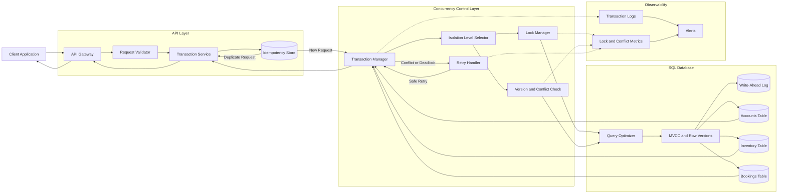
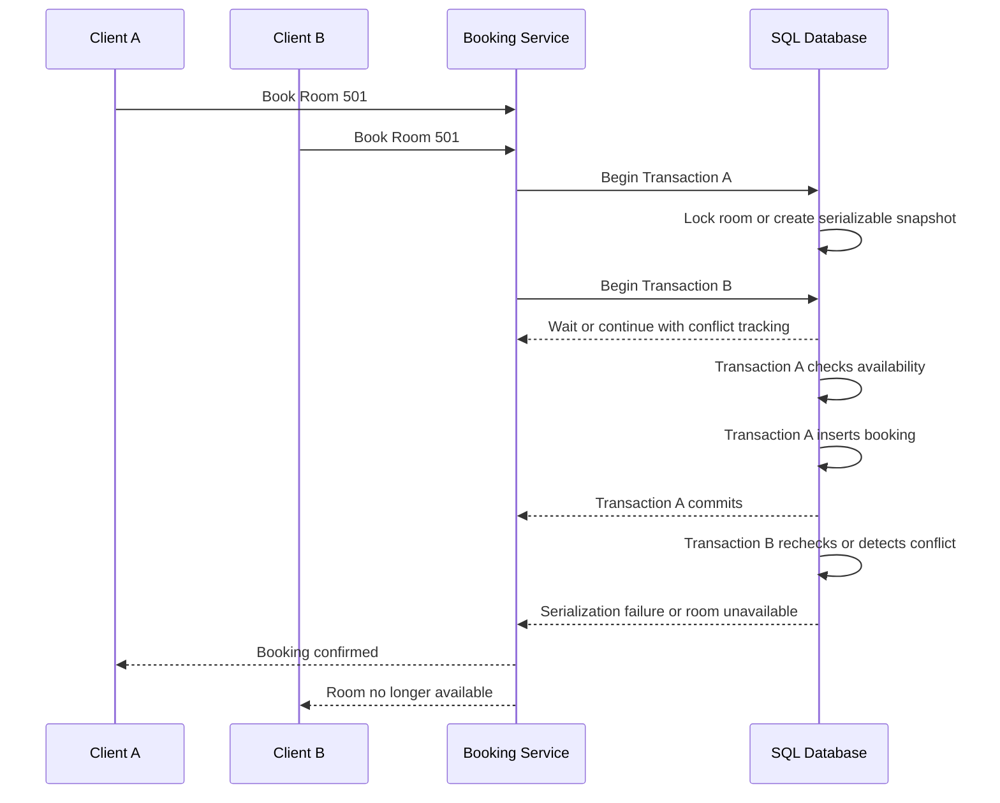

# Isolation Levels

Isolation levels define how much one database transaction can observe or interfere with another concurrent transaction. Choosing the correct level is essential for payments, inventory, booking systems, financial records, counters, and other workflows where multiple requests may update the same data simultaneously.

---

## Core Concepts

### 1. What Is Transaction Isolation?

Transaction isolation controls how concurrent transactions interact with shared data.

Consider two users trying to purchase the final unit of a product:

```text
Available stock = 1

Transaction A reads stock = 1
Transaction B reads stock = 1

Transaction A creates an order
Transaction B creates an order
```

Without sufficient concurrency control, both transactions may succeed and the system may oversell the product.

Isolation helps the database determine:

* Which changes a transaction can observe
* Whether values remain stable during a transaction
* How conflicting writes are handled
* Whether a transaction must wait, retry, or fail

---

### 2. Isolation Is the “I” in ACID

ACID stands for:

```text
Atomicity
Consistency
Isolation
Durability
```

Isolation ensures concurrent transactions behave safely.

It does not always mean transactions are completely separated. Different isolation levels provide different guarantees.

```text
Stronger isolation
        ↓
Fewer concurrency anomalies
        ↓
More locking, waiting, or retries
        ↓
Potentially lower throughput
```

The goal is not always to use the strongest level. The goal is to use the weakest level that still protects the required business rules.

---

### 3. Concurrency Anomalies

Isolation levels are easier to understand through the problems they prevent.

---

#### Dirty Read

A dirty read occurs when one transaction reads changes that another transaction has not committed.

```text
Transaction A updates balance to ₹500
Transaction B reads balance as ₹500
Transaction A rolls back
```

Transaction B observed a value that never became permanent.

---

#### Non-Repeatable Read

A non-repeatable read occurs when a transaction reads the same row twice and receives different values.

```text
Transaction A reads balance = ₹1,000

Transaction B updates balance to ₹700
Transaction B commits

Transaction A reads balance again = ₹700
```

The same row changed during Transaction A.

---

#### Phantom Read

A phantom read occurs when a transaction repeats a range query and receives a different set of rows.

```text
Transaction A counts active bookings: 10

Transaction B creates a new active booking
Transaction B commits

Transaction A counts again: 11
```

A new matching row appeared during the transaction.

---

#### Lost Update

A lost update occurs when two transactions read the same value and overwrite each other.

```text
Initial stock = 10

Transaction A reads 10
Transaction B reads 10

Transaction A writes 9
Transaction B writes 9
```

The expected final stock was 8, but one update was lost.

---

#### Dirty Write

A dirty write occurs when one transaction overwrites an uncommitted change made by another transaction.

```text
Transaction A writes balance = ₹700
Transaction B writes balance = ₹500
Transaction A rolls back
```

The database may no longer know which value should remain.

Most transactional databases prevent dirty writes at all standard isolation levels.

---

#### Write Skew

Write skew occurs when two transactions read overlapping data but update different rows, together violating a rule.

Example rule:

```text
At least one doctor must remain on call.
```

Concurrent actions:

```text
Doctor A sees Doctor B on call and goes off duty.
Doctor B sees Doctor A on call and goes off duty.
```

Each transaction updates a different row, but the final state violates the rule.

---

### 4. Read Uncommitted

`READ UNCOMMITTED` provides the weakest standard isolation.

```sql
SET TRANSACTION ISOLATION LEVEL READ UNCOMMITTED;
```

A transaction may observe changes that another transaction has not committed.

It can allow:

* Dirty reads
* Non-repeatable reads
* Phantom reads
* Inconsistent calculations

Potential advantages:

* Minimal read blocking
* High concurrency
* Low coordination overhead

Typical use cases are limited because reading uncommitted data can produce incorrect results.

It may be acceptable for approximate diagnostics or non-critical monitoring, depending on the database.

---

### 5. Read Committed

`READ COMMITTED` allows a transaction to read only committed data.

```sql
SET TRANSACTION ISOLATION LEVEL READ COMMITTED;
```

It prevents dirty reads.

However, each query may observe a newer committed database state.

```text
Query 1 sees version A
Another transaction commits version B
Query 2 sees version B
```

It may still allow:

* Non-repeatable reads
* Phantom reads
* Lost updates when using unsafe read-modify-write logic

Read Committed is a common default because it provides a useful balance between correctness and concurrency.

Suitable workloads include:

* Standard CRUD operations
* Short API requests
* Product browsing
* Order-history reads
* Operations using atomic conditional updates

---

### 6. Repeatable Read

`REPEATABLE READ` keeps previously read data stable during the transaction.

```sql
SET TRANSACTION ISOLATION LEVEL REPEATABLE READ;
```

A transaction repeatedly reading the same row should continue seeing the same version.

It generally prevents:

* Dirty reads
* Non-repeatable reads

Phantom-read behavior varies by database implementation.

Some databases use snapshot isolation, while others use locks or range-locking techniques.

Suitable workloads include:

* Multi-step calculations
* Consistent reports
* Reading a stable set of account data
* Workflows that revisit the same records

---

### 7. Serializable

`SERIALIZABLE` is the strongest standard isolation level.

```sql
SET TRANSACTION ISOLATION LEVEL SERIALIZABLE;
```

Concurrent transactions behave as though they were executed one after another.

Possible outcomes:

```text
Transaction A completes before Transaction B
```

or:

```text
Transaction B completes before Transaction A
```

The database may enforce this using:

* Locks
* Predicate locks
* Range locks
* Conflict detection
* Serialization failure and retries

Serializable isolation can prevent:

* Dirty reads
* Non-repeatable reads
* Phantom reads
* Many lost-update cases
* Write-skew anomalies

Trade-offs include:

* More blocking
* More aborted transactions
* Higher retry rates
* Higher latency
* Lower throughput under contention

Use it when business correctness depends on evaluating multiple related rows as one consistent decision.

---

### 8. Snapshot Isolation

Snapshot isolation gives each transaction a consistent snapshot of committed data.

```text
Transaction begins
      ↓
Database snapshot is selected
      ↓
Reads continue using that snapshot
```

Readers usually do not block writers, and writers usually do not block readers.

Snapshot isolation often prevents:

* Dirty reads
* Non-repeatable reads
* Many phantom-read behaviors

However, it may still allow write skew because two transactions can update different rows based on the same older snapshot.

Snapshot isolation is commonly implemented using Multi-Version Concurrency Control.

---

### 9. Multi-Version Concurrency Control

Multi-Version Concurrency Control, or MVCC, keeps multiple versions of a row.

```text
Row version 1 → balance = ₹1,000
Row version 2 → balance = ₹700
```

Different transactions may observe different committed versions based on their snapshots.

Benefits include:

* Reads do not always block writes
* Writes do not always block reads
* Consistent snapshots
* Improved concurrency

Costs include:

* Additional storage
* Version cleanup
* More complex visibility rules
* Long-running transactions retaining old row versions

---

### 10. Pessimistic Locking

Pessimistic locking assumes conflicts are likely and locks data before modification.

```sql
BEGIN;

SELECT available_stock
FROM inventory
WHERE product_id = 301
FOR UPDATE;

UPDATE inventory
SET available_stock = available_stock - 1
WHERE product_id = 301;

COMMIT;
```

Other transactions attempting to lock the same row must wait.

Best suited for:

* High-contention inventory
* Financial balances
* Seat reservations
* Critical state transitions

Possible disadvantages:

* Lock waits
* Deadlocks
* Reduced throughput
* Longer tail latency

---

### 11. Optimistic Concurrency Control

Optimistic concurrency assumes conflicts are uncommon.

A version column is checked during the update:

```sql
UPDATE products
SET available_stock = available_stock - 1,
    version = version + 1
WHERE id = 301
  AND version = 12
  AND available_stock > 0;
```

Possible outcomes:

```text
1 row updated → Success
0 rows updated → Another transaction changed the row
```

The application can retry or return a conflict response.

Best suited for:

* Read-heavy workloads
* Low-contention records
* User profile updates
* Content editing
* Distributed APIs

---

### 12. Atomic Conditional Updates

Some concurrency problems can be solved without increasing the isolation level.

Unsafe approach:

```text
Read stock
Check stock in application
Write reduced stock
```

Safer approach:

```sql
UPDATE inventory
SET available_stock = available_stock - 1
WHERE product_id = 301
  AND available_stock > 0;
```

The condition and update are executed atomically.

The application must check the affected row count.

---

### 13. Lock Granularity

Databases may lock data at different levels.

#### Row-Level Lock

Locks only the required rows.

```sql
SELECT *
FROM accounts
WHERE id = 101
FOR UPDATE;
```

Provides better concurrency but may create many locks.

#### Page-Level Lock

Locks a group of rows stored on the same page.

It reduces lock-management overhead but may block unrelated records.

#### Table-Level Lock

Locks the entire table.

It is simple but greatly reduces concurrency.

#### Predicate or Range Lock

Protects a search condition or key range.

Example:

```text
All bookings for Room 12 between 10:00 and 11:00
```

These locks help prevent phantom rows from violating range-based rules.

---

### 14. Deadlocks

A deadlock occurs when transactions wait on locks held by each other.

```text
Transaction A locks Account 101
Transaction B locks Account 202

Transaction A requests Account 202
Transaction B requests Account 101
```

The database detects the cycle and aborts one transaction.

Applications should treat deadlock errors as retryable when the operation is safe to repeat.

A consistent lock order reduces the risk:

```sql
SELECT id, balance
FROM accounts
WHERE id IN (101, 202)
ORDER BY id
FOR UPDATE;
```

---

### 15. Isolation Level Scope

Isolation can often be configured at different scopes:

```text
Database default
Session level
Transaction level
Individual query behavior
```

Example:

```sql
BEGIN TRANSACTION ISOLATION LEVEL SERIALIZABLE;

-- Critical transactional logic

COMMIT;
```

Using a stronger level only for critical workflows can protect correctness without slowing every database operation.

---

## Architecture

A reliable transaction architecture combines clear transaction boundaries, deliberate isolation levels, concurrency controls, retries, and observability.



### Transaction Flow

```text
Client request
      ↓
Validate request
      ↓
Check idempotency key
      ↓
Begin transaction
      ↓
Choose isolation level
      ↓
Read snapshot or acquire locks
      ↓
Validate current business state
      ↓
Apply conditional updates
      ↓
Commit or detect conflict
      ↓
Retry safe failures
      ↓
Return result
```

---

### Main Components

#### 1. API Gateway

The API gateway handles:

* Authentication
* Rate limiting
* Request-size limits
* Request tracing
* API timeouts

Invalid requests should be rejected before they consume database connections or locks.

---

#### 2. Request Validator

Static validation should happen before starting the transaction.

Examples:

* Required fields
* Valid identifiers
* Supported status values
* Positive amounts
* User permissions

Mutable data such as balance, stock, and booking capacity must be validated inside the transaction.

---

#### 3. Transaction Service

The transaction service owns the business operation.

Its responsibilities include:

* Opening the transaction
* Selecting an isolation level
* Applying business rules
* Committing successful changes
* Rolling back failures
* Mapping database conflicts
* Triggering safe retries

Transaction boundaries should be clear and short.

---

#### 4. Idempotency Store

Idempotency protects the system when a client retries after a timeout.

Example key:

```text
booking-user101-request900
```

Stored outcome:

```json
{
  "idempotency_key": "booking-user101-request900",
  "status": "COMPLETED",
  "resource_id": "booking-8001"
}
```

A duplicate request returns the original result instead of repeating the transaction.

---

#### 5. Transaction Manager

The transaction manager controls:

```text
BEGIN
COMMIT
ROLLBACK
```

It may also configure:

* Isolation level
* Lock timeout
* Statement timeout
* Retry policy
* Connection lifecycle
* Savepoints

---

#### 6. Isolation-Level Selector

Not every operation needs the same isolation.

Example policy:

| Operation               | Suggested Approach                         |
| ----------------------- | ------------------------------------------ |
| Product listing         | Read Committed                             |
| User profile update     | Read Committed with version check          |
| Financial report        | Repeatable Read or snapshot                |
| Final-seat booking      | Serializable or explicit locking           |
| Inventory decrement     | Atomic conditional update                  |
| Cross-row business rule | Serializable or explicit invariant locking |

The final choice depends on database behavior, contention, and correctness requirements.

---

#### 7. Lock Manager

The database lock manager coordinates conflicting operations.

It determines whether a transaction should:

* Continue
* Wait
* Time out
* Fail
* Become a deadlock victim

Lock waits should be monitored because they often explain high P95 and P99 latency.

---

#### 8. Version and Conflict Check

Optimistic workflows compare a version or timestamp before applying changes.

```sql
UPDATE documents
SET content = ?,
    version = version + 1
WHERE id = ?
  AND version = ?;
```

A zero-row update indicates a conflict.

---

#### 9. MVCC and Row Versions

MVCC allows transactions to read stable snapshots while concurrent writes create newer row versions.

This improves concurrency but requires cleanup of obsolete versions.

Long-running transactions can delay that cleanup.

---

#### 10. Write-Ahead Log

The write-ahead log records transaction changes before the main database pages are finalized.

It primarily supports atomicity and durability, while isolation controls concurrent visibility.

---

#### 11. Retry Handler

Some failures are expected under strong isolation:

* Deadlock victim
* Serialization failure
* Optimistic version conflict
* Lock timeout

A retry policy should use:

* Limited attempts
* Exponential backoff
* Random jitter
* Idempotency
* Clear metrics

Not every database error should be retried.

---

#### 12. Observability

Monitor:

* Transaction duration
* Lock wait time
* Deadlock count
* Serialization failure rate
* Optimistic conflict rate
* Retry success rate
* Rollback rate
* Long-running transactions
* Connection-pool usage
* P50, P95, and P99 latency

---

## Comparison: SQL Isolation Levels

| Isolation Level  | Dirty Reads | Non-Repeatable Reads |      Phantom Reads | Concurrency | Typical Use                                           |
| ---------------- | ----------: | -------------------: | -----------------: | ----------- | ----------------------------------------------------- |
| Read Uncommitted |    Possible |             Possible |           Possible | Highest     | Approximate, non-critical reads                       |
| Read Committed   |   Prevented |             Possible |           Possible | High        | Standard CRUD and short API transactions              |
| Repeatable Read  |   Prevented |            Prevented | Database-dependent | Medium      | Stable multi-query reads and reports                  |
| Serializable     |   Prevented |            Prevented |          Prevented | Lowest      | Critical cross-row rules and high-integrity workflows |

> Exact guarantees vary between database engines because locking, MVCC, and snapshot implementations differ.

### Rule of Thumb

Use `READ COMMITTED` for ordinary operations when atomic SQL updates already protect correctness.

Use `REPEATABLE READ` when a transaction must repeatedly observe stable data.

Use `SERIALIZABLE` when concurrent decisions across multiple rows could violate a critical business invariant.

---

## Real-World Example: Hotel Room Booking

Consider a hotel where only one booking can exist for a room during an overlapping time range.

### Business Rule

```text
A room cannot have two confirmed bookings for overlapping dates.
```

Two users attempt to reserve the same room concurrently.

### Unsafe Flow

```text
Transaction A checks availability → Room is free
Transaction B checks availability → Room is free

Transaction A creates booking
Transaction B creates booking
```

Both requests may succeed because each availability check ran before either booking was committed.

---

### Tables

```sql
CREATE TABLE rooms (
    id BIGINT PRIMARY KEY,
    name VARCHAR(100) NOT NULL
);

CREATE TABLE bookings (
    id BIGINT PRIMARY KEY,
    room_id BIGINT NOT NULL,
    guest_id BIGINT NOT NULL,
    check_in DATE NOT NULL,
    check_out DATE NOT NULL,
    status VARCHAR(30) NOT NULL,
    FOREIGN KEY (room_id) REFERENCES rooms(id),
    CHECK (check_out > check_in)
);
```

Recommended lookup index:

```sql
CREATE INDEX idx_bookings_room_dates
ON bookings(room_id, check_in, check_out);
```

---

### Serializable Solution

```sql
BEGIN TRANSACTION ISOLATION LEVEL SERIALIZABLE;

SELECT id
FROM bookings
WHERE room_id = 501
  AND status = 'CONFIRMED'
  AND check_in < DATE '2026-08-10'
  AND check_out > DATE '2026-08-05';

-- Continue only when no overlapping booking exists.

INSERT INTO bookings(
    id,
    room_id,
    guest_id,
    check_in,
    check_out,
    status
)
VALUES (
    8001,
    501,
    101,
    DATE '2026-08-05',
    DATE '2026-08-10',
    'CONFIRMED'
);

COMMIT;
```

Under Serializable isolation, one transaction may be rejected with a serialization failure if both transactions would create an invalid combined result.

The rejected transaction can retry and then observe the committed booking.

---

### Pessimistic Locking Solution

Another approach is to lock the room record.

```sql
BEGIN;

SELECT id
FROM rooms
WHERE id = 501
FOR UPDATE;

SELECT id
FROM bookings
WHERE room_id = 501
  AND status = 'CONFIRMED'
  AND check_in < DATE '2026-08-10'
  AND check_out > DATE '2026-08-05';

INSERT INTO bookings(
    id,
    room_id,
    guest_id,
    check_in,
    check_out,
    status
)
VALUES (
    8001,
    501,
    101,
    DATE '2026-08-05',
    DATE '2026-08-10',
    'CONFIRMED'
);

COMMIT;
```

Locking the room creates one synchronization point for all bookings related to that room.

Trade-off:

```text
Safer booking decision
        ↓
Bookings for the same room become serialized
        ↓
Higher waiting time during contention
```

---

### Booking Sequence



---

### Why Read Committed Alone May Be Insufficient

Read Committed prevents dirty reads, but it does not automatically protect the complete check-then-insert rule.

Both transactions may read:

```text
No overlapping booking exists
```

before either inserts its row.

The rule spans a range of possible rows, so it may require:

* Serializable isolation
* Predicate or range locking
* Explicit locking of a parent resource
* Database exclusion constraints where supported

---

### Idempotent Booking Requests

A network timeout may occur after the booking commits.

Use an idempotency key:

```http
POST /bookings
Idempotency-Key: room501-user101-20260805
```

This prevents a retry from creating another booking.

---

## Best Practices

### 1. Choose Isolation Based on Business Invariants

Start with the rule that must remain true.

Examples:

```text
Inventory must not become negative.
A seat must not be sold twice.
A refund must not exceed the payment.
At least one operator must remain active.
```

Then choose the isolation level or concurrency technique that protects it.

---

### 2. Use the Weakest Safe Isolation Level

Stronger isolation can increase:

* Lock waits
* Transaction aborts
* Retry volume
* Latency
* Deadlocks

Do not use Serializable everywhere without a clear correctness requirement.

---

### 3. Keep Transactions Short

Do not hold transactions open while:

* Calling external APIs
* Sending email
* Waiting for user input
* Uploading files
* Running large computations

Short transactions reduce lock duration and conflict probability.

---

### 4. Prefer Atomic SQL Operations

Use:

```sql
UPDATE inventory
SET available_stock = available_stock - 1
WHERE product_id = ?
  AND available_stock > 0;
```

instead of reading a value, modifying it in application memory, and writing it back.

---

### 5. Check Affected Row Counts

A conditional update that changes zero rows indicates:

* Insufficient stock
* Version conflict
* Invalid state
* Missing record

Do not treat it as a successful operation.

---

### 6. Lock Records in a Consistent Order

For transfers between accounts:

```text
Lock the smaller account ID first.
Lock the larger account ID second.
```

Consistent ordering lowers deadlock probability.

---

### 7. Add Limited Retries

Retry errors that are safe and expected:

* Deadlocks
* Serialization failures
* Optimistic conflicts
* Temporary lock timeouts

Use bounded retries with backoff and jitter.

---

### 8. Make Retried Operations Idempotent

A retry must not duplicate:

* Payments
* Orders
* Refunds
* Reservations
* Account transfers

Store an idempotency key with the original result.

---

### 9. Set Lock and Transaction Timeouts

Timeouts prevent transactions from waiting indefinitely.

Configure:

* Statement timeout
* Lock timeout
* Transaction timeout
* API timeout

---

### 10. Use Database Constraints

Constraints provide a final layer of protection.

Use:

* Primary keys
* Foreign keys
* Unique constraints
* Check constraints
* Exclusion constraints where supported

Application checks alone may fail under concurrency.

---

### 11. Test With Real Concurrency

A workflow that succeeds in sequential tests may fail under simultaneous requests.

Test:

* Two requests updating the same row
* Many users purchasing the final item
* Opposite-direction account transfers
* Concurrent booking attempts
* Retry after serialization failure

---

### 12. Understand Database-Specific Behavior

The same isolation-level name can behave differently across database engines.

Review how the selected database handles:

* MVCC
* Phantom reads
* Gap or range locks
* Snapshot isolation
* Read-only transactions
* Serialization failures

---

### 13. Monitor Long-Running Transactions

Long transactions can:

* Retain old row versions
* Delay cleanup
* Increase storage usage
* Block schema changes
* Increase replication lag
* Cause lock contention

---

### 14. Separate Analytical Workloads

Large reporting queries may hold snapshots or locks for long periods.

Move them to:

* Read replicas
* Data warehouses
* Reporting databases
* Materialized views

---

## Common Mistakes

### 1. Assuming the Default Isolation Level Is Always Safe

Database defaults are designed for broad workloads, not every business invariant.

Critical workflows must be reviewed explicitly.

---

### 2. Using Read-Then-Write Without Protection

Unsafe:

```text
Read balance
Check balance
Calculate new balance
Write new balance
```

Another transaction may change the value between the read and write.

Use locks, versions, or atomic conditional updates.

---

### 3. Using Serializable Isolation Everywhere

Serializable isolation can reduce throughput and produce frequent retries under contention.

Reserve it for workflows that need its guarantees.

---

### 4. Assuming Repeatable Read Behaves Identically Everywhere

One database may use snapshots, while another may use stronger range locking.

Always verify the database-specific behavior.

---

### 5. Ignoring Write Skew

Snapshot-based isolation may provide stable reads but still allow two transactions to update different rows and violate a shared rule.

---

### 6. Retrying Without Idempotency

A transaction may have committed even when the client received a timeout.

Blind retrying can create duplicate business operations.

---

### 7. Retrying Every Database Error

Some errors are permanent:

* Invalid constraints
* Missing required data
* Unauthorized operation
* Invalid business state

Only retry errors known to be temporary and safe.

---

### 8. Holding Locks During External Calls

Incorrect flow:

```text
Begin transaction
Lock inventory
Call payment provider
Wait for response
Commit
```

External calls are unpredictable and can make lock duration excessive.

---

### 9. Ignoring Deadlocks

Deadlocks are possible even with good design.

Applications need:

* Detection
* Safe rollback
* Limited retry
* Monitoring
* Consistent lock ordering

---

### 10. Forgetting to Check Updated Row Counts

A versioned or conditional update may affect zero rows.

Failing to check can make the application report success when no change occurred.

---

### 11. Confusing Isolation With Durability

Isolation controls concurrent visibility.

Durability ensures committed changes survive failure.

They solve different problems.

---

### 12. Treating Isolation as an Application-Only Concern

The database must enforce the final concurrency rule.

Application-level checks alone can race when multiple service instances run simultaneously.

---

### 13. Keeping Transactions Open Too Long

Long transactions increase:

* Lock contention
* Version retention
* Rollback cost
* Connection usage
* Deadlock probability

---

### 14. Testing Only Single-Threaded Scenarios

Concurrency bugs usually appear only when requests overlap.

Load and race-condition testing are essential.

---

### 15. Monitoring Only Average Latency

Average latency may hide severe lock waits.

Track:

```text
P50
P95
P99
Maximum transaction duration
Lock-wait duration
```

---

## Interview Questions with Short Answers

### 1. What is the purpose of transaction isolation?

Transaction isolation controls how concurrent transactions observe and modify shared data, preventing anomalies such as dirty reads, lost updates, and inconsistent results.

---

### 2. What is the difference between Read Committed and Repeatable Read?

Read Committed allows each query to see the latest committed data. Repeatable Read keeps previously read data stable for the duration of the transaction.

---

### 3. When should Serializable isolation be used?

Use Serializable when concurrent transactions could violate a critical rule involving multiple rows, ranges, or dependent decisions and weaker controls cannot safely enforce it.

---

### 4. What is write skew?

Write skew occurs when two transactions read overlapping data and update different rows, producing a final state that violates a shared business rule.

---

### 5. How should an application handle serialization failures?

Roll back the failed transaction and retry the complete business operation using limited retries, backoff, jitter, and idempotency protection.

---

## Key Takeaways

1. **Isolation levels balance correctness and concurrency.** Stronger isolation prevents more anomalies but can increase blocking, retries, and latency.

2. **Choose protection based on the business invariant.** Atomic updates, optimistic versions, explicit locks, constraints, and Serializable isolation solve different concurrency problems.

3. **Retries are part of transactional design.** Deadlocks and serialization failures are expected under contention, so operations must be short, observable, and idempotent.
