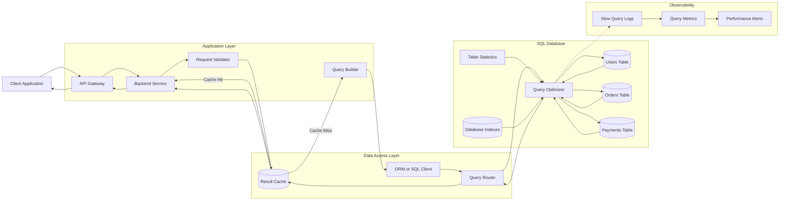
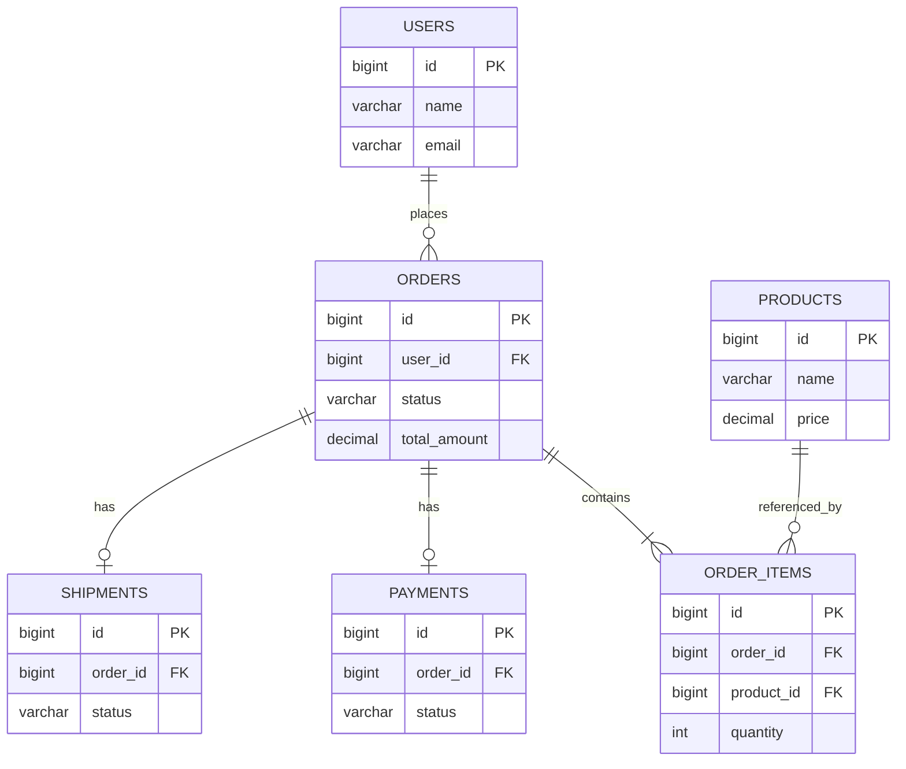

# Joins

Joins allow backend systems to combine related data stored across multiple tables. They are essential for user profiles, orders, payments, inventory, reporting, permissions, and most relational database workloads.

---

## Core Concepts

### 1. What Is a SQL Join?

A SQL join combines rows from two or more tables using a related column.

Consider these tables:

### `users`

| id | name  | email                                         |
| -: | ----- | --------------------------------------------- |
|  1 | Asha  | [asha@example.com](mailto:asha@example.com)   |
|  2 | Rahul | [rahul@example.com](mailto:rahul@example.com) |
|  3 | Neha  | [neha@example.com](mailto:neha@example.com)   |

### `orders`

|  id | user_id | total_amount |
| --: | ------: | -----------: |
| 101 |       1 |         2500 |
| 102 |       1 |         1200 |
| 103 |       2 |         3400 |

The relationship is:

```text
users.id = orders.user_id
```

A join can return user information together with order information:

```sql
SELECT
    users.name,
    orders.id AS order_id,
    orders.total_amount
FROM users
JOIN orders
    ON users.id = orders.user_id;
```

Result:

| name  | order_id | total_amount |
| ----- | -------: | -----------: |
| Asha  |      101 |         2500 |
| Asha  |      102 |         1200 |
| Rahul |      103 |         3400 |

---

### 2. Primary Keys and Foreign Keys

A primary key uniquely identifies a row.

```sql
CREATE TABLE users (
    id BIGINT PRIMARY KEY,
    name VARCHAR(100) NOT NULL
);
```

A foreign key connects one table to another.

```sql
CREATE TABLE orders (
    id BIGINT PRIMARY KEY,
    user_id BIGINT NOT NULL,
    total_amount DECIMAL(10, 2) NOT NULL,
    FOREIGN KEY (user_id) REFERENCES users(id)
);
```

In this relationship:

```text
users.id → Parent key
orders.user_id → Foreign key
```

Foreign keys help maintain referential integrity and prevent invalid relationships.

---

### 3. INNER JOIN

An `INNER JOIN` returns only rows that have matching values in both tables.

```sql
SELECT
    users.name,
    orders.id AS order_id
FROM users
INNER JOIN orders
    ON users.id = orders.user_id;
```

Users without orders are not returned.

Use it when both sides of the relationship are required.

---

### 4. LEFT JOIN

A `LEFT JOIN` returns every row from the left table and matching rows from the right table.

```sql
SELECT
    users.name,
    orders.id AS order_id
FROM users
LEFT JOIN orders
    ON users.id = orders.user_id;
```

A user without an order still appears:

| name  | order_id |
| ----- | -------: |
| Asha  |      101 |
| Asha  |      102 |
| Rahul |      103 |
| Neha  |   `NULL` |

Use it when the main entity must be returned even if related data does not exist.

---

### 5. RIGHT JOIN

A `RIGHT JOIN` returns every row from the right table and matching rows from the left table.

```sql
SELECT
    users.name,
    orders.id AS order_id
FROM users
RIGHT JOIN orders
    ON users.id = orders.user_id;
```

In practice, many teams prefer rewriting a `RIGHT JOIN` as a `LEFT JOIN` by reversing the table order.

This is often easier to read:

```sql
SELECT
    users.name,
    orders.id AS order_id
FROM orders
LEFT JOIN users
    ON orders.user_id = users.id;
```

---

### 6. FULL OUTER JOIN

A `FULL OUTER JOIN` returns:

* Matching rows from both tables
* Unmatched rows from the left table
* Unmatched rows from the right table

```sql
SELECT
    users.name,
    orders.id AS order_id
FROM users
FULL OUTER JOIN orders
    ON users.id = orders.user_id;
```

This is useful for reconciliation, audits, and data comparison.

Not every SQL database supports `FULL OUTER JOIN` directly.

---

### 7. CROSS JOIN

A `CROSS JOIN` returns every possible combination of rows.

```sql
SELECT
    products.name,
    regions.name
FROM products
CROSS JOIN regions;
```

If there are:

```text
100 products × 10 regions = 1,000 result rows
```

Cross joins are useful for generating combinations, but they can create extremely large result sets.

---

### 8. SELF JOIN

A self join joins a table with itself.

Consider an employee hierarchy:

| id | name  | manager_id |
| -: | ----- | ---------: |
|  1 | Priya |     `NULL` |
|  2 | Arjun |          1 |
|  3 | Meera |          1 |

Query:

```sql
SELECT
    employee.name AS employee_name,
    manager.name AS manager_name
FROM employees AS employee
LEFT JOIN employees AS manager
    ON employee.manager_id = manager.id;
```

Result:

| employee_name | manager_name |
| ------------- | ------------ |
| Priya         | `NULL`       |
| Arjun         | Priya        |
| Meera         | Priya        |

---

### 9. Equi Join and Non-Equi Join

An equi join uses equality:

```sql
ON users.id = orders.user_id
```

A non-equi join uses another comparison operator:

```sql
SELECT
    products.name,
    discount_rules.discount_percent
FROM products
JOIN discount_rules
    ON products.price BETWEEN discount_rules.min_price
                          AND discount_rules.max_price;
```

Non-equi joins are useful for ranges, pricing rules, time windows, and scoring bands.

---

### 10. Multi-Table Joins

A query can join several related tables.

```sql
SELECT
    users.name,
    orders.id AS order_id,
    payments.status AS payment_status,
    shipments.status AS shipment_status
FROM users
JOIN orders
    ON users.id = orders.user_id
LEFT JOIN payments
    ON orders.id = payments.order_id
LEFT JOIN shipments
    ON orders.id = shipments.order_id
WHERE users.id = 101;
```

Each additional join can increase:

* Query complexity
* Intermediate result size
* Memory usage
* CPU usage
* Risk of duplicated rows

---

### 11. Join Cardinality

Cardinality describes the relationship between tables.

#### One-to-One

```text
users 1 ─── 1 user_profiles
```

One user has one profile.

#### One-to-Many

```text
users 1 ─── N orders
```

One user can have many orders.

#### Many-to-Many

```text
students N ─── N courses
```

Many-to-many relationships require a junction table:

```text
students
student_courses
courses
```

Example:

```sql
SELECT
    students.name,
    courses.title
FROM students
JOIN student_courses
    ON students.id = student_courses.student_id
JOIN courses
    ON student_courses.course_id = courses.id;
```

---

### 12. Join Algorithms

The database optimizer chooses how a join is executed.

#### Nested Loop Join

```text
For each row in Table A:
    Search matching rows in Table B
```

Best suited for:

* Small outer datasets
* Indexed lookup columns
* Highly selective filters

#### Hash Join

```text
Build hash table from one dataset
Probe it using rows from the other dataset
```

Best suited for:

* Equality joins
* Large unsorted datasets
* Tables without a useful ordering

#### Merge Join

```text
Sort both datasets
Move through them in order
Match equal keys
```

Best suited for:

* Sorted inputs
* Large datasets
* Equality or range-compatible joins

The optimizer selects an algorithm based on table size, statistics, indexes, memory, and filtering conditions.

---

## Architecture

A scalable backend should keep join responsibilities controlled and observable.



### Request Flow

```text
Client Request
      ↓
API Validation
      ↓
Cache Lookup
      ↓
Query Construction
      ↓
Database Query Optimizer
      ↓
Join Algorithm Selection
      ↓
Index and Table Access
      ↓
Join Result
      ↓
Response and Optional Caching
```

### Main Components

#### 1. API Gateway

The API gateway handles:

* Authentication
* Rate limiting
* Request-size limits
* Timeouts
* Input validation

It prevents unrestricted client requests from creating expensive database joins.

---

#### 2. Backend Service

The backend service decides:

* Which related entities are needed
* Whether all relationships should be loaded
* Which consistency level is required
* Whether cached data is acceptable

It should avoid loading every related object by default.

---

#### 3. Request Validator

The validator restricts:

* Maximum page size
* Supported filters
* Allowed sorting fields
* Number of relationships requested
* Date-range size
* Query complexity

This protects the database from unbounded join requests.

---

#### 4. Query Builder

The query builder creates parameterized SQL.

```sql
SELECT
    orders.id,
    orders.status,
    users.name
FROM orders
JOIN users
    ON orders.user_id = users.id
WHERE orders.user_id = ?
ORDER BY orders.created_at DESC
LIMIT ?;
```

It should select only required columns and avoid unnecessary joins.

---

#### 5. Result Cache

Repeated join results can be cached when:

* The query is frequently executed
* The result does not change often
* Slightly stale data is acceptable
* The join is computationally expensive

Example cache key:

```text
user-orders:user=101:status=delivered:limit=20:cursor=abc
```

---

#### 6. Query Optimizer

The query optimizer chooses:

* Join order
* Join algorithm
* Indexes
* Filtering order
* Sorting strategy
* Parallel execution strategy

Developers can inspect its decision using:

```sql
EXPLAIN
SELECT
    users.name,
    orders.total_amount
FROM users
JOIN orders
    ON users.id = orders.user_id
WHERE users.id = 101;
```

For actual runtime details:

```sql
EXPLAIN ANALYZE
SELECT
    users.name,
    orders.total_amount
FROM users
JOIN orders
    ON users.id = orders.user_id
WHERE users.id = 101;
```

---

#### 7. Table Statistics

The optimizer uses statistics to estimate:

* Number of rows
* Number of distinct values
* Data distribution
* Filter selectivity
* Expected join result size

Outdated statistics can cause the optimizer to choose an inefficient join order or algorithm.

---

#### 8. Database Indexes

Indexes should usually exist on:

* Primary keys
* Foreign keys used in joins
* Frequently filtered columns
* Frequently sorted columns

Example:

```sql
CREATE INDEX idx_orders_user_id
ON orders(user_id);
```

For a filtered and sorted order query:

```sql
CREATE INDEX idx_orders_user_status_created
ON orders(user_id, status, created_at DESC);
```

---

#### 9. Slow Query Monitoring

Join-heavy queries should be monitored for:

* Execution time
* Rows scanned
* Rows returned
* Temporary disk usage
* Join algorithm
* Lock wait time
* Memory usage
* Query frequency

P95 and P99 latency often reveal problems hidden by average latency.

---

## Comparison: SQL Join Types

| Join Type         |        Matching Rows |  Unmatched Left Rows | Unmatched Right Rows | Common Use Case                                    |
| ----------------- | -------------------: | -------------------: | -------------------: | -------------------------------------------------- |
| `INNER JOIN`      |                  Yes |                   No |                   No | Return records that exist in both tables           |
| `LEFT JOIN`       |                  Yes |                  Yes |                   No | Return all main records with optional related data |
| `RIGHT JOIN`      |                  Yes |                   No |                  Yes | Return all right-side records                      |
| `FULL OUTER JOIN` |                  Yes |                  Yes |                  Yes | Reconciliation and data comparison                 |
| `CROSS JOIN`      |    Every combination |       Not applicable |       Not applicable | Generate combinations                              |
| `SELF JOIN`       | Depends on condition | Depends on join type | Depends on join type | Hierarchies and relationships within one table     |

### Rule of Thumb

Use `INNER JOIN` when the relationship must exist.

Use `LEFT JOIN` when the primary entity must be returned even when related data is missing.

Use `FULL OUTER JOIN` mainly for audits and reconciliation.

Use `CROSS JOIN` carefully because the result size grows multiplicatively.

---

## Real-World Example: E-Commerce Order Details

Consider an e-commerce system with these tables:

```text
users
orders
order_items
products
payments
shipments
```

The order details page needs to display:

* Customer name
* Order status
* Purchased products
* Product quantity
* Payment status
* Shipment status

### Relationships



### Query

```sql
SELECT
    orders.id AS order_id,
    orders.status AS order_status,
    users.name AS customer_name,
    products.id AS product_id,
    products.name AS product_name,
    order_items.quantity,
    payments.status AS payment_status,
    shipments.status AS shipment_status
FROM orders
JOIN users
    ON orders.user_id = users.id
JOIN order_items
    ON orders.id = order_items.order_id
JOIN products
    ON order_items.product_id = products.id
LEFT JOIN payments
    ON orders.id = payments.order_id
LEFT JOIN shipments
    ON orders.id = shipments.order_id
WHERE orders.id = 5001;
```

### Why Different Join Types Are Used

`INNER JOIN` is used for:

```text
orders → users
orders → order_items
order_items → products
```

These records are required for a valid order.

`LEFT JOIN` is used for:

```text
orders → payments
orders → shipments
```

Payment or shipment records may not exist yet.

---

### Recommended Indexes

```sql
CREATE INDEX idx_orders_user_id
ON orders(user_id);

CREATE INDEX idx_order_items_order_id
ON order_items(order_id);

CREATE INDEX idx_order_items_product_id
ON order_items(product_id);

CREATE INDEX idx_payments_order_id
ON payments(order_id);

CREATE INDEX idx_shipments_order_id
ON shipments(order_id);
```

Indexes on foreign-key columns reduce the number of rows scanned during joins.

---

### Possible Duplicate Rows

An order containing three products produces three result rows.

```text
One order
   ↓
Three order items
   ↓
Three joined rows
```

This is expected for a one-to-many relationship.

The backend can transform the flat result into a nested response:

```json
{
  "order_id": 5001,
  "order_status": "SHIPPED",
  "customer_name": "Asha",
  "payment_status": "PAID",
  "shipment_status": "IN_TRANSIT",
  "items": [
    {
      "product_id": 201,
      "product_name": "Mechanical Keyboard",
      "quantity": 1
    },
    {
      "product_id": 305,
      "product_name": "Wireless Mouse",
      "quantity": 2
    }
  ]
}
```

---

### Scaling the Query

As the dataset grows:

* Filter the main table before joining
* Index all frequently used foreign keys
* Select only required columns
* Paginate large child collections
* Cache stable order summaries
* Separate operational queries from analytics
* Precompute expensive reporting views
* Inspect the execution plan
* Avoid joining historical data unnecessarily
* Archive old records when appropriate

---

## Best Practices

### 1. Join on Indexed Columns

Indexes should normally exist on both primary keys and frequently used foreign-key columns.

```sql
CREATE INDEX idx_orders_user_id
ON orders(user_id);
```

Without an index, the database may repeatedly scan the joined table.

---

### 2. Filter Before Joining Large Tables

Prefer reducing the dataset as early as possible.

```sql
SELECT
    users.name,
    recent_orders.total_amount
FROM users
JOIN (
    SELECT user_id, total_amount
    FROM orders
    WHERE created_at >= CURRENT_DATE - INTERVAL '30 days'
) AS recent_orders
    ON users.id = recent_orders.user_id;
```

The optimizer may rewrite queries internally, but clear filtering still improves readability and intent.

---

### 3. Select Only Required Columns

Avoid:

```sql
SELECT *
FROM users
JOIN orders
    ON users.id = orders.user_id;
```

Prefer:

```sql
SELECT
    users.id,
    users.name,
    orders.id AS order_id,
    orders.status
FROM users
JOIN orders
    ON users.id = orders.user_id;
```

This reduces network, memory, and serialization costs.

---

### 4. Use Clear Table Aliases

```sql
SELECT
    u.name,
    o.id,
    o.total_amount
FROM users AS u
JOIN orders AS o
    ON u.id = o.user_id;
```

Aliases make multi-table queries easier to read and maintain.

Avoid unclear aliases such as `a`, `b`, and `c` in large queries.

---

### 5. Understand Relationship Cardinality

Before writing a join, identify whether the relationship is:

* One-to-one
* One-to-many
* Many-to-many

This helps predict the number of returned rows and prevents accidental duplication.

---

### 6. Use the Correct Join Type

Do not use `LEFT JOIN` when unmatched rows are not needed.

Do not use `INNER JOIN` when optional relationships must remain visible.

The join type should reflect the business requirement.

---

### 7. Check Execution Plans

Use:

```sql
EXPLAIN ANALYZE
```

Look for:

* Full table scans
* Large intermediate results
* Repeated nested loops
* Unexpected sorting
* Hash joins spilling to disk
* Incorrect row estimates

---

### 8. Keep Statistics Updated

The optimizer depends on accurate statistics.

Outdated statistics can produce:

* Incorrect cardinality estimates
* Poor join order
* Inefficient join algorithm selection
* Unexpected table scans

---

### 9. Avoid Unbounded Join Queries

Every list query should include:

* Filters
* Pagination
* Maximum result size
* Query timeout

Avoid returning millions of joined rows through an API.

---

### 10. Use Parameterized Queries

```sql
SELECT
    orders.id,
    orders.status
FROM orders
JOIN users
    ON orders.user_id = users.id
WHERE users.id = ?;
```

Parameterized queries reduce SQL injection risk and may improve execution-plan reuse.

---

### 11. Separate OLTP and Analytical Joins

Transactional databases should handle short, predictable queries.

Large analytical joins can be moved to:

* Data warehouses
* Read replicas
* Materialized views
* Reporting tables
* Batch-processing systems

---

### 12. Consider Denormalization Carefully

A frequently joined value may sometimes be duplicated to improve read performance.

For example, an order may store:

```text
customer_name_at_purchase
```

This can preserve historical accuracy and avoid a join.

However, denormalization adds:

* Duplicate data
* Write complexity
* Synchronization concerns
* Additional storage

---

## Common Mistakes

### 1. Missing the Join Condition

Incorrect:

```sql
SELECT *
FROM users
JOIN orders;
```

This can create a Cartesian product.

```text
10,000 users × 100,000 orders
= 1,000,000,000 rows
```

Always define the relationship explicitly.

---

### 2. Joining on Non-Indexed Foreign Keys

A missing index can force repeated scans of a large table.

```sql
CREATE INDEX idx_orders_user_id
ON orders(user_id);
```

---

### 3. Using `SELECT *`

Joining multiple tables with `SELECT *` can:

* Return duplicate column names
* Transfer unnecessary data
* Increase memory usage
* Break consumers when schemas change

---

### 4. Accidentally Turning a LEFT JOIN Into an INNER JOIN

Consider:

```sql
SELECT
    users.name,
    orders.status
FROM users
LEFT JOIN orders
    ON users.id = orders.user_id
WHERE orders.status = 'DELIVERED';
```

The `WHERE` condition removes rows where `orders.status` is `NULL`, effectively behaving like an inner join.

To preserve all users:

```sql
SELECT
    users.name,
    orders.status
FROM users
LEFT JOIN orders
    ON users.id = orders.user_id
   AND orders.status = 'DELIVERED';
```

---

### 5. Ignoring Duplicate Rows

One-to-many joins naturally produce multiple rows.

Using `DISTINCT` without understanding the cause may hide a modeling or query problem.

---

### 6. Joining Large Tables Before Filtering

This can create huge intermediate result sets.

Apply restrictive conditions as early as possible.

---

### 7. Using Functions on Join Columns

This may reduce index usability:

```sql
ON LOWER(users.email) = LOWER(accounts.email)
```

Prefer normalized data or functional indexes where supported.

---

### 8. Joining Columns With Different Data Types

Example:

```text
users.id        → BIGINT
orders.user_id  → VARCHAR
```

The database may need to convert values during the join, reducing performance and preventing normal index usage.

Related columns should use compatible data types.

---

### 9. Overusing Joins in API Requests

Loading users, orders, payments, products, reviews, shipments, and addresses in one request can create:

* Large result sets
* Duplicated data
* High memory usage
* Slow serialization
* Difficult pagination

Split queries when the relationships have different access patterns.

---

### 10. Creating N+1 Queries Instead of One Join or Batch

Problem:

```text
1 query to fetch orders
100 queries to fetch users
```

Better options:

* Join
* Batch lookup
* Eager loading
* Request-scoped data loader

---

### 11. Joining on Incomplete Conditions

Incorrect:

```sql
ON prices.product_id = products.id
```

When prices are tenant-specific, the correct condition may be:

```sql
ON prices.product_id = products.id
AND prices.tenant_id = products.tenant_id
```

Missing part of a composite relationship can create incorrect matches.

---

### 12. Optimizing Without Measuring

Do not change join order or add indexes based only on assumptions.

Measure:

* Query latency
* Query frequency
* Rows scanned
* Rows returned
* Memory usage
* Execution plan
* Database load

---

## Interview Questions with Short Answers

### 1. What is the difference between INNER JOIN and LEFT JOIN?

`INNER JOIN` returns only matching rows from both tables. `LEFT JOIN` returns every row from the left table and matching rows from the right table, using `NULL` when no match exists.

---

### 2. Why should foreign-key columns be indexed?

Foreign-key indexes help the database find related rows quickly. Without them, joins may require repeated full scans of the child table.

---

### 3. What is the difference between nested loop, hash, and merge joins?

A nested loop checks matches repeatedly and works well with small indexed datasets. A hash join builds a hash table and is effective for equality joins. A merge join processes sorted inputs efficiently.

---

### 4. How can a LEFT JOIN accidentally behave like an INNER JOIN?

A filter on the right table inside the `WHERE` clause removes rows containing `NULL`. Move the filter into the `ON` clause when unmatched left rows must remain.

---

### 5. How would you optimize a slow multi-table join?

Inspect the execution plan, filter early, select fewer columns, index join keys, update statistics, reduce intermediate rows, verify data types, paginate results, and move analytical joins away from the primary transactional database.

---

## Key Takeaways

1. **Choose the join type based on the required relationship.** Use `INNER JOIN` for mandatory matches and `LEFT JOIN` for optional related data.

2. **Join performance depends on indexes, cardinality, filtering, and execution plans.** The SQL syntax may be simple while the underlying operation is expensive.

3. **Understand the shape of the result before optimizing it.** One-to-many and many-to-many joins can multiply rows, increase memory use, and create unexpected duplicates.
