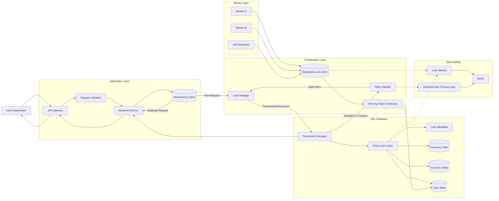
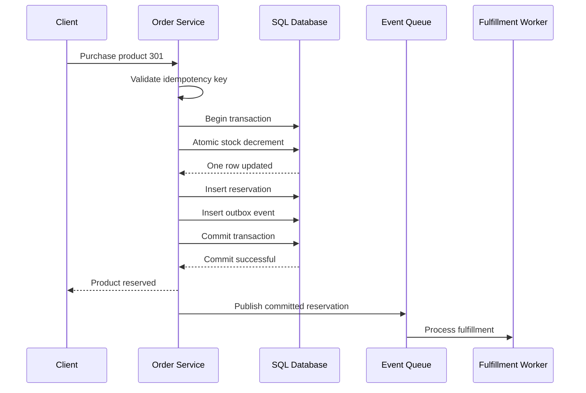

# Locks

Locks control access to shared resources when multiple requests, threads, processes, or services attempt to modify the same data simultaneously.

They are commonly used for:

* Inventory updates
* Account balances
* Seat reservations
* Job scheduling
* Leader election
* File processing
* Duplicate-request prevention

The goal is not to lock everything. The goal is to protect critical operations while preserving as much concurrency as possible.

⭐ Star this repository for more practical backend and system-design guides.

---

## Core Concepts

### 1. What Is a Lock?

A lock gives one or more operations controlled access to a shared resource.

Consider the final product in stock:

```text
Available stock = 1

Request A reads stock = 1
Request B reads stock = 1

Request A reduces stock to 0
Request B reduces stock to 0
```

Both requests may create an order even though only one item exists.

A lock coordinates the requests:

```text
Request A acquires lock
Request B waits

Request A checks stock
Request A reduces stock
Request A commits
Request A releases lock

Request B acquires lock
Request B sees stock = 0
Request B rejects purchase
```

---

### 2. Critical Section

A critical section is the part of the code that accesses shared mutable data.

```text
Acquire lock
    ↓
Read shared state
    ↓
Validate business rule
    ↓
Update shared state
    ↓
Release lock
```

Only the smallest necessary section should be protected.

Holding a lock during unrelated work reduces throughput and increases waiting time.

---

### 3. Shared Lock

A shared lock allows multiple transactions to read the same resource.

```text
Reader A ─┐
Reader B ─┼── Shared access
Reader C ─┘
```

A conflicting writer may have to wait until the shared locks are released.

Shared locks are useful when:

* Multiple readers need stable data
* Writes must not occur during the read
* The database uses lock-based isolation

---

### 4. Exclusive Lock

An exclusive lock allows one transaction to modify a resource.

```text
Writer A → Exclusive access
Writer B → Wait
Reader C → May wait, depending on the database
```

Example:

```sql
SELECT available_stock
FROM inventory
WHERE product_id = 301
FOR UPDATE;
```

`FOR UPDATE` usually acquires a row-level lock for the selected record.

---

### 5. Row-Level Lock

A row-level lock protects individual rows.

```sql
BEGIN;

SELECT balance
FROM accounts
WHERE id = 101
FOR UPDATE;

UPDATE accounts
SET balance = balance - 500
WHERE id = 101;

COMMIT;
```

Advantages:

* High concurrency
* Unrelated rows remain available
* Suitable for targeted updates

Trade-offs:

* More locks to manage
* Deadlocks are still possible
* Hot rows can become bottlenecks

---

### 6. Table-Level Lock

A table-level lock protects an entire table.

```sql
LOCK TABLE inventory IN EXCLUSIVE MODE;
```

Advantages:

* Simple coordination
* Lower lock-management overhead
* Useful for certain maintenance operations

Disadvantages:

* Blocks unrelated operations
* Reduces concurrency
* Can create high latency under traffic

Table locks should be used carefully in request-driven systems.

---

### 7. Page-Level Lock

A page-level lock protects a group of rows stored on the same database page.

It provides a middle ground between row-level and table-level locking.

```text
Row lock   → Small protected area, more lock objects
Page lock  → Medium protected area
Table lock → Large protected area, fewer lock objects
```

The database may choose the lock granularity automatically.

---

### 8. Intent Locks

Intent locks tell the database that a transaction plans to lock records at a lower level.

For example:

```text
Intent exclusive lock on table
            ↓
Exclusive lock on selected rows
```

They help the database coordinate row-level and table-level locks efficiently.

Application developers rarely manage intent locks directly, but they may appear in execution and lock diagnostics.

---

### 9. Pessimistic Locking

Pessimistic locking assumes conflicts are likely.

The resource is locked before it is modified:

```sql
BEGIN;

SELECT available_stock
FROM inventory
WHERE product_id = 301
FOR UPDATE;

UPDATE inventory
SET available_stock = available_stock - 1
WHERE product_id = 301;

COMMIT;
```

Best suited for:

* High-contention resources
* Financial balances
* Limited inventory
* Seat reservations
* Critical state transitions

Trade-offs:

* Requests may wait
* Deadlocks may occur
* Long transactions reduce throughput
* Failed clients may hold resources until timeout

---

### 10. Optimistic Locking

Optimistic locking assumes conflicts are uncommon.

Instead of blocking other operations, it detects whether the record changed.

Example table:

```sql
CREATE TABLE products (
    id BIGINT PRIMARY KEY,
    available_stock INT NOT NULL,
    version BIGINT NOT NULL DEFAULT 0
);
```

Update:

```sql
UPDATE products
SET available_stock = available_stock - 1,
    version = version + 1
WHERE id = 301
  AND version = 12
  AND available_stock > 0;
```

Result:

```text
1 row updated → Success
0 rows updated → Conflict or unavailable stock
```

Best suited for:

* Read-heavy workloads
* Low-contention data
* User-profile editing
* Content-management systems
* APIs where waiting is undesirable

---

### 11. Lock Timeout

A lock timeout limits how long an operation waits for a lock.

```text
Request waits for lock
        ↓
Timeout reached
        ↓
Transaction fails
```

Timeouts prevent blocked requests from consuming database connections indefinitely.

The application should return a controlled error or retry when appropriate.

---

### 12. Deadlock

A deadlock occurs when transactions wait for each other.

```text
Transaction A locks Row 1
Transaction B locks Row 2

Transaction A requests Row 2
Transaction B requests Row 1
```

Neither can continue.

Most databases detect the cycle and abort one transaction.

Applications should treat deadlock errors as retryable when the complete operation is safe to repeat.

---

### 13. Lock Ordering

Consistent lock ordering reduces deadlocks.

For an account transfer:

```text
Always lock the account with the smaller ID first.
```

Example:

```sql
SELECT id, balance
FROM accounts
WHERE id IN (101, 202)
ORDER BY id
FOR UPDATE;
```

Every transfer follows the same order, even when money moves in the opposite direction.

---

### 14. Lock Escalation

Lock escalation occurs when a database replaces many smaller locks with a larger lock.

```text
Thousands of row locks
          ↓
One table-level lock
```

This reduces lock-management overhead but may unexpectedly block unrelated transactions.

Large updates should often be processed in bounded batches.

---

### 15. Advisory Locks

Advisory locks are application-controlled locks provided by some databases.

They can protect logical resources that are not represented by one specific row.

Examples:

```text
Generate monthly invoice for tenant 101
Run one migration task
Process one customer export
```

The application must follow the locking convention consistently because the database may not enforce it automatically.

---

### 16. Distributed Locks

A distributed lock coordinates processes running on different machines.

```text
Service Instance A
Service Instance B
Service Instance C
         ↓
Shared Lock Service
```

Common use cases:

* Running one scheduled job
* Processing one file
* Leader election
* Preventing duplicate background work
* Coordinating access to an external resource

A distributed lock normally requires:

* Unique owner identifier
* Expiration time
* Safe release
* Failure handling
* Fencing token or version

---

### 17. Lease

A lease is a lock with an expiration time.

```text
Acquire lock for 30 seconds
          ↓
Complete or renew work
          ↓
Lock expires automatically
```

Expiration prevents a crashed process from holding a lock forever.

However, the process may continue working after its lease expires. This is why expiration alone is not enough for every critical workflow.

---

### 18. Fencing Token

A fencing token is a monotonically increasing number issued whenever a lock is acquired.

```text
Worker A acquires lock → Token 41
Worker A pauses

Lease expires

Worker B acquires lock → Token 42
Worker B updates resource

Worker A resumes with Token 41
Resource rejects stale token
```

The protected system accepts only the newest token.

Fencing tokens protect against a previous lock owner continuing work after losing ownership.

---

### 19. Reentrant Lock

A reentrant lock allows the same owner to acquire a lock multiple times.

```text
Function A acquires lock
Function A calls Function B
Function B acquires the same lock
```

The lock is released only after the matching number of releases.

Reentrant locks are common inside applications, but their ownership rules must be clear.

---

### 20. Read-Write Lock

A read-write lock supports:

* Multiple concurrent readers
* One exclusive writer

```text
Readers can run together
Writer requires exclusive access
```

It is useful when reads are frequent and writes are rare.

A poorly configured read-write lock may cause writer starvation when readers continuously acquire access.

---

## Architecture

A reliable locking architecture uses the database for transactional row protection and a dedicated coordination mechanism for cross-instance operations.



### Request Flow

```text
Client request
      ↓
Validate request
      ↓
Check idempotency key
      ↓
Identify protected resource
      ↓
Acquire database or distributed lock
      ↓
Revalidate current state
      ↓
Apply the change
      ↓
Commit the transaction
      ↓
Release the lock
      ↓
Return the result
```

---

### Main Components

#### 1. API Gateway

The API gateway handles:

* Authentication
* Rate limiting
* Request tracing
* Request-size limits
* API timeouts

Invalid requests should be rejected before acquiring locks.

---

#### 2. Backend Service

The service owns the critical business operation.

Its responsibilities include:

* Choosing the protected resource
* Defining lock scope
* Starting the transaction
* Handling conflicts
* Committing or rolling back
* Returning controlled errors

The lock boundary should align with the business invariant being protected.

---

#### 3. Idempotency Store

Idempotency prevents retried requests from repeating a completed operation.

Example:

```text
Idempotency-Key: checkout-user101-cart88
```

Stored result:

```json
{
  "idempotency_key": "checkout-user101-cart88",
  "status": "COMPLETED",
  "resource_id": "order-5001"
}
```

Locks coordinate simultaneous work. Idempotency protects against repeated work after completion or uncertain responses.

Both may be required.

---

#### 4. Lock Manager

The lock manager determines:

* Which resource to lock
* Which locking mechanism to use
* Lock timeout
* Retry policy
* Lock ordering
* Ownership information

Example resource identifiers:

```text
inventory:product:301
account:101
job:daily-settlement
file:customer-import-900
```

---

#### 5. Transaction Manager

The transaction manager controls:

```text
BEGIN
COMMIT
ROLLBACK
```

Database locks should usually be held within a transaction and released immediately after commit or rollback.

---

#### 6. Row-Level Locks

Row-level locks protect individual database records.

```sql
SELECT available_stock
FROM inventory
WHERE product_id = 301
FOR UPDATE;
```

The database tracks ownership and releases the lock when the transaction ends.

---

#### 7. Distributed Lock Store

A distributed lock store coordinates independent service instances.

A lock record may contain:

```json
{
  "resource": "job:daily-settlement",
  "owner": "worker-17",
  "expires_at": "2026-08-01T10:31:00Z",
  "fencing_token": 42
}
```

The implementation should use an atomic acquire operation rather than:

```text
Check whether lock exists
Then create lock
```

That check-then-create sequence contains a race condition.

---

#### 8. Fencing Token Generator

Each successful lock acquisition receives a larger token.

The protected resource rejects requests carrying an older token.

This prevents stale lock holders from modifying data after their lease expires.

---

#### 9. Retry Handler

Some locking failures are temporary:

* Deadlock
* Lock timeout
* Optimistic conflict
* Lease acquisition failure

Safe retries should use:

* Limited attempts
* Exponential backoff
* Random jitter
* Idempotency protection
* Clear metrics

---

#### 10. Observability

Monitor:

* Lock acquisition latency
* Lock hold duration
* Lock timeout rate
* Deadlock count
* Retry count
* Optimistic conflict rate
* Number of waiting transactions
* Distributed lock expiry rate
* Stale fencing-token rejection
* Long-running transactions

High P95 or P99 latency may be caused by lock contention even when query execution is fast.

---

## Comparison: Pessimistic vs Optimistic Locking

| Area               | Pessimistic Locking                    | Optimistic Locking                     |
| ------------------ | -------------------------------------- | -------------------------------------- |
| Strategy           | Block conflicts before modification    | Detect conflicts during modification   |
| Waiting            | Common                                 | Usually no waiting                     |
| Conflict result    | Other requests wait or time out        | One update fails and retries           |
| Best for           | High-contention resources              | Low-contention resources               |
| Database technique | `SELECT ... FOR UPDATE`                | Version or timestamp check             |
| Main risk          | Deadlocks and lock waits               | Frequent retries under high contention |
| Throughput         | Lower when locks are heavily contested | High when conflicts are rare           |
| Example            | Final seat reservation                 | Editing a user profile                 |

### Rule of Thumb

Use pessimistic locking when conflicts are frequent and only one operation should proceed at a time.

Use optimistic locking when conflicts are uncommon and retrying is cheaper than making requests wait.

For simple counters or inventory updates, an atomic conditional update may be better than either approach.

---

## Real-World Example: Flash-Sale Inventory

Consider a flash sale with:

```text
Product: Gaming Console
Available stock: 100
Concurrent buyers: 10,000
```

The system must prevent inventory from becoming negative.

---

### Unsafe Read-Then-Write Flow

```sql
SELECT available_stock
FROM inventory
WHERE product_id = 301;
```

Application logic:

```text
If stock > 0:
    stock = stock - 1
```

Update:

```sql
UPDATE inventory
SET available_stock = 99
WHERE product_id = 301;
```

Many requests can read the same stock value before any update commits.

This creates lost updates and overselling.

---

### Option 1: Atomic Conditional Update

```sql
UPDATE inventory
SET available_stock = available_stock - 1
WHERE product_id = 301
  AND available_stock > 0;
```

The application checks the affected row count:

```text
1 row updated → Inventory reserved
0 rows updated → Sold out
```

This is often the simplest solution.

---

### Option 2: Pessimistic Row Lock

```sql
BEGIN;

SELECT available_stock
FROM inventory
WHERE product_id = 301
FOR UPDATE;

UPDATE inventory
SET available_stock = available_stock - 1
WHERE product_id = 301
  AND available_stock > 0;

INSERT INTO reservations(
    user_id,
    product_id,
    status
)
VALUES (
    101,
    301,
    'RESERVED'
);

COMMIT;
```

This protects the full reservation workflow but serializes transactions competing for the same product row.

---

### Option 3: Optimistic Lock

```sql
UPDATE inventory
SET available_stock = available_stock - 1,
    version = version + 1
WHERE product_id = 301
  AND version = 42
  AND available_stock > 0;
```

A zero-row result means:

* Another request updated the record
* The version is stale
* The product sold out

The application can reload the record and retry a limited number of times.

Under extremely high contention, optimistic retries may create additional database load.

---

### Flash-Sale Architecture



---

### Handling a Sold-Out Product

When the conditional update affects zero rows:

```text
Rollback transaction
      ↓
Return sold-out response
```

Example:

```json
{
  "error": "PRODUCT_SOLD_OUT",
  "message": "This product is no longer available."
}
```

---

### Handling Client Retries

The client may time out after the database commits.

Request:

```http
POST /orders
Idempotency-Key: flash-sale-user101-product301
```

A repeated request should return the existing reservation rather than decrementing stock again.

---

### Scaling Beyond One Hot Row

One inventory row can become a bottleneck during extreme traffic.

Possible strategies include:

* Admission control
* Waiting-room queues
* Partitioned inventory buckets
* Reservation tokens
* Per-region inventory
* Preallocated stock pools
* Asynchronous order acceptance

These approaches increase complexity and should be introduced only when database-level atomic updates no longer meet the throughput requirement.

---

## Best Practices

### 1. Lock the Smallest Necessary Resource

Prefer:

```text
Lock one inventory row
```

over:

```text
Lock the complete inventory table
```

Smaller lock scope preserves concurrency.

---

### 2. Keep Lock Duration Short

Inside a lock:

* Read required state
* Validate the rule
* Apply the update
* Commit

Do not perform unrelated work.

---

### 3. Never Hold Database Locks During External Calls

Avoid:

```text
Begin transaction
Acquire lock
Call payment provider
Wait for response
Update database
Commit
```

External calls have unpredictable latency and failure behavior.

---

### 4. Use Atomic Updates When Possible

Prefer:

```sql
UPDATE inventory
SET available_stock = available_stock - 1
WHERE product_id = ?
  AND available_stock > 0;
```

This may remove the need for an explicit application-managed lock.

---

### 5. Check Affected Row Counts

A conditional update may affect zero rows.

Always distinguish between:

```text
Update succeeded
Resource unavailable
Version conflict
Record missing
```

---

### 6. Acquire Multiple Locks in a Consistent Order

For account transfers:

```text
Lock lower account ID first
Lock higher account ID second
```

Use the same order throughout the system.

---

### 7. Configure Lock Timeouts

Requests should not wait forever.

Use:

* Lock timeout
* Statement timeout
* Transaction timeout
* API timeout

The shortest timeout should not accidentally expire while a lower layer continues consuming resources.

---

### 8. Retry Only Safe Failures

Potentially retryable errors include:

* Deadlocks
* Serialization failures
* Optimistic version conflicts
* Temporary lock-acquisition failures

Use bounded retries with backoff and jitter.

---

### 9. Make Retried Operations Idempotent

A retry must not duplicate:

* Orders
* Payments
* Refunds
* Reservations
* Scheduled jobs

Locks alone do not provide request-level idempotency.

---

### 10. Use Leases for Distributed Locks

Distributed locks should normally expire so crashed owners cannot block the resource permanently.

The lease duration must account for:

* Expected task duration
* Network delay
* Process pauses
* Renewal failures

---

### 11. Use Fencing Tokens for Critical Distributed Work

Lease expiry cannot stop an old worker from continuing after a long pause.

Fencing tokens allow the protected resource to reject stale workers.

---

### 12. Release Only Locks You Own

A distributed lock release should verify the owner identifier.

Unsafe:

```text
Delete lock by resource name
```

Safer:

```text
Delete lock only when resource and owner token match
```

---

### 13. Monitor Contention

Track resources with:

* High wait time
* Frequent timeouts
* High retry rates
* Long lock duration
* Repeated deadlocks

A hot resource may require redesign rather than larger timeouts.

---

### 14. Test Real Concurrent Requests

Single-request tests do not reveal locking bugs.

Test:

* Two simultaneous updates
* High-contention inventory
* Opposite-direction transfers
* Worker crash while holding a lease
* Lock expiry during processing
* Deadlock recovery

---

### 15. Document Lock Ownership

For every important lock, document:

```text
Resource being protected
Lock owner
Acquisition location
Release location
Timeout
Retry behavior
Lock ordering
Failure recovery
```

Undocumented locking conventions are difficult to maintain safely.

---

## Common Mistakes

### 1. Locking Too Much Data

A table-level lock for a row-level operation reduces concurrency unnecessarily.

---

### 2. Holding Locks Too Long

Long lock duration increases:

* Waiting requests
* Deadlock probability
* Timeout rate
* Connection usage
* Tail latency

---

### 3. Calling External Services While Holding a Lock

A slow payment, email, or storage service can block unrelated database work.

---

### 4. Forgetting to Release Application Locks

Locks should be released in guaranteed cleanup logic.

```text
Acquire
Try operation
Finally release
```

Database locks should be released through commit or rollback.

---

### 5. Using Read-Then-Write Without Protection

Unsafe:

```text
Read stock
Change value in application
Write value
```

Use an atomic update, version check, or explicit lock.

---

### 6. Retrying Without Idempotency

The original operation may already have committed before the client received an error.

Blind retries can duplicate business actions.

---

### 7. Locking Resources in Different Orders

Inconsistent ordering creates preventable deadlocks.

---

### 8. Retrying Forever

Unlimited retries increase load and hide persistent problems.

Use bounded attempts and expose a controlled failure.

---

### 9. Assuming a Distributed Lock Is Perfect

Distributed locks must handle:

* Network partitions
* Expired leases
* Paused processes
* Duplicate owners
* Clock differences
* Stale workers

A simple lock key with an expiry may not protect critical resources safely.

---

### 10. Releasing Another Owner’s Lock

Deleting a lock without verifying its owner may release a newer worker’s valid lock.

---

### 11. Using a Lease Without Fencing Tokens

An expired worker may resume and overwrite work completed by the new owner.

---

### 12. Using Locks Instead of Database Constraints

Locks coordinate operations, but constraints should still protect final invariants.

Examples:

* Unique constraints
* Foreign keys
* Check constraints
* Exclusion constraints

---

### 13. Using a Global Lock for Convenience

A global lock may be easy to implement but can turn the entire system into a single-threaded workflow.

---

### 14. Ignoring Lock Metrics

A query may appear slow because it is waiting for a lock, not because its execution plan is inefficient.

---

### 15. Assuming In-Memory Locks Work Across Instances

A lock inside one application process does not coordinate other servers.

```text
Instance A lock ≠ Instance B lock
```

Use database or distributed coordination when multiple instances share the resource.

---

## Interview Questions with Short Answers

### 1. What is the difference between shared and exclusive locks?

A shared lock allows multiple compatible readers. An exclusive lock gives one transaction write access and blocks conflicting operations.

---

### 2. What is the difference between optimistic and pessimistic locking?

Pessimistic locking blocks conflicting operations before modification. Optimistic locking allows concurrent work but detects conflicts using a version or timestamp during the update.

---

### 3. What causes a deadlock?

A deadlock occurs when transactions hold resources and wait for each other in a cycle. Consistent lock ordering and short transactions reduce the risk.

---

### 4. Why does a distributed lock need an expiration time and fencing token?

Expiration releases abandoned locks after a worker crashes. A fencing token prevents an expired lock owner from continuing to modify the protected resource.

---

### 5. How would you prevent inventory from becoming negative?

Use an atomic conditional update such as `UPDATE ... WHERE available_stock > 0`, check the affected row count, and keep the reservation changes in one transaction.

---

## Key Takeaways

1. **Locks protect critical sections, not entire systems.** Use the smallest lock scope and hold it for the shortest possible time.

2. **Choose coordination based on contention.** Pessimistic locking is useful for frequent conflicts, while optimistic locking works well when conflicts are rare.

3. **Distributed locks require failure-aware design.** Use atomic acquisition, ownership checks, leases, fencing tokens, idempotency, and observability.
