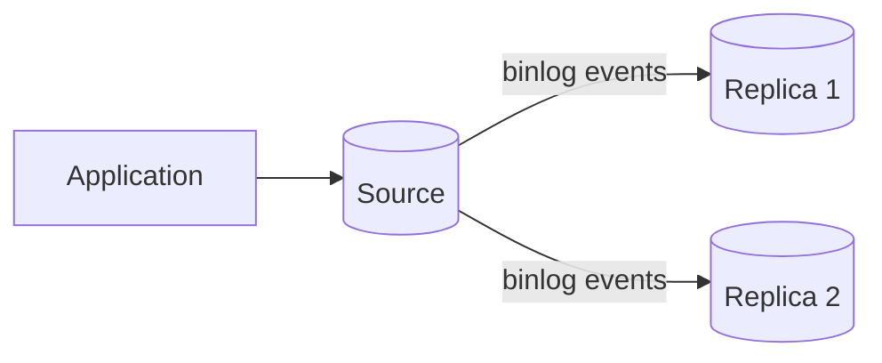

# MySQL / InnoDB for System Design

MySQL is a mature relational database platform. For most transactional MySQL system-design discussions, the relevant storage engine is **InnoDB**.

The interview value comes from understanding the InnoDB transaction model, clustered indexes, buffer pool, redo/undo/binlog responsibilities, replication lag, and failure behavior.

---

## Interview TL;DR

1. InnoDB provides ACID transactions, MVCC, row-level locking, foreign keys, and a clustered primary-key index.
2. InnoDB's default isolation level is **Repeatable Read**.
3. Ordinary consistent reads use MVCC; locking reads and writes can acquire record, gap, or next-key locks depending on isolation level and access path.
4. Primary-key choice matters more in InnoDB because table rows are organized by the clustered primary-key index and secondary indexes carry the primary-key value.
5. The **buffer pool** is central to performance; disk capacity is not the same as working-set performance.
6. Redo log, undo log, and binary log have different purposes.
7. Traditional MySQL replication is **asynchronous by default**, so replicas may lag and failover can lose recent source-only transactions.
8. Semisynchronous replication reduces some acknowledgement risk but is not the same as waiting for a replica to apply the transaction.
9. Deadlocks are expected failure modes; applications must be ready to retry complete transactions.
10. More indexes improve selected reads but amplify writes and enlarge the buffer-pool working set.

---

# 1. InnoDB as the Transactional Default

InnoDB is the normal production choice when you need:

- transactions
- MVCC
- row-level locking
- crash recovery
- foreign keys
- secondary indexes
- replication integration

Do not design modern OLTP around MyISAM unless there is an extremely specific reason.

---

# 2. Clustered Primary Key

In InnoDB, the table data is organized by the primary-key clustered index.

Conceptually:

```text
clustered primary-key B+ tree
        ↓
leaf pages contain row data
```

Secondary indexes contain:

```text
secondary key
+
primary-key value
```

A secondary-index lookup may require:

```text
secondary index
      ↓
primary key
      ↓
clustered index
      ↓
row
```

Therefore a very large primary key increases:

- clustered-index size
- secondary-index size
- memory pressure
- I/O
- write amplification

Primary-key design is a storage decision, not only an API identifier decision.

---

# 3. Auto-Increment vs UUID

## Auto-increment integer

**Benefits**

- compact
- insertion locality
- smaller secondary indexes

**Costs**

- centrally generated
- predictable
- harder for disconnected writers to pre-generate

## UUID

Useful for independent generation, but random UUIDs can spread inserts across pages and increase index size.

If UUID semantics are required, prefer a storage representation and ordering strategy appropriate to the workload.

---

# 4. Transactions

```sql
START TRANSACTION;

UPDATE accounts
SET balance = balance - 100
WHERE id = 1;

UPDATE accounts
SET balance = balance + 100
WHERE id = 2;

COMMIT;
```

Keep transactions:

- short
- consistently ordered
- free of slow external I/O
- prepared for deadlock retry

---

# 5. InnoDB Isolation Levels

InnoDB supports the four standard names:

- Read Uncommitted
- Read Committed
- Repeatable Read
- Serializable

Default: **Repeatable Read**.

Implementation details matter more than the generic ANSI anomaly table.

---

# 6. Repeatable Read in InnoDB

Ordinary consistent reads in one transaction use the snapshot established by the first such read.

For locking reads, `UPDATE`, and `DELETE`:

- an exact unique-index lookup can lock only the matching record
- range and non-unique searches can use next-key locking
- next-key locking includes a record plus the gap before it

This matters for both correctness and contention.

Example:

```sql
SELECT *
FROM reservations
WHERE room_id = 10
  AND starts_at >= ?
  AND starts_at < ?
FOR UPDATE;
```

The access path and index design affect which ranges are locked.

A missing or weak index can therefore become a **concurrency problem**, not just a latency problem.

---

# 7. Read Committed

Read Committed creates a fresh committed view per consistent read.

It generally reduces gap-locking behavior compared with Repeatable Read, improving concurrency for some workloads.

Trade-off:

- more changing data can be observed between statements
- application logic must not assume a stable transaction snapshot

Do not change the global isolation level merely because “Read Committed is faster.” Validate your business invariants.

---

# 8. Serializable

Serializable is stricter and can transform ordinary reads into stronger locking behavior.

It can significantly reduce concurrency for contested workloads.

Before choosing it globally, ask whether the invariant can be protected with:

- atomic conditional update
- unique constraint
- row lock
- version check
- narrower transaction

---

# 9. MVCC and Undo

InnoDB uses undo information to reconstruct older row versions for consistent reads and rollback.

Long-running transactions can keep old versions alive and increase purge/history pressure.

Monitor:

- long transactions
- undo/history growth
- lock waits
- deadlocks

---

# 10. Atomic Conditional Update

Instead of:

```text
read stock = 1
check in app
write stock = 0
```

prefer:

```sql
UPDATE inventory
SET available = available - 1
WHERE product_id = ?
  AND available > 0;
```

Then verify the affected-row count.

This often protects an invariant without a broad isolation change.

---

# 11. Locking Reads

Use:

```sql
SELECT ...
FOR UPDATE;
```

when the following write depends on the exact current row state and conflict should serialize.

Be aware:

- rows/ranges remain locked until transaction end
- lock order affects deadlocks
- query plan affects lock footprint
- long transactions amplify tail latency

---

# 12. Deadlocks

Deadlocks are normal in concurrent transactional systems.

Example:

```text
Tx A locks order 1
Tx B locks order 2

Tx A requests order 2
Tx B requests order 1
```

InnoDB detects a deadlock and rolls back a victim transaction when deadlock detection is enabled.

Application strategy:

```text
deadlock
   ↓
rollback whole transaction
   ↓
bounded backoff
   ↓
retry if operation is safe
```

Reduce deadlocks by:

- consistent lock order
- short transactions
- useful indexes for locking predicates
- smaller lock ranges

---

# 13. Buffer Pool

The InnoDB buffer pool caches table/index pages.

```text
query
  ↓
buffer pool
  ├─ hit  → memory path
  └─ miss → storage read
```

Performance depends strongly on:

- working-set size
- buffer-pool size
- query locality
- index footprint
- storage latency
- dirty-page flushing

“Database is 5 TB” does not imply “needs 5 TB RAM.” The critical metric is the hot working set and I/O pattern.

---

# 14. Redo Log

Redo records physical changes needed for crash recovery.

Conceptually:

```text
modify page in memory
      ↓
redo log
      ↓
commit durability point
      ↓
page flushed later
```

Redo allows page writes to be decoupled from every commit.

---

# 15. Undo Log

Undo supports:

- rollback
- older versions for MVCC
- consistent reads

Long transactions can prevent cleanup of older versions.

---

# 16. Binary Log

The binary log exists at the MySQL server level and supports:

- replication
- point-in-time recovery
- change data capture

It is not interchangeable with InnoDB redo.

Mental model:

| Log | Main role |
|---|---|
| Redo | InnoDB crash recovery/durability |
| Undo | rollback + MVCC history |
| Binlog | replication/logical recovery/CDC |

---

# 17. Indexing

InnoDB commonly uses B-tree-style indexes.

Index trade-off:

```text
faster targeted reads
    vs
more storage + memory + write cost
```

Because every secondary index contains the primary-key value, over-indexing and oversized primary keys interact.

Design indexes from real:

- equality predicates
- range predicates
- join columns
- ordering
- covering needs

Validate with `EXPLAIN` / `EXPLAIN ANALYZE` where appropriate for the version/workload.

---

# 18. Composite Index Order

Example:

```sql
CREATE INDEX idx_orders_tenant_status_created
ON orders(tenant_id, status, created_at DESC);
```

Good for queries whose leading predicates align.

But do not reduce index design to a single memorized rule.

Consider:

- equality columns
- range columns
- sort order
- selectivity
- covering
- lock footprint

---

# 19. Replication

Traditional MySQL replication is asynchronous by default.



Benefits:

- read scale
- redundancy
- DR
- backup/reporting offload

Costs:

- lag
- read-after-write problems
- failover complexity
- possible loss of recent source-only transactions

---

# 20. GTIDs

Global Transaction Identifiers identify committed transactions in a topology.

They simplify:

- replication positioning
- failover/source switching
- topology operations

They do not remove the need to reason about:

- lag
- durability
- promotion safety
- consistency-sensitive reads

---

# 21. Semisynchronous Replication

Semisynchronous replication can make the source wait until at least one semisynchronous replica acknowledges receiving/logging the transaction events before returning the commit to the client.

Important:

> This is not the same as guaranteeing the transaction has been applied on the replica before the client sees success.

It can reduce the window for source-only acknowledged transactions, at the cost of added write latency and dependence on replica/network responsiveness.

---

# 22. Group Replication

MySQL Group Replication provides a different HA model with group membership and consistency mechanisms.

It can operate in:

- single-primary mode
- multi-primary mode

Use it when the operational model fits. Do not treat “multi-primary” as automatic infinite write scale; certification/conflict handling and workload shape still matter.

---

# 23. Read Replicas

Send reads to replicas only when the consistency policy permits it.

Stale-tolerant:

- catalog browsing
- historical reporting
- dashboards

Potentially primary/stronger path:

- immediate order status after write
- security state
- inventory decision
- payment result

Measure replication lag.

---

# 24. Connection Pooling

Application concurrency should be decoupled from database connection count.

```text
2,000 request workers
       ↓
bounded pool
       ↓
100 DB connections
```

The exact pool size is workload-specific.

Too many database connections can create:

- CPU scheduling overhead
- lock contention
- memory pressure
- worse tail latency

---

# 25. Backups and Recovery

Replication is not backup.

Use:

- physical/logical backups as appropriate
- binary log retention for point-in-time recovery
- off-site/independent copies
- encrypted backup storage
- regular restore tests

Define:

- RPO
- RTO

before choosing replication and backup topology.

---

# 26. Scaling Path

A healthy progression:

```text
single InnoDB primary
      ↓
query/index tuning
      ↓
pooling
      ↓
cache measured hot reads
      ↓
read replicas
      ↓
archive/partition workload where useful
      ↓
separate analytics/search
      ↓
shard/distribute only when measured limits require it
```

---

# 27. Common Mistakes

### “MySQL is simpler, therefore it cannot handle complex systems”

Wrong. Complexity depends on the workload and architecture.

### “Replica = current”

Replication is asynchronous by default.

### “Repeatable Read means no anomalies”

Implementation is strong, but correctness still depends on read type, locking, and business invariant.

### “Deadlocks mean the schema is broken”

Some deadlocks are normal. Frequent deadlocks may reveal poor lock ordering/indexing or overly large transactions.

### “Adding indexes is free”

Indexes enlarge the buffer-pool working set and increase write cost.

### “Semisync means synchronous apply”

It does not imply the replica has applied the transaction before acknowledgment.

---

# 28. Interview Questions

## Why does primary-key size matter more in InnoDB?

Because rows are clustered by primary key and secondary indexes include the primary-key value.

## Why can a missing index increase lock contention?

Locking statements can lock scanned index ranges. A broader scan can produce a broader lock footprint.

## What is the consistency problem with read replicas?

The replica may not have applied the latest source transaction.

## Why must applications retry deadlocks?

InnoDB can choose one transaction as the deadlock victim and roll it back.

## Redo vs binlog?

Redo is an InnoDB crash-recovery mechanism. Binlog supports replication and logical recovery/CDC.

---

# Senior-Level Checklist

```text
1. What invariant belongs in MySQL?
2. Which isolation/locking strategy protects it?
3. What is the clustered primary key?
4. How large are secondary indexes?
5. What is the hot working set?
6. How many connections can the source sustain?
7. What is the replica-staleness policy?
8. Async, semisync, or Group Replication — why?
9. What is the failover/RPO model?
10. How are deadlocks and retries handled?
11. What is the backup/PITR plan?
12. What metric proves we need sharding?
```

---

## References

- https://dev.mysql.com/doc/refman/8.4/en/innodb-introduction.html
- https://dev.mysql.com/doc/refman/8.4/en/innodb-transaction-isolation-levels.html
- https://dev.mysql.com/doc/refman/8.4/en/innodb-locks-set.html
- https://dev.mysql.com/doc/refman/8.4/en/innodb-deadlocks.html
- https://dev.mysql.com/doc/refman/8.4/en/replication.html
