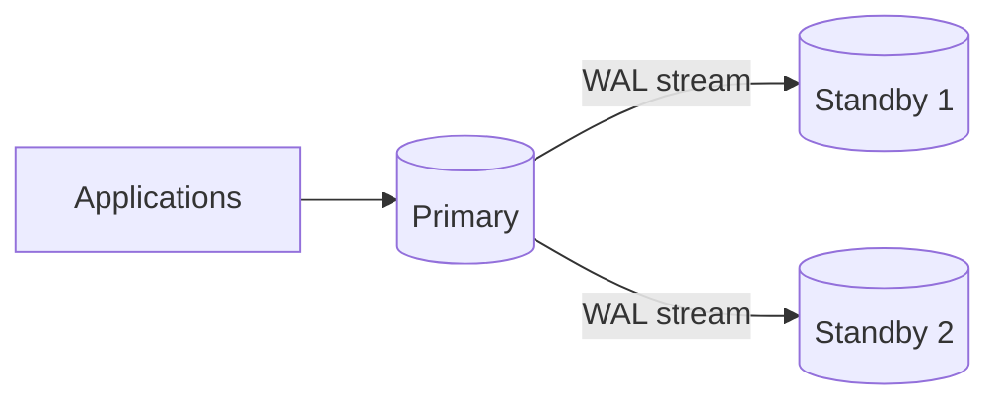

# PostgreSQL for System Design

PostgreSQL is a relational database with mature transaction semantics, a cost-based optimizer, rich indexing, JSON support, physical and logical replication, partitioning, and a large extension ecosystem.

For a senior system-design interview, the useful question is not:

> “What features does PostgreSQL have?”

It is:

> **“Which guarantees and failure modes do I get from PostgreSQL, and where does a single PostgreSQL topology stop being enough?”**

---

## Interview TL;DR

1. PostgreSQL is a strong default when **relational integrity, transactions, flexible querying, and mature operational behavior** matter.
2. The default isolation level is **Read Committed**; each statement gets a fresh committed snapshot.
3. PostgreSQL **Repeatable Read** is snapshot isolation and is stronger than the minimum SQL-standard definition: it prevents phantom reads but can still permit serialization anomalies.
4. PostgreSQL **Serializable** uses Serializable Snapshot Isolation and applications must retry serialization failures.
5. MVCC improves concurrency but creates dead tuples; **autovacuum is correctness-critical**, not merely a performance feature, because it also prevents transaction-ID wraparound.
6. PostgreSQL writes changes to the **WAL** before dirty table pages are persisted; WAL underpins crash recovery, replication, and point-in-time recovery.
7. Streaming replication can be asynchronous or synchronous. Read replicas can be stale; failover needs fencing to avoid split brain.
8. Replication slots are useful but can retain enough WAL to fill storage if consumers stall.
9. Partitioning is **not the same as sharding**: native partitioning divides one logical table inside a PostgreSQL system; it does not automatically distribute writes across independent database servers.
10. The database connection count is a capacity constraint. Use pooling and size the pool for database throughput, not request concurrency.

---

# 1. When PostgreSQL Is a Strong Fit

Choose PostgreSQL when the workload benefits from:

- transactions across multiple related rows
- foreign keys and constraints
- flexible joins and SQL
- secondary indexes
- complex filtering and aggregation
- stable relational data plus selected semi-structured attributes
- transactional outbox patterns
- geospatial or domain-specific extensions
- point-in-time recovery
- logical change feeds/integration

Examples:

- orders and payments
- SaaS control planes
- subscriptions and billing
- inventory
- booking
- identity metadata
- workflow state
- multi-tenant business applications

Do not reject PostgreSQL merely because “the system must scale.” First identify the actual bottleneck.

---

# 2. Data Modeling and Constraints

Database constraints are part of the architecture because they protect data from **every writer**, not only the happy-path application.

Example:

```sql
CREATE TABLE accounts (
    id BIGINT GENERATED ALWAYS AS IDENTITY PRIMARY KEY,
    account_number TEXT NOT NULL UNIQUE,
    balance NUMERIC(18, 2) NOT NULL CHECK (balance >= 0),
    status TEXT NOT NULL
        CHECK (status IN ('active', 'blocked', 'closed'))
);
```

Use:

- `PRIMARY KEY`
- `UNIQUE`
- `NOT NULL`
- `CHECK`
- `FOREIGN KEY`

when they represent real invariants.

Application validation improves UX. Database constraints protect correctness.

---

# 3. Primary-Key Choice

A good primary key is:

- stable
- compact enough for indexes
- easy to generate at the required scale
- compatible with future partition/shard strategy

## Integer identity

```sql
id BIGINT GENERATED ALWAYS AS IDENTITY PRIMARY KEY
```

Advantages:

- compact
- good B-tree locality
- simple joins

Trade-offs:

- usually generated centrally
- predictable
- may be awkward when independent writers need IDs before persistence

## UUID

```sql
id UUID PRIMARY KEY
```

Advantages:

- independent generation
- globally unique identifiers
- useful for distributed workflows

Trade-offs:

- larger indexes
- random identifiers can reduce locality
- harder to inspect manually

Time-ordered identifier schemes can improve insertion locality, but choose IDs from application requirements rather than fashion.

---

# 4. Transactions

A transaction groups related state changes into one atomic unit.

```sql
BEGIN;

UPDATE accounts
SET balance = balance - 100
WHERE id = 1;

UPDATE accounts
SET balance = balance + 100
WHERE id = 2;

COMMIT;
```

The transaction boundary should correspond to an invariant.

Keep transactions:

- short
- deterministic where possible
- free of long network calls
- small enough to reduce lock/MVCC pressure

Do not hold a transaction open while calling a slow external API if the operation can be restructured.

---

# 5. PostgreSQL Isolation Levels

PostgreSQL exposes the standard isolation-level names but implements three distinct behaviors.

## Read Committed — default

Each statement sees a snapshot of committed data as of the start of that statement.

Two successive `SELECT`s in one transaction can observe different committed data.

Use it for many ordinary CRUD operations, especially when correctness is protected by:

- constraints
- atomic updates
- explicit row locks
- version checks

## Repeatable Read

The transaction sees a stable snapshot.

PostgreSQL Repeatable Read:

- prevents dirty reads
- prevents non-repeatable reads
- prevents phantom reads
- can still allow serialization anomalies such as write skew
- can abort an updating transaction when a concurrent change conflicts with the original snapshot

Applications must be prepared to retry relevant failures.

## Serializable

PostgreSQL Serializable emulates a serial execution for successfully committed transactions by monitoring dangerous read/write dependency patterns.

It can abort transactions with serialization failures.

A correct retry strategy retries the **entire transaction** with fresh reads.

```text
begin
  ↓
read / validate
  ↓
write
  ↓
serialization failure?
   ├─ no  → commit
   └─ yes → backoff → rerun whole transaction
```

See `isolation-levels.md` for the cross-database model.

---

# 6. MVCC

PostgreSQL uses Multi-Version Concurrency Control.

Conceptually, an update creates a new row version rather than overwriting the old visible version in place.

```text
Transaction A snapshot → Row version V1

Transaction B updates
        ↓
creates V2
        ↓
commits

Transaction A may still see V1
newer snapshots see V2
```

Benefits:

- readers often avoid blocking writers
- writers often avoid blocking ordinary readers
- stable snapshots are possible

Costs:

- dead tuples
- vacuum work
- table/index bloat
- old row versions retained by long transactions
- visibility bookkeeping

Long-lived transactions are an operational risk.

---

# 7. VACUUM and Autovacuum

`VACUUM` is not a “run this when the table is slow” feature.

It contributes to:

- reclaiming dead-row space for reuse
- maintaining visibility information
- maintaining planner statistics through autovacuum/analyze activity
- preventing transaction-ID wraparound

PostgreSQL transaction IDs are finite. Tables must be vacuumed/frozen before old XIDs become unsafe.

Therefore:

> **Disabling autovacuum globally is a correctness risk.**

High-churn or very large tables often need table-specific tuning.

Monitor:

- dead tuples
- autovacuum duration/frequency
- table age / XID age
- bloat
- long-running transactions
- `idle in transaction`
- WAL generation

---

# 8. Table and Index Bloat

Bloat can grow from:

- high update/delete rates
- long transactions
- insufficient vacuuming
- indexes on frequently changed columns
- fill-factor/workload mismatch

Effects:

- more pages read
- larger indexes
- lower cache efficiency
- slower scans
- larger backups

Remediation is workload-specific:

- tune autovacuum
- shorten transactions
- `VACUUM`
- `REINDEX` where appropriate
- controlled table rewrites when necessary

`VACUUM FULL` rewrites and takes stronger locks; it is not a routine production fix.

---

# 9. Query Planner and Statistics

PostgreSQL uses a cost-based planner.

Common plan nodes include:

- sequential scan
- index scan
- index-only scan
- bitmap heap scan
- nested-loop join
- hash join
- merge join
- sort
- aggregate

The planner relies on statistics.

Bad estimates can produce a bad plan even when a useful index exists.

Start performance analysis with:

```sql
EXPLAIN (ANALYZE, BUFFERS)
SELECT ...
```

Important signals:

- estimated rows vs actual rows
- loops
- buffers
- sort/spill behavior
- join strategy
- index condition
- filter rows removed
- heap fetches for index-only scans

`EXPLAIN ANALYZE` executes the statement, so be careful with mutating SQL.

---

# 10. Index Types

## B-tree

Default general-purpose index.

Good for:

- equality
- ranges
- ordered retrieval
- prefix columns of useful composites

```sql
CREATE INDEX idx_orders_customer_created
ON orders(customer_id, created_at DESC);
```

## Hash

Useful for supported equality semantics, but B-tree is usually the more versatile default.

## GIN

Generalized Inverted Index.

Commonly useful for:

- arrays
- JSONB containment
- full-text data structures

```sql
CREATE INDEX idx_products_metadata
ON products USING GIN(metadata);
```

## GiST

Useful for extensible search structures such as:

- ranges
- geometric search
- nearest-neighbor use cases
- PostGIS operator classes

## SP-GiST

Useful for partitioned search structures supported by appropriate operator classes.

## BRIN

Stores summaries over ranges of table blocks.

Good for very large tables where indexed values correlate with physical order, such as append-heavy timestamps.

It is tiny relative to B-tree, but much less precise.

---

# 11. Composite Indexes

Index order must follow actual predicates and ordering.

Example:

```sql
CREATE INDEX idx_orders_tenant_status_created
ON orders(tenant_id, status, created_at DESC);
```

Potentially useful for:

```sql
WHERE tenant_id = ?
  AND status = ?
ORDER BY created_at DESC
```

Do not memorize “leftmost prefix” as the complete planner model. PostgreSQL can combine indexes and newer planner behavior may use additional strategies. Always validate with `EXPLAIN`.

---

# 12. Partial and Expression Indexes

## Partial

Index only rows that matter to a recurring query.

```sql
CREATE INDEX idx_pending_orders
ON orders(created_at)
WHERE status = 'pending';
```

Useful when the indexed subset is much smaller than the full table.

## Expression

```sql
CREATE UNIQUE INDEX idx_users_lower_email
ON users (lower(email));
```

Useful when queries consistently apply the same expression.

---

# 13. Index-Only Scans and INCLUDE

A covering index can include payload columns:

```sql
CREATE INDEX idx_order_summary
ON orders(customer_id, created_at DESC)
INCLUDE (status, total_amount);
```

PostgreSQL may use an index-only scan when:

- the query can be answered from the index
- visibility information allows it to avoid heap checks

“Covering index exists” does not guarantee zero heap access.

---

# 14. JSONB

PostgreSQL supports relational and document-like data in one database.

Use JSONB for:

- sparse optional attributes
- external payloads
- evolving metadata
- fields that do not justify dedicated normalized columns yet

Do not hide core relational invariants inside JSON simply to avoid schema design.

A useful hybrid:

```text
stable identity / money / relationships → columns
flexible metadata                     → JSONB
```

---

# 15. Partitioning

Native table partitioning can help with:

- large tables
- retention
- partition pruning
- operational management
- bulk removal

Example:

```sql
CREATE TABLE events (
    id BIGINT GENERATED ALWAYS AS IDENTITY,
    created_at TIMESTAMPTZ NOT NULL,
    payload JSONB NOT NULL
) PARTITION BY RANGE (created_at);
```

Important distinction:

> **Partitioning is not automatic horizontal sharding across independent PostgreSQL servers.**

One PostgreSQL primary can still remain the write bottleneck.

Partitioning does not eliminate:

- connection limits
- WAL throughput
- shared storage limits
- primary CPU
- cross-partition query cost

---

# 16. WAL

Write-Ahead Logging means PostgreSQL records durable change information in WAL before modified table pages need to reach their final storage location.

WAL supports:

- crash recovery
- streaming replication
- backups/PITR
- logical decoding

Conceptually:

```text
change
  ↓
WAL
  ↓
commit durability point
  ↓
dirty table page flushed later
```

Actual durability depends on configuration and storage guarantees.

---

# 17. Physical Streaming Replication

Typical topology:



A hot standby can serve read-only queries.

Potential issues:

- replication lag
- read-after-write staleness
- WAL replay conflict with long standby queries
- failover orchestration
- connection routing
- old-primary fencing

---

# 18. Asynchronous vs Synchronous Replication

## Asynchronous

Primary does not wait for a standby to satisfy a synchronous commit requirement.

**Gain**

- lower write latency
- less dependency on remote standby

**Risk**

- recent committed transactions may not exist on the promoted standby after primary loss

## Synchronous

Commit can wait for configured synchronous standby acknowledgements.

**Gain**

- lower acknowledged-write loss risk

**Cost**

- higher latency
- reduced write availability if required standbys cannot acknowledge

The right mode follows RPO and latency requirements.

---

# 19. Replication Slots

Slots prevent required WAL from being removed before a consumer has received it.

Useful for:

- physical standbys
- logical replication consumers
- CDC

Danger:

```text
consumer stops
    ↓
slot still requires WAL
    ↓
pg_wal grows
    ↓
disk fills
```

Monitor inactive/lagging slots and enforce retention policy.

---

# 20. Failover and Split Brain

Promoting a standby is only half of failover.

If the old primary returns and still accepts writes:

```text
old primary → accepts writes
new primary → accepts writes
```

you have split brain.

Failover needs:

- authoritative leader selection
- client rerouting
- fencing/STONITH or equivalent
- old-primary rejoin procedure
- replica divergence handling
- RPO/RTO measurement

Do not describe HA as simply “promote replica.”

---

# 21. Logical Replication

Logical replication publishes logical changes rather than block-level physical WAL state.

Useful for:

- selected table replication
- online migration
- integration
- version upgrades
- CDC-style pipelines

It has different operational semantics than physical streaming replication.

Ask:

- DDL handling
- sequence handling
- conflict strategy
- subscriber lag
- failover continuity
- schema compatibility

---

# 22. Connection Pooling

PostgreSQL uses one backend process per client connection.

Thousands of application requests do not imply thousands of database connections should be active.

```text
many request workers
      ↓
connection pool
      ↓
bounded database connections
```

Pool sizing should be driven by:

- database CPU
- query latency
- I/O
- lock contention
- workload mix

More connections can reduce throughput after saturation.

External poolers can support session or transaction pooling, but transaction pooling may not preserve session-scoped features.

---

# 23. Read Replicas

Replica reads are useful for stale-tolerant workloads:

- reporting
- catalog browsing
- history
- analytics support

Do not blindly send all reads to replicas.

Read the primary or an appropriately consistent path when:

- read-your-writes matters
- payment/order state must be current
- a decision depends on latest authorization/inventory
- the request participates in a transaction

Monitor actual replay lag rather than assuming “replica = current.”

---

# 24. Backups and PITR

Replication is not backup.

A replica faithfully copies:

- accidental delete
- bad migration
- corrupt application update

A real recovery plan includes:

- base backup
- WAL archive
- retention
- encryption
- off-site/independent storage
- restore testing
- RPO/RTO targets

A backup that has never been restored is an unverified backup.

---

# 25. Scaling Path

A reasonable evolution path:

```text
single PostgreSQL
      ↓
indexes + query tuning
      ↓
connection pooling
      ↓
cache for measured hot reads
      ↓
read replicas
      ↓
partition large tables
      ↓
separate analytical/search workloads
      ↓
shard/distribute only when a single-primary limit is proven
```

Do not jump to sharding before:

- fixing bad queries
- controlling connections
- sizing indexes
- measuring WAL/CPU/I/O
- removing analytical load from OLTP

---

# 26. Production Metrics

Track:

- connection utilization
- transaction rate
- p50/p95/p99 query latency
- lock waits
- deadlocks
- serialization failures
- long transactions
- `idle in transaction`
- buffer/cache behavior
- table/index size
- dead tuples
- autovacuum lag
- XID age
- WAL generation
- replication lag
- replication-slot WAL retention
- checkpoint behavior
- disk capacity
- backup/restore health

---

# 27. Common Mistakes

### “PostgreSQL cannot scale”

Too vague. Identify the limiting resource.

### “Read replicas solve scaling”

They help selected reads, not primary writes, locks, or all consistency-sensitive traffic.

### “Partitioning means sharding”

It does not automatically distribute writes across independent servers.

### “Serializable means no concurrency”

PostgreSQL uses SSI and can execute transactions concurrently, aborting dangerous combinations.

### “Autovacuum is optional maintenance”

No. It also prevents XID wraparound.

### “Replication is backup”

No. Logical mistakes replicate too.

### “More connections increase throughput”

Only until the database saturates.

---

# 28. Interview Questions

## Why PostgreSQL over MongoDB?

Use PostgreSQL when relational constraints, joins, multi-row transactions, and flexible SQL are primary workload needs. Use MongoDB when document locality and document-shaped access patterns are stronger drivers. Avoid choosing from brand stereotypes.

## Why PostgreSQL over Redis?

PostgreSQL is commonly the durable system of record; Redis is commonly a low-latency derived/state layer. They frequently coexist.

## What happens when autovacuum falls behind?

Dead tuples and bloat can grow; visibility/statistics quality can suffer; and sufficiently old transaction IDs create wraparound risk.

## What is the read-replica consistency problem?

A replica may not have replayed the latest primary commit, causing stale reads and breaking read-after-write assumptions.

## Why can a replication slot be dangerous?

A stalled consumer can force the primary to retain WAL until disk pressure becomes severe.

## How would you protect a final-seat booking?

Use a database invariant plus an atomic conditional update, explicit locking, or Serializable transaction depending on the rule and contention.

---

# Senior-Level Checklist

When proposing PostgreSQL, answer:

```text
1. What invariant belongs in the DB?
2. What isolation level/locking strategy protects it?
3. What are the dominant queries?
4. Which indexes serve those queries?
5. What is the write amplification?
6. How many connections can the DB sustain?
7. What is the read-after-write policy?
8. What is the replication RPO?
9. How is failover fenced?
10. What is the backup/PITR plan?
11. How is autovacuum monitored?
12. What proves we need partitioning or sharding?
```

---

## References

- https://www.postgresql.org/docs/current/transaction-iso.html
- https://www.postgresql.org/docs/current/indexes.html
- https://www.postgresql.org/docs/current/routine-vacuuming.html
- https://www.postgresql.org/docs/current/high-availability.html
- https://www.postgresql.org/docs/current/warm-standby.html
