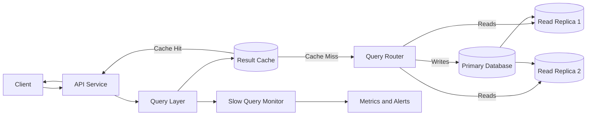

# Query Optimization

Query optimization is the process of making data retrieval faster and more resource-efficient. It involves improving SQL queries, selecting the right indexes, reducing unnecessary data access, and designing systems that remain responsive as traffic and data grow.

---

## Core Concepts

### 1. Query Execution Plana

A query execution plan describes how a database intends to execute a query.

It may include:

* Table scans
* Index scans
* Join strategies
* Sorting operations
* Estimated row counts
* Execution costs

Use tools such as:

```sql
EXPLAIN
SELECT *
FROM orders
WHERE user_id = 101;
```

For actual runtime information:

```sql
EXPLAIN ANALYZE
SELECT *
FROM orders
WHERE user_id = 101;
```

The execution plan helps identify expensive operations before changing the query or database schema.

---

### 2. Full Table Scan

A full table scan checks every row in a table.

```text
Row 1 → Row 2 → Row 3 → ... → Row N
```

This may be acceptable for:

* Small tables
* Analytical queries that require most rows
* Queries where no useful index exists

It becomes expensive when a large table is scanned frequently for a small result set.

---

### 3. Index Scan

An index scan uses an index to locate matching records without scanning the entire table.

```sql
CREATE INDEX idx_orders_user_id
ON orders(user_id);
```

This index can improve:

```sql
SELECT id, status, total_amount
FROM orders
WHERE user_id = 101;
```

Indexes improve reads but add storage usage and write overhead.

---

### 4. Query Selectivity

Selectivity describes how effectively a condition reduces the number of matching rows.

A condition such as:

```sql
WHERE email = 'user@example.com'
```

is usually highly selective because it may return one row.

A condition such as:

```sql
WHERE is_active = true
```

may have low selectivity if most rows are active.

Highly selective fields are generally stronger candidates for indexing.

---

### 5. Composite Indexes

A composite index contains multiple columns.

```sql
CREATE INDEX idx_orders_user_status
ON orders(user_id, status);
```

It can help queries such as:

```sql
SELECT id, total_amount
FROM orders
WHERE user_id = 101
  AND status = 'DELIVERED';
```

Column order matters.

An index on:

```text
(user_id, status)
```

is not equivalent to:

```text
(status, user_id)
```

The index should reflect the application’s most common filtering and sorting patterns.

---

### 6. Covering Indexes

A covering index contains all columns required by a query.

```sql
CREATE INDEX idx_orders_covering
ON orders(user_id, status, total_amount);
```

The database may answer the following query entirely from the index:

```sql
SELECT status, total_amount
FROM orders
WHERE user_id = 101;
```

This avoids an additional lookup in the main table.

---

### 7. Join Optimization

Joins become expensive when they process large intermediate datasets.

Example:

```sql
SELECT
    users.name,
    orders.total_amount
FROM users
JOIN orders ON users.id = orders.user_id
WHERE orders.status = 'DELIVERED';
```

Possible optimizations include:

* Indexing join columns
* Filtering rows before joining
* Selecting only required columns
* Joining smaller datasets first
* Avoiding unnecessary joins
* Reviewing the join algorithm selected by the database

Common join algorithms include:

* Nested loop join
* Hash join
* Merge join

---

### 8. Pagination

Pagination limits how many records are returned in one request.

Offset pagination:

```sql
SELECT id, created_at
FROM posts
ORDER BY created_at DESC
LIMIT 20 OFFSET 100000;
```

The database may still need to process and discard the first 100,000 rows.

Cursor pagination:

```sql
SELECT id, created_at
FROM posts
WHERE created_at < '2026-08-01 10:00:00'
ORDER BY created_at DESC
LIMIT 20;
```

Cursor pagination usually performs better for large or frequently updated datasets.

---

### 9. Query Caching

Caching stores the result of frequently executed queries.

```text
Request → Cache lookup → Cached response
```

On a cache miss:

```text
Request → Cache miss → Database query → Cache result → Response
```

Query caching is useful when:

* The same query is repeated frequently
* Results do not change often
* Slightly stale data is acceptable
* Database computation is expensive

Cache invalidation must be designed carefully to avoid serving incorrect data.

---

### 10. Denormalization

Normalization reduces duplicate data and improves consistency.

Denormalization stores selected duplicate or precomputed data to reduce expensive joins.

Example:

Instead of calculating an order total on every request:

```sql
SELECT SUM(quantity * unit_price)
FROM order_items
WHERE order_id = 5001;
```

The system may store:

```text
orders.total_amount
```

Denormalization improves read performance but increases write complexity and consistency responsibilities.

---

## Architecture

A scalable query path often combines routing, caching, read replicas, optimized indexes, and monitoring.



### Main Components

#### 1. API Service

The API validates requests and applies:

* Pagination limits
* Timeouts
* Authorization rules
* Rate limits
* Query complexity limits

It should prevent clients from generating unrestricted database queries.

---

#### 2. Query Layer

The query layer builds and executes database queries.

Its responsibilities may include:

* Selecting required fields
* Applying filters
* Choosing pagination strategy
* Routing reads and writes
* Adding query timeouts
* Recording query metrics

Keeping query logic centralized makes optimization and monitoring easier.

---

#### 3. Result Cache

The cache stores frequently requested results.

A cache key should include every parameter that can affect the response:

```text
products:category=phones:brand=acme:page_size=20:cursor=abc123
```

Incomplete cache keys can cause one user or filter combination to receive another query’s result.

---

#### 4. Query Router

The query router sends:

* Writes to the primary database
* Strongly consistent reads to the primary database
* Eligible read-only queries to replicas

Routing decisions depend on consistency requirements.

---

#### 5. Primary Database

The primary database processes:

* Inserts
* Updates
* Deletes
* Transactions
* Strongly consistent reads

Complex analytical queries should not be allowed to overload the transactional write path.

---

#### 6. Read Replicas

Read replicas reduce load on the primary database.

They are suitable for:

* Product browsing
* Reporting dashboards
* Search filters
* Public content
* Historical records

Replication lag means replicas may temporarily return stale data.

---

#### 7. Slow Query Monitor

A slow-query system records queries that exceed a latency threshold.

Useful details include:

* Query fingerprint
* Execution time
* Rows scanned
* Rows returned
* Index used
* Lock wait time
* Query frequency

Queries should usually be grouped by fingerprint rather than stored only as raw SQL.

---

## Comparison: Offset vs Cursor Pagination

| Area                  | Offset Pagination               | Cursor Pagination                          |
| --------------------- | ------------------------------- | ------------------------------------------ |
| Example               | `LIMIT 20 OFFSET 1000`          | `WHERE id > last_seen_id LIMIT 20`         |
| Implementation        | Simple                          | Requires cursor handling                   |
| Deep-page performance | Becomes slower                  | Usually remains efficient                  |
| Data consistency      | Can skip or duplicate records   | More stable with changing data             |
| Random page access    | Supported                       | Not naturally supported                    |
| Best use case         | Small datasets and admin panels | Feeds, timelines, logs, and large datasets |

### Rule of Thumb

Use offset pagination when the dataset is small and users need direct page numbers.

Use cursor pagination when the dataset is large, frequently updated, or used in an infinite-scroll experience.

---

## Real-World Example: E-Commerce Order History

Consider an e-commerce platform with hundreds of millions of orders.

A customer opens their order-history page.

### Initial Query

```sql
SELECT *
FROM orders
WHERE user_id = 101
ORDER BY created_at DESC
LIMIT 20 OFFSET 0;
```

This query has several possible problems:

* `SELECT *` retrieves unnecessary columns
* The database may sort many rows
* Deep offsets become expensive
* A missing index may cause a full table scan

---

### Optimized Query

```sql
SELECT
    id,
    status,
    total_amount,
    created_at
FROM orders
WHERE user_id = 101
  AND created_at < '2026-08-01 10:00:00'
ORDER BY created_at DESC
LIMIT 20;
```

Recommended index:

```sql
CREATE INDEX idx_orders_user_created
ON orders(user_id, created_at DESC);
```

### Why It Performs Better

The optimized query:

1. Retrieves only required columns.
2. Filters by `user_id`.
3. Uses cursor-based pagination.
4. Matches the index column order.
5. Avoids sorting a large unindexed result.
6. Limits the response to 20 records.

---

### Request Flow

```text
Client
  ↓
Order API
  ↓
Check order-history cache
  ↓
Route read to database
  ↓
Use composite index
  ↓
Return 20 records and next cursor
```

Example response:

```json
{
  "orders": [
    {
      "id": "ord_5001",
      "status": "DELIVERED",
      "total_amount": 2499,
      "created_at": "2026-07-28T12:30:00Z"
    }
  ],
  "next_cursor": "2026-07-28T12:30:00Z"
}
```

---

### Scaling the Query Path

As traffic increases:

* Cache the first page of order history for a short period
* Send eligible reads to replicas
* Partition orders by customer or time
* Archive old orders
* Add query timeouts
* Monitor replication lag
* Track P95 and P99 query latency
* Precompute expensive aggregates
* Separate analytical workloads from transactional workloads

---

## Best Practices

### 1. Start With Measurements

Do not optimize based only on assumptions.

Measure:

* Query latency
* Query frequency
* Rows scanned
* Rows returned
* CPU usage
* Disk reads
* Lock wait time
* Cache hit rate

---

### 2. Use `EXPLAIN ANALYZE`

Review the real execution plan before and after making changes.

Check for:

* Unexpected table scans
* Incorrect row estimates
* Expensive sorting
* Large intermediate results
* Unused indexes
* Repeated nested loops

---

### 3. Select Only Required Columns

Avoid:

```sql
SELECT *
FROM users;
```

Prefer:

```sql
SELECT id, name, email
FROM users;
```

This reduces:

* Network transfer
* Memory usage
* Disk reads
* Object-mapping overhead

---

### 4. Index Real Query Patterns

Create indexes based on actual filters, joins, and sorting requirements.

A useful index should support a frequent or expensive access pattern.

---

### 5. Match Composite Index Order

For a query such as:

```sql
WHERE tenant_id = ?
  AND status = ?
ORDER BY created_at DESC
```

A suitable index may be:

```sql
CREATE INDEX idx_orders_tenant_status_created
ON orders(tenant_id, status, created_at DESC);
```

---

### 6. Limit Result Sizes

Every list endpoint should have a maximum page size.

```text
Default page size: 20
Maximum page size: 100
```

This protects the database and API from unbounded responses.

---

### 7. Add Query Timeouts

A slow query should fail before it consumes database resources indefinitely.

Timeouts should exist at:

* API level
* Database-driver level
* Database level
* Load-balancer level

---

### 8. Avoid Functions on Indexed Columns

This query may prevent normal index usage:

```sql
SELECT id
FROM users
WHERE LOWER(email) = 'user@example.com';
```

Possible solutions include:

* Storing a normalized value
* Creating a functional index
* Using a database-supported case-insensitive type

---

### 9. Use Batching

Avoid executing one query for every item.

Instead of:

```text
1 query to fetch orders
100 queries to fetch customers
```

Use:

```sql
SELECT id, name
FROM customers
WHERE id IN (...);
```

---

### 10. Separate Transactional and Analytical Workloads

Transactional databases should handle short, predictable operations.

Large reports and aggregations can be moved to:

* Read replicas
* Data warehouses
* Search engines
* Materialized views
* Precomputed reporting tables

---

### 11. Monitor Query Percentiles

Average latency can hide slow requests.

Track:

* P50
* P95
* P99
* Timeout rate
* Error rate

Tail latency often has the greatest effect on user experience.

---

### 12. Reassess Indexes Regularly

Data distribution and access patterns change over time.

Review:

* Unused indexes
* Duplicate indexes
* Index size
* Write overhead
* Query frequency
* Table growth

---

## Common Mistakes

### 1. Adding Indexes Without Reviewing Queries

An index that does not support a real query pattern consumes storage and slows writes without providing meaningful value.

---

### 2. Using `SELECT *`

Retrieving every column increases database, network, memory, and serialization costs.

---

### 3. Ignoring the Execution Plan

A query can appear simple while performing a full scan, large sort, or inefficient join.

---

### 4. Using Deep Offset Pagination

Queries such as:

```sql
LIMIT 20 OFFSET 1000000
```

force the database to process and discard a large number of rows.

---

### 5. Creating Too Many Indexes

Every insert, update, and delete may need to update several indexes.

Over-indexing can reduce write throughput significantly.

---

### 6. Solving Every Problem With Caching

Caching hides some database latency but does not fix:

* Poor joins
* Missing indexes
* Unbounded queries
* Incorrect data models
* Excessive rows scanned

Optimize the underlying query before relying heavily on caching.

---

### 7. Ignoring the N+1 Query Problem

Example:

```text
1 query to fetch 100 orders
100 additional queries to fetch customer details
```

Use joins, batching, eager loading, or request-scoped data loaders.

---

### 8. Filtering After Fetching Data

Avoid retrieving thousands of records and filtering them inside the application.

Push supported filters into the database:

```sql
WHERE status = 'ACTIVE'
```

---

### 9. Sorting Without an Appropriate Index

Sorting a large result set can require expensive memory or disk operations.

Indexes should align with frequent filtering and sorting combinations.

---

### 10. Sending Every Read to the Primary Database

Read-heavy systems can overload the primary database.

Use caching and replicas where the consistency requirements allow it.

---

### 11. Ignoring Data Distribution

An index may be less effective when most rows share the same value.

Optimization decisions should use real production-like data.

---

### 12. Optimizing Rare Queries First

A query that takes two seconds once per day may be less important than a 100-millisecond query executed thousands of times per second.

Prioritize using:

```text
Total impact = Query latency × Query frequency
```

---

## Interview Questions with Short Answers

### 1. How do you identify a slow query?

Use application metrics, slow-query logs, and `EXPLAIN ANALYZE` to inspect execution time, rows scanned, join behavior, sorting, and index usage.

---

### 2. Why can an index improve reads but reduce write performance?

The index provides a faster lookup path for reads, but inserts, updates, and deletes must also modify the index.

---

### 3. What is the N+1 query problem?

It occurs when one query retrieves a list and an additional query is executed for every item. It can be solved using joins, batching, eager loading, or data loaders.

---

### 4. When should cursor pagination be preferred?

Cursor pagination is preferred for large or frequently updated datasets because it avoids expensive deep offsets and provides more stable pagination.

---

### 5. How would you optimize a read-heavy system?

Use appropriate indexes, result caching, read replicas, bounded pagination, query monitoring, denormalization where justified, and separate analytical workloads from transactional traffic.

---

## Key Takeaways

1. **Measure before optimizing.** Execution plans, query frequency, rows scanned, and latency percentiles reveal where optimization has the highest impact.

2. **Optimize the complete query path.** Efficient SQL alone is not enough; indexes, pagination, caching, replicas, data models, and API limits must work together.

3. **Every optimization has a trade-off.** Faster reads may increase write cost, storage usage, consistency complexity, or operational overhead.
