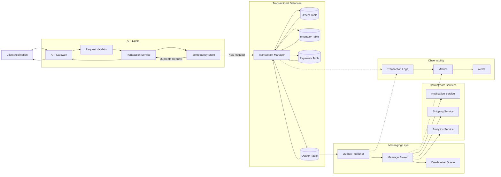
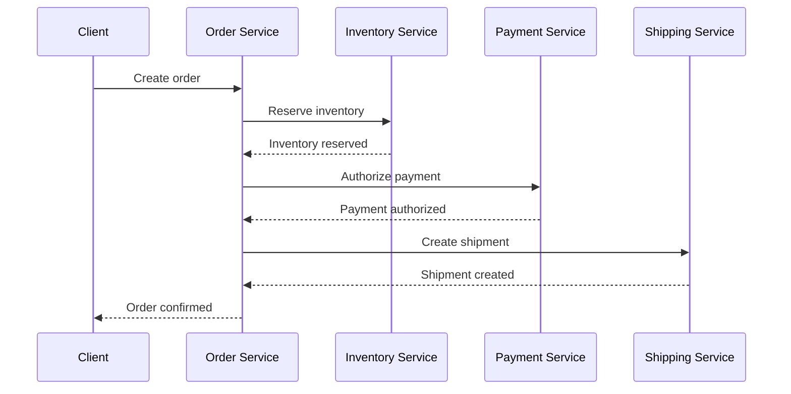

# Transactions

Transactions help backend systems execute multiple database operations as one logical unit. They are essential for payments, order creation, inventory updates, banking, reservations, and any workflow where partial completion could leave data in an invalid state.

---

## Core Concepts

### 1. What Is a Transaction?

A transaction is a group of operations that either:

* Complete successfully together
* Fail and leave the system unchanged

Example:

```sql
BEGIN;

UPDATE accounts
SET balance = balance - 500
WHERE id = 101;

UPDATE accounts
SET balance = balance + 500
WHERE id = 202;

COMMIT;
```

If either update fails, the transaction should be rolled back:

```sql
ROLLBACK;
```

This prevents money from being deducted from one account without being added to the other.

---

### 2. ACID Properties

Reliable database transactions are commonly described using ACID.

#### Atomicity

All operations succeed, or none of them are applied.

```text
Debit account
Credit account
Update transfer record
```

These steps should behave as one indivisible unit.

#### Consistency

A transaction must move the database from one valid state to another.

Examples:

* Account balances must follow business rules
* Foreign keys must remain valid
* Inventory must not become negative
* Required fields must remain present

#### Isolation

Concurrent transactions should not interfere with each other in unexpected ways.

Two users attempting to purchase the final product should not both succeed.

#### Durability

Once a transaction is committed, its changes should survive crashes and restarts.

Databases commonly use logs, disk persistence, and replication to support durability.

---

### 3. Transaction Lifecycle

A typical transaction follows this flow:

```text
Begin
  ↓
Read data
  ↓
Validate business rules
  ↓
Modify data
  ↓
Commit or Rollback
```

Example:

```sql
BEGIN;

SELECT stock
FROM products
WHERE id = 501
FOR UPDATE;

UPDATE products
SET stock = stock - 1
WHERE id = 501
  AND stock > 0;

INSERT INTO orders(user_id, product_id, status)
VALUES (101, 501, 'CREATED');

COMMIT;
```

---

### 4. Commit

`COMMIT` permanently applies all changes made during the transaction.

```sql
COMMIT;
```

After a successful commit:

* Other transactions can observe the changes
* The database treats the operation as complete
* A rollback is no longer possible through that transaction

---

### 5. Rollback

`ROLLBACK` cancels all uncommitted changes.

```sql
ROLLBACK;
```

Rollback is used when:

* A query fails
* Business validation fails
* A timeout occurs
* A deadlock is detected
* An external dependency returns an error

---

### 6. Savepoints

A savepoint creates a partial rollback point inside a transaction.

```sql
BEGIN;

INSERT INTO orders(user_id, status)
VALUES (101, 'CREATED');

SAVEPOINT order_created;

INSERT INTO audit_logs(message)
VALUES ('Order created');

ROLLBACK TO SAVEPOINT order_created;

COMMIT;
```

The order remains, but changes after the savepoint are reversed.

Savepoints are useful for complex workflows, but excessive use can make transaction logic difficult to understand.

---

### 7. Isolation Levels

Isolation levels control how much one transaction can observe changes made by another transaction.

Common isolation levels include:

* Read Uncommitted
* Read Committed
* Repeatable Read
* Serializable

Higher isolation reduces concurrency anomalies but may increase locking, retries, and latency.

---

### 8. Concurrency Problems

#### Dirty Read

A transaction reads data that another transaction has changed but not committed.

```text
Transaction A updates balance
Transaction B reads new balance
Transaction A rolls back
```

Transaction B observed a value that never became permanent.

#### Non-Repeatable Read

A transaction reads the same row twice and gets different values.

```text
Transaction A reads balance = 1000
Transaction B updates balance = 700 and commits
Transaction A reads balance again = 700
```

#### Phantom Read

A transaction repeats a range query and receives additional or missing rows.

```text
Transaction A counts active bookings
Transaction B inserts a new active booking
Transaction A counts again and sees another row
```

#### Lost Update

Two transactions read the same value and overwrite each other.

```text
Stock = 10

Transaction A reads 10
Transaction B reads 10

Transaction A writes 9
Transaction B writes 9
```

The correct final value should have been 8.

#### Write Skew

Two transactions read overlapping data and update different rows, together violating a business rule.

---

### 9. Locking

Locks prevent conflicting transactions from modifying the same data simultaneously.

#### Shared Lock

Used for reads. Multiple transactions may hold shared locks when no write conflict exists.

#### Exclusive Lock

Used for writes. It blocks other conflicting reads or writes depending on the database and isolation level.

#### Row-Level Lock

Locks individual rows.

```sql
SELECT *
FROM inventory
WHERE product_id = 501
FOR UPDATE;
```

#### Table-Level Lock

Locks an entire table. It is simpler but reduces concurrency.

---

### 10. Optimistic Concurrency Control

Optimistic concurrency assumes conflicts are uncommon.

A version field is checked before updating:

```sql
UPDATE products
SET stock = stock - 1,
    version = version + 1
WHERE id = 501
  AND version = 12
  AND stock > 0;
```

If zero rows are updated, another transaction changed the record first.

The application can retry or return a conflict response.

Best suited for:

* Read-heavy systems
* Low-contention records
* User profile updates
* Distributed APIs

---

### 11. Pessimistic Concurrency Control

Pessimistic concurrency locks data before modifying it.

```sql
SELECT stock
FROM products
WHERE id = 501
FOR UPDATE;
```

Other transactions must wait until the lock is released.

Best suited for:

* High-contention records
* Inventory reservation
* Financial balances
* Limited-capacity booking

Pessimistic locking reduces conflicts but can increase waiting and deadlocks.

---

### 12. Deadlocks

A deadlock occurs when transactions wait on each other indefinitely.

```text
Transaction A locks Row 1
Transaction B locks Row 2

Transaction A waits for Row 2
Transaction B waits for Row 1
```

The database usually detects the cycle and aborts one transaction.

Applications should treat deadlocks as retryable failures.

---

### 13. Local Transactions

A local transaction runs inside one database.

```text
Backend Service
      ↓
Single SQL Database
      ↓
Begin → Update → Commit
```

Local transactions are usually simpler and provide strong ACID guarantees.

---

### 14. Distributed Transactions

A distributed transaction spans multiple services, databases, or message systems.

Example:

```text
Order Service
Payment Service
Inventory Service
Delivery Service
```

A single database transaction cannot usually cover all of these systems safely.

Distributed workflows commonly use:

* Two-Phase Commit
* Saga Pattern
* Transactional Outbox
* Idempotency keys
* Compensating actions

---

### 15. Idempotency

An idempotent operation produces the same final outcome when repeated.

For a payment request:

```text
Idempotency-Key: payment-order-5001
```

The backend stores the key and returns the original result when the same request is retried.

This prevents:

* Duplicate payments
* Duplicate orders
* Duplicate refunds
* Duplicate event processing

---

### 16. Transactional Outbox

The transactional outbox pattern stores a business change and an outgoing event in the same database transaction.

```sql
BEGIN;

INSERT INTO orders(id, user_id, status)
VALUES (5001, 101, 'CREATED');

INSERT INTO outbox_events(
    event_id,
    event_type,
    aggregate_id,
    payload
)
VALUES (
    'evt-9001',
    'OrderCreated',
    5001,
    '{"order_id":5001}'
);

COMMIT;
```

A background publisher later sends the event to a message broker.

This prevents the database from committing while the event is lost.

---

## Architecture

A reliable transaction architecture separates local database consistency from distributed workflow coordination.



### Transaction Request Flow

```text
Client Request
      ↓
Authentication and Validation
      ↓
Idempotency Check
      ↓
Begin Database Transaction
      ↓
Lock or Version Check
      ↓
Update Business Records
      ↓
Write Outbox Event
      ↓
Commit
      ↓
Publish Event Asynchronously
      ↓
Return Response
```

---

### Main Components

#### 1. API Gateway

The API gateway handles:

* Authentication
* Rate limiting
* Request validation
* Timeouts
* Request tracing

It should reject malformed requests before a transaction begins.

---

#### 2. Transaction Service

The transaction service owns the business workflow.

Its responsibilities include:

* Starting transactions
* Applying business validations
* Updating related records
* Handling rollback
* Mapping database errors
* Retrying safe failures
* Recording transaction outcomes

Transaction boundaries should usually be defined in the service layer rather than spread across controllers and repositories.

---

#### 3. Request Validator

Validation should occur before acquiring database locks when possible.

Examples:

* Required fields
* Valid amount
* Supported currency
* Product identifier format
* User permissions
* Request-size limits

Business rules that depend on current database state must still be checked inside the transaction.

---

#### 4. Idempotency Store

The idempotency store tracks previously processed requests.

Example record:

```json
{
  "idempotency_key": "order-user101-request88",
  "status": "COMPLETED",
  "resource_id": "order-5001",
  "response_code": 201
}
```

A repeated request returns the stored result instead of creating a duplicate transaction.

---

#### 5. Transaction Manager

The transaction manager controls:

```text
BEGIN
COMMIT
ROLLBACK
```

It may also manage:

* Isolation level
* Lock timeout
* Retry policy
* Savepoints
* Connection lifecycle

The transaction should remain open only as long as necessary.

---

#### 6. Transactional Tables

Related updates should be performed in the same local transaction when they share one database.

For order creation:

```text
Orders
Inventory
Payments
Outbox
```

The commit should happen only after all required changes succeed.

---

#### 7. Outbox Table

The outbox table stores events that must be published after commit.

Example schema:

```sql
CREATE TABLE outbox_events (
    id UUID PRIMARY KEY,
    event_type VARCHAR(100) NOT NULL,
    aggregate_id VARCHAR(100) NOT NULL,
    payload JSON NOT NULL,
    status VARCHAR(20) NOT NULL,
    created_at TIMESTAMP NOT NULL
);
```

The event should be inserted in the same transaction as the business change.

---

#### 8. Outbox Publisher

The publisher reads committed events and sends them to the message broker.

It should support:

* Retries
* Batching
* Idempotent publishing
* Delivery tracking
* Dead-letter handling

Messages may be delivered more than once, so consumers must also be idempotent.

---

#### 9. Message Broker

The message broker decouples the transaction service from downstream systems.

Possible event:

```json
{
  "event_id": "evt-9001",
  "event_type": "OrderCreated",
  "order_id": 5001,
  "user_id": 101,
  "created_at": "2026-08-01T10:30:00Z"
}
```

The core transaction should not remain open while waiting for notification, analytics, or shipping services.

---

#### 10. Downstream Services

Downstream services process committed events independently.

Examples:

* Notification Service sends confirmation messages
* Shipping Service creates delivery tasks
* Analytics Service records business metrics

Failures in these systems should not roll back an already committed order.

---

#### 11. Observability

A production transaction system should track:

* Transaction latency
* Commit rate
* Rollback rate
* Deadlock rate
* Lock wait time
* Retry count
* Idempotency conflicts
* Outbox backlog
* Event publication failures
* Database connection usage

---

## Comparison: Local Transaction vs Saga Pattern

| Area                 | Local Database Transaction          | Saga Pattern                                        |
| -------------------- | ----------------------------------- | --------------------------------------------------- |
| Scope                | One database                        | Multiple services or databases                      |
| Consistency          | Strong consistency                  | Eventual consistency                                |
| Failure handling     | Rollback                            | Compensating actions                                |
| Complexity           | Lower                               | Higher                                              |
| Transaction duration | Usually short                       | May run for seconds, minutes, or longer             |
| Coupling             | Database-level                      | Workflow-level                                      |
| Best use case        | Related updates in one SQL database | Distributed business workflows                      |
| Example              | Update order and inventory tables   | Order, payment, shipping, and notification services |

### Rule of Thumb

Use a local transaction when all required updates live in one database.

Use a Saga when a workflow spans independently deployed services and a global transaction would create excessive coupling or operational risk.

---

## Real-World Example: E-Commerce Checkout

Consider a checkout workflow that must:

1. Create an order
2. Reserve inventory
3. Record payment state
4. Publish an order-created event

### Tables

```text
orders
order_items
inventory
payments
outbox_events
```

---

### Transactional Workflow

```sql
BEGIN;

INSERT INTO orders(
    id,
    user_id,
    status,
    total_amount
)
VALUES (
    5001,
    101,
    'PENDING',
    2499.00
);

UPDATE inventory
SET available_stock = available_stock - 1
WHERE product_id = 301
  AND available_stock > 0;

INSERT INTO payments(
    order_id,
    status,
    amount
)
VALUES (
    5001,
    'PENDING',
    2499.00
);

INSERT INTO outbox_events(
    id,
    event_type,
    aggregate_id,
    payload,
    status,
    created_at
)
VALUES (
    'evt-9001',
    'OrderCreated',
    '5001',
    '{"order_id":5001,"user_id":101}',
    'PENDING',
    CURRENT_TIMESTAMP
);

COMMIT;
```

---

### Preventing Overselling

The inventory update should verify that stock remains available:

```sql
UPDATE inventory
SET available_stock = available_stock - 1
WHERE product_id = 301
  AND available_stock > 0;
```

The application must check the affected row count.

```text
1 row updated → Inventory reserved
0 rows updated → Product unavailable
```

If no row is updated:

```sql
ROLLBACK;
```

---

### Using a Row Lock

For high-contention inventory:

```sql
BEGIN;

SELECT available_stock
FROM inventory
WHERE product_id = 301
FOR UPDATE;

UPDATE inventory
SET available_stock = available_stock - 1
WHERE product_id = 301;

COMMIT;
```

This serializes conflicting updates but may increase lock waiting during high traffic.

---

### Idempotent Checkout Request

Client request:

```http
POST /checkout
Idempotency-Key: checkout-user101-cart88
```

The server stores:

```text
checkout-user101-cart88 → order 5001
```

If the client retries after a timeout, the backend returns the existing order rather than creating another one.

---

### Event Publication

After the transaction commits:

```text
Outbox Publisher
      ↓
Message Broker
      ↓
OrderCreated Event
      ↓
Notification, Shipping, Analytics
```

This keeps the database transaction short while ensuring committed events are eventually delivered.

---

### Distributed Checkout With Saga

A larger system may separate:



If payment fails:

```text
Payment authorization fails
      ↓
Release inventory
      ↓
Mark order as cancelled
```

These reversal operations are compensating actions rather than database rollbacks.

---

## Best Practices

### 1. Keep Transactions Short

Do not keep a transaction open while:

* Calling external APIs
* Sending emails
* Uploading files
* Waiting for user input
* Performing long calculations

Long transactions increase lock time and reduce database concurrency.

---

### 2. Define Clear Transaction Boundaries

A transaction should represent one business operation.

Good example:

```text
Create order + reserve stock + record outbox event
```

Poor example:

```text
Keep transaction open across the entire HTTP workflow and multiple services
```

---

### 3. Validate Before Starting the Transaction

Perform non-database validation first:

* Request format
* Required fields
* Authentication
* Static business rules

This reduces the time spent holding database resources.

---

### 4. Revalidate Mutable Data Inside the Transaction

Data such as stock, balance, and reservation state can change concurrently.

Check these values after the transaction begins.

---

### 5. Use Idempotency Keys

Idempotency is essential for operations that clients may retry.

Examples:

* Payments
* Checkout
* Refunds
* Booking
* Account transfers

---

### 6. Use Parameterized Queries

```sql
UPDATE accounts
SET balance = balance - ?
WHERE id = ?;
```

Parameterized queries reduce SQL injection risk and improve query handling.

---

### 7. Use Consistent Lock Ordering

When multiple rows must be locked, always lock them in the same order.

Example:

```text
Always lock the smaller account ID first
Then lock the larger account ID
```

This reduces deadlock risk.

---

### 8. Handle Deadlocks With Retries

A deadlock does not always mean the business operation is invalid.

Use:

* Limited retries
* Exponential backoff
* Random jitter
* Clear retry metrics

Do not retry indefinitely.

---

### 9. Choose Isolation Levels Deliberately

Do not automatically use the strongest isolation level everywhere.

Choose based on:

* Consistency requirement
* Contention
* Query pattern
* Performance target
* Retry tolerance

---

### 10. Check Affected Row Counts

For conditional updates:

```sql
UPDATE inventory
SET available_stock = available_stock - 1
WHERE product_id = 301
  AND available_stock > 0;
```

Always verify whether the expected row was updated.

---

### 11. Use the Transactional Outbox for Events

Avoid this unsafe sequence:

```text
Commit database
Publish event
```

If publishing fails, the database and message broker become inconsistent.

Store the event inside the same transaction instead.

---

### 12. Make Event Consumers Idempotent

Message brokers may deliver the same event more than once.

Consumers should track processed event IDs:

```text
evt-9001 already processed → Skip duplicate
```

---

### 13. Add Transaction Timeouts

Transactions should not wait indefinitely.

Configure:

* Statement timeout
* Lock timeout
* Transaction timeout
* API timeout

---

### 14. Monitor Lock Contention

Track:

* Long-running transactions
* Blocked queries
* Lock wait duration
* Deadlock frequency
* Hot rows
* Open connections

---

### 15. Avoid User Interaction Inside Transactions

Do not open a transaction, ask the user for confirmation, and then continue.

User-controlled delays can leave locks open for an unpredictable period.

---

### 16. Test Failure Scenarios

Test what happens when:

* The database restarts
* A commit times out
* The client retries
* An event is duplicated
* A consumer crashes
* A deadlock occurs
* The message broker is unavailable
* A compensating action fails

---

## Common Mistakes

### 1. Keeping Transactions Open During External Calls

Incorrect flow:

```text
Begin transaction
Call payment provider
Wait for response
Update database
Commit
```

The database transaction may remain open for several seconds.

Prefer separating external communication from local transaction boundaries.

---

### 2. Assuming a Timeout Means the Transaction Failed

A client may time out after the database has committed.

Retrying without idempotency can create duplicate operations.

---

### 3. Forgetting to Roll Back

Every failure path should close the transaction correctly.

Unfinished transactions may keep locks and connections occupied.

---

### 4. Using Read-Then-Write Without Protection

Unsafe flow:

```text
Read stock = 1
Check stock
Write stock = 0
```

Another transaction may perform the same steps simultaneously.

Use conditional updates, locks, or version checks.

---

### 5. Using the Highest Isolation Level Everywhere

Serializable isolation provides strong protection but can reduce throughput and increase retries.

Use it only when the business requirement justifies the cost.

---

### 6. Ignoring Deadlocks

Deadlocks can occur even in well-designed systems.

Applications should detect retryable database errors and retry safely.

---

### 7. Locking Rows in Different Orders

Transaction A:

```text
Lock account 101
Lock account 202
```

Transaction B:

```text
Lock account 202
Lock account 101
```

This creates a common deadlock pattern.

---

### 8. Publishing Events Outside the Transaction

Unsafe flow:

```text
Commit order
Publish OrderCreated event
```

A crash between these steps can permanently lose the event.

Use a transactional outbox.

---

### 9. Treating Distributed Workflows Like Local Transactions

A transaction cannot usually roll back changes across independent services.

Use sagas, idempotency, durable events, and compensating actions.

---

### 10. Retrying Non-Idempotent Operations Blindly

A retry can duplicate:

* Payments
* Orders
* Refunds
* Reservations

Every retry strategy must consider whether the original request may already have succeeded.

---

### 11. Performing Too Much Work in One Transaction

Large transactions:

* Hold locks longer
* Generate more log data
* Increase rollback cost
* Reduce concurrency
* Raise timeout risk

Split unrelated operations into separate workflows.

---

### 12. Ignoring Partial Failures in a Saga

Compensating actions can also fail.

A saga needs:

* Retry policies
* State tracking
* Dead-letter handling
* Operational dashboards
* Manual recovery procedures

---

### 13. Assuming Exactly-Once Delivery

Most distributed messaging systems provide at-least-once delivery in practical workflows.

Design consumers to tolerate duplicates.

---

### 14. Not Monitoring Long-Running Transactions

A single abandoned transaction can block many other requests.

Monitor transaction age and terminate unsafe sessions when necessary.

---

### 15. Mixing Business Logic Across Multiple Transaction Owners

When several layers independently begin and commit transactions, behavior becomes difficult to predict.

Use one clear owner for the transaction boundary.

---

## Interview Questions with Short Answers

### 1. What are the ACID properties?

Atomicity means all operations succeed or fail together. Consistency preserves valid database rules. Isolation controls concurrent visibility. Durability ensures committed changes survive failures.

---

### 2. What is the difference between optimistic and pessimistic locking?

Optimistic locking detects conflicts using versions and works well when conflicts are rare. Pessimistic locking blocks conflicting operations and is useful for high-contention data.

---

### 3. How do you prevent duplicate payments when a client retries?

Require an idempotency key, store the result of the first request, and return the same result for repeated requests with that key.

---

### 4. What is a deadlock, and how should an application handle it?

A deadlock occurs when transactions wait on locks held by each other. The database aborts one transaction, and the application should retry it safely with a limited backoff policy.

---

### 5. How do you keep a database update and message publication consistent?

Use the transactional outbox pattern. Store the business update and event in one database transaction, then publish the committed event asynchronously.

---

## Key Takeaways

1. **A transaction protects one logical business operation.** All required local changes should commit together or roll back together.

2. **Concurrency must be handled explicitly.** Isolation levels, conditional updates, locks, versions, and retries prevent lost updates and inconsistent results.

3. **Distributed workflows require more than database rollback.** Use idempotency, sagas, transactional outbox, durable messaging, and compensating actions.
