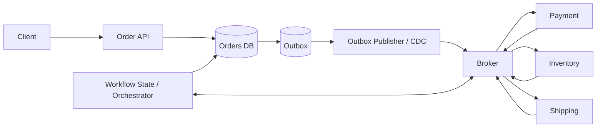

# Transactions for System Design

A database transaction is a **local atomicity and isolation boundary**. It is excellent when the state that must change together lives inside one transactional database.

The moment a workflow crosses:

- another database,
- a message broker,
- a payment provider,
- an email API,
- object storage,
- or another independently deployed service,

a normal database transaction no longer gives end-to-end atomic rollback.

That boundary is one of the most important ideas in senior backend system design.

---

## Interview TL;DR

1. Put one business invariant inside one local database transaction when practical.
2. Keep transactions short; do not hold locks or snapshots while calling slow external services.
3. Validate mutable state **inside** the transaction.
4. Use constraints and atomic conditional updates before reaching for broad locks.
5. Deadlocks and serialization failures are expected; retry the **entire transaction** when the database requires it.
6. Idempotency protects repeated requests; transaction isolation protects concurrent database operations. They solve different problems.
7. A database commit does not atomically publish a Kafka message or charge a payment provider.
8. Use a **transactional outbox** when a committed DB change must reliably produce an event.
9. Consumers should be idempotent because event publication/delivery may happen more than once.
10. Use a saga for a multi-service workflow with compensating business actions; a saga is not a distributed rollback.
11. Use two-phase commit only when all participants support the protocol and its blocking/operational trade-offs are justified.
12. Define the **point of no return** in long-running workflows.

---

# 1. The Local Transaction Boundary

Example transfer inside one SQL database:

```sql
BEGIN;

UPDATE accounts
SET balance = balance - 500
WHERE id = 101
  AND balance >= 500;

UPDATE accounts
SET balance = balance + 500
WHERE id = 202;

INSERT INTO transfers(id, sender_id, receiver_id, amount, status)
VALUES (9001, 101, 202, 500, 'COMPLETED');

COMMIT;
```

The application must verify the debit actually affected a row.

The invariant is:

```text
debit + credit + transfer record
must commit as one unit
```

That is an excellent transaction boundary.

---

# 2. Transactions Do Not Roll Back External Side Effects

This is unsafe:

```text
BEGIN
  ↓
reserve inventory
  ↓
charge payment provider
  ↓
insert order
  ↓
COMMIT
```

Suppose the external payment succeeds but the database transaction rolls back.

The database cannot undo the external charge.

Likewise, rollback cannot unsend:

- email
- SMS
- webhook
- object upload
- third-party API mutation

Therefore:

> Keep irreversible or remote side effects outside the local database transaction unless a protocol explicitly coordinates them.

---

# 3. Keep Transactions Short

Long transactions create:

- longer lock hold time
- MVCC/version-retention pressure
- connection occupancy
- deadlock probability
- larger retry cost
- worse p95/p99 latency

Bad:

```text
BEGIN
lock row
call remote service for 8 seconds
wait for user input
COMMIT
```

Better:

```text
short local transaction
      ↓
persist durable workflow state
      ↓
commit
      ↓
perform remote work
      ↓
record outcome in another short transaction
```

---

# 4. Validate Mutable State Inside the Transaction

Static validation can happen before `BEGIN`:

- input shape
- identifier format
- positive amount
- authorization token format

But mutable business state must be revalidated inside the transaction:

- balance
- stock
- seat availability
- current order status
- coupon usage count
- version number

Otherwise a time-of-check/time-of-use race exists.

---

# 5. Atomic Conditional Updates

Often the safest design is smaller than an explicit locking workflow.

Inventory:

```sql
UPDATE inventory
SET available_stock = available_stock - 1
WHERE product_id = ?
  AND available_stock > 0;
```

Then:

```text
affected rows = 1 → reserved
affected rows = 0 → unavailable
```

This avoids:

```text
read stock
      ↓
application check
      ↓
write stock
```

with a race between the read and write.

---

# 6. Constraints Are Part of the Transaction Design

Examples:

```sql
UNIQUE (idempotency_key)
```

```sql
CHECK (balance >= 0)
```

```sql
FOREIGN KEY (order_id) REFERENCES orders(id)
```

A constraint closes races that application pre-checks cannot reliably close.

Example:

```text
check email not used
      ↓
another request inserts same email
      ↓
first request inserts
```

The unique constraint is the authoritative concurrency control.

---

# 7. Savepoints

Savepoints create partial rollback points inside a transaction.

```sql
BEGIN;

INSERT INTO batch_runs(id, status)
VALUES (1, 'STARTED');

SAVEPOINT item_1;

-- work

ROLLBACK TO SAVEPOINT item_1;

COMMIT;
```

Use sparingly.

They are useful for controlled sub-work but do not turn one large, long-lived transaction into a good architecture.

---

# 8. Deadlock Retry

A deadlock can abort a transaction even when the business logic is correct.

Correct retry:

```text
BEGIN
read current state
validate
write
COMMIT
```

If deadlock:

```text
rollback
bounded backoff + jitter
rerun the entire transaction
```

Do not reuse stale values from the aborted attempt.

---

# 9. Serialization Retry

Serializable or snapshot-based implementations may abort a transaction due to a concurrency conflict.

Retry the full unit:

```text
attempt 1 snapshot
   ↓
serialization failure
   ↓
new transaction
   ↓
fresh snapshot and fresh validation
```

A retry is part of the transaction contract, not an exceptional architectural surprise.

---

# 10. Idempotency

Idempotency handles **repeated business requests**.

Example:

```http
Idempotency-Key: checkout-user101-cart88
```

Persist:

```text
key
request fingerprint
status
resource id
response metadata
```

A uniqueness constraint should make creation atomic.

Possible states:

```text
STARTED
COMPLETED
FAILED_RETRYABLE
FAILED_FINAL
```

Be careful with concurrent duplicate requests:

```text
request A and B use same key simultaneously
```

Only one should own execution; the other should observe/reuse the durable result.

---

# 11. Idempotency Is Not Isolation

Two separate questions:

### Isolation

Can two concurrent transactions corrupt shared database state?

### Idempotency

Can one logical client operation be executed twice because of retry or timeout?

A payment endpoint usually needs both.

---

# 12. Transactional Outbox

Problem:

```text
DB commit succeeds
      ↓
process crashes
      ↓
event publish never happens
```

Naive dual write:

```text
UPDATE database
publish broker message
```

has no atomic boundary across both systems.

Outbox:

```sql
BEGIN;

UPDATE orders
SET status = 'PAID'
WHERE id = 5001;

INSERT INTO outbox_events(
    event_id,
    aggregate_id,
    event_type,
    payload,
    created_at
)
VALUES (
    'evt-9001',
    '5001',
    'OrderPaid',
    '{"orderId":5001}',
    CURRENT_TIMESTAMP
);

COMMIT;
```

Then a publisher asynchronously forwards committed outbox rows to the broker.

---

# 13. Outbox Delivery Semantics

The outbox solves:

> “A committed business change must not silently lose the fact that an event should be published.”

It does **not** automatically guarantee exactly-once end-to-end processing.

Typical reality:

```text
publisher sends message
      ↓
broker accepts
      ↓
publisher crashes before marking row sent
      ↓
publisher sends again
```

Therefore consumers should support:

- event ID deduplication
- idempotent state transition
- unique constraints
- monotonic version checks

Think:

```text
at-least-once publication
+
idempotent consumption
```

---

# 14. Inbox / Consumer Deduplication

Consumer:

```sql
BEGIN;

INSERT INTO processed_events(event_id)
VALUES (?);

-- if duplicate key → already processed

UPDATE shipment_state
SET ...
WHERE ...;

COMMIT;
```

The dedup marker and the consumer's business update should share the same local transaction where possible.

---

# 15. CDC vs Outbox Poller

Outbox events can be delivered by:

### Polling publisher

```text
query pending rows
publish
mark sent
```

Simple, but requires polling/claiming and cleanup.

### Change Data Capture

A log-based system observes committed outbox inserts and publishes them downstream.

Benefits:

- lower application polling pressure
- natural ordering from the DB log in some topologies

Costs:

- CDC infrastructure
- failover/recovery semantics
- schema/connector operations

The outbox table remains the local atomicity bridge.

---

# 16. Saga

A saga coordinates multiple independently committed steps.

Example:

```text
Create Order
   ↓
Reserve Inventory
   ↓
Authorize Payment
   ↓
Create Shipment
```

Each step commits locally.

If a later step fails:

```text
release inventory
cancel order
void/refund payment where possible
```

Those are **compensating business actions**, not technical rollback.

Compensation itself can fail and must be retried/observed.

---

# 17. Orchestration vs Choreography

## Orchestration

A workflow coordinator issues commands and tracks state.

Advantages:

- explicit state machine
- easier global visibility
- clearer timeout/compensation control

Costs:

- coordinator logic
- central workflow dependency

## Choreography

Services react to events.

Advantages:

- loose direct coupling
- local ownership

Costs:

- hidden global workflow
- cyclic dependencies
- difficult debugging
- harder compensation visibility

For complex money/order flows, explicit orchestration is often easier to reason about.

---

# 18. Saga State Machine

Persist workflow state.

```text
ORDER_CREATED
      ↓
INVENTORY_RESERVED
      ↓
PAYMENT_AUTHORIZED
      ↓
CONFIRMED
```

Failure branch:

```text
PAYMENT_FAILED
      ↓
RELEASE_INVENTORY
      ↓
CANCELLED
```

Every transition should be:

- idempotent
- observable
- retryable where safe
- protected against stale commands/events

---

# 19. Two-Phase Commit

Two-phase commit coordinates participants that support a prepare/commit protocol.

Conceptually:

```text
Phase 1: PREPARE
  coordinator asks all participants if they can commit

Phase 2:
  COMMIT all
  or
  ROLLBACK all
```

Advantages:

- stronger atomic commit across compatible participants

Costs:

- coordination
- prepared state
- blocking/resource retention
- recovery complexity
- coordinator/participant failure handling
- limited compatibility with external SaaS APIs

Do not propose 2PC for Stripe + Kafka + PostgreSQL unless the actual participants and protocol support it.

---

# 20. Prepared Transactions Are Operational State

A prepared transaction can retain resources while waiting for final resolution.

Operationally monitor:

- prepared transaction age
- locks/resources held
- coordinator state
- orphaned prepared transactions
- recovery procedure

2PC is a correctness mechanism with operational cost.

---

# 21. Long-Running Workflows

A business process may last minutes or days.

Example:

```text
order created
      ↓
payment pending
      ↓
warehouse allocation
      ↓
shipment
```

Do not keep one DB transaction open for the duration.

Persist a state machine and use short local transactions for each transition.

---

# 22. Point of No Return

Every workflow should identify irreversible or expensive transitions.

Examples:

- captured payment
- parcel handed to carrier
- email sent
- external trade executed

Before that point, compensation may be easy.

After that point, recovery may require:

- refund
- return
- correction entry
- manual review

System design should model this explicitly.

---

# 23. Transactional Workflow Architecture



Local invariants stay local.

Cross-service consistency is managed as durable workflow state.

---

# 24. Failure Scenarios

## Client times out after DB commit

Use idempotency to return/reconstruct the committed result.

## DB commits, publisher crashes

Outbox event remains durable and can be published later.

## Event delivered twice

Consumer deduplicates or uses idempotent state transition.

## Consumer commits DB change, acknowledgement lost

Broker redelivers; consumer deduplication protects the business update.

## Payment succeeds, order service unavailable

Payment result/event is retried; workflow state reconciles.

## Compensation fails

Persist compensation state and retry; alert if SLA exceeded.

---

# 25. Observability

Track:

- transaction p95/p99
- rollback rate
- deadlocks
- serialization failures
- lock waits
- retries
- idempotency conflicts
- outbox oldest age
- unpublished outbox count
- duplicate-event count
- saga state age
- compensation failures
- workflow timeout count

The most useful metric for an asynchronous workflow is often:

```text
age of oldest unfinished state/event
```

not only queue depth.

---

# 26. Interview Decision Table

| Situation | Prefer |
|---|---|
| Several rows in one DB must change together | Local transaction |
| One conditional counter/inventory update | Atomic statement |
| Client may retry same request | Idempotency key |
| DB change must reliably emit event | Transactional outbox |
| Consumer may receive duplicates | Inbox/idempotent consumer |
| Workflow spans services | Saga/workflow state |
| All participants support atomic prepare/commit and cost is justified | 2PC |
| External irreversible side effect | Explicit state + reconciliation/compensation |

---

# 27. Common Mistakes

### Holding a transaction open across remote calls

Creates locks, retries, and uncertain external side effects.

### Publishing an event before commit

Consumers may observe an event for a DB change that later rolls back.

### Publishing only after commit without outbox

Crash window can lose the event.

### Saying Kafka gives exactly-once business processing

Broker guarantees do not automatically cover your database and external side effects.

### Treating saga compensation as rollback

Compensation is a new business action.

### Using idempotency only in memory

Process restart destroys the guarantee.

---

# Interview Answer Template

> “The order and inventory rows live in one database, so I’ll protect that invariant with a short local transaction and an atomic stock decrement. The client request carries an idempotency key with a unique constraint. I won’t call payment or Kafka inside the transaction. The transaction writes an outbox event, which is published asynchronously. Downstream consumers deduplicate by event ID. The payment/inventory/shipping sequence is a persisted saga; failures trigger compensating actions rather than pretending we can roll back remote systems.”

---

## References

- PostgreSQL transaction processing: https://www.postgresql.org/docs/current/transactions.html
- PostgreSQL isolation: https://www.postgresql.org/docs/current/transaction-iso.html
- MySQL InnoDB error handling: https://dev.mysql.com/doc/refman/8.4/en/innodb-error-handling.html
