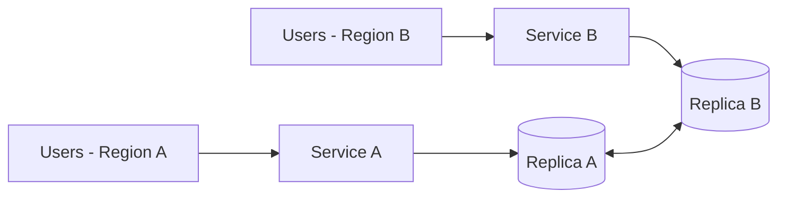

# CAP Theorem

CAP is useful in interviews, but the common “pick any two of C, A, and P” slogan is too imprecise for serious system design.

The practical question is:

> **When communication between replicas is disrupted, which operations should preserve a strong consistency guarantee, and which operations should remain available?**

That decision can differ by operation, data type, region, and failure mode.

---

## Interview TL;DR

1. **CAP applies to replicated/distributed data when a network partition affects communication.**
2. **Consistency in the formal CAP model is an atomic/linearizable-style guarantee**, not ACID consistency.
3. **Availability means every request reaching a non-failing node eventually receives a response**, even when replicas cannot coordinate.
4. In a partition, a system cannot guarantee both that strong consistency property and full availability for the affected operation.
5. Do not classify an entire company or application as permanently “CP” or “AP.”
6. Modern systems often make **different consistency choices for different operations**.
7. CAP says little about the normal case when there is no partition; use **PACELC** to discuss latency-versus-consistency trade-offs outside partitions.
8. A strong interview answer starts with **business invariants**, not a database label.

---

## What CAP Actually Says

The CAP theorem formalizes an impossibility result for distributed systems under a network-partition model.

The three properties are:

### Consistency

In the CAP literature, consistency is stronger than “all nodes will eventually agree.”

A useful interview interpretation is:

> A read behaves as though all operations occurred in one globally ordered, up-to-date sequence.

This is close to **linearizability** for the shared data under discussion.

If a successful write changes:

```text
balance = 100
```

to:

```text
balance = 150
```

a strongly consistent read should not later return the old value merely because it reached a lagging replica.

### Availability

Every request delivered to a non-failing node eventually gets a response.

Availability in CAP does **not** mean:

- 99.99% uptime
- low latency
- the server process is alive
- every response is the latest value

Those are separate operational properties.

### Partition tolerance

A partition means some nodes cannot reliably exchange messages.

Examples include:

- region-to-region connectivity loss
- packet loss severe enough to break coordination
- routing failure
- switch or link failure
- a node being reachable from one side but not another

In real distributed systems, you cannot design on the assumption that communication will always succeed.

---

## Why “Pick Two of Three” Is Misleading

The usual triangle suggests three symmetric knobs:

```text
C
A
P
```

with a permanent choice of two.

That is not the useful mental model.

When the network is healthy, a system may provide both strong consistency and high availability.

The difficult choice appears **when a partition prevents the nodes needed for coordination from communicating**.

For the affected operation:

```text
Network partition
      ↓
Can replicas coordinate?
      ↓
No
      ↓
Preserve strong consistency?
   /                 \
 Yes                  No
  ↓                    ↓
Reject/delay some      Continue serving
requests               possibly stale/conflicting state
```

So the interview question is not:

> “Is this database CP or AP?”

It is:

> “What does this operation do when the replicas it depends on cannot coordinate?”

---

## CP-Style Behavior During a Partition

Suppose two replicas cannot communicate.

To preserve a strong consistency invariant, the system may allow writes only through the side that still has enough authority to make a safe decision.

Other requests may:

- fail
- time out
- wait
- return a retryable error
- become read-only

Example:

```text
Region A --------X-------- Region B
   |
   | has quorum
   ↓
Writes allowed

Region B
   ↓
Writes rejected
```

### Typical use cases

Use stronger consistency where stale or conflicting decisions can violate an invariant:

- allocating the same unique resource twice
- committing a ledger mutation
- assigning the same seat twice
- enforcing a uniqueness constraint
- changing security-sensitive authorization state

But even a financial system may have eventually consistent projections around a strongly consistent core.

---

## AP-Style Behavior During a Partition

A system can continue accepting operations on both sides of a partition if it allows temporary divergence.

```text
Region A --------X-------- Region B

Write X                  Write Y
   ↓                        ↓
Accepted                 Accepted
```

After communication is restored:

```text
X + Y
  ↓
reconcile / merge / resolve
```

This requires a convergence strategy.

Possible approaches include:

- last-write-wins where acceptable
- version vectors
- CRDTs
- application-specific conflict resolution
- compensating actions
- deterministic merge rules

### Typical use cases

Availability-first behavior is plausible for data where temporary divergence is acceptable:

- presence
- reaction counters
- telemetry ingestion
- some recommendation signals
- cached projections
- collaborative state designed for merge

The correct choice depends on the invariant, not the product category.

---

## Think Per Operation, Not Per Product

A single system can contain both kinds of behavior.

For example, an e-commerce platform might use:

| Operation | Likely priority | Reason |
|---|---|---|
| Browse product description | Availability/freshness trade-off | Slight staleness may be acceptable |
| Recommendation feed | Availability | Can tolerate stale ranking |
| Inventory reservation | Stronger consistency | Avoid overselling |
| Payment ledger mutation | Stronger consistency | Financial invariant |
| Analytics event | Availability | Eventual processing is acceptable |
| Search index update | Eventual consistency | Source database remains authoritative |

This is more realistic than calling “e-commerce” CP or AP.

---

## CAP Consistency vs ACID Consistency

These are different concepts.

### CAP consistency

Concerned with whether distributed clients observe a single up-to-date ordering of operations.

### ACID consistency

Concerned with whether a transaction preserves application/database invariants.

Example:

```text
account_balance >= 0
```

A database can preserve an ACID invariant locally while replicas are asynchronously converging.

Do not use the two meanings interchangeably in interviews.

---

## CAP vs Eventual Consistency

Eventual consistency is not the “A” in CAP.

It is one possible consistency model.

A system may provide:

- linearizable reads
- sequential consistency
- causal consistency
- read-your-writes
- monotonic reads
- bounded staleness
- eventual consistency

Interview answers are stronger when they name the actual guarantee the workload requires.

---

## CAP and Quorums

Quorum replication can help implement consistency policies.

If a system has:

```text
N = number of replicas
W = replicas required for write acknowledgement
R = replicas consulted for a read
```

then configurations where:

```text
R + W > N
```

create overlap between read and write quorums.

But this formula alone does **not** automatically prove linearizability.

You still need to reason about:

- version ordering
- concurrent writes
- leader/consensus behavior
- failure detection
- stale replicas
- repair
- the database's actual protocol

Do not reduce consistency guarantees to quorum arithmetic without discussing the protocol.

---

## PACELC

CAP focuses on partitions.

PACELC adds the normal operating trade-off:

```text
If Partition:
    Availability vs Consistency
Else:
    Latency vs Consistency
```

This matters because most requests happen when the network is not partitioned.

Example:

A globally replicated database may choose:

```text
Local replica read
    ↓
lower latency
    ↓
possible staleness
```

or:

```text
Cross-region coordination
    ↓
higher latency
    ↓
stronger consistency
```

That latency-versus-consistency decision is often more important day to day than an actual partition.

---

## Failure Scenario

Assume a two-region system:



Now the inter-region link fails.

Ask:

1. Can both regions still accept writes?
2. What invariant could conflicting writes violate?
3. Is there a quorum or leader?
4. Can one region safely become read-only?
5. What does the client see?
6. How are rejected writes retried?
7. If both sides write, how are conflicts resolved?
8. What happens when the partition heals?

Those are better interview questions than “CP or AP?”

---

## Example: Inventory Reservation

Suppose only one unit remains:

```text
inventory = 1
```

During a partition:

```text
Region A believes inventory = 1
Region B believes inventory = 1
```

If both accept a reservation independently:

```text
Customer A buys
Customer B buys
```

the invariant is violated.

Possible designs:

### Option 1 — Single authoritative region

Only one region owns writes.

**Gain:** simple correctness model.

**Cost:** cross-region latency and lower write availability during region failure.

### Option 2 — Consensus/quorum replication

A write succeeds only when enough replicas coordinate.

**Gain:** strong consistency across replicas.

**Cost:** latency and unavailability when quorum cannot be reached.

### Option 3 — Partition inventory

Pre-allocate inventory units to regions.

```text
Region A owns 60
Region B owns 40
```

Each region can make local decisions within its allocation.

**Gain:** better regional availability.

**Cost:** inventory can become stranded in one region while another sells out.

This is the kind of trade-off discussion interviewers want.

---

## Common Mistakes

### “CAP means choose two permanently”

Wrong mental model.

The hard constraint matters when a partition affects the operation.

### “P is optional”

In a genuinely distributed deployment, communication failure must be considered.

### “AP means no consistency”

AP-oriented systems can still provide meaningful consistency guarantees.

### “CP means the entire service goes down”

Usually only operations that cannot safely proceed without coordination need to fail or wait.

### “All financial data must be strongly consistent”

Financial systems often combine:

- strongly consistent ledgers
- asynchronous projections
- eventually consistent analytics
- cached reads

Classify data by invariant.

### “Database X is CP”

Configuration and operation matter.

Ask:

- which API operation?
- which read level?
- which write level?
- which deployment mode?
- what happens under partition?

---

## Interview Answer Template

A concise senior-level answer:

> “I use CAP specifically for partition behavior. For this operation, the business invariant is that the same resource cannot be allocated twice. During a network partition I would preserve that invariant even if some requests must fail, so writes require the authoritative leader or quorum. Other data such as analytics and recommendations can remain available and converge later. Outside partitions I would separately evaluate the latency-versus-consistency trade-off, which is closer to PACELC.”

---

## Interview Questions

### What does CAP consistency mean?

A strong single-copy-style guarantee: operations behave as though clients are interacting with one up-to-date logical copy.

### Does CAP say a system is always either CP or AP?

No. The meaningful trade-off appears during partition, and behavior can differ by operation and configuration.

### Is eventual consistency the same as availability?

No. Eventual consistency is a consistency model; availability is a response guarantee in the CAP model.

### Can SQL systems be AP?

The SQL data model does not determine CAP behavior. Replication and coordination protocols do.

### Can NoSQL systems provide strong consistency?

Yes. “NoSQL” does not imply eventual consistency.

### Why use PACELC?

CAP explains partition behavior; PACELC also highlights latency-versus-consistency trade-offs when the network is healthy.

---

## Senior-Level Follow-ups

Be ready to discuss:

- linearizability
- quorum systems
- leader-based replication
- consensus
- split brain
- fencing
- conflict resolution
- CRDTs
- causal consistency
- read-your-writes
- bounded staleness
- multi-region write ownership
- RPO/RTO

---

## Key Takeaways

1. CAP is a **partition-time impossibility result**, not a database shopping chart.
2. Treat consistency requirements **per operation and invariant**.
3. Strong consistency may reduce availability for affected operations during a partition.
4. Availability-first behavior requires a convergence/conflict strategy.
5. CAP consistency and ACID consistency are different.
6. Modern architectures mix consistency models.
7. Use PACELC to discuss normal-case latency-versus-consistency trade-offs.

---

## References

- Seth Gilbert and Nancy Lynch, *Brewer's Conjecture and the Feasibility of Consistent, Available, Partition-Tolerant Web Services*.
- Eric Brewer, *CAP Twelve Years Later: How the "Rules" Have Changed*.
