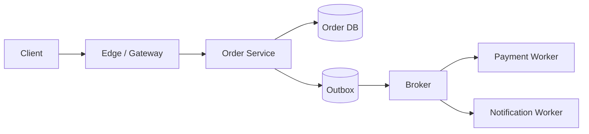

# High-Level Design (HLD)

High-Level Design explains the major system boundaries, data ownership, request/event flows, scaling model, failure behavior, and production trade-offs needed to satisfy the requirements.

In a system-design interview, HLD is not “draw boxes until the page is full.” Every major box should have a requirement-driven reason to exist.

## Interview TL;DR

1. Requirements and design-driving estimates come before architecture.
2. Draw the critical end-to-end flow first.
3. Name the source of truth for important state.
4. Define APIs/events and data model deeply enough to expose access patterns.
5. State where synchronous calls end and asynchronous work begins.
6. Explain consistency and failure behavior for critical operations.
7. Identify the first bottleneck and the 10× evolution path.
8. Include security and observability as architecture concerns.
9. Reject at least one plausible alternative and explain why.
10. Prefer one coherent design over many disconnected technologies.

## HLD Sequence

```text
Requirements
    ↓
Scale assumptions
    ↓
API / events
    ↓
Data model + ownership
    ↓
High-level components
    ↓
Critical flows
    ↓
Deep dive
    ↓
Failure / consistency
    ↓
Security / observability
    ↓
Trade-offs / evolution
```

## Requirements

Identify:

- critical journey;
- hard invariants;
- latency/availability;
- read/write/connection scale;
- geography;
- retention;
- security;
- non-goals.

## Design-Driving Estimates

```text
peak reads/sec
peak writes/sec
dataset/year
bandwidth
concurrent connections
largest tenant/hot key
```

## Interfaces

Example:

```http
POST /v1/orders
GET /v1/orders/{id}
```

Events:

```text
OrderCreated
PaymentAuthorized
ShipmentCreated
```

Interfaces expose transaction boundaries and coupling.

## Data Model and Ownership

Do not stop at “SQL or NoSQL.”

Ask:

- authoritative owner;
- access patterns;
- primary/partition key;
- indexes;
- transaction boundary;
- consistency;
- retention;
- projections.

## Architecture



Explain why each component exists.

## Critical Flows

### Synchronous

What must complete before returning success?

### Asynchronous

What is durable before acknowledgement?

### Failure

What happens when a dependency is slow or unavailable?

## Deep Dive

Pick the hardest requirement:

- partitioning;
- cache consistency;
- ordering;
- idempotency;
- reservation;
- multi-region;
- fan-out;
- search;
- persistent connection management.

Depth is stronger signal than extra boxes.

## Scaling

Name the bottleneck, then state the trigger for change.

## Failure and Recovery

Cover:

- deadlines;
- retry safety;
- overload;
- backlog;
- replica lag;
- stateful failover;
- region loss;
- reconciliation;
- RPO/RTO.

## Security

Include:

- trust boundaries;
- authentication;
- authorization;
- encryption;
- abuse/rate limiting;
- sensitive data;
- audit trail.

## Observability

Tie telemetry to failure modes:

```text
request p99
error rate
DB saturation
cache hit/miss
queue oldest age
replication lag
workflow stuck age
```

## Trade-Offs

```text
Decision
→ Driver
→ Benefit
→ Cost
→ Failure mode
→ Mitigation
→ Revisit trigger
```

## HLD vs LLD

HLD owns distributed boundaries, communication, data ownership, scaling, failure domains, and evolution.

LLD owns internal interfaces, state machines, algorithms, component-level concurrency, and detailed implementation.

## Common Mistakes

- database choice before access patterns;
- microservices without an ownership/deployment need;
- queue without delivery/idempotency semantics;
- cache without invalidation/fallback;
- multi-region without write ownership;
- no bottleneck/evolution story;
- security/observability added as final checkboxes.

## 2-Minute Interview Answer

> “My HLD starts from the critical journey and SLOs, then defines APIs/events and authoritative data. I draw the end-to-end flow, separate synchronous from durable async work, and deep dive on the hardest invariant or scaling constraint. I cover deadlines, overload, failover, consistency, security, and observability, then close with the current bottleneck and metric that triggers the next design.”
