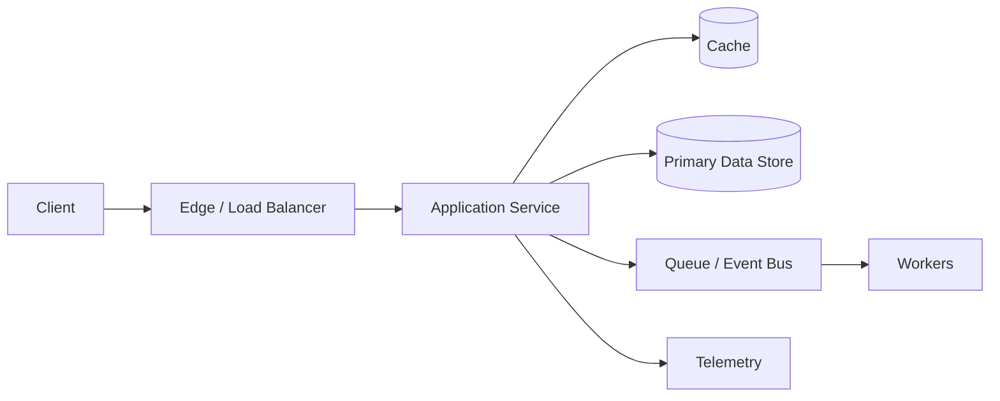

# 45-Minute System Design Framework

The framework is a time-management tool, not a script. Adapt it when the interviewer wants a specific deep dive.

## 0-5 Minutes — Requirements

Clarify:

- primary users and critical journeys;
- reads vs writes;
- latency and availability expectations;
- consistency requirements by operation;
- geography and multi-region needs;
- object/data sizes;
- retention;
- realtime or offline behavior;
- abuse/security constraints;
- explicit non-goals.

Do not ask questions whose answers would not affect the architecture.

## 5-10 Minutes — Scale and Interfaces

Estimate only what drives design:

- requests per second;
- peak multiplier;
- writes per second;
- storage growth;
- bandwidth;
- concurrent connections;
- hot-key or hot-partition risk.

Then define the major APIs or events.

## 10-20 Minutes — High-Level Architecture

Draw the end-to-end flow:

Every box should exist for a reason tied to a requirement.

## 20-32 Minutes — Deep Dive

Pick the hardest part:

- data model and partition key;
- cache freshness;
- ordering and delivery semantics;
- idempotency;
- hot partitions;
- multi-region writes;
- search/indexing;
- reservation/locking;
- fan-out.

Depth is more valuable than adding boxes.

## 32-40 Minutes — Failure and Operations

Cover:

- timeout budgets;
- retry safety;
- idempotency;
- overload and backpressure;
- partial dependency failure;
- replica lag;
- queue backlog;
- region failure;
- observability;
- deployment and rollback.

## 40-45 Minutes — Trade-offs and Evolution

Close with:

1. the most important trade-off;
2. one rejected alternative;
3. the biggest current bottleneck;
4. the next architecture change at 10× load;
5. the metrics that would trigger that change.

## Communication Rule

Prefer:

> “Because the redirect path is read-heavy and can tolerate short-lived staleness, I would cache URL mappings. The cost is invalidation complexity, so mappings are immutable after creation and use a long TTL.”

Over:

> “I’ll use Redis because Redis is fast.”
