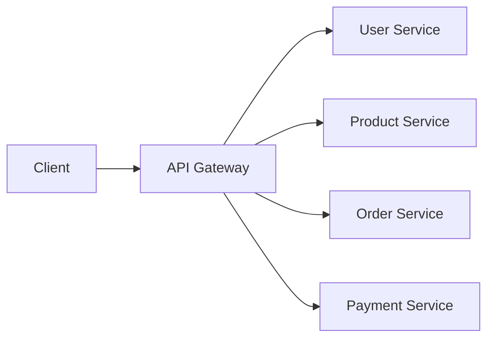
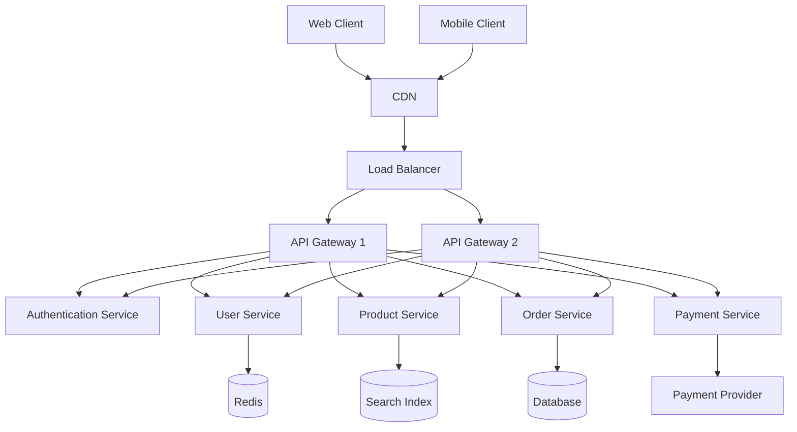
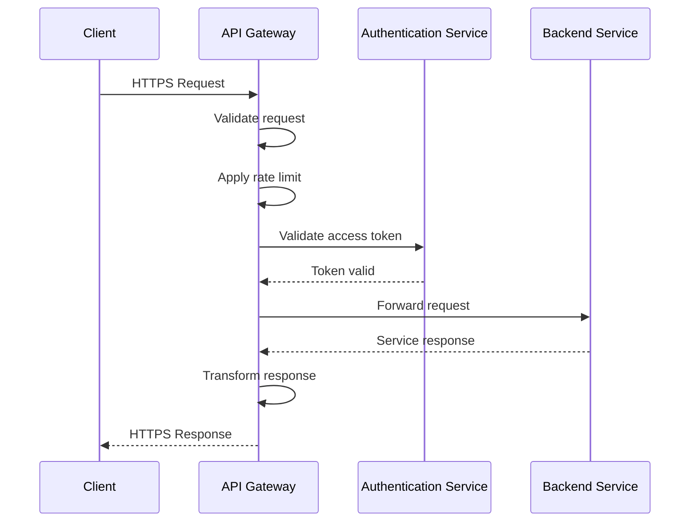
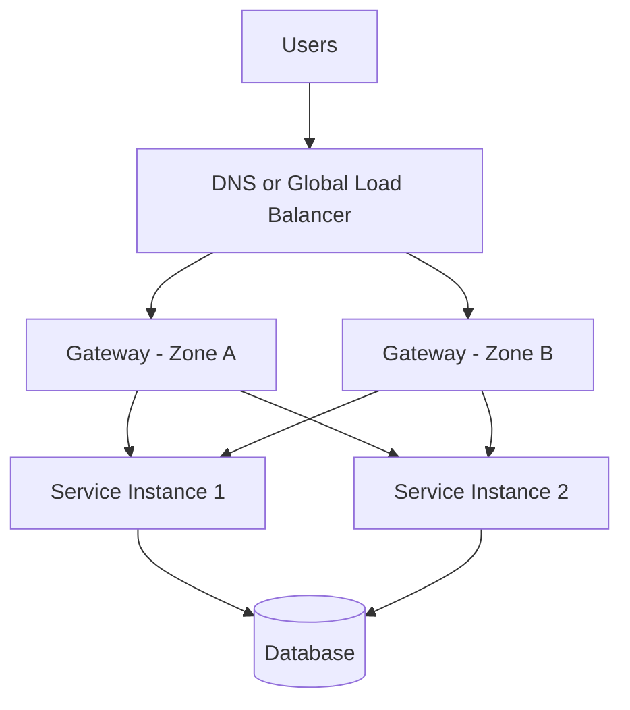
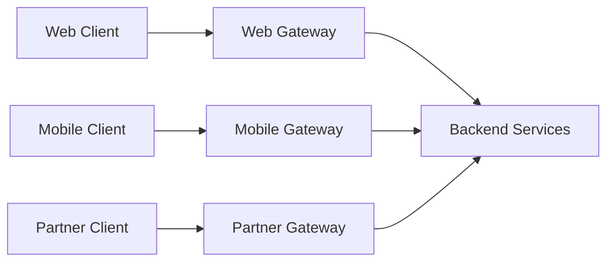
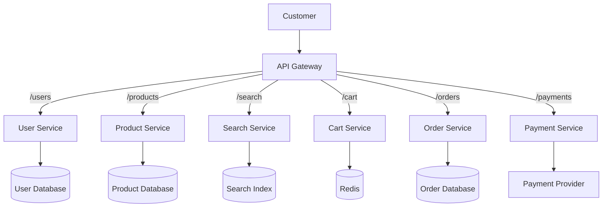
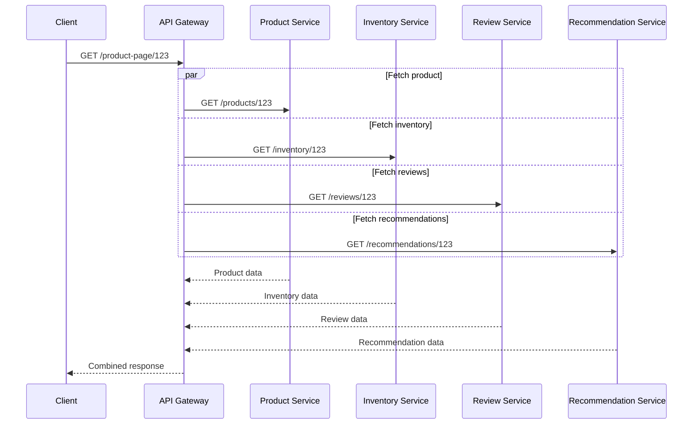

# API Gateway

An **API Gateway** acts as the main entry point for clients communicating with backend services.

Instead of exposing every service directly, clients send requests to the gateway. The gateway validates, routes, transforms, monitors, and forwards those requests to the appropriate backend service.

```text
Client → API Gateway → Backend Services
```

Popular API Gateway solutions include:

* Amazon API Gateway
* Kong
* Apigee
* Azure API Management
* NGINX
* Envoy
* Traefik
* Tyk
* Spring Cloud Gateway

---

## Overview

In a monolithic application, clients usually communicate with one backend server.

```text
Client → Monolithic Application
```

In a microservices architecture, the backend may contain many independent services.

```text
Client
  ├──→ User Service
  ├──→ Product Service
  ├──→ Order Service
  ├──→ Payment Service
  └──→ Notification Service
```

Allowing clients to communicate directly with every service creates several problems:

* Clients must know the location of each service
* Authentication logic may be duplicated
* Internal services become publicly exposed
* API changes become harder to manage
* Monitoring becomes fragmented
* Mobile and web clients may need different API responses

An API Gateway provides one controlled entry point.

```text
                         ┌──→ User Service
                         ├──→ Product Service
Client → API Gateway ────┼──→ Order Service
                         ├──→ Payment Service
                         └──→ Notification Service
```

The client only needs to know one public endpoint:

```text
https://api.example.com
```

The gateway handles communication with internal services.

---

## Core Concepts

### Single Entry Point

The API Gateway exposes one public interface for multiple backend services.

```text
https://api.example.com/users
https://api.example.com/products
https://api.example.com/orders
```

Internally, these requests may be handled by completely different services.

```text
/users    → User Service
/products → Product Service
/orders   → Order Service
```

This hides the internal architecture from clients.

---

### Request Routing

Routing determines which backend service receives a request.

#### Path-Based Routing

```text
/api/users     → User Service
/api/orders    → Order Service
/api/payments  → Payment Service
```

#### Host-Based Routing

```text
users.example.com   → User Service
orders.example.com  → Order Service
admin.example.com   → Admin Service
```

#### Header-Based Routing

```text
X-API-Version: 1 → API Version 1
X-API-Version: 2 → API Version 2
```

#### Method-Based Routing

```text
GET  /products → Product Query Service
POST /products → Product Command Service
```

---

### Authentication

The gateway can verify who is making the request.

Common authentication methods include:

* API keys
* OAuth 2.0
* JSON Web Tokens
* Session cookies
* Mutual TLS
* Signed requests

Example:

```http
Authorization: Bearer <access-token>
```

The gateway validates the token before forwarding the request.

```text
Client
  ↓
API Gateway
  ↓ Validate token
Authentication Service
  ↓
Backend Service
```

Centralizing authentication avoids implementing the same verification logic in every service.

---

### Authorization

Authentication answers:

> Who is the user?

Authorization answers:

> What is the user allowed to do?

Example:

```text
Customer → Can view own orders
Support Agent → Can view customer orders
Administrator → Can manage all orders
```

The gateway may enforce high-level authorization rules, while individual services should still enforce business-specific permissions.

---

### Rate Limiting

Rate limiting controls how many requests a client can make during a specific time period.

Examples:

```text
100 requests per minute per user
1,000 requests per hour per API key
5 login attempts per minute per IP
```

Rate limiting protects the system from:

* Abuse
* Bots
* Accidental traffic spikes
* Brute-force attacks
* Resource exhaustion
* Noisy clients

Common rate-limiting algorithms include:

* Token bucket
* Leaky bucket
* Fixed window
* Sliding window
* Sliding-window log

---

### Throttling

Rate limiting defines the allowed request rate.

Throttling controls how traffic is slowed, delayed, or rejected when limits are reached.

A gateway may return:

```http
HTTP/1.1 429 Too Many Requests
Retry-After: 60
```

---

### Request Transformation

The gateway can modify requests before forwarding them.

Examples:

* Rename headers
* Add authentication context
* Convert request formats
* Remove unsupported fields
* Add correlation IDs
* Rewrite URL paths

Example:

```text
External Request:
GET /v1/customers/42

Internal Request:
GET /users/42
```

---

### Response Transformation

The gateway can modify responses before returning them to clients.

Examples:

* Rename fields
* Remove internal information
* Convert XML to JSON
* Standardize error responses
* Add security headers
* Combine responses from multiple services

Example:

```json
{
  "user_id": 42,
  "full_name": "Alex"
}
```

The backend may internally use a different structure, but the gateway provides a stable public format.

---

### API Composition

A client screen may require data from multiple services.

Without composition:

```text
Client → User Service
Client → Order Service
Client → Recommendation Service
```

With API composition:

```text
Client
  ↓
API Gateway
  ├──→ User Service
  ├──→ Order Service
  └──→ Recommendation Service
  ↓
Combined Response
```

Example response:

```json
{
  "user": {
    "id": 42,
    "name": "Alex"
  },
  "recent_orders": [],
  "recommendations": []
}
```

This reduces the number of network calls made by the client.

---

### Protocol Translation

Clients and backend services may use different protocols.

```text
Client REST Request
        ↓
API Gateway
        ↓
Internal gRPC Service
```

Other examples include:

```text
HTTP → gRPC
REST → SOAP
WebSocket → Internal Messaging Service
JSON → XML
```

Protocol translation allows modern clients to communicate with older or specialized backend systems.

---

### Load Balancing

The API Gateway may distribute traffic across multiple instances of the same service.

```text
                              ┌──→ Order Service 1
Client → API Gateway ─────────┼──→ Order Service 2
                              └──→ Order Service 3
```

Common algorithms include:

* Round robin
* Weighted round robin
* Least connections
* Random selection
* Consistent hashing

---

### Service Discovery

In dynamic environments, service instances may frequently change.

The gateway can use a service registry to discover available instances.

```text
API Gateway
     ↓
Service Registry
     ↓
Available Service Instances
```

Common discovery systems include:

* Kubernetes Services
* Consul
* Eureka
* Cloud service registries
* DNS-based discovery

---

### Health Checks

The gateway should route traffic only to healthy service instances.

```text
Service A → Healthy
Service B → Unhealthy
Service C → Healthy
```

Requests are sent only to Service A and Service C.

Health checks may be:

* Active
* Passive
* Readiness-based
* Dependency-aware

---

### Timeouts

Timeouts prevent requests from waiting indefinitely.

Important timeout types include:

* Connection timeout
* Request timeout
* Upstream response timeout
* Idle timeout
* Read timeout
* Write timeout

Example:

```text
Gateway timeout: 3 seconds
```

If the backend does not respond in time, the gateway may return:

```http
HTTP/1.1 504 Gateway Timeout
```

---

### Retries

The gateway may retry a failed request on another service instance.

```text
Request
  ↓
Service Instance A → Failure
  ↓ Retry
Service Instance B → Success
```

Retries should be used carefully.

They are generally safer for idempotent requests:

```http
GET /products/123
```

They can be dangerous for non-idempotent requests:

```http
POST /payments
```

A repeated payment request may charge a customer twice unless idempotency protection is used.

---

### Circuit Breaker

A circuit breaker temporarily stops requests from reaching an unhealthy service.

```text
Closed    → Requests are allowed
Open      → Requests are blocked
Half-open → Limited requests test recovery
```

Circuit breakers prevent repeated failures from spreading through the system.

---

### Caching

The gateway may cache frequently requested responses.

```text
Client → API Gateway Cache

Cache hit  → Return response
Cache miss → Request backend service
```

Good caching candidates include:

* Product catalogs
* Public configuration
* Reference data
* Static metadata
* Frequently requested public APIs

Avoid shared caching for:

* Account information
* Payment responses
* Shopping carts
* Authentication endpoints
* Personalized data

---

### Request Aggregation

Request aggregation combines multiple backend responses into one client response.

```text
                    ┌──→ User Service
Client → Gateway ───┼──→ Order Service
                    └──→ Loyalty Service
                           ↓
                    Combined Response
```

This is useful for mobile applications where reducing network calls improves performance.

---

### Observability

The API Gateway is a valuable place to collect system-wide traffic information.

Important data includes:

* Request count
* Response status
* Request latency
* Upstream latency
* Error rate
* Rate-limit events
* Authentication failures
* Request and response sizes
* Selected backend instance

A unique request ID should be attached to each request.

```http
X-Request-ID: 324ee4e7-2f24-4b57-b5c2-a0d43ec668c4
```

The same ID should appear in gateway logs, service logs, and distributed traces.

---

### API Versioning

An API Gateway can route different API versions to different services.

#### URL Versioning

```text
/v1/products
/v2/products
```

#### Header Versioning

```http
X-API-Version: 2
```

#### Media-Type Versioning

```http
Accept: application/vnd.example.v2+json
```

Versioning helps teams introduce changes without immediately breaking existing clients.

---

## Architecture

### Basic API Gateway Architecture



The gateway provides a single public interface while backend services remain private.

---

### Production Architecture



Multiple gateway instances prevent the gateway layer from becoming a single point of failure.

---

### Request Flow



### Step-by-Step Flow

1. The client sends an HTTPS request.
2. The request reaches the API Gateway.
3. The gateway validates the request format.
4. Authentication and authorization rules are applied.
5. The gateway checks the client's rate limit.
6. Routing rules identify the correct backend service.
7. A healthy service instance is selected.
8. The request is transformed if necessary.
9. The backend processes the request.
10. The gateway receives the response.
11. The response may be transformed, cached, or compressed.
12. The gateway returns the final response to the client.

---

### High-Availability Architecture



For high availability:

* Run multiple gateway instances
* Deploy across multiple availability zones
* Use health checks
* Keep gateway instances stateless
* Automate configuration deployment
* Monitor gateway saturation
* Regularly test failover

---

### Backend for Frontend Architecture

Different clients may require different APIs.



This pattern is called **Backend for Frontend**, or **BFF**.

A mobile gateway may return smaller responses, while a web gateway may return richer data.

```text
Mobile Response → Small and bandwidth-efficient
Web Response    → Detailed and feature-rich
Partner API     → Stable and strictly versioned
```

---

## Comparisons

### API Gateway vs Reverse Proxy

| API Gateway                                     | Reverse Proxy                                   |
| ----------------------------------------------- | ----------------------------------------------- |
| Designed mainly for API traffic                 | Designed for general request forwarding         |
| Provides API keys, quotas, and policies         | Provides routing, TLS, and load balancing       |
| Often handles authentication and transformation | Usually focuses on proxying and traffic control |
| Supports API analytics and developer access     | Often provides infrastructure-level metrics     |
| May provide monetization and API products       | Usually does not manage API consumers           |

An API Gateway is often a specialized reverse proxy with API-management features.

---

### API Gateway vs Load Balancer

| API Gateway                                   | Load Balancer                                           |
| --------------------------------------------- | ------------------------------------------------------- |
| Routes requests using API-level rules         | Distributes traffic across server instances             |
| Understands paths, headers, tokens, and users | Often focuses on IP, port, or connection data           |
| Can authenticate and transform requests       | Usually does not implement business-facing API policies |
| May aggregate responses                       | Does not normally combine service responses             |
| Manages API quotas and versions               | Manages backend traffic distribution                    |

A production architecture may use both:

```text
Client → Load Balancer → API Gateway Cluster → Services
```

---

### API Gateway vs Service Mesh

| API Gateway                             | Service Mesh                                    |
| --------------------------------------- | ----------------------------------------------- |
| Handles north-south traffic             | Primarily handles east-west traffic             |
| Connects external clients to services   | Connects internal services to each other        |
| Enforces public API policies            | Enforces service-to-service policies            |
| Usually deployed at the system boundary | Usually deployed throughout the service network |
| Manages API consumers                   | Manages internal service identities             |

#### North-South Traffic

```text
External Client → API Gateway → Service
```

#### East-West Traffic

```text
Order Service → Payment Service
```

Many systems use an API Gateway for external traffic and a service mesh for internal communication.

---

### API Gateway vs CDN

| API Gateway                            | CDN                                        |
| -------------------------------------- | ------------------------------------------ |
| Manages API traffic                    | Delivers content from edge locations       |
| Handles authentication and routing     | Reduces geographic latency                 |
| Connects clients to backend services   | Caches static and selected dynamic content |
| Often sits near backend infrastructure | Runs across global edge locations          |
| Applies API-specific policies          | Absorbs large amounts of repeat traffic    |

A common architecture is:

```text
Client → CDN → API Gateway → Backend Services
```

---

### API Gateway vs Web Application Firewall

| API Gateway                       | Web Application Firewall                     |
| --------------------------------- | -------------------------------------------- |
| Routes and manages API requests   | Detects and blocks malicious traffic         |
| Handles authentication and quotas | Applies security rules and attack signatures |
| Transforms requests and responses | Filters threats such as SQL injection        |
| Understands API consumers         | Focuses on traffic security                  |
| Connects requests to services     | Protects the application boundary            |

These components often work together.

```text
Client → WAF → API Gateway → Backend Services
```

---

### API Gateway vs Backend for Frontend

| API Gateway                          | Backend for Frontend                                        |
| ------------------------------------ | ----------------------------------------------------------- |
| General gateway for multiple clients | Gateway designed for one client type                        |
| Applies shared policies              | Provides client-specific responses                          |
| Routes to many services              | Often composes data for one interface                       |
| Can serve web, mobile, and partners  | Usually serves only web, mobile, or another specific client |
| Centralizes common concerns          | Optimizes client experience                                 |

A BFF may be implemented using an API Gateway.

---

### API Gateway vs Direct Service Access

| API Gateway                      | Direct Service Access                    |
| -------------------------------- | ---------------------------------------- |
| Provides one public endpoint     | Exposes multiple service endpoints       |
| Hides internal service locations | Clients know service addresses           |
| Centralizes security policies    | Security may be repeated across services |
| Simplifies client configuration  | Increases client complexity              |
| Enables centralized monitoring   | Produces fragmented traffic visibility   |

Direct access may be acceptable for small internal systems, but it becomes difficult to manage as service count grows.

---

## Real-World Example: E-Commerce Platform

Consider an online store with the following backend services:

* User service
* Product service
* Search service
* Cart service
* Order service
* Payment service
* Notification service

### Without an API Gateway

The client communicates with every service directly.

```text
Web App → User Service
Web App → Product Service
Web App → Search Service
Web App → Cart Service
Web App → Order Service
Web App → Payment Service
```

This creates several challenges:

* The client must know every service address
* Authentication must be implemented repeatedly
* Service changes may break clients
* Internal infrastructure is exposed
* Monitoring is spread across services
* Mobile clients make too many network calls

---

### With an API Gateway



The client communicates with one domain:

```text
https://api.store.example
```

Routing rules:

```text
GET  /products/123 → Product Service
GET  /search?q=bag → Search Service
POST /cart/items   → Cart Service
POST /orders       → Order Service
POST /payments     → Payment Service
```

---

### Product Page Request

A product page may require:

* Product details
* Inventory
* Reviews
* Recommendations

Without aggregation:

```text
Client → Product Service
Client → Inventory Service
Client → Review Service
Client → Recommendation Service
```

With gateway aggregation:



The client receives one response instead of making four requests.

---

### Login Request

```text
POST /login
```

The gateway can:

* Apply strict rate limits
* Validate request size
* Block suspicious IP addresses
* Forward the request to the authentication service
* Log failed attempts
* Add a request ID
* Standardize the error response

---

### Checkout Request

Checkout traffic requires stricter rules than product browsing.

| Endpoint           | Gateway Behavior                    |
| ------------------ | ----------------------------------- |
| `GET /products`    | Cache briefly                       |
| `GET /search`      | Apply moderate rate limits          |
| `POST /login`      | Apply strict rate limits            |
| `POST /cart/items` | Do not use shared caching           |
| `POST /orders`     | Require an idempotency key          |
| `POST /payments`   | Avoid unsafe automatic retries      |
| `GET /profile`     | Require authentication              |
| `GET /admin`       | Require administrator authorization |

---

### Payment Request

A payment request may include an idempotency key.

```http
POST /payments
Idempotency-Key: order-91273-payment-1
```

If the client retries the request, the backend can recognize the same operation and avoid charging the customer twice.

---

### Flash-Sale Scenario

During a flash sale, traffic may increase dramatically.

The API Gateway can:

* Rate-limit abusive users
* Throttle excessive traffic
* Cache public product responses
* Reject invalid requests early
* Route requests only to healthy instances
* Prioritize checkout endpoints
* Enforce request timeouts
* Apply circuit breakers
* Collect traffic metrics

```text
Thousands of Clients
        ↓
API Gateway Cluster
        ↓
Healthy Backend Services
```

---

## Best Practices

### 1. Keep the Gateway Stateless

Gateway instances should not store user sessions in local memory.

Use shared systems such as:

* Redis
* Databases
* Token-based authentication
* Distributed caches

Stateless gateways are easier to scale and replace.

---

### 2. Deploy Multiple Gateway Instances

A single gateway becomes a single point of failure.

```text
                    ┌──→ API Gateway A
Client → Load Balancer
                    └──→ API Gateway B
```

Deploy instances across multiple machines or availability zones.

---

### 3. Keep Backend Services Private

Backend services should normally accept traffic only from trusted infrastructure.

Use:

* Private networks
* Firewall rules
* Security groups
* Mutual TLS
* Service identities
* Network policies

This prevents clients from bypassing gateway security controls.

---

### 4. Separate Gateway and Business Logic

The gateway should handle cross-cutting concerns such as:

* Authentication
* Routing
* Rate limiting
* Logging
* Request transformation
* Protocol translation

Business rules should remain inside backend services.

Avoid implementing complex pricing, order, payment, or inventory logic inside the gateway.

---

### 5. Use Sensible Timeouts

Every upstream request should have a deadline.

```text
Connection timeout → Short
Read timeout       → Based on expected operation
Total timeout      → Limited by client expectations
```

Long-running work should usually be handled asynchronously.

```text
Client → Create job → Queue → Worker
```

---

### 6. Retry Carefully

Retry only when the request is safe.

Good retry candidates:

* Read requests
* Temporary connection failures
* Selected service-unavailable errors
* Idempotent operations

Risky retry candidates:

* Payments
* Order creation
* Inventory updates
* Email sending
* Account changes

Use:

* Retry limits
* Exponential backoff
* Jitter
* Retry budgets
* Idempotency keys
* Per-request deadlines

---

### 7. Add Correlation IDs

Generate or preserve a unique request ID.

```http
X-Request-ID: c1db08ae-05d2-462a-a18a-bf44bef4e84c
```

Pass it through every service involved in the request.

This improves:

* Log search
* Debugging
* Distributed tracing
* Incident investigation
* Customer support

---

### 8. Standardize Error Responses

Clients should receive predictable error formats.

```json
{
  "error": {
    "code": "RATE_LIMIT_EXCEEDED",
    "message": "Too many requests.",
    "request_id": "c1db08ae-05d2-462a-a18a-bf44bef4e84c"
  }
}
```

Avoid exposing:

* Internal stack traces
* Database errors
* Service addresses
* Secret values
* Infrastructure details

---

### 9. Use Route-Specific Rate Limits

Different endpoints have different risks.

```text
Product catalog → High limit
Search API      → Moderate limit
Login           → Low limit
Password reset  → Very low limit
Payment API     → Strict authenticated limit
```

Rate limits may be based on:

* IP address
* User ID
* API key
* Tenant
* Endpoint
* Subscription plan

---

### 10. Validate Requests Early

Reject invalid traffic before it reaches backend services.

Validate:

* Required headers
* Content type
* Request body size
* URL length
* Authentication tokens
* JSON structure
* Query parameters
* HTTP methods

Early rejection protects backend capacity.

---

### 11. Use API Versioning Carefully

Avoid breaking existing clients.

```text
/v1/orders
/v2/orders
```

When introducing a new version:

* Define a migration period
* Monitor old-version usage
* Document behavior changes
* Communicate deprecation dates
* Remove old versions only after adoption

---

### 12. Protect Sensitive Headers

Never forward unnecessary sensitive headers.

Sensitive values may include:

* Authorization tokens
* Session cookies
* API keys
* Internal service credentials
* Private tracing information

Only forward what the backend actually needs.

---

### 13. Trust Forwarded Headers Carefully

Clients may attempt to spoof headers such as:

```http
X-Forwarded-For: 127.0.0.1
```

The gateway should remove untrusted client-supplied proxy headers and add trusted values itself.

Backend services should trust these headers only when they come from approved gateway infrastructure.

---

### 14. Use Circuit Breakers

A failing service should not continuously receive traffic.

Circuit breaking can:

* Reduce repeated failures
* Protect overloaded services
* Improve recovery
* Prevent cascading outages
* Provide fast fallback responses

---

### 15. Use Bulkheads

Bulkheads isolate resources so that one service cannot consume all gateway capacity.

Example:

```text
Payment Service Connection Pool → Separate
Search Service Connection Pool  → Separate
Order Service Connection Pool   → Separate
```

If the search service becomes slow, payment traffic can continue operating.

---

### 16. Avoid Excessive Response Aggregation

API composition is useful, but too much aggregation creates problems.

A gateway request depending on ten services may become:

* Slow
* Fragile
* Hard to debug
* Difficult to retry
* Vulnerable to partial failures

Aggregate only what provides clear client value.

---

### 17. Cache Carefully

Cache only responses that are safe to share.

Good candidates:

* Public product information
* Country lists
* Public configuration
* Static reference data

Avoid caching:

* User profiles
* Shopping carts
* Payment data
* Authentication responses
* Personalized dashboards

Use clear TTL and invalidation policies.

---

### 18. Support Graceful Degradation

When a non-critical service fails, return partial data where appropriate.

Example:

```json
{
  "product": {
    "id": 123,
    "name": "Travel Backpack"
  },
  "reviews": [],
  "recommendations_unavailable": true
}
```

The product page can remain usable even when the recommendation service is unavailable.

Do not use partial responses for operations requiring strict correctness, such as payments.

---

### 19. Secure Gateway Administration

The gateway configuration interface is highly sensitive.

Protect it with:

* Private network access
* Strong authentication
* Role-based access control
* Audit logs
* Change approval
* Secret management
* Multi-factor authentication

Never expose the gateway administration API publicly without strict controls.

---

### 20. Automate Configuration Deployment

Gateway configuration should be stored and reviewed like application code.

Recommended practices:

* Use version control
* Validate configuration automatically
* Test changes in staging
* Use gradual rollouts
* Keep rollback procedures
* Avoid manual production edits
* Audit all changes

---

### 21. Monitor the Gateway Layer

Important metrics include:

* Request rate
* Success rate
* Error rate
* Gateway latency
* Upstream latency
* Active connections
* Timeout count
* Retry count
* Circuit-breaker state
* Rate-limit rejections
* Authentication failures
* Response size
* Requests per route
* Requests per client
* Backend health

Important log fields include:

```text
Request ID
Client identity
HTTP method
Request path
Status code
Selected service
Gateway latency
Upstream latency
Request size
Response size
Authentication result
```

---

### 22. Plan Gateway Capacity

The gateway may become a bottleneck due to:

* TLS processing
* Request transformations
* Large payloads
* Excessive logging
* Too many active connections
* Slow upstream services
* Response aggregation
* Complex authorization rules

Load-test the gateway separately from backend services.

---

### 23. Use Progressive Delivery

The gateway can route traffic between application versions.

#### Canary Release

```text
95% traffic → Version 1
5% traffic  → Version 2
```

#### Header-Based Routing

```text
X-Beta-User: true → New Version
```

#### Blue-Green Deployment

```text
Current traffic → Blue Environment
New release     → Green Environment
```

This enables safer deployments and faster rollback.

---

## Common Mistakes

### 1. Creating a Single Point of Failure

Running only one API Gateway instance makes the whole system dependent on one component.

Use multiple instances across separate failure zones.

---

### 2. Putting Business Logic in the Gateway

Complex business logic makes the gateway difficult to maintain and deploy.

The gateway should manage traffic. Backend services should own business rules.

---

### 3. Retrying Every Request

Automatic retries can duplicate payments, orders, emails, or account changes.

Retry policies must consider:

* HTTP method
* Failure type
* Idempotency
* Request deadline
* Backend behavior

---

### 4. Using One Timeout for Every Endpoint

A search request, file upload, login request, and payment request may have different latency requirements.

Configure timeouts based on operation behavior.

---

### 5. Applying One Rate Limit Globally

A single global limit may be too restrictive for some endpoints and too permissive for others.

Use route-specific and identity-aware limits.

---

### 6. Exposing Backend Services Publicly

If clients can reach services directly, they can bypass:

* Authentication
* Rate limits
* Logging
* Request validation
* Web Application Firewall rules

Restrict backend access to the gateway and trusted internal systems.

---

### 7. Blindly Trusting Client Headers

Clients can spoof forwarding, identity, and role headers.

The gateway should remove untrusted values and add verified identity context itself.

---

### 8. Logging Sensitive Information

Do not log:

* Passwords
* Access tokens
* Session cookies
* Payment details
* Private request bodies
* Personal information

Use redaction and structured logging.

---

### 9. Overusing API Aggregation

Combining too many services into one request increases latency and failure probability.

Keep gateway composition small and purposeful.

---

### 10. Caching Private Data

Incorrect caching can expose one user's information to another.

Use explicit cache rules and never publicly cache personalized or sensitive responses.

---

### 11. Ignoring Partial Failures

An aggregated request may succeed for three services and fail for one.

Define:

* Fallback behavior
* Partial response rules
* Timeouts per dependency
* Error formats
* Critical and optional dependencies

---

### 12. Treating the Gateway as the Only Security Layer

Backend services must still perform:

* Authorization
* Input validation
* Business-rule validation
* Secret protection
* Secure database access
* Sensitive operation verification

Defense in depth is essential.

---

### 13. Using Long Retry Chains

A client may retry the gateway while the gateway retries the service and the service retries a database.

```text
Client retry
  ↓
Gateway retry
  ↓
Service retry
  ↓
Database retry
```

This can multiply traffic during an outage.

Use retry budgets and clearly define which layer owns retries.

---

### 14. Ignoring Gateway Version Compatibility

Gateway configuration changes can break existing clients or backend services.

Test:

* Route compatibility
* Header changes
* Schema transformations
* Authentication rules
* Error responses
* API versions

---

### 15. Not Monitoring Upstream Latency

Total gateway latency alone does not reveal which service is slow.

Measure gateway processing time and upstream service time separately.

---

### 16. Returning Internal Errors Directly

A backend may return:

```text
Database connection failed at 10.0.4.23
```

The gateway should return a safe public error instead.

```json
{
  "error": {
    "code": "SERVICE_UNAVAILABLE",
    "message": "The service is temporarily unavailable."
  }
}
```

---

### 17. Making the Gateway Too Intelligent

An overly complex gateway becomes difficult to scale, test, and replace.

Keep the gateway focused on reusable traffic-management responsibilities.

---

## Interview Questions

### 1. What is an API Gateway?

An API Gateway is a single entry point that receives client requests and routes them to backend services. It can also handle authentication, rate limiting, transformation, caching, monitoring, and protocol translation.

---

### 2. How is an API Gateway different from a load balancer?

A load balancer mainly distributes traffic across server instances. An API Gateway understands API-level concerns such as authentication, quotas, request transformation, versioning, and service routing.

---

### 3. Why can an API Gateway become a single point of failure?

All client traffic may pass through it. To avoid failure, run multiple stateless gateway instances across separate availability zones and place them behind health-aware traffic routing.

---

### 4. Why are retries dangerous at the gateway layer?

Retries can duplicate side effects for operations such as payments or order creation. They should be limited to safe operations or protected with idempotency keys.

---

### 5. What is the Backend for Frontend pattern?

Backend for Frontend uses a separate gateway or backend layer for each client type, such as web, mobile, or partner applications. Each gateway returns data optimized for that client's needs.

---

## Key Takeaways

### 1. An API Gateway creates one controlled entry point

It hides internal services and centralizes routing, authentication, rate limiting, observability, and API policies.

### 2. The gateway should manage traffic, not business logic

Business rules belong inside backend services. Keeping the gateway focused makes the architecture easier to scale and maintain.

### 3. The gateway must be designed as critical infrastructure

It should be highly available, stateless, secure, observable, carefully configured, and protected from becoming a bottleneck.

---

## Final Architecture Summary

```text
Clients
  ↓
DNS / Global Traffic Manager
  ↓
CDN / Web Application Firewall
  ↓
Load Balancer
  ↓
API Gateway Cluster
  ├── Authentication
  ├── Authorization
  ├── Rate Limiting
  ├── Request Validation
  ├── Request Routing
  ├── Protocol Translation
  ├── Response Aggregation
  ├── Caching
  └── Observability
          ↓
     Backend Services
          ↓
Cache / Database / Queue / External APIs
```

> A well-designed API Gateway does more than route requests. It creates a secure, reliable, and consistent boundary between clients and backend services.

---

⭐ **Star this repository** if this guide helped you understand API Gateway system design.

👀 **Follow for more practical backend architecture, scalability, and system design guides.**
