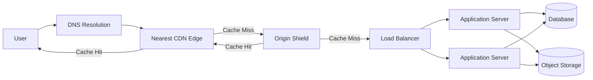
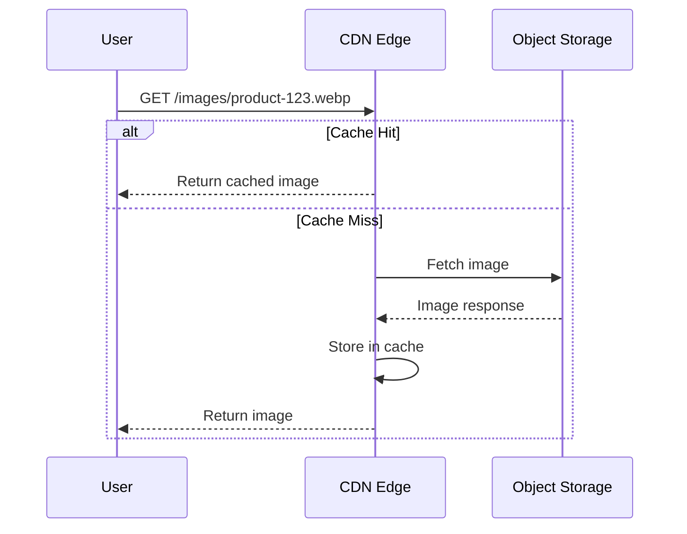
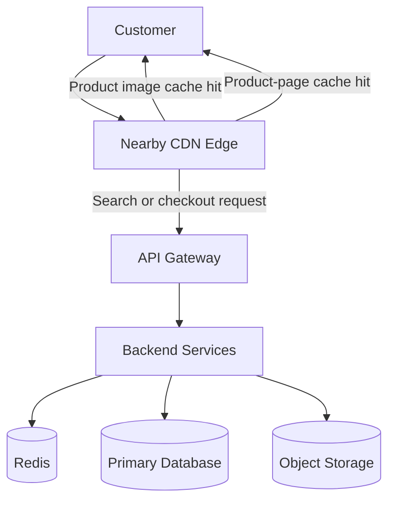

# Content Delivery Network (CDN)

A **Content Delivery Network**, or **CDN**, is a globally distributed network of servers that stores and delivers content from locations close to users.

Without a CDN, every user request must travel to the application's origin server.

With a CDN, frequently requested content is cached at nearby **edge servers**.

```text
Without CDN

User ───────────────────────> Origin Server
       Long network distance


With CDN

User ─────> Nearby CDN Edge ─────> Origin Server
              Cached content       Only when needed
```

CDNs commonly deliver:

* Images
* Videos
* JavaScript and CSS files
* Fonts
* Software downloads
* API responses
* HTML pages
* Live and on-demand streams

Popular CDN providers include Cloudflare, Amazon CloudFront, Akamai, Fastly, and Google Cloud CDN.

---

## Why CDN?

### 1. Lower Latency

Content is served from an edge server closer to the user, reducing network travel time.

### 2. Reduced Origin Load

Cached requests are handled by the CDN instead of reaching the backend.

```text
Without CDN:

1,000,000 requests → Origin Server


With a 90% cache hit ratio:

900,000 requests → CDN Cache
100,000 requests → Origin Server
```

### 3. Better Availability

Traffic is distributed across multiple edge locations. If one location becomes unavailable, requests can be routed to another.

### 4. Improved Scalability

A CDN absorbs traffic spikes without requiring the origin infrastructure to scale at the same rate.

### 5. Faster Global Delivery

Users in different countries receive content from nearby CDN points of presence.

### 6. Improved Security

Many CDN platforms provide:

* DDoS protection
* Web Application Firewalls
* TLS termination
* Bot management
* Rate limiting
* Origin IP protection

---

## Core Concepts

### Origin Server

The original source of the content.

The origin may be:

* An application server
* An object storage service
* A load balancer
* An API gateway
* A media server

---

### Edge Server

A CDN server located close to end users.

It stores cached content and responds to requests without contacting the origin whenever possible.

---

### Point of Presence

A **Point of Presence**, or **PoP**, is a physical location containing one or more CDN edge servers.

CDN providers operate PoPs across cities and regions around the world.

---

### Cache Hit

A cache hit occurs when the requested content already exists on the edge server.

```text
User → CDN Edge → Cached Response
```

Cache hits are fast and do not require communication with the origin.

---

### Cache Miss

A cache miss occurs when the requested content is not available at the edge.

```text
User
  ↓
CDN Edge
  ↓ Cache miss
Origin Server
  ↓
CDN stores response
  ↓
User receives response
```

The next request for the same content may become a cache hit.

---

### Cache Hit Ratio

The cache hit ratio measures how often requests are served from the CDN cache.

```text
Cache Hit Ratio =
Cache Hits / Total Cacheable Requests
```

A higher cache hit ratio generally means:

* Lower latency
* Reduced origin traffic
* Lower infrastructure cost
* Better scalability

---

### Time to Live

**Time to Live**, or **TTL**, defines how long an object can remain cached before it becomes stale.

```http
Cache-Control: public, max-age=3600
```

This response may be cached for one hour.

Longer TTLs improve cache efficiency but may delay content updates.

---

### Cache Invalidation

Cache invalidation removes or refreshes cached content before its TTL expires.

Common approaches include:

* Explicit CDN purge
* Versioned file names
* Cache-busting query parameters
* Short TTLs
* Revalidation with `ETag`
* Revalidation with `Last-Modified`

Example:

```text
Before update:
app.v1.js

After update:
app.v2.js
```

Versioned file names are usually safer than repeatedly purging the entire cache.

---

### Cache Key

A cache key determines whether two requests should use the same cached response.

It may include:

* Host
* URL path
* Query parameters
* Selected headers
* Cookies
* Device type
* Language

Example:

```text
https://example.com/products?page=2
```

Using too many cache-key values reduces cache reuse. Using too few may serve the wrong response to users.

---

### Anycast Routing

Many CDNs use **Anycast**, where multiple edge locations advertise the same IP address.

Internet routing sends the user to a nearby or reachable CDN location.

```text
                    ┌── Edge: Mumbai
User → CDN IP ──────┼── Edge: Singapore
                    └── Edge: Frankfurt
```

---

### Pull CDN

In a pull CDN, the edge fetches content from the origin when it receives a cache miss.

```text
Request → Edge → Origin → Cache → Response
```

This is the most common CDN model.

---

### Push CDN

In a push CDN, content is uploaded to the CDN before users request it.

It can be useful for:

* Large software downloads
* Pre-published media
* Predictable content releases

However, it requires more storage and content-management coordination.

---

### Origin Shield

An origin shield is an additional centralized caching layer between edge servers and the origin.

```text
Users
  ↓
Regional Edge Servers
  ↓
Origin Shield
  ↓
Origin Server
```

It prevents multiple edge locations from requesting the same missing object directly from the origin.

---

## Architecture

### High-Level Architecture



### Request Flow

1. The user requests a resource.
2. DNS routes the request to a nearby CDN edge.
3. The edge generates a cache key.
4. The edge checks its local cache.
5. On a cache hit, the edge immediately returns the content.
6. On a cache miss, the edge contacts the origin shield or origin.
7. The origin generates or retrieves the content.
8. The CDN stores the response according to its caching rules.
9. The CDN returns the response to the user.
10. Future users may receive the cached response directly from the edge.

---

## Static Content Delivery

Static files are the easiest CDN candidates.



Recommended static assets include:

* Images
* CSS
* JavaScript
* Fonts
* Videos
* Public documents
* Application bundles

---

## Dynamic Content Delivery

Dynamic responses can also benefit from a CDN, but they require more careful configuration.

Examples include:

* Product catalog pages
* Public API responses
* Search suggestions
* News feeds
* Location-based content

Dynamic acceleration may include:

* Optimized network routes
* TLS connection reuse
* Request collapsing
* HTTP/2 or HTTP/3
* Compression
* Edge computing
* Short-lived caching

Private or user-specific responses should not be publicly cached.

```http
Cache-Control: private, no-store
```

---

## Cache-Control Example

```http
HTTP/1.1 200 OK
Content-Type: image/webp
Cache-Control: public, max-age=3600, s-maxage=86400
ETag: "product-image-v12"
```

Meaning:

* Browsers may cache the response for one hour.
* Shared caches may store it for 24 hours.
* The `ETag` can be used for revalidation.

---

## Comparisons

### CDN vs Load Balancer

| CDN                                        | Load Balancer                                        |
| ------------------------------------------ | ---------------------------------------------------- |
| Operates near users                        | Usually operates near application servers            |
| Caches and delivers content                | Distributes requests across servers                  |
| Reduces global latency                     | Improves backend scalability                         |
| Protects the origin from repeated requests | Prevents one backend server from becoming overloaded |
| Often includes DDoS protection             | Often performs health checks                         |

A production system commonly uses both.

```text
User → CDN → Load Balancer → Application Servers
```

---

### CDN vs Reverse Proxy

| CDN                               | Reverse Proxy                         |
| --------------------------------- | ------------------------------------- |
| Globally distributed              | Often deployed in one region          |
| Optimized for edge delivery       | Optimized for backend routing         |
| Provides geographic caching       | Provides application-level proxying   |
| Usually managed by a CDN provider | Often managed by the application team |

A CDN is technically a distributed reverse-proxy system, but not every reverse proxy is a CDN.

---

### CDN vs Browser Cache

| CDN Cache                             | Browser Cache                          |
| ------------------------------------- | -------------------------------------- |
| Shared across many users              | Used by one browser                    |
| Stored on edge servers                | Stored on the user's device            |
| Reduces origin traffic globally       | Avoids repeated downloads for one user |
| Controlled through CDN and HTTP rules | Controlled mainly through HTTP headers |

Both layers can work together.

```text
Browser Cache → CDN Cache → Origin
```

---

### Pull CDN vs Push CDN

| Pull CDN                                | Push CDN                                |
| --------------------------------------- | --------------------------------------- |
| Fetches content after the first request | Content is uploaded in advance          |
| Easier to manage                        | Requires publishing workflows           |
| Best for frequently changing websites   | Useful for large, predictable files     |
| First request may be slower             | Content is already available at the CDN |

---

### CDN vs Multi-Region Deployment

| CDN                                 | Multi-Region Backend                            |
| ----------------------------------- | ----------------------------------------------- |
| Primarily improves content delivery | Runs application workloads in multiple regions  |
| Excellent for cacheable traffic     | Supports regional writes and dynamic processing |
| Simpler to operate                  | More complex data consistency                   |
| Reduces origin requests             | Reduces distance to backend computation         |

A CDN does not completely replace a multi-region architecture for highly dynamic applications.

---

## Real-World Example: Global E-Commerce Platform

Consider an e-commerce platform serving customers across multiple countries.

The platform provides:

* Product images
* Product pages
* Search APIs
* Shopping carts
* Checkout services
* User accounts

### Without a CDN

Every customer request reaches the primary backend region.

Possible problems:

* Slow image delivery for distant users
* High origin bandwidth usage
* Backend overload during sales
* Increased latency during traffic spikes
* Greater exposure to DDoS attacks

### With a CDN



### Suggested Caching Strategy

| Content            | Caching Strategy                            |
| ------------------ | ------------------------------------------- |
| Product images     | Cache for days or weeks with versioned URLs |
| CSS and JavaScript | Long TTL with content-hashed filenames      |
| Product details    | Cache for a few minutes                     |
| Search suggestions | Cache for seconds or minutes                |
| Inventory count    | Short TTL or no cache                       |
| Shopping cart      | Private cache or no shared cache            |
| Checkout response  | Never cache publicly                        |
| User profile       | Private cache only                          |

### During a Flash Sale

Suppose one million users request the same product page.

Without caching:

```text
1,000,000 requests → Backend
```

With an effective CDN strategy:

```text
Most requests → CDN Edge
Small remaining portion → Backend
```

The CDN protects the backend while providing faster responses to users.

---

## Best Practices

### Use Versioned Asset URLs

Use content hashes or version identifiers.

```text
/assets/app.a84f92.js
/assets/styles.3bc102.css
```

These files can safely use long TTLs because a new deployment creates a new URL.

---

### Choose TTLs by Content Type

Do not use the same TTL for every resource.

```text
Images and fonts       → Long TTL
JavaScript and CSS     → Long TTL with versioned URLs
Public API responses   → Short or moderate TTL
Inventory              → Very short TTL
User-specific data     → Private or no shared caching
```

---

### Protect the Origin

Configure the origin to accept traffic only from trusted CDN networks when possible.

This prevents attackers from bypassing CDN security controls and directly targeting the origin.

---

### Minimize the Cache Key

Only include request attributes that truly change the response.

Avoid unnecessary variation based on:

* Tracking query parameters
* Unused cookies
* Irrelevant headers
* Random identifiers

A smaller cache-key space usually improves the cache hit ratio.

---

### Normalize Query Parameters

These URLs may return the same content:

```text
/products?id=10&utm_source=email
/products?utm_source=email&id=10
/products?id=10
```

Remove or ignore tracking parameters when they do not affect the response.

---

### Use an Origin Shield

An origin shield is valuable when many edge locations request the same uncached content.

It reduces:

* Duplicate origin requests
* Database load
* Network traffic
* Cache stampedes

---

### Enable Compression

Use Brotli or Gzip for text-based assets such as:

* HTML
* CSS
* JavaScript
* JSON
* SVG

Avoid recompressing formats that are already compressed, such as JPEG or MP4.

---

### Support Modern Protocols

Use HTTP/2 or HTTP/3 when available.

Potential benefits include:

* Multiplexing
* Reduced connection overhead
* Better performance on unreliable networks
* Faster connection establishment

---

### Monitor CDN Metrics

Important metrics include:

* Cache hit ratio
* Cache miss ratio
* Origin request rate
* Edge latency
* Origin latency
* Error rate
* Bandwidth usage
* Eviction rate
* Requests by region
* HTTP status-code distribution

---

### Use Stale Content Carefully

Serving slightly stale content may be better than returning an error when the origin is unavailable.

```http
Cache-Control: public, max-age=60, stale-while-revalidate=300
```

The CDN may serve stale content while refreshing it in the background.

For some content, `stale-if-error` can also improve resilience.

Avoid this strategy for highly sensitive information such as account balances or rapidly changing authorization data.

---

### Prevent Cache Stampedes

A cache stampede occurs when a popular cached object expires and many requests reach the origin at once.

Mitigation techniques include:

* Request coalescing
* Origin shielding
* TTL jitter
* Background refresh
* Stale-while-revalidate
* Distributed locking

---

### Test Cache Behavior

Verify:

* Which responses are cached
* How cache keys are generated
* Whether private data can leak
* How invalidation behaves
* What happens during origin failure
* Whether error responses are cached
* Whether query parameters affect caching

---

## Common Mistakes

### 1. Caching Private User Data

A dangerous configuration may cause one user's response to be served to another user.

Never publicly cache content containing:

* Authentication tokens
* Personal information
* Shopping-cart data
* Private account details
* Payment information

---

### 2. Using One TTL for Everything

Static assets and real-time inventory have different freshness requirements.

Treat caching as a content-specific design decision.

---

### 3. Including Every Cookie in the Cache Key

Analytics and session cookies can create millions of cache variations.

This destroys cache efficiency and increases origin traffic.

---

### 4. Purging the Entire CDN Frequently

Large cache purges can cause sudden origin traffic spikes.

Prefer:

* Versioned URLs
* Targeted invalidation
* Background refresh
* Controlled TTLs

---

### 5. Leaving the Origin Publicly Accessible

Attackers may bypass the CDN and send traffic directly to the backend.

Use firewall rules, signed requests, private networking, or CDN-specific origin authentication where available.

---

### 6. Caching Error Responses for Too Long

Caching a temporary `500` or `404` response can extend an incident.

Use carefully selected error-cache TTLs.

---

### 7. Ignoring Cache Stampedes

A popular object expiring across multiple locations can overwhelm the origin.

Use request collapsing, TTL jitter, origin shielding, or stale responses.

---

### 8. Assuming the CDN Solves Every Scaling Problem

A CDN is most effective for cacheable or network-heavy workloads.

It does not automatically solve:

* Slow database queries
* Poor application logic
* Database write bottlenecks
* Data consistency challenges
* Inefficient service communication

---

### 9. Not Measuring Cache Effectiveness

A CDN configuration should be validated with real metrics.

A low cache hit ratio may indicate:

* Poor cache keys
* Short TTLs
* Excessive cookies
* Highly fragmented URLs
* Frequent invalidations

---

## Interview Questions

### 1. What happens when a CDN receives a request?

The CDN routes the request to a nearby edge server. The edge checks its cache and returns the cached content on a hit. On a miss, it fetches the content from the origin, caches it according to the configured policy, and returns it to the user.

---

### 2. What is the difference between a cache hit and a cache miss?

A cache hit means the requested content is available at the CDN edge. A cache miss means the edge must retrieve it from another cache layer or the origin.

---

### 3. How do you update content that has already been cached?

Common methods include versioned URLs, cache invalidation, short TTLs, `ETag` revalidation, and `Last-Modified` headers. Versioned URLs are usually preferred for static assets.

---

### 4. How can a CDN accidentally leak user data?

A leak can occur when user-specific responses are stored in a shared cache without the correct cache key or privacy headers. Private responses should use `private` or `no-store`, and authentication-related values must be handled carefully.

---

### 5. How would you handle a popular object expiring during a traffic spike?

Use request coalescing, origin shielding, TTL jitter, background refresh, and stale-while-revalidate. These techniques prevent thousands of simultaneous requests from reaching the origin.

---

## Key Takeaways

### 1. A CDN moves content closer to users

This reduces latency and improves the experience for geographically distributed users.

### 2. Good caching requires deliberate design

TTL values, cache keys, invalidation rules, privacy controls, and freshness requirements must be selected carefully.

### 3. A CDN protects the backend but does not replace it

CDNs reduce origin traffic and absorb spikes, but backend services, databases, and APIs must still be designed for reliability and scale.

---

## Final Architecture Summary

```text
User
  ↓
DNS
  ↓
Nearest CDN Edge
  ├── Cache Hit  → Fast response
  │
  └── Cache Miss
          ↓
     Origin Shield
          ↓
     Load Balancer
          ↓
   Application Servers
          ↓
  Cache / Database / Storage
```

> The best CDN design is not the one that caches everything. It is the one that delivers the right content quickly without sacrificing correctness, freshness, security, or user privacy.

---

⭐ Star this repository if this guide helped you understand CDN system design.

👀 Follow the repository for more practical backend architecture and system design guides.
