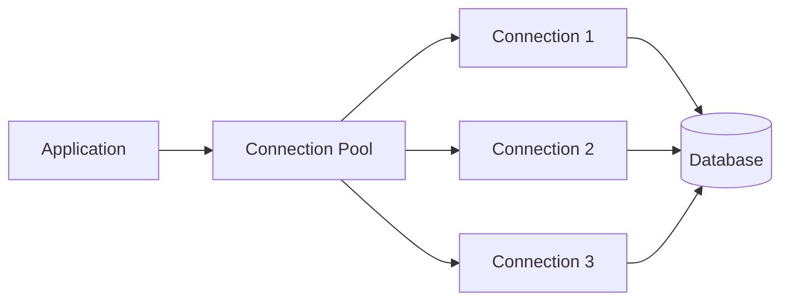
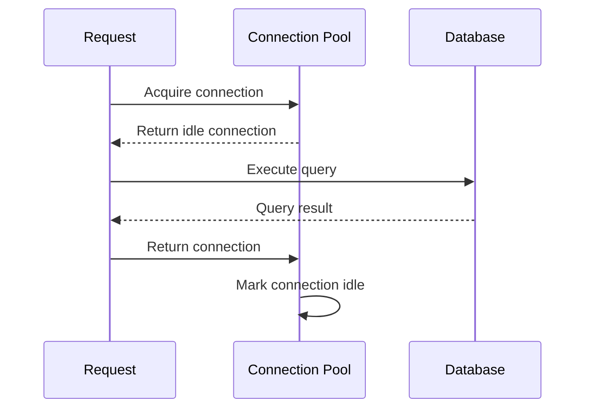
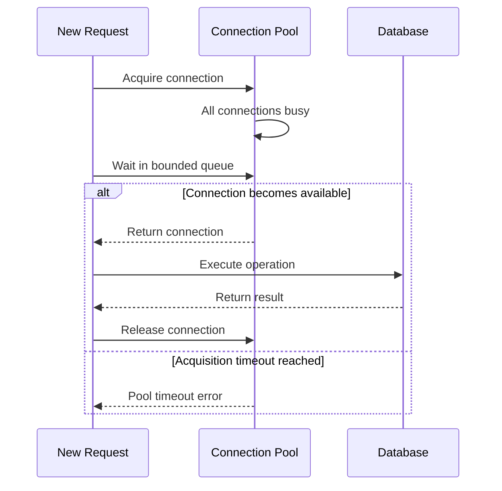
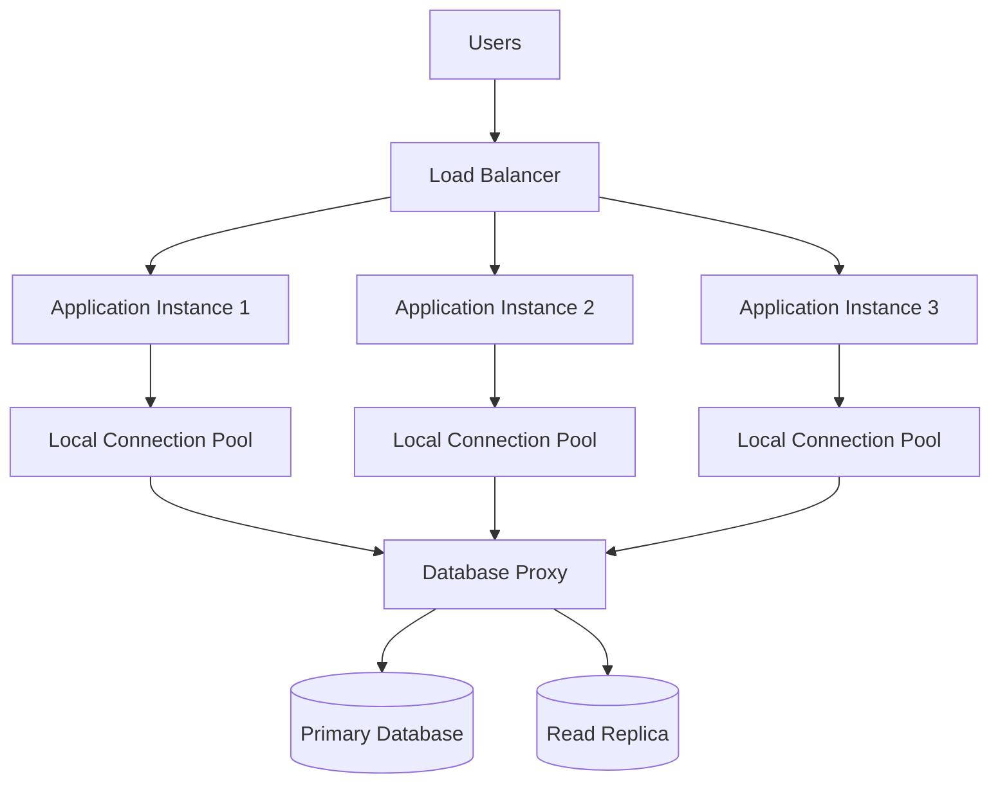
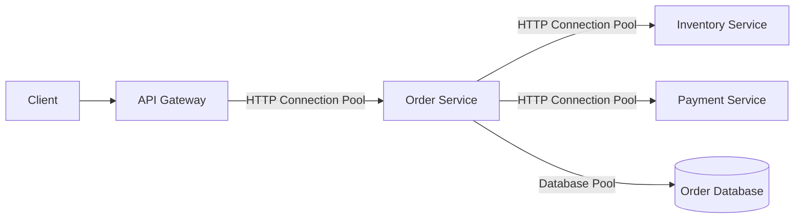
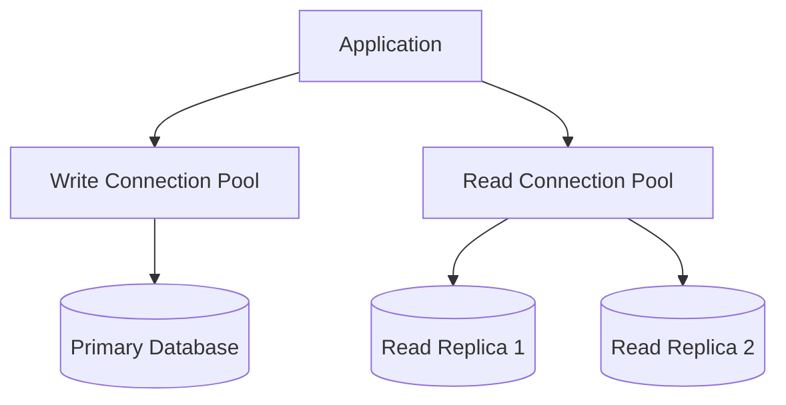
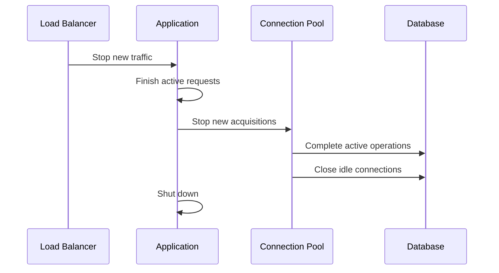
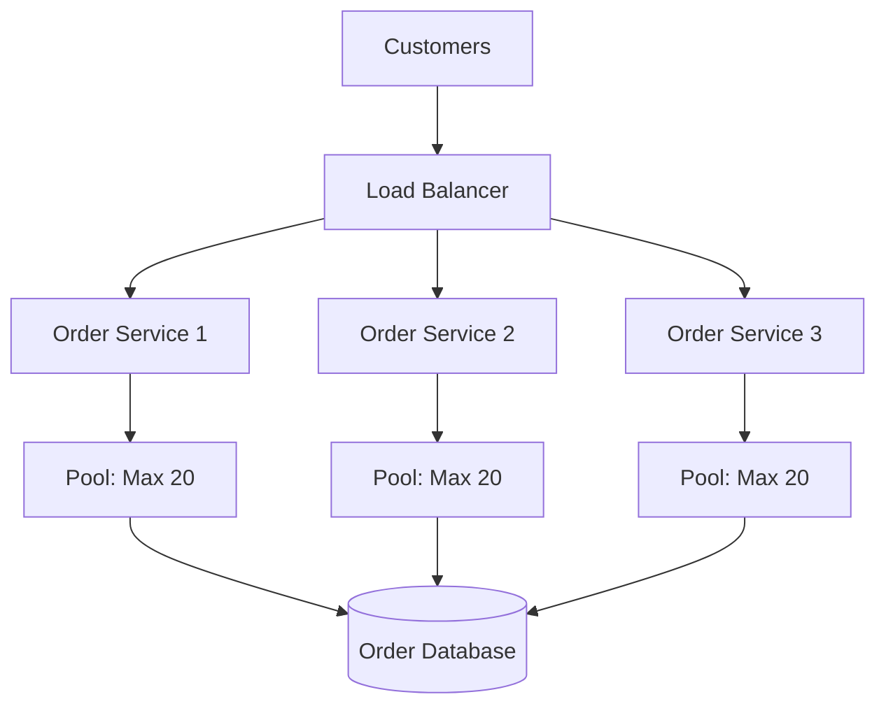
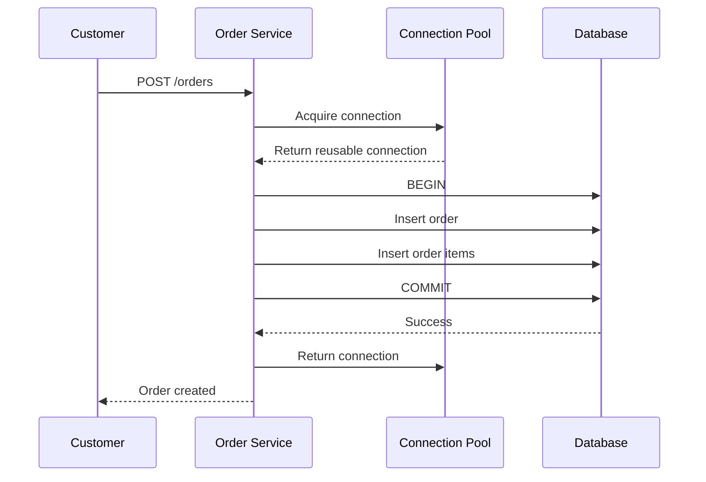

# Connection Pooling

**Connection pooling** keeps a reusable collection of open connections instead of creating a new connection for every request.

```text
Without Connection Pooling:

Request → Open Connection → Authenticate → Execute → Close
Request → Open Connection → Authenticate → Execute → Close
Request → Open Connection → Authenticate → Execute → Close


With Connection Pooling:

Application
    ↓
Connection Pool
    ├── Reuse Connection 1
    ├── Reuse Connection 2
    └── Reuse Connection 3
```

Connection pooling is commonly used between:

* Applications and databases
* Microservices and internal APIs
* API Gateways and backend services
* Applications and message brokers
* Applications and cache servers
* Reverse proxies and upstream servers
* Backend systems and external APIs

The goal is simple:

> Reuse a controlled number of healthy connections instead of repeatedly creating expensive new ones.

---

## Core Concepts

### What Is a Connection?

A connection is a communication channel between two systems.

Examples include:

```text
Application ↔ Database
Service A ↔ Service B
API Gateway ↔ Backend
Producer ↔ Message Broker
```

Creating a connection may require:

1. DNS resolution
2. TCP handshake
3. TLS handshake
4. Authentication
5. Session initialization
6. Resource allocation

Repeating these steps for every request adds latency and consumes CPU, memory, sockets, and network resources.

---

### What Is a Connection Pool?

A connection pool maintains a bounded collection of reusable connections.

```text
Connection Pool
├── Connection 1 → In Use
├── Connection 2 → Idle
├── Connection 3 → In Use
└── Connection 4 → Idle
```

When the application needs a connection:

1. It requests one from the pool.
2. The pool returns an available connection.
3. The application performs its operation.
4. The connection is returned to the pool.
5. Another request can reuse it.

The connection is not closed after every operation unless it is expired, broken, or no longer needed.

---

### Connection Lifecycle

A pooled connection usually moves through several states.

```text
Created
   ↓
Idle
   ↓
Borrowed
   ↓
In Use
   ↓
Returned
   ↓
Idle
   ↓
Expired or Closed
```

A connection may be removed when:

* It becomes unhealthy
* Its idle timeout expires
* Its maximum lifetime is reached
* The remote server closes it
* Authentication expires
* The pool shuts down
* A network error occurs

---

### Minimum Pool Size

The minimum pool size defines how many connections the pool tries to keep ready.

```text
Minimum Pool Size: 5

Even during low traffic:
5 connections remain available
```

Benefits include:

* Lower latency for sudden requests
* Fewer connection-creation spikes
* Faster application warm-up

A large minimum may waste database or downstream capacity during quiet periods.

---

### Maximum Pool Size

The maximum pool size limits how many connections one application instance can create.

```text
Maximum Pool Size: 20
```

When all 20 connections are busy, additional requests must:

* Wait
* Time out
* Fail
* Use backpressure

A maximum protects the downstream system from unlimited connection growth.

---

### Pool-Wait Queue

When no connection is available, requests may wait in a queue.

```text
Incoming Requests
       ↓
Pool Wait Queue
       ↓
Available Connection
```

Important queue settings include:

* Maximum wait time
* Maximum queue length
* Request priority
* Cancellation behavior

An unlimited queue can hide overload until latency becomes unacceptable.

---

### Acquisition Timeout

The acquisition timeout defines how long a request can wait for a connection.

```text
Request asks for connection
          ↓
Wait up to 500 ms
          ↓
Connection available → Continue
No connection         → Fail fast
```

This is different from the query or request timeout.

A request may successfully obtain a connection and still time out while using it.

---

### Idle Connection

An idle connection is open but not currently serving a request.

```text
Open Connection
      ↓
No active operation
      ↓
Available for reuse
```

Idle connections improve response time but still consume:

* File descriptors
* Server-side connection slots
* Memory
* Network state
* Authentication sessions

The pool should retain enough idle connections for expected traffic without holding unnecessary capacity.

---

### Idle Timeout

The idle timeout defines how long an unused connection remains in the pool.

```text
Connection returned
       ↓
Idle for configured period
       ↓
Connection closed
```

A timeout that is too short causes connection churn.

A timeout that is too long may retain unnecessary or stale connections.

---

### Maximum Connection Lifetime

Maximum lifetime limits the total age of a connection, even if it remains active or frequently reused.

```text
Connection created
       ↓
Used many times
       ↓
Maximum lifetime reached
       ↓
Retire after current operation
```

This helps:

* Refresh DNS changes
* Rotate credentials
* Distribute traffic across new servers
* Replace stale network paths
* Reduce long-lived connection problems
* Support certificate rotation

Use slight randomization, or jitter, so every connection does not expire simultaneously.

---

### Connection Validation

A connection may appear available but no longer be usable.

Possible causes include:

* Database restart
* Firewall timeout
* Load balancer timeout
* Network interruption
* Credential expiration
* Server-side idle timeout

Validation strategies include:

* Lightweight health query
* Socket check
* Protocol ping
* Validation on checkout
* Background validation

Example database validation:

```sql
SELECT 1;
```

Validation should be reliable but inexpensive.

---

### Stale Connection

A stale connection exists in the pool but has already been closed or invalidated by the remote system.

```text
Pool:
Connection appears open

Database:
Connection already closed
```

The next operation may fail with:

* Connection reset
* Broken pipe
* Unexpected EOF
* Session closed
* Network error

The pool should discard stale connections and create replacements when appropriate.

---

### Connection Leak

A connection leak occurs when application code borrows a connection but never returns it.

```text
Pool Size: 10

Request 1 borrows connection → Never returns it
Request 2 borrows connection → Never returns it
...
Pool eventually exhausted
```

Symptoms include:

* Increasing pool usage
* Requests waiting for connections
* Acquisition timeouts
* Low database activity despite pool exhaustion
* Application latency spikes

Connections should always be released in guaranteed cleanup logic.

---

### Database Session State

A database connection may retain session-specific state.

Examples include:

* Open transactions
* Temporary tables
* Session variables
* Selected schema
* Isolation level
* Prepared statements
* Role changes

Before returning a connection to the pool, the application or pool should restore it to a safe state.

```text
Borrow Connection
      ↓
Begin Transaction
      ↓
Execute Queries
      ↓
Commit or Roll Back
      ↓
Reset State
      ↓
Return to Pool
```

---

### Transaction Boundaries

A transaction should normally remain on the same database connection.

```text
BEGIN
  ↓
Query 1
  ↓
Query 2
  ↓
COMMIT
```

Returning the connection before the transaction finishes may cause incorrect behavior.

Leaving a transaction open while waiting on external systems can hold locks and consume pool capacity.

---

### Prepared Statement Caching

Some pools, drivers, or databases cache prepared statements per connection.

```text
Connection 1
├── Prepared Statement A
└── Prepared Statement B
```

This can improve repeated-query performance but may increase memory usage.

Prepared-statement settings should be tested against the database and driver behavior.

---

### Pool Sizing

A pool should support expected concurrency without overwhelming the downstream service.

A useful starting relationship is:

```text
Estimated concurrency
≈ Request rate × Average operation duration
```

Example:

```text
Database operations: 500 per second
Average operation time: 0.02 seconds

Estimated concurrency:
500 × 0.02 = 10
```

This does not mean the correct pool size is always exactly 10.

Also consider:

* Traffic spikes
* Slow queries
* Transactions
* Replicas
* Retry behavior
* Read and write workloads
* Database connection limits
* Other applications sharing the database

---

### Fleet-Wide Connection Count

Pool size is usually configured per application instance.

```text
50 application instances
× 20 connections each
= 1,000 possible database connections
```

A pool size that is safe for one instance may overload the database when multiplied across the fleet.

Always calculate:

```text
Total Possible Connections
=
Application Instances
× Maximum Pool Size per Instance
```

Include:

* Background workers
* Administrative tools
* Batch jobs
* Monitoring systems
* Migration processes
* Failover environments

---

### Backpressure

Backpressure prevents an overloaded downstream system from receiving unlimited work.

A bounded pool naturally provides a form of backpressure.

```text
Application traffic increases
          ↓
Pool reaches capacity
          ↓
Requests wait or fail
          ↓
Database avoids unlimited connections
```

Failing quickly can be safer than allowing a huge queue to grow.

---

### Pool Warm-Up

A new application instance may create connections gradually or establish them during startup.

```text
Application starts
      ↓
Create initial connections
      ↓
Validate connections
      ↓
Mark instance ready
```

Warm-up reduces latency for the first requests.

However, many instances starting together can create a connection storm.

---

### Connection Storm

A connection storm occurs when many clients create connections simultaneously.

Common causes include:

* Application deployment
* Database restart
* Regional failover
* Autoscaling event
* Expiring all connections at once
* Pool misconfiguration

```text
100 application instances restart
× 50 connections
= 5,000 new connection attempts
```

Mitigation techniques include:

* Gradual startup
* Connection creation limits
* Exponential backoff
* Jitter
* Minimum-pool warm-up
* Database proxies
* Staggered deployments

---

### Connection Pooling Proxy

A connection-pooling proxy sits between applications and a database or service.

```text
Applications
     ↓
Pooling Proxy
     ↓
Database
```

The proxy may accept many client connections while maintaining fewer backend connections.

Benefits include:

* Centralized pooling
* Better connection reuse
* Protection from connection spikes
* Simplified failover
* Reduced database connection pressure

The proxy also adds another component that must be monitored and made highly available.

---

## Architecture

### Basic Connection Pool Architecture



The application borrows connections from the pool instead of opening them directly.

---

### Request Flow



The connection remains available for future requests.

---

### Pool Exhaustion Flow



A bounded wait protects the system from indefinite queue growth.

---

### Production Database Architecture



This architecture provides two pooling layers:

```text
Application-Level Pools
          ↓
Database Proxy Pool
          ↓
Database Connections
```

Multiple pooling layers should be configured carefully to avoid excessive queuing and hidden bottlenecks.

---

### Microservices Connection Pooling



Each network hop can maintain its own pool.

Poor settings at one layer can affect the entire request path.

---

### Read and Write Pool Architecture



Separate pools can isolate:

* Read traffic
* Write traffic
* Reporting queries
* Administrative operations
* Background jobs

This prevents one workload from consuming all connections.

---

### Graceful Shutdown Flow



A graceful shutdown prevents active database operations from being interrupted.

---

## Comparisons

### Connection Pooling vs Opening a New Connection

| Connection Pooling                    | New Connection per Operation      |
| ------------------------------------- | --------------------------------- |
| Reuses existing connections           | Creates a connection every time   |
| Lower latency                         | Repeats setup latency             |
| Lower authentication overhead         | Repeats authentication            |
| Bounded resource use                  | Can create connection spikes      |
| Requires lifecycle management         | Simpler individual operation flow |
| Can suffer leaks or stale connections | Produces higher connection churn  |

Pooling is usually preferred for repeated communication with the same destination.

---

### Connection Pooling vs Keep-Alive

| Connection Pooling                      | Keep-Alive                                     |
| --------------------------------------- | ---------------------------------------------- |
| Manages multiple reusable connections   | Keeps an individual connection open            |
| Includes limits, queues, and lifetimes  | Describes connection persistence               |
| Common for databases and HTTP clients   | Common for HTTP and TCP communication          |
| Controls concurrency                    | Reduces repeated connection setup              |
| May contain many keep-alive connections | Does not automatically provide pool management |

Keep-alive is a connection behavior. Connection pooling is a resource-management strategy.

---

### Application Pool vs Database Proxy

| Application-Level Pool                           | Database Pooling Proxy                  |
| ------------------------------------------------ | --------------------------------------- |
| Runs inside each application instance            | Runs as shared infrastructure           |
| Low network overhead                             | Adds an extra network hop               |
| Configuration is distributed                     | Configuration is centralized            |
| Total connections grow with application replicas | Can reduce backend database connections |
| Application owns pooling behavior                | Proxy manages database connections      |

Many large systems use both, but their limits must be coordinated.

---

### Fixed Pool vs Elastic Pool

| Fixed Pool                              | Elastic Pool                         |
| --------------------------------------- | ------------------------------------ |
| Maintains a stable connection count     | Grows and shrinks within limits      |
| Predictable database load               | Adapts to traffic                    |
| May waste capacity during quiet periods | May create connections during spikes |
| Easier capacity planning                | Requires careful scaling controls    |

Most production pools are bounded and elastic between minimum and maximum sizes.

---

### Small Pool vs Large Pool

| Small Pool                    | Large Pool                        |
| ----------------------------- | --------------------------------- |
| Protects downstream resources | Supports more concurrency         |
| May cause requests to wait    | Can overwhelm the database        |
| Easier to control             | Uses more memory and connections  |
| Encourages backpressure       | May hide slow queries temporarily |

A larger pool does not automatically improve throughput.

If the database is CPU-bound or lock-bound, more connections may make performance worse.

---

### Local Pool vs Shared Pool

| Local Pool                                   | Shared Pool                             |
| -------------------------------------------- | --------------------------------------- |
| One pool per application instance            | Shared across multiple clients          |
| Fast local access                            | Better global connection control        |
| Scales with application replicas             | Adds infrastructure dependency          |
| Simple failure isolation                     | Centralized observability               |
| Can create high fleet-wide connection counts | Can reduce database connection pressure |

---

### Connection Pooling vs Caching

| Connection Pooling            | Caching                               |
| ----------------------------- | ------------------------------------- |
| Reuses communication channels | Reuses previously computed data       |
| Reduces connection setup cost | Avoids backend work                   |
| Does not eliminate queries    | May eliminate repeated queries        |
| Improves resource efficiency  | Improves response latency             |
| Protects connection capacity  | Protects compute and storage capacity |

These patterns solve different problems and are often used together.

---

## Real-World Example: E-Commerce Checkout

Consider an e-commerce platform with:

* Product service
* Cart service
* Order service
* Inventory service
* Payment service
* PostgreSQL database

Each Order service instance handles many simultaneous requests.

---

### Without Connection Pooling

Every operation opens a new database connection.

```text
Create Order Request
      ↓
Open Database Connection
      ↓
Authenticate
      ↓
Execute Queries
      ↓
Close Connection
```

During a traffic spike:

```text
2,000 requests per second
≈ Thousands of connection attempts
```

Possible results include:

* High authentication overhead
* Increased latency
* Database CPU spikes
* Exhausted connection limits
* Failed checkouts
* Increased memory usage
* Connection storms

---

### With Connection Pooling



The database receives at most approximately:

```text
3 application instances
× 20 connections
= 60 application connections
```

The exact total may also include monitoring, migrations, administrators, and background workers.

---

### Order Creation Flow



The connection returns to the pool only after the transaction is complete.

---

### Slow Query Scenario

Suppose a reporting query holds ten connections for 30 seconds.

```text
Pool Size: 20

10 connections → Slow reporting queries
10 connections → Normal checkout traffic
```

Another small traffic spike may exhaust the pool.

A safer design uses separate pools:

```text
Checkout Pool  → Short transactional queries
Reporting Pool → Long analytical queries
```

This isolates critical user traffic from heavy reporting workloads.

---

### Autoscaling Scenario

Assume each instance has a maximum pool size of 30.

```text
Normal:
5 instances × 30 = 150 connections

Traffic spike:
20 instances × 30 = 600 connections
```

Autoscaling the application may accidentally overload the database.

Application autoscaling and database connection capacity must be designed together.

Possible solutions include:

* Smaller per-instance pools
* Database proxy
* Maximum replica limits
* Read replicas
* Query optimization
* Backpressure
* Asynchronous processing

---

### Connection Leak Scenario

A code path forgets to release connections after an error.

```text
Pool Maximum: 20

Every failed request leaks one connection
        ↓
Available connections decrease
        ↓
Pool reaches zero
        ↓
All new orders time out
```

The database may appear healthy because the issue exists inside the application.

Leak detection and acquisition-time metrics make this easier to diagnose.

---

### Failover Scenario

The primary database fails and a new primary is promoted.

Existing pooled connections may still point to the old server.

The pool should:

1. Detect failed connections.
2. Stop returning them to callers.
3. Refresh service discovery or DNS.
4. Create connections to the new primary.
5. Apply backoff to avoid a reconnection storm.
6. Resume traffic gradually.

---

## Best Practices

### 1. Use a Bounded Pool

Always define a maximum connection count.

An unlimited pool can overwhelm:

* Databases
* Cache servers
* Message brokers
* External APIs
* NAT gateways
* Operating-system socket limits

A bounded pool creates predictable resource usage.

---

### 2. Size the Pool from Real Workload Data

Measure:

* Request rate
* Query latency
* Transaction duration
* Peak concurrency
* Database capacity
* Number of application replicas
* Background workload

Do not copy a pool size from another system without testing.

---

### 3. Calculate Fleet-Wide Connections

Always multiply the per-instance maximum by the maximum application replica count.

```text
Maximum replicas: 40
Pool size: 25

Potential application connections:
40 × 25 = 1,000
```

Leave database capacity for:

* Administrators
* Migrations
* Monitoring
* Failover operations
* Background jobs
* Maintenance tools

---

### 4. Keep Transactions Short

Do not hold a database connection while:

* Calling an external API
* Waiting for user input
* Performing slow file operations
* Sending email
* Running unrelated computation

Preferred flow:

```text
Perform external work
        ↓
Acquire database connection
        ↓
Execute short transaction
        ↓
Release connection
```

---

### 5. Release Connections Reliably

Use language features that guarantee cleanup.

Examples include:

* `try/finally`
* Context managers
* `defer`
* `using`
* Framework-managed transactions

Every successful acquisition should have a guaranteed release path.

---

### 6. Set an Acquisition Timeout

Do not let requests wait forever for a connection.

A bounded timeout provides:

* Faster failure detection
* Better backpressure
* Predictable latency
* Easier alerting

Return a controlled error when the pool is exhausted.

---

### 7. Set Idle and Maximum Lifetimes

Use both:

* **Idle timeout** to remove unused connections
* **Maximum lifetime** to refresh old connections

Add jitter so large groups of connections do not expire together.

---

### 8. Align Timeouts Across Layers

Review:

```text
Application Pool
      ↓
Database Proxy
      ↓
Load Balancer or Network
      ↓
Database
```

The client pool should not assume a connection remains valid longer than the infrastructure allows.

---

### 9. Validate Connections Carefully

Validation should catch stale connections without adding expensive work to every acquisition.

Possible strategies include:

* Validation after idle periods
* Background health checks
* Driver-level socket checks
* Lightweight protocol pings

Measure the cost before enabling aggressive validation.

---

### 10. Reset Connection State

Before returning a connection to the pool:

* Commit or roll back transactions
* Reset session variables
* Restore isolation settings
* Clear temporary state
* Release locks
* Consume pending results

A connection should be safe for the next borrower.

---

### 11. Use Separate Pools for Different Workloads

Consider dedicated pools for:

* User-facing requests
* Background jobs
* Reporting
* Administrative tasks
* Read replicas
* Primary database writes

Isolation prevents one workload from exhausting all connections.

---

### 12. Add Backpressure

When the pool is saturated:

* Bound the waiting queue
* Reject excess work
* Slow producers
* Shed low-priority requests
* Use asynchronous processing where appropriate

Do not allow unlimited waiting requests to consume application memory.

---

### 13. Prevent Connection Storms

Use:

* Gradual pool warm-up
* Exponential reconnect backoff
* Jitter
* Staggered deployments
* Controlled autoscaling
* Database proxies
* Maximum connection-creation rates

This is especially important after database recovery.

---

### 14. Monitor Pool Metrics

Important metrics include:

* Active connections
* Idle connections
* Maximum connections
* Pending acquisition requests
* Acquisition latency
* Acquisition timeout count
* Connection creation rate
* Connection close rate
* Connection age
* Connection errors
* Leak detections
* Query duration
* Transaction duration

Pool saturation should trigger alerts before users experience widespread failures.

---

### 15. Monitor Database Metrics Too

A healthy-looking pool does not guarantee a healthy database.

Monitor:

* Database CPU
* Memory
* Active sessions
* Lock waits
* Query latency
* Transaction rate
* Disk I/O
* Replication lag
* Connection limit usage

Pool and database metrics should be analyzed together.

---

### 16. Use Graceful Shutdown

During deployment:

1. Stop new traffic.
2. Stop new connection acquisitions.
3. Complete active operations.
4. Return or close borrowed connections.
5. Close idle connections.
6. Shut down after a deadline.

This prevents interrupted transactions and abandoned connections.

---

### 17. Test Under Peak Load

Load tests should include:

* Maximum application replicas
* Slow queries
* Pool exhaustion
* Database failover
* Connection loss
* Rolling deployment
* Sudden traffic spikes
* Recovery after outage

Average traffic tests are not enough.

---

### 18. Use a Database Proxy When It Solves a Real Constraint

A database proxy may help when:

* Applications scale to many replicas
* Database connection limits are low
* Connections are expensive
* Serverless workloads create bursts
* Failover must be centralized

Do not add a proxy without planning for its availability, latency, capacity, and failure modes.

---

## Common Mistakes

### 1. Making the Pool Too Large

A large pool may increase database contention instead of improving throughput.

More connections can create:

* Higher context switching
* More lock contention
* Greater memory usage
* Larger transaction queues
* Increased database CPU

Tune the system as a whole, not only the application.

---

### 2. Making the Pool Too Small

A very small pool causes requests to wait even when the database has spare capacity.

Monitor acquisition latency and queue length before increasing the size.

---

### 3. Ignoring the Number of Application Replicas

Per-instance settings multiply during autoscaling.

A safe pool for five instances may be unsafe for fifty.

---

### 4. Forgetting to Return Connections

Connection leaks eventually exhaust the pool.

Every acquisition must have a guaranteed cleanup path.

---

### 5. Returning a Connection with an Open Transaction

The next request may inherit locks, isolation state, or uncommitted work.

Always commit or roll back before release.

---

### 6. Holding Connections During External Calls

A service that holds a database connection while calling a slow payment provider wastes pool capacity.

Acquire connections only when database work is ready to begin.

---

### 7. Using Unlimited Wait Times

Requests may wait indefinitely while application memory and latency continue growing.

Use bounded acquisition timeouts and queues.

---

### 8. Treating Pool Exhaustion as the Root Cause

Pool exhaustion is often a symptom of:

* Slow queries
* Lock contention
* Connection leaks
* Downstream failure
* Long transactions
* Traffic spikes
* Incorrect pool sizing

Increasing the pool may hide the issue temporarily.

---

### 9. Expiring Every Connection at the Same Time

Simultaneous expiration creates a reconnect spike.

Use lifetime jitter.

---

### 10. Ignoring Stale Connections

Firewalls, proxies, and databases may close idle connections.

Pools must detect and replace invalid connections safely.

---

### 11. Retrying Without Backoff

When the database recovers, every application instance may reconnect immediately.

Use exponential backoff and jitter to prevent a connection storm.

---

### 12. Creating a New Pool per Request

A connection pool should usually be a long-lived shared application component.

Creating one for every request defeats pooling and increases connection churn.

---

### 13. Sharing One Connection Across Concurrent Operations

Many database connections are not designed for unsafe concurrent use.

Borrow separate pooled connections unless the driver explicitly supports multiplexing.

---

### 14. Mixing Critical and Non-Critical Workloads

Long-running reports can consume connections needed for login, checkout, or payment operations.

Use workload isolation.

---

### 15. Assuming Pooling Fixes Slow Queries

Connection pooling reduces setup overhead.

It does not fix:

* Missing indexes
* Poor query plans
* Large table scans
* Lock contention
* Incorrect schema design
* Slow storage

Query optimization remains essential.

---

### 16. Adding Multiple Pooling Layers Without Coordination

Application pools, proxies, drivers, and database middleware may all queue work.

```text
Application Queue
      ↓
Local Connection Pool
      ↓
Proxy Queue
      ↓
Database Queue
```

This can create high latency and make failures harder to diagnose.

---

## Interview Questions

### 1. What is connection pooling?

Connection pooling maintains a reusable set of open connections so applications do not need to establish a new connection for every operation.

---

### 2. Why can a very large connection pool reduce performance?

Too many connections can increase database memory usage, context switching, lock contention, and query competition, making the database slower.

---

### 3. What happens when a connection pool is exhausted?

New requests wait for a connection, time out, or fail according to the pool's queue and acquisition-timeout configuration.

---

### 4. What is a connection leak?

A connection leak occurs when code borrows a connection but fails to return it, gradually reducing the number of connections available in the pool.

---

### 5. How should connection-pool size be calculated in a scaled system?

Estimate required concurrency, test against database capacity, and multiply the per-instance pool size by the maximum number of application instances to determine the fleet-wide connection count.

---

## Key Takeaways

### 1. Connection pooling reduces expensive setup work

Reusing established connections lowers latency, authentication overhead, CPU usage, and connection churn.

### 2. Pool limits protect downstream systems

Maximum size, acquisition timeouts, bounded queues, and backpressure prevent applications from creating unlimited connections.

### 3. Pool sizing is a system-wide decision

Application replicas, query duration, transaction behavior, database limits, autoscaling, and failure recovery must all be considered together.

---

## Final Architecture Summary

```text
Clients
   ↓
Load Balancer
   ↓
Application Instances
   ├── Bounded Connection Pools
   ├── Acquisition Timeouts
   ├── Idle Connection Management
   ├── Maximum Connection Lifetime
   ├── Leak Detection
   └── Graceful Shutdown
            ↓
      Database Proxy
            ↓
 Primary Database / Read Replicas
```

> Connection pooling is not simply a performance optimization. It is a resource-control mechanism that determines how safely an application shares limited downstream capacity.

---

⭐ **Star this repository** if this guide made connection pooling easier to understand.

👀 **Follow for more practical backend architecture, databases, scalability, performance, and system design guides.**
