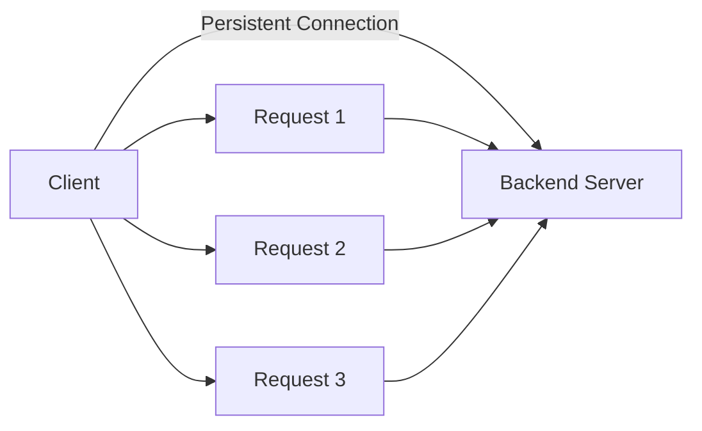
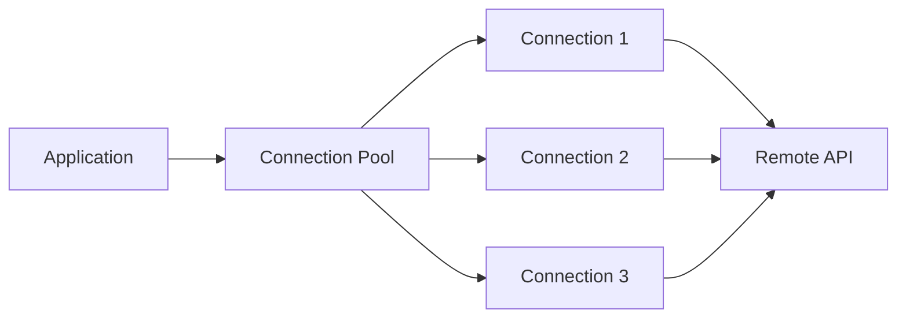
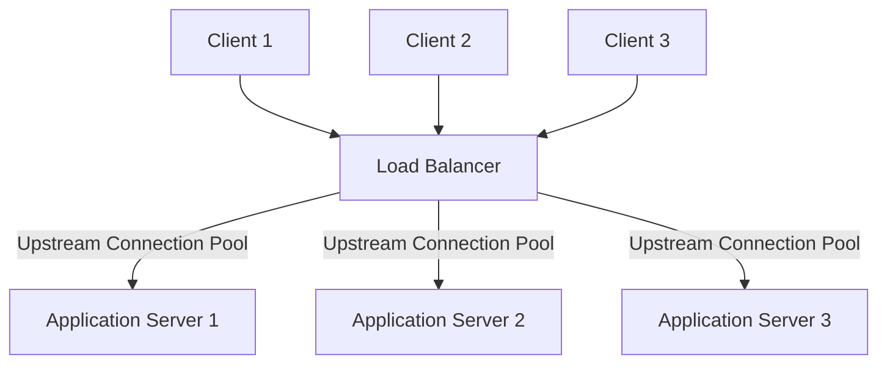
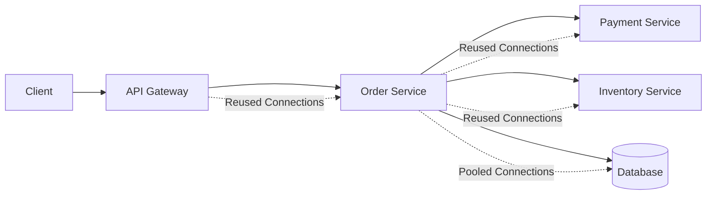
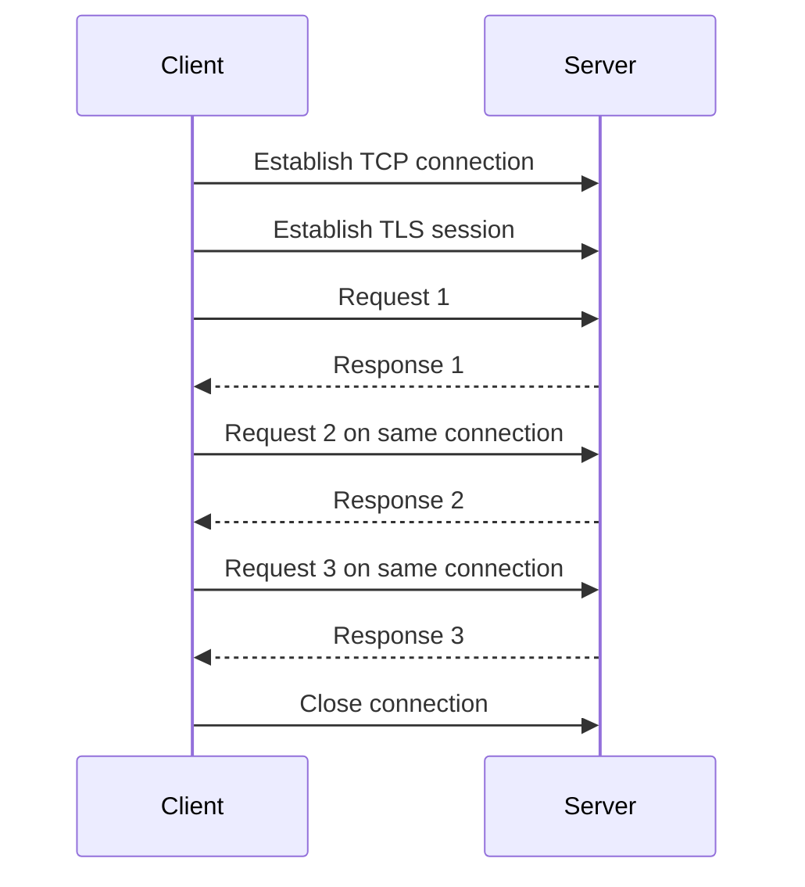
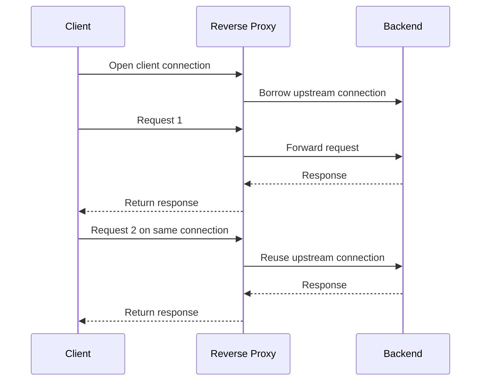
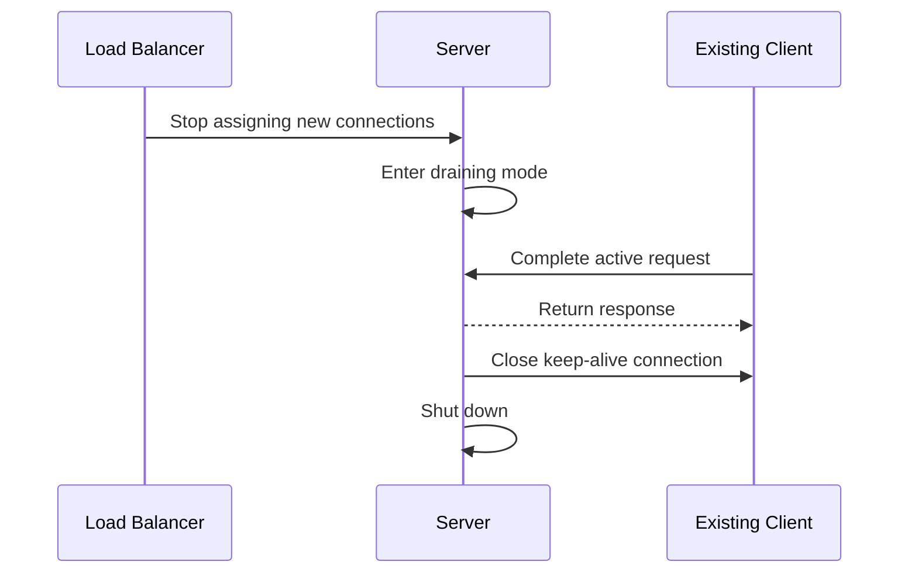
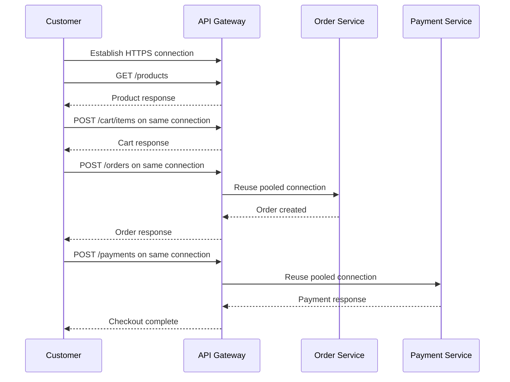

# Keep-Alive Connections

A **keep-alive connection** allows multiple requests and responses to reuse the same network connection instead of creating a new connection for every request.

```text
Without Keep-Alive:

Request 1 → Open connection → Response → Close connection
Request 2 → Open connection → Response → Close connection
Request 3 → Open connection → Response → Close connection


With Keep-Alive:

Open connection
    ├── Request 1 → Response
    ├── Request 2 → Response
    └── Request 3 → Response
Close connection
```

Keep-alive is commonly used between:

* Browsers and web servers
* Clients and API Gateways
* Load balancers and backend servers
* Microservices
* Applications and databases
* Applications and message brokers
* Reverse proxies and upstream services

Its main goal is simple:

> Reuse an existing connection instead of repeatedly paying the cost of creating a new one.

---

## Core Concepts

### Connection Establishment

Before two systems can exchange data over TCP, they must establish a connection.

A simplified TCP handshake looks like this:

```text
Client                         Server
  |                              |
  | -------- SYN ------------->  |
  | <------ SYN-ACK ------------ |
  | -------- ACK ------------->  |
  |                              |
  |      Connection ready        |
```

Creating a connection adds:

* Network round trips
* CPU work
* Memory allocation
* Socket creation
* Connection tracking
* Possible TLS handshake cost

If every request creates a new connection, these costs are repeated continuously.

---

### Persistent Connection

A persistent connection remains open after a response is returned.

```text
Client
  ↓ Request 1
Server
  ↑ Response 1

Same connection

Client
  ↓ Request 2
Server
  ↑ Response 2
```

The connection is closed when:

* The client closes it
* The server closes it
* An idle timeout expires
* A connection limit is reached
* A network failure occurs
* The application shuts down
* A proxy removes the connection

---

### HTTP Keep-Alive

HTTP keep-alive allows multiple HTTP requests to reuse one TCP connection.

In **HTTP/1.1**, persistent connections are normally enabled by default unless one side explicitly requests closure.

```http
Connection: close
```

The `Connection: keep-alive` header is mainly associated with older HTTP/1.0 compatibility and some proxy configurations.

A simplified HTTP/1.1 connection looks like this:

```text
TCP Connection
├── GET /products
├── Response
├── GET /cart
├── Response
├── POST /orders
└── Response
```

---

### TLS Connection Reuse

HTTPS adds a TLS handshake after the TCP connection is established.

```text
TCP Handshake
      ↓
TLS Handshake
      ↓
HTTP Request
      ↓
HTTP Response
```

Reusing an HTTPS connection avoids repeating both the TCP and TLS setup for every request.

```text
Without Keep-Alive:

TCP + TLS + Request
TCP + TLS + Request
TCP + TLS + Request


With Keep-Alive:

TCP + TLS
├── Request 1
├── Request 2
└── Request 3
```

This can significantly reduce latency and CPU usage.

---

### Idle Timeout

An idle timeout defines how long an unused connection remains open.

```text
Last request completed
        ↓
Connection remains idle
        ↓
Idle timeout reached
        ↓
Connection closed
```

A timeout that is too short causes frequent reconnections.

A timeout that is too long may waste:

* Memory
* File descriptors
* Connection-table entries
* Backend connection capacity

The correct value depends on traffic patterns and infrastructure limits.

---

### Maximum Requests per Connection

Some systems limit how many requests can use one connection.

```text
Connection opened
├── Request 1
├── Request 2
├── ...
├── Request 1,000
└── Connection closed
```

This helps:

* Refresh long-lived connections
* Redistribute traffic
* Avoid resource leaks
* Apply configuration changes
* Prevent one client from holding a connection forever

---

### Client-Side Connection Pool

A connection pool stores reusable connections to a destination.

```text
Application
    ↓
Connection Pool
├── Connection 1 → Service A
├── Connection 2 → Service A
├── Connection 3 → Service A
└── Connection 4 → Service A
```

When the application needs to send a request:

1. It asks the pool for a connection.
2. The pool returns an existing idle connection.
3. The request is sent.
4. The connection is returned to the pool.

If no connection is available, the client may:

* Create a new connection
* Wait for an existing connection
* Reject the request
* Time out

---

### Connection Pool Size

A connection pool must be large enough to support expected concurrency.

```text
Pool size: 10
Concurrent requests: 100
```

If each connection handles only one request at a time, many requests may wait for an available connection.

A pool that is too large can overwhelm the destination service.

```text
100 application instances
× 100 connections each
= 10,000 backend connections
```

Pool sizing must consider the entire system, not just one application instance.

---

### Client-Side Keep-Alive

Client-side keep-alive means the client intentionally reuses outgoing connections.

Examples include:

* An API service calling another service
* A web scraper contacting the same host
* A backend calling a payment provider
* A database client using a connection pool

A client must correctly return reusable connections to its pool.

For HTTP clients, this often requires fully reading or closing the response body.

---

### Server-Side Keep-Alive

Server-side keep-alive means the server allows clients to reuse established connections.

The server must manage:

* Idle connection limits
* Per-client limits
* Request timeouts
* Maximum connection age
* File descriptors
* Memory usage
* Graceful shutdown

---

### Upstream Keep-Alive

A reverse proxy or load balancer maintains connections to backend servers.

```text
Clients
   ↓
Load Balancer
   ↓ Reused upstream connections
Backend Servers
```

Client-side and upstream connections are separate.

```text
Client Connection A
        ↓
Load Balancer
        ↓
Backend Connection X
```

The load balancer may receive thousands of client connections while maintaining a smaller reusable pool of backend connections.

---

### Connection Multiplexing

Traditional HTTP/1.1 connections usually process requests sequentially unless pipelining is used.

HTTP/2 can send multiple concurrent streams over one connection.

```text
HTTP/1.1 Connection:

Request 1 → Response 1
Request 2 → Response 2
Request 3 → Response 3


HTTP/2 Connection:

Connection
├── Stream 1: Request and response
├── Stream 2: Request and response
└── Stream 3: Request and response
```

Multiplexing can reduce the number of connections required.

However, one connection can still become a bottleneck if:

* Packet loss affects the connection
* Stream limits are reached
* The destination has high concurrency
* Traffic is unevenly distributed

---

### HTTP/3 Connections

HTTP/3 uses QUIC over UDP rather than TCP.

It supports:

* Multiplexed streams
* Faster connection establishment
* Improved behavior during packet loss
* Connection migration between networks

Keep-alive still matters because connection establishment and cryptographic negotiation continue to have a cost.

---

### TCP Keepalive

**TCP keepalive** is different from **HTTP keep-alive**.

| HTTP Keep-Alive                                  | TCP Keepalive                             |
| ------------------------------------------------ | ----------------------------------------- |
| Reuses a connection for HTTP requests            | Detects dead or unreachable TCP peers     |
| Application-protocol behavior                    | Operating-system-level behavior           |
| Reduces connection setup cost                    | Sends probes during long idle periods     |
| Controlled by client, server, and proxy settings | Controlled through socket and OS settings |

TCP keepalive probes help detect connections that appear open but whose remote endpoint has disappeared.

```text
Connection appears idle
        ↓
TCP keepalive probe
        ↓
No response
        ↓
Connection marked dead
```

---

### Database Keep-Alive and Connection Pooling

Database systems usually use connection pooling rather than opening a new database connection per query.

```text
Application Requests
        ↓
Database Connection Pool
        ↓
Database
```

Database connections may require:

* Authentication
* TLS negotiation
* Session creation
* Configuration loading
* Transaction state

Reusing them improves efficiency.

However, a database connection must not be returned to the pool with:

* An unfinished transaction
* Modified session state
* Temporary settings
* Unread query results
* Broken network state

---

### Connection Lifetime

A connection may have multiple timeout and lifetime settings:

| Setting           | Purpose                                         |
| ----------------- | ----------------------------------------------- |
| Connect timeout   | Maximum time allowed to establish a connection  |
| Request timeout   | Maximum time allowed for a request              |
| Read timeout      | Maximum wait for response data                  |
| Write timeout     | Maximum time allowed to send data               |
| Idle timeout      | Maximum unused connection time                  |
| Maximum lifetime  | Maximum total connection age                    |
| Pool wait timeout | Maximum wait for an available pooled connection |

These values solve different problems and should not be treated as interchangeable.

---

### Half-Open Connection

A half-open connection occurs when one side believes a connection is still active while the other side has lost or closed it.

This may happen because of:

* Network interruption
* Server restart
* NAT timeout
* Firewall timeout
* Load balancer timeout
* Device sleep
* Process crash

The next request on that connection may fail.

Clients should safely discard broken connections and retry only when appropriate.

---

### Stale Connection

A stale connection exists in a pool but is no longer usable.

```text
Client Pool: Connection appears available
Server: Connection already closed
```

The client may receive:

* Connection reset
* Broken pipe
* Unexpected end of stream
* EOF
* Socket error

Connection pools should validate, expire, or replace stale connections.

---

## Architecture

### Basic Keep-Alive Architecture



One connection carries multiple requests.

---

### Connection Pool Architecture



The application borrows and returns connections instead of creating new ones repeatedly.

---

### Load Balancer Architecture



The load balancer manages two connection layers:

```text
Client ↔ Load Balancer connections
Load Balancer ↔ Backend connections
```

Each layer may have different keep-alive settings.

---

### Microservices Architecture



Connection reuse is important at every network hop.

---

### Request Flow



The TCP and TLS setup cost is paid once instead of once per request.

---

### Proxy Connection Flow



The client connection and backend connection do not need to have the same lifetime.

---

### Graceful Shutdown Flow



Graceful draining prevents active persistent connections from being terminated unexpectedly.

---

## Comparisons

### Keep-Alive vs New Connection per Request

| Keep-Alive                     | New Connection per Request             |
| ------------------------------ | -------------------------------------- |
| Reuses an existing connection  | Creates a connection for every request |
| Lower latency                  | Higher connection setup latency        |
| Fewer TCP and TLS handshakes   | Repeated TCP and TLS handshakes        |
| Lower CPU usage                | Higher CPU usage                       |
| Requires connection management | Simpler connection lifecycle           |
| Can consume idle resources     | Releases resources immediately         |

Keep-alive is usually preferred for repeated communication with the same destination.

---

### HTTP Keep-Alive vs TCP Keepalive

| HTTP Keep-Alive                                    | TCP Keepalive                            |
| -------------------------------------------------- | ---------------------------------------- |
| Reuses connections for HTTP traffic                | Detects inactive or broken peers         |
| Works at the application layer                     | Works at the transport layer             |
| Improves request performance                       | Improves dead-connection detection       |
| Controlled through HTTP client and server behavior | Controlled through socket and OS options |

They solve different problems and may be enabled together.

---

### HTTP/1.1 vs HTTP/2

| HTTP/1.1                                                  | HTTP/2                                |
| --------------------------------------------------------- | ------------------------------------- |
| Supports persistent connections                           | Supports persistent connections       |
| Requests are commonly handled sequentially per connection | Multiple streams share one connection |
| May require several connections for concurrency           | Usually requires fewer connections    |
| Text-based message format                                 | Binary framing                        |
| More connection-pool pressure                             | Better multiplexing                   |

Keep-alive remains useful in both versions.

---

### Keep-Alive vs Connection Pooling

| Keep-Alive                       | Connection Pooling                             |
| -------------------------------- | ---------------------------------------------- |
| Keeps one connection open        | Manages multiple reusable connections          |
| Describes connection persistence | Describes connection allocation                |
| Can exist without a large pool   | Usually relies on persistent connections       |
| Common in HTTP                   | Common in HTTP, databases, and message systems |

A connection pool is a structured way to manage many keep-alive connections.

---

### Short Idle Timeout vs Long Idle Timeout

| Short Timeout                 | Long Timeout                       |
| ----------------------------- | ---------------------------------- |
| Releases resources quickly    | Reduces reconnections              |
| Better for infrequent traffic | Better for frequent traffic        |
| May increase handshake cost   | Holds connections longer           |
| Reduces stale connection risk | May increase stale connection risk |
| Uses fewer idle sockets       | Uses more idle sockets             |

The right balance depends on request frequency and system capacity.

---

### Keep-Alive vs WebSocket

| Keep-Alive                                 | WebSocket                                          |
| ------------------------------------------ | -------------------------------------------------- |
| Reuses a connection for separate requests  | Maintains a continuous bidirectional channel       |
| Usually request-response based             | Either side can send messages                      |
| Common for APIs and web pages              | Common for chat, gaming, and live updates          |
| Connections may be idle between requests   | Connection remains part of the application session |
| Does not automatically provide server push | Supports server-initiated messages                 |

A WebSocket is long-lived, but it is not the same as HTTP keep-alive.

---

### Keep-Alive vs Long Polling

| Keep-Alive                                | Long Polling                                  |
| ----------------------------------------- | --------------------------------------------- |
| Reuses a connection across requests       | Keeps one request open while waiting for data |
| Optimizes normal request-response traffic | Simulates server push                         |
| Requests are usually completed quickly    | Responses may be delayed                      |
| Primarily a connection-efficiency feature | Primarily a real-time communication technique |

Long polling may still use keep-alive between polling requests.

---

## Real-World Example: E-Commerce Checkout System

Consider an e-commerce platform with:

* Web and mobile clients
* CDN
* Load balancer
* API Gateway
* Product service
* Cart service
* Order service
* Payment service
* Database

A customer may perform many actions during one session:

```text
GET  /products
GET  /products/123
GET  /cart
POST /cart/items
POST /orders
POST /payments
```

---

### Without Keep-Alive

Each request creates a new connection.

```text
Product request
→ TCP handshake
→ TLS handshake
→ Request
→ Response
→ Connection closed

Cart request
→ TCP handshake
→ TLS handshake
→ Request
→ Response
→ Connection closed
```

This creates:

* Higher response latency
* More CPU work
* More TLS handshakes
* More short-lived sockets
* More operating-system overhead
* Higher load on proxies and servers

---

### With Keep-Alive



The public connection is reused across customer requests.

The API Gateway also reuses its connections to backend services.

---

### High-Traffic Scenario

Suppose the Order service receives 10,000 requests per second.

Without connection reuse:

```text
10,000 requests per second
≈ 10,000 new connections per second
```

With connection pooling:

```text
10,000 requests per second
        ↓
Reusable pool of established connections
        ↓
Order Service
```

The exact pool size depends on:

* Request latency
* Desired concurrency
* Protocol
* Multiplexing
* Backend limits
* Number of application instances

The goal is not to create one connection per request, but to reuse a controlled number of healthy connections.

---

### Mismatched Timeout Scenario

Consider these settings:

```text
Load balancer upstream idle timeout: 60 seconds
Application client idle timeout: 120 seconds
```

The client may try to reuse a connection after 90 seconds.

However, the load balancer already closed it after 60 seconds.

```text
Client believes connection is reusable
        ↓
Proxy has already closed it
        ↓
Connection reset or failed request
```

Timeouts across clients, proxies, firewalls, and servers should be coordinated.

---

### Payment Retry Scenario

A stale keep-alive connection may fail when a payment request is sent.

Blindly retrying the request could create a duplicate payment.

A safer design uses an idempotency key:

```http
POST /payments
Idempotency-Key: order-72819-payment-1
```

The connection may be retried, but the business operation is processed only once.

---

## Best Practices

### 1. Reuse Connections for Repeated Destinations

Enable connection reuse when an application frequently contacts the same service.

Good candidates include:

* Internal APIs
* Databases
* Payment providers
* Object storage
* Search systems
* Message brokers

---

### 2. Use a Bounded Connection Pool

Do not create an unlimited number of connections.

A pool should define:

* Maximum connections
* Maximum idle connections
* Per-host limits
* Pool wait timeout
* Maximum connection age
* Idle connection lifetime

A bounded pool protects the destination from connection overload.

---

### 3. Size Pools Using Concurrency

A useful starting relationship is:

```text
Required concurrent connections
≈ Request rate × Average request duration
```

For example:

```text
Request rate: 1,000 requests per second
Average duration: 0.05 seconds

Estimated concurrency:
1,000 × 0.05 = 50
```

The real pool size should also account for:

* Traffic spikes
* Slow requests
* Retries
* Multiplexing
* Multiple destination instances
* Safety margins

---

### 4. Consider Total Fleet Connections

Pool size is normally configured per application instance.

```text
200 application instances
× 50 connections
= 10,000 destination connections
```

Verify that the backend, database, or external service can support the total.

---

### 5. Coordinate Idle Timeouts

Review timeout values across:

```text
Client
  ↓
CDN
  ↓
Load Balancer
  ↓
Reverse Proxy
  ↓
Application
  ↓
Database or Downstream Service
```

Mismatched timeouts can create stale connections and random connection resets.

Clients should generally expire connections before infrastructure components silently remove them.

---

### 6. Set a Maximum Connection Lifetime

Even an active connection should not necessarily live forever.

Maximum lifetime helps:

* Redistribute traffic after scaling
* Move traffic away from unhealthy nodes
* Apply DNS changes
* Rotate certificates
* Refresh network paths
* Reduce long-lived resource leaks

Use small lifetime variation, or jitter, to prevent all connections from expiring at once.

---

### 7. Use Graceful Connection Draining

During deployment:

1. Remove the server from new traffic.
2. Stop accepting new keep-alive requests.
3. Allow active requests to finish.
4. Close idle connections.
5. Shut down after a deadline.

This reduces deployment-related failures.

---

### 8. Fully Consume or Close HTTP Responses

Some HTTP clients cannot reuse a connection until the response body is fully consumed or explicitly closed.

Incorrect:

```text
Send request
Read only part of response
Forget to close response
```

Result:

* Connection leak
* Pool exhaustion
* New connection creation
* Increasing latency

Always follow the HTTP client's response-cleanup requirements.

---

### 9. Validate Connections Before Reuse

Connection pools should remove:

* Closed connections
* Expired connections
* Connections with protocol errors
* Connections beyond maximum lifetime
* Connections associated with unhealthy backends

Avoid expensive validation before every request unless required.

---

### 10. Retry Only Safe Operations

A connection can fail before, during, or after a request is transmitted.

The client may not know whether the server processed the operation.

Retries are safer for:

* Idempotent reads
* Requests with idempotency keys
* Operations designed for repeated execution

Be careful with:

* Payments
* Order creation
* Inventory updates
* Email sending
* Account modifications

---

### 11. Use Request Deadlines

Keep-alive does not replace timeouts.

Every request should still have a deadline.

```text
Connection remains open
Request exceeds deadline
        ↓
Cancel request
```

One slow request should not occupy a connection indefinitely.

---

### 12. Use TCP Keepalive for Long Idle Connections

TCP keepalive can help detect broken connections for:

* Database sessions
* Message consumers
* Long-lived internal channels
* Connections passing through NAT devices
* Persistent service links

Configure probe intervals according to infrastructure timeout behavior.

---

### 13. Monitor Pool Saturation

Important metrics include:

* Active connections
* Idle connections
* Maximum pool size
* Requests waiting for connections
* Pool wait time
* Connection creation rate
* Connection reuse rate
* Connection failures
* Connection age
* Idle connection closures

A full pool with increasing wait time may indicate insufficient capacity or a slow downstream service.

---

### 14. Monitor Connection Churn

Connection churn means connections are being created and destroyed frequently.

Possible causes include:

* Keep-alive disabled
* Idle timeout too short
* Proxy timeout mismatch
* Server restarts
* DNS changes
* Pool misconfiguration
* Connections not returned to the pool

High churn increases CPU, latency, and TLS overhead.

---

### 15. Protect Against Idle-Connection Exhaustion

Attackers or broken clients may open many connections and send little traffic.

Use:

* Per-client connection limits
* Header timeouts
* Idle timeouts
* Request-rate limits
* Maximum concurrent connections
* Slow-client protection

Keep-alive should not allow unlimited resource reservation.

---

### 16. Prefer Modern HTTP Protocols

Use HTTP/2 or HTTP/3 where supported.

They can provide:

* Multiplexing
* Fewer required connections
* Header compression
* Better network utilization
* Lower connection-management overhead

Still monitor connection count and stream saturation.

---

### 17. Separate Pooling by Destination

Do not mix connections for unrelated hosts, tenants, or security identities.

Pool keys may include:

* Hostname
* Port
* Protocol
* TLS configuration
* Client certificate
* Proxy
* Authentication identity

A connection established for one identity must not accidentally be reused for another incompatible identity.

---

### 18. Rotate Connections Gradually

When certificates, DNS records, or backend instances change, refresh connections gradually.

Closing every connection simultaneously may cause:

* Connection storms
* TLS CPU spikes
* Sudden backend load
* Increased latency

Use lifetime jitter and controlled draining.

---

## Common Mistakes

### 1. Opening a New Connection for Every Request

This repeats TCP and TLS setup unnecessarily.

Use persistent clients and connection pools instead of creating a new HTTP client for every call.

---

### 2. Creating a New HTTP Client per Request

Many HTTP client implementations own their own connection pool.

```text
Request 1 → New HTTP client → New pool
Request 2 → New HTTP client → New pool
```

The connections are never reused effectively.

Create long-lived client instances when the library is designed for reuse.

---

### 3. Using an Unlimited Connection Pool

An unlimited pool can overload:

* Backend servers
* Databases
* NAT tables
* Firewalls
* File descriptor limits
* External providers

Always apply connection limits.

---

### 4. Making the Pool Too Small

A very small pool causes requests to wait even when the backend has available capacity.

Monitor pool wait time instead of guessing.

---

### 5. Ignoring Fleet-Wide Connection Count

A pool size that looks safe for one application instance may be dangerous across hundreds of instances.

Always calculate the total possible connection count.

---

### 6. Using the Same Timeout Everywhere

A single timeout value does not suit every layer.

Connect, request, idle, pool-wait, and maximum-lifetime settings have different purposes.

---

### 7. Mismatching Proxy and Client Timeouts

A proxy may close a connection before the client expects it to expire.

This creates intermittent reuse failures.

Coordinate settings or make the client connection lifetime shorter than the infrastructure timeout.

---

### 8. Failing to Close Response Bodies

An unclosed response may prevent the connection from returning to the pool.

This eventually causes pool exhaustion.

---

### 9. Keeping Connections Forever

Very long-lived connections may:

* Continue targeting removed servers
* Miss DNS updates
* Delay certificate rotation
* Create uneven traffic
* Accumulate hidden state

Set a maximum connection lifetime.

---

### 10. Closing Connections Too Quickly

An extremely short idle timeout removes most keep-alive benefits.

Frequent reconnection increases handshake latency and CPU usage.

---

### 11. Retrying Unsafe Requests Automatically

A broken connection does not always mean the server failed to process the request.

Blind retries can duplicate payments, orders, or writes.

Use idempotency protection.

---

### 12. Confusing HTTP Keep-Alive with TCP Keepalive

HTTP keep-alive improves connection reuse.

TCP keepalive detects broken idle peers.

Enabling one does not automatically provide the behavior of the other.

---

### 13. Ignoring Long-Lived Connection Load Balancing

A load balancer often selects a backend when a connection is created.

If connections remain open for a long time, new backend servers may receive little traffic.

Maximum connection age can improve redistribution.

---

### 14. Forgetting Graceful Shutdown

Immediately terminating a server can break active requests and persistent connections.

Drain traffic before shutdown.

---

### 15. Treating Keep-Alive as a Complete Performance Solution

Keep-alive cannot fix:

* Slow database queries
* Inefficient application logic
* Lock contention
* Large payloads
* Missing indexes
* Insufficient backend capacity

It reduces connection overhead but does not remove application bottlenecks.

---

## Interview Questions

### 1. What is HTTP keep-alive?

HTTP keep-alive allows multiple HTTP requests and responses to reuse the same network connection instead of creating a new connection for every request.

---

### 2. Why does keep-alive improve performance?

It reduces repeated TCP and TLS handshakes, lowering latency, CPU usage, and connection-management overhead.

---

### 3. What is the difference between HTTP keep-alive and TCP keepalive?

HTTP keep-alive reuses a connection for multiple HTTP requests. TCP keepalive sends low-level probes to detect broken or unreachable peers during idle periods.

---

### 4. What happens when a connection pool is too small?

Requests wait for an available connection, increasing latency and potentially causing pool-wait timeouts even when the destination has capacity.

---

### 5. Why can long-lived connections cause uneven load balancing?

The backend may be selected when the connection is created. If existing connections remain open, newly added servers may receive fewer requests until connections are refreshed.

---

## Key Takeaways

### 1. Keep-alive reduces repeated connection setup

Reusing TCP and TLS connections lowers latency, CPU usage, and network overhead.

### 2. Connection pools must be bounded and observable

Pool size, idle timeout, lifetime, request deadlines, and fleet-wide connection counts must be designed carefully.

### 3. Persistent connections require lifecycle management

Stale connections, timeout mismatches, unsafe retries, graceful shutdown, and load-balancing behavior must all be considered.

---

## Final Architecture Summary

```text
Clients
   ↓ Persistent HTTPS Connections
CDN / Load Balancer
   ↓ Reusable Upstream Connections
API Gateway
   ↓ Connection Pools
Backend Services
   ↓ Pooled Connections
Database / Cache / External APIs
```

> Keep-alive is a small configuration with a large system-wide impact. When designed correctly, it reduces latency and infrastructure cost while improving throughput across every layer of the backend.

---

⭐ **Star this repository** if this guide made keep-alive connections easier to understand.

👀 **Follow for more practical backend architecture, performance, scalability, and system design guides.**
