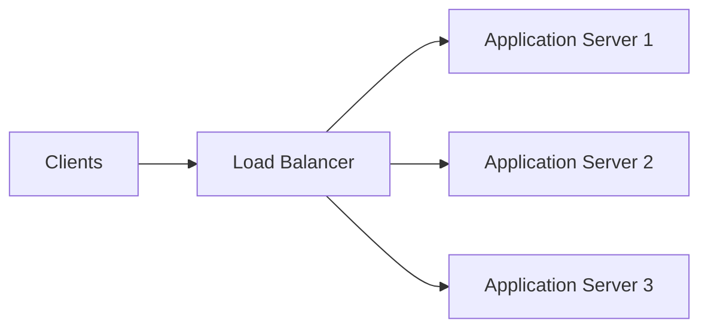
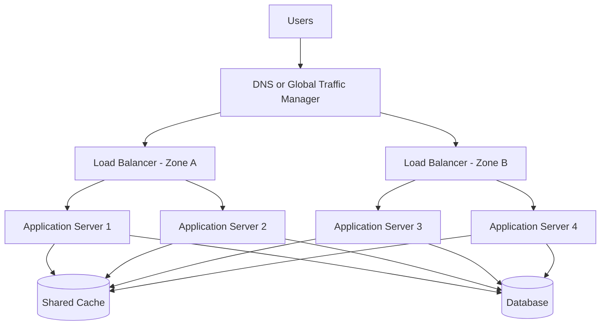
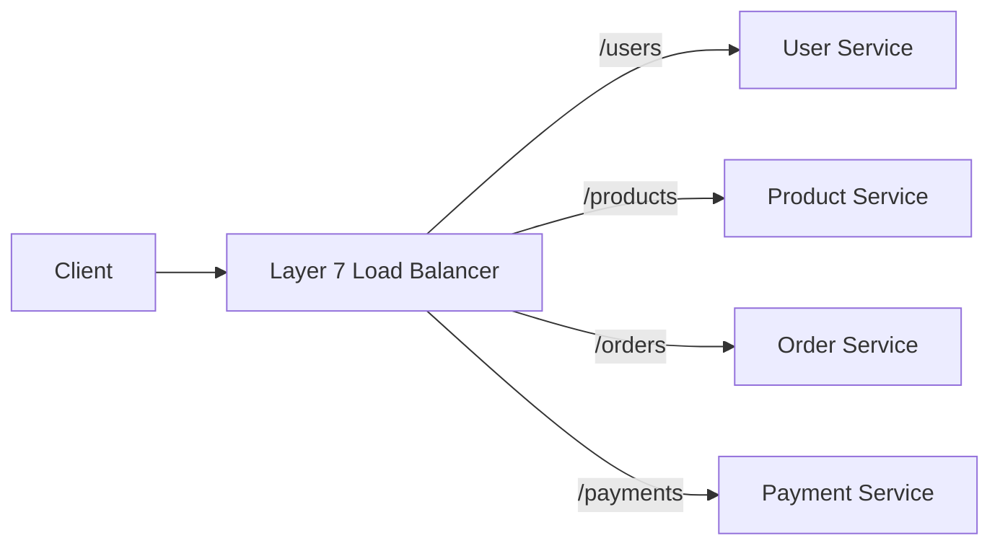
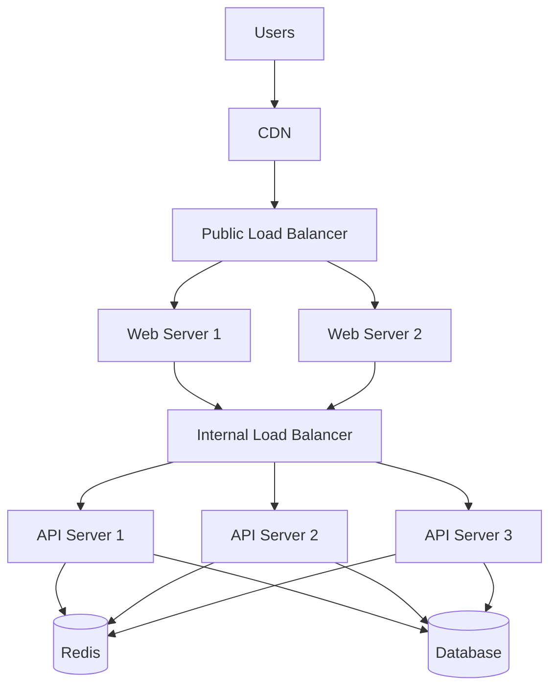
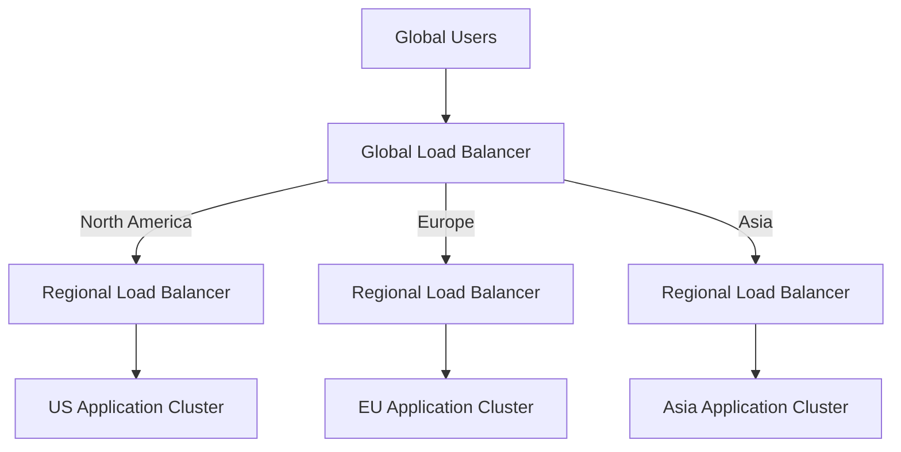
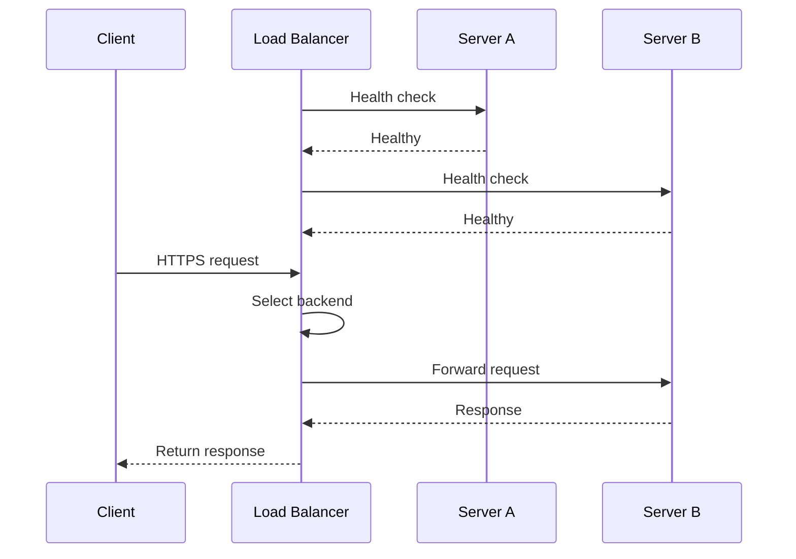
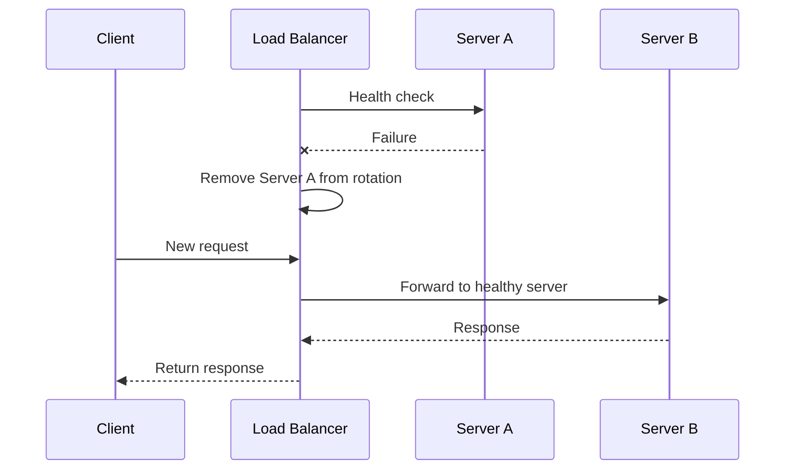
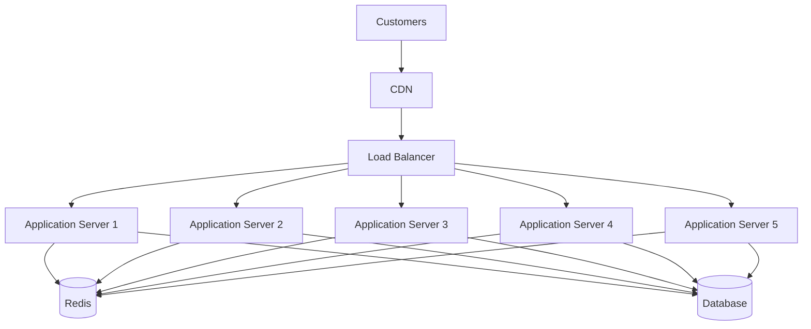
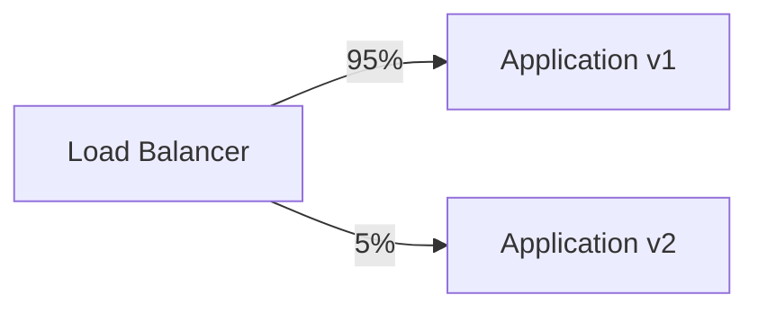

# Load Balancers

A **load balancer** sits between clients and backend servers. It receives incoming traffic and forwards each request to an appropriate healthy server.

```text
Clients → Load Balancer → Backend Servers
```

Without a load balancer, clients may depend on a single server.

```text
Clients → Application Server
```

If that server becomes overloaded or unavailable, the application may slow down or stop working.

With a load balancer, traffic can be distributed across multiple servers.

```text
                         ┌──→ Server A
Clients → Load Balancer ─┼──→ Server B
                         └──→ Server C
```

Load balancers are commonly used for:

* Web applications
* APIs
* Microservices
* Databases
* Message brokers
* Gaming servers
* Streaming platforms
* Multi-region systems

Popular load-balancing technologies include:

* NGINX
* HAProxy
* Envoy
* Traefik
* AWS Elastic Load Balancing
* Google Cloud Load Balancing
* Azure Load Balancer
* Kubernetes Services
* Cloudflare Load Balancing

---

## Core Concepts

### Traffic Distribution

The primary responsibility of a load balancer is to distribute incoming traffic across multiple backend servers.

```text
Request 1 → Server A
Request 2 → Server B
Request 3 → Server C
Request 4 → Server A
```

This prevents one server from receiving all requests while other servers remain idle.

---

### Backend Pool

A **backend pool** is a group of servers that can process the same type of request.

```text
Backend Pool
├── Application Server 1
├── Application Server 2
├── Application Server 3
└── Application Server 4
```

Servers in the same pool should usually provide equivalent functionality.

---

### Health Checks

A load balancer should send traffic only to healthy servers.

```text
Server A → Healthy
Server B → Unhealthy
Server C → Healthy
```

Requests are routed to Server A and Server C while Server B is removed from rotation.

#### Active Health Checks

The load balancer periodically sends a request to each backend.

```http
GET /health
```

A healthy server may respond with:

```http
HTTP/1.1 200 OK
```

#### Passive Health Checks

The load balancer observes real traffic.

A server may be marked unhealthy after repeated:

* Connection failures
* Timeouts
* `500` responses
* Connection resets
* Invalid responses

---

### Readiness and Liveness

A server can be running without being ready to receive traffic.

* **Liveness** indicates that the process is running.
* **Readiness** indicates that the server can safely handle requests.

A server may be alive but not ready because it is:

* Loading configuration
* Warming caches
* Waiting for a database
* Running startup tasks
* Recovering from an outage

Load balancers should generally use readiness when deciding where to route traffic.

---

### Load-Balancing Algorithms

A load-balancing algorithm determines which backend receives the next request.

#### Round Robin

Requests are distributed sequentially.

```text
Request 1 → Server A
Request 2 → Server B
Request 3 → Server C
Request 4 → Server A
```

**Best for:** servers with similar capacity and requests with similar processing cost.

---

#### Weighted Round Robin

Servers receive traffic according to assigned weights.

```text
Server A → Weight 5
Server B → Weight 3
Server C → Weight 2
```

Server A receives more traffic because it has greater capacity.

**Best for:** backend servers with different CPU, memory, or performance levels.

---

#### Least Connections

The next request is sent to the server with the fewest active connections.

```text
Server A → 20 active connections
Server B → 8 active connections
Server C → 14 active connections

Next request → Server B
```

**Best for:** long-running requests, uploads, downloads, or persistent connections.

---

#### Least Response Time

Traffic is sent to the server with the lowest response time and, in some implementations, the fewest active connections.

**Best for:** systems where backend performance changes frequently.

---

#### Random Selection

The load balancer selects a backend randomly.

This is simple and can work well when there are many similar servers.

---

#### Power of Two Choices

The load balancer randomly selects two servers and sends the request to the less busy one.

This provides better distribution than pure random selection while remaining efficient.

---

#### IP Hash

The client IP address determines the backend server.

```text
hash(client_ip) → Backend Server
```

This can provide basic session affinity.

However, traffic may become uneven if many users share the same public IP address.

---

#### Consistent Hashing

A request key is mapped to a backend server using a hash ring.

Possible keys include:

* User ID
* Session ID
* Tenant ID
* Cache key
* Request path

```text
hash(user_id) → Server
```

When servers are added or removed, only a limited portion of keys must move.

**Best for:** distributed caches, stateful routing, and sharded systems.

---

### Layer 4 Load Balancing

A **Layer 4 load balancer** operates at the transport layer.

It makes routing decisions using:

* IP address
* TCP port
* UDP port
* Connection information

```text
Client TCP Connection
        ↓
Layer 4 Load Balancer
        ↓
Backend Server
```

The load balancer does not need to understand HTTP paths, cookies, or headers.

#### Advantages

* High performance
* Low processing overhead
* Supports non-HTTP protocols
* Suitable for databases and message brokers

#### Limitations

* Cannot route by URL path
* Cannot inspect HTTP headers
* Limited request-level control

---

### Layer 7 Load Balancing

A **Layer 7 load balancer** understands application-level protocols such as HTTP.

It can route based on:

* URL path
* Hostname
* HTTP method
* Headers
* Cookies
* Query parameters
* Content type

```text
/api/users    → User Service
/api/orders   → Order Service
/api/payments → Payment Service
```

#### Advantages

* Advanced routing
* Request and response modification
* Authentication support
* Content-based routing
* HTTP caching
* Better API control

#### Limitations

* More processing overhead
* Greater configuration complexity
* Usually protocol-specific

---

### Static Load Balancing

Static load balancing uses predefined rules.

Examples include:

* Round robin
* Weighted round robin
* IP hash

The algorithm does not continuously adapt to backend performance.

---

### Dynamic Load Balancing

Dynamic load balancing considers current backend conditions.

It may use:

* Active connections
* Response latency
* CPU usage
* Queue length
* Error rate
* Server health

Dynamic algorithms can react more effectively to uneven workloads.

---

### Session Affinity

Session affinity, also called **sticky sessions**, routes the same user to the same backend server.

```text
User A → Server 1
User A → Server 1
User B → Server 2
```

It may be implemented using:

* Cookies
* Client IP address
* Session ID
* Consistent hashing

Sticky sessions can simplify stateful applications, but they have disadvantages:

* Uneven traffic distribution
* Difficult failover
* Reduced scaling flexibility
* Session loss when a server fails

A more scalable approach is to store session data in a shared system such as Redis.

```text
Server A ─┐
Server B ─┼──→ Shared Session Store
Server C ─┘
```

---

### SSL/TLS Termination

A load balancer can terminate HTTPS connections.

```text
Client
  ↓ HTTPS
Load Balancer
  ↓ HTTP or HTTPS
Backend Server
```

Benefits include:

* Centralized certificate management
* Reduced TLS work on backend servers
* Consistent security policies
* Easier certificate rotation

For sensitive environments, connections between the load balancer and backends should also be encrypted.

---

### Connection Pooling

A load balancer can reuse connections to backend servers.

```text
Many Client Connections
          ↓
     Load Balancer
          ↓
Reusable Backend Connections
```

Connection pooling reduces:

* TCP handshake overhead
* TLS handshake overhead
* Backend connection pressure
* Request latency

---

### Connection Draining

When a server is removed from rotation, active requests should be allowed to finish.

```text
Healthy → Draining → Removed
```

During draining:

* No new requests are assigned
* Existing requests continue
* The server is removed after active work completes

This is important during deployments and autoscaling events.

---

### Failover

If one backend server fails, the load balancer redirects traffic to healthy servers.

```text
Server A → Failed
Server B → Healthy
Server C → Healthy
```

Failover can also occur between load balancers, availability zones, or regions.

---

### Cross-Zone Load Balancing

Cross-zone load balancing distributes requests across servers in multiple availability zones.

```text
Load Balancer
├── Zone A → 2 servers
└── Zone B → 4 servers
```

With cross-zone balancing, traffic can be distributed across all six servers instead of being limited to servers in the client's selected zone.

---

### Global Load Balancing

A global load balancer distributes users across regions.

```text
                       ┌──→ Region: North America
Users → Global Router ─┼──→ Region: Europe
                       └──→ Region: Asia
```

Routing decisions may consider:

* Geographic distance
* Network latency
* Region health
* Capacity
* Legal requirements
* Cost
* User residency

Common global-routing approaches include:

* Geo-based DNS
* Latency-based DNS
* Anycast routing
* Global proxy networks
* Active-passive failover

---

### Autoscaling Integration

The load balancer and autoscaling system often work together.

```text
Traffic increases
      ↓
Autoscaler adds servers
      ↓
Health checks pass
      ↓
Load balancer adds servers to pool
```

During scale-down:

```text
Server enters draining mode
      ↓
Active requests finish
      ↓
Server is removed
      ↓
Instance terminates
```

---

### Slow Start

A newly added server may not be ready to receive a full traffic share immediately.

It may still be:

* Warming caches
* Creating database connections
* Loading models
* Compiling application code
* Initializing dependencies

Slow start gradually increases traffic to the new server.

```text
New server traffic:

10% → 25% → 50% → 100%
```

---

### Load Shedding

When the system is overloaded, the load-balancing layer may reject lower-priority work.

```http
HTTP/1.1 503 Service Unavailable
```

Load shedding prevents complete system collapse by preserving capacity for critical requests.

---

## Architecture

### Basic Architecture



The load balancer:

1. Receives a client request.
2. Checks the health of available servers.
3. Selects a server using a balancing algorithm.
4. Forwards the request.
5. Returns the backend response to the client.

---

### High-Availability Architecture



Multiple load balancers prevent the balancing layer from becoming a single point of failure.

---

### Layer 7 Microservices Architecture



The load balancer routes traffic based on the request path.

---

### Multi-Tier Architecture



This architecture uses:

* A public load balancer for internet traffic
* An internal load balancer for private service traffic
* Shared cache and database layers

---

### Global Architecture



The global layer selects a region.

The regional layer distributes traffic across servers within that region.

---

### Request Flow



---

### Failure Flow



---

## Comparisons

### Layer 4 vs Layer 7 Load Balancer

| Layer 4                               | Layer 7                                       |
| ------------------------------------- | --------------------------------------------- |
| Operates at TCP or UDP level          | Operates at application protocol level        |
| Routes using IP and port              | Routes using path, host, headers, and cookies |
| Lower processing overhead             | Supports more advanced routing                |
| Works with non-HTTP protocols         | Commonly used for HTTP and APIs               |
| Cannot inspect application content    | Can inspect and transform requests            |
| Useful for databases and TCP services | Useful for websites and microservices         |

---

### Load Balancer vs Reverse Proxy

| Load Balancer                          | Reverse Proxy                                   |
| -------------------------------------- | ----------------------------------------------- |
| Primarily distributes traffic          | Represents backend servers                      |
| Focuses on backend selection           | Handles routing and request forwarding          |
| May operate at Layer 4 or Layer 7      | Commonly operates at Layer 7                    |
| Usually requires multiple backends     | May forward to one or many backends             |
| Can provide health checks and failover | Can provide caching, TLS, and security controls |

A reverse proxy can perform load balancing, but not every reverse proxy is configured as a load balancer.

---

### Load Balancer vs API Gateway

| Load Balancer                           | API Gateway                                        |
| --------------------------------------- | -------------------------------------------------- |
| Distributes traffic across servers      | Manages API traffic and policies                   |
| Focuses on availability and capacity    | Focuses on authentication, quotas, and API routing |
| May operate at Layer 4 or Layer 7       | Usually operates at Layer 7                        |
| Routes to server instances              | Routes to services and API endpoints               |
| Usually avoids business-facing policies | May transform and aggregate API responses          |

A common architecture uses both:

```text
Client → Load Balancer → API Gateway Cluster → Services
```

---

### Load Balancer vs CDN

| Load Balancer                             | CDN                                          |
| ----------------------------------------- | -------------------------------------------- |
| Distributes requests across backends      | Delivers cached content from edge locations  |
| Usually operates near application servers | Operates across global edge locations        |
| Improves backend availability             | Reduces geographic latency                   |
| Sends traffic to healthy servers          | Avoids origin traffic when content is cached |
| Used for dynamic processing               | Best known for content delivery              |

A production request path may be:

```text
User → CDN → Load Balancer → Application Servers
```

---

### Load Balancer vs Service Discovery

| Load Balancer                 | Service Discovery                      |
| ----------------------------- | -------------------------------------- |
| Selects a backend instance    | Finds available service instances      |
| Forwards network traffic      | Maintains service-location information |
| Performs health-based routing | Registers and removes instances        |
| Sits in the request path      | May operate outside the request path   |

The load balancer may use service discovery to keep its backend pool updated.

---

### Hardware vs Software Load Balancer

| Hardware Load Balancer             | Software Load Balancer                      |
| ---------------------------------- | ------------------------------------------- |
| Dedicated physical appliance       | Runs on virtual machines or containers      |
| High performance                   | Flexible and easy to automate               |
| Higher cost                        | Usually lower cost                          |
| Vendor-specific management         | Integrates well with infrastructure as code |
| Scaling may require new hardware   | Scaling can be horizontal                   |
| Common in traditional data centers | Common in cloud-native systems              |

---

### Server-Side vs Client-Side Load Balancing

| Server-Side                                 | Client-Side                         |
| ------------------------------------------- | ----------------------------------- |
| A central load balancer selects the backend | The client selects a backend        |
| Clients use one endpoint                    | Clients receive a list of instances |
| Easier for external clients                 | Common in internal microservices    |
| Centralized control                         | Avoids an extra network hop         |
| Balancer can become a bottleneck            | Adds complexity to every client     |

#### Server-Side

```text
Client → Load Balancer → Service Instance
```

#### Client-Side

```text
Client → Service Registry → Select Instance → Service
```

---

### Active-Active vs Active-Passive

| Active-Active                       | Active-Passive                     |
| ----------------------------------- | ---------------------------------- |
| Multiple environments serve traffic | One environment serves traffic     |
| Better resource utilization         | Simpler consistency model          |
| Faster failover                     | Passive capacity may remain unused |
| More complex data coordination      | Failover may take longer           |
| Suitable for high availability      | Suitable for disaster recovery     |

---

### Round Robin vs Least Connections

| Round Robin                       | Least Connections                  |
| --------------------------------- | ---------------------------------- |
| Distributes requests sequentially | Uses current connection count      |
| Simple and predictable            | Adapts to long-running requests    |
| Works for similar request costs   | Better for uneven request duration |
| Does not consider current load    | Requires connection tracking       |

---

### Sticky Sessions vs Shared Sessions

| Sticky Sessions                  | Shared Sessions                        |
| -------------------------------- | -------------------------------------- |
| User returns to the same server  | Any server can handle the user         |
| Easier for legacy stateful apps  | Better for horizontal scaling          |
| Can create uneven traffic        | Requires shared storage                |
| Server failure may lose sessions | Better failover                        |
| Limits deployment flexibility    | Supports stateless application servers |

---

## Real-World Example: E-Commerce Flash Sale

Consider an e-commerce platform preparing for a major flash sale.

The application includes:

* Product catalog
* Search
* Shopping cart
* Order processing
* Inventory
* Payments
* User accounts

During normal traffic, the platform runs three application servers.

```text
                         ┌──→ App Server 1
Users → Load Balancer ───┼──→ App Server 2
                         └──→ App Server 3
```

During the flash sale, traffic increases rapidly.

---

### Without a Load Balancer

All traffic reaches one server.

```text
100,000 Users → One Application Server
```

Possible results:

* CPU exhaustion
* Memory pressure
* Slow responses
* Connection failures
* Application outage
* Lost sales

---

### With a Load Balancer

Traffic is distributed across multiple servers.



The load balancer can:

* Distribute requests
* Remove unhealthy servers
* Terminate TLS
* Support autoscaling
* Drain servers during deployments
* Route traffic by service
* Enforce connection limits

---

### Traffic Distribution

Suppose five servers have equal capacity.

```text
100,000 requests per minute
          ↓
Load Balancer
          ↓
Approximately 20,000 requests per server
```

The exact distribution depends on connection duration, algorithm, caching, and backend performance.

---

### Unequal Server Capacity

Suppose newer servers are twice as powerful as older servers.

```text
Server A → Weight 2
Server B → Weight 2
Server C → Weight 1
Server D → Weight 1
```

The load balancer sends more traffic to the stronger servers.

---

### Server Failure

Server C becomes unhealthy.

```text
Server A → Healthy
Server B → Healthy
Server C → Unhealthy
Server D → Healthy
```

The load balancer removes Server C from rotation.

```text
New traffic
├──→ Server A
├──→ Server B
└──→ Server D
```

Users continue using the platform without needing to know that a server failed.

---

### Autoscaling Flow

As traffic rises:

```text
CPU and request rate increase
          ↓
Autoscaler launches new servers
          ↓
New servers pass readiness checks
          ↓
Load balancer adds them to the pool
```

As traffic falls:

```text
Traffic decreases
      ↓
Selected servers enter draining mode
      ↓
Active requests finish
      ↓
Servers are removed and terminated
```

---

### Checkout Prioritization

Product browsing and checkout have different business importance.

A Layer 7 load balancer can route traffic to separate pools.

```text
/products/* → Product Server Pool
/search/*   → Search Server Pool
/checkout/* → Checkout Server Pool
/payments/* → Payment Server Pool
```

This isolates critical checkout traffic from heavy browsing traffic.

---

### Deployment Scenario

A new application version is released.

The load balancer can support a canary deployment.

```text
95% traffic → Version 1
5% traffic  → Version 2
```



If Version 2 performs well, its traffic share can increase gradually.

```text
5% → 20% → 50% → 100%
```

If errors increase, traffic can be returned to Version 1.

---

## Best Practices

### 1. Deploy Multiple Load Balancers

A single load balancer can become a single point of failure.

```text
                  ┌──→ Load Balancer A
Users → DNS ──────┤
                  └──→ Load Balancer B
```

Deploy load balancers across separate:

* Machines
* Availability zones
* Failure domains
* Regions, when required

---

### 2. Use Accurate Health Checks

Health checks should verify whether a server can process real requests.

A weak health endpoint may return `200 OK` even when:

* The database is unavailable
* Required configuration is missing
* The server is overloaded
* Startup has not completed

Health checks should be lightweight but meaningful.

---

### 3. Separate Liveness from Readiness

Do not remove or restart a server merely because it is temporarily not ready.

Use:

* Liveness to detect a broken process
* Readiness to control traffic routing

---

### 4. Use Connection Draining

Before removing a server:

1. Stop sending it new requests.
2. Allow active requests to complete.
3. Close remaining connections safely.
4. Remove the server from the backend pool.

This prevents request failures during deployments and scaling events.

---

### 5. Keep Application Servers Stateless

Any healthy server should be able to handle any request.

Store shared state in systems such as:

* Redis
* Databases
* Object storage
* Distributed caches

Stateless servers improve:

* Scaling
* Failover
* Deployments
* Traffic distribution

---

### 6. Choose the Right Algorithm

Use the traffic pattern to select an algorithm.

```text
Similar short requests       → Round robin
Different server capacities  → Weighted round robin
Long-lived connections       → Least connections
Cache or shard affinity      → Consistent hashing
Variable backend performance → Least response time
```

No single algorithm is best for every workload.

---

### 7. Use Sensible Timeouts

Configure:

* Connection timeout
* Read timeout
* Write timeout
* Idle timeout
* Total request timeout

Large or unlimited timeouts can allow slow connections to consume resources indefinitely.

---

### 8. Retry Carefully

Retries can improve reliability for temporary failures.

However, retries can also multiply traffic and duplicate operations.

Safer retry candidates include:

* Idempotent reads
* Temporary connection failures
* Selected service-unavailable responses

Risky retry candidates include:

* Payments
* Order creation
* Inventory updates
* Email delivery

Use:

* Retry limits
* Request deadlines
* Exponential backoff
* Jitter
* Idempotency keys

---

### 9. Use Slow Start for New Servers

Do not immediately send a full traffic share to a newly started server.

Gradually increase traffic while it warms up.

---

### 10. Monitor Load-Balancer Metrics

Important metrics include:

* Requests per second
* Active connections
* New connections per second
* Backend response time
* Load-balancer latency
* Healthy backend count
* Unhealthy backend count
* Connection errors
* Timeout count
* Retry count
* Queue length
* Rejected requests
* Bytes transferred
* TLS handshake latency

---

### 11. Monitor Backend Distribution

Check whether traffic is distributed fairly.

Uneven distribution may be caused by:

* Sticky sessions
* Long-lived connections
* Poor weights
* IP hashing
* Slow servers
* Unequal capacity
* Incorrect health checks

---

### 12. Preserve Client Information Securely

When a Layer 7 load balancer forwards requests, it may add headers such as:

```http
X-Forwarded-For: 203.0.113.10
X-Forwarded-Proto: https
X-Forwarded-Host: api.example.com
```

Backends should trust these headers only when they come from approved load-balancing infrastructure.

The load balancer should replace untrusted client-supplied forwarding headers.

---

### 13. Secure Backend Servers

Backend servers should not normally be directly accessible from the public internet.

Use:

* Private subnets
* Firewall rules
* Security groups
* Network policies
* Mutual TLS
* Load-balancer authentication

This prevents attackers from bypassing the load-balancing and security layers.

---

### 14. Automate Configuration

Store load-balancer configuration in version control.

Recommended practices:

* Validate configuration automatically
* Test changes in staging
* Review changes through pull requests
* Use gradual rollouts
* Maintain rollback support
* Avoid manual production edits

---

### 15. Test Failure Scenarios

Test what happens when:

* A backend crashes
* An availability zone fails
* The load balancer becomes overloaded
* Health checks fail
* DNS becomes unavailable
* A new server starts slowly
* Connections remain open during shutdown
* All backends become unhealthy

Failover plans should be tested, not assumed.

---

### 16. Plan Capacity

A load balancer can become limited by:

* CPU
* Memory
* Open connections
* TLS processing
* Network bandwidth
* Packet rate
* Request rate
* Logging volume

Capacity planning should include peak traffic and failure conditions.

---

### 17. Use Load Shedding

When backend capacity is exhausted, reject excess traffic early rather than allowing the entire system to collapse.

Return clear responses such as:

```http
HTTP/1.1 503 Service Unavailable
Retry-After: 30
```

---

### 18. Isolate Critical Workloads

Use separate backend pools for critical and non-critical traffic.

```text
Browsing traffic → General application pool
Checkout traffic → Dedicated checkout pool
Admin traffic    → Restricted internal pool
```

This prevents one workload from consuming all system capacity.

---

### 19. Use Least Privilege

The load balancer should have only the permissions it needs.

Protect:

* TLS private keys
* Management interfaces
* Configuration APIs
* Health endpoints
* Backend credentials
* Administrative ports

---

### 20. Design for Graceful Degradation

When capacity is limited, preserve essential operations.

For example:

```text
Keep available:
- Login
- Cart
- Checkout
- Payment

Temporarily reduce:
- Recommendations
- Analytics
- Personalized widgets
```

---

## Common Mistakes

### 1. Using a Single Load Balancer

A single instance creates a critical point of failure.

Deploy multiple load balancers or use a managed highly available service.

---

### 2. Using Weak Health Checks

A process-level health check may report healthy while the application cannot access its dependencies.

Use readiness checks that reflect the ability to serve traffic.

---

### 3. Sending Traffic Too Soon

New servers may receive traffic before initialization is complete.

Use readiness checks and slow start.

---

### 4. Terminating Servers Without Draining

Removing a server immediately can interrupt active requests.

Always drain connections before shutdown.

---

### 5. Using Sticky Sessions by Default

Sticky sessions reduce flexibility and can create uneven traffic.

Prefer stateless servers and shared session storage.

---

### 6. Choosing the Wrong Algorithm

Round robin may perform poorly when requests have very different processing times.

Choose an algorithm based on actual workload behavior.

---

### 7. Retrying Non-Idempotent Requests

Blind retries can duplicate payments, orders, or inventory updates.

Retry only safe requests or use idempotency protection.

---

### 8. Creating Retry Storms

Retries at several layers can multiply traffic.

```text
Client retry
  ↓
Load balancer retry
  ↓
Application retry
  ↓
Database retry
```

Define which layer owns retries and enforce a retry budget.

---

### 9. Ignoring Long-Lived Connections

WebSockets, streaming, and large downloads may keep connections open for a long time.

Round robin based on request count may produce uneven resource usage.

Least connections may work better.

---

### 10. Exposing Backend Servers

Publicly reachable backends allow clients to bypass:

* Traffic distribution
* Security rules
* TLS policies
* Rate limits
* Logging

Keep backends private.

---

### 11. Trusting Forwarded Headers Blindly

Clients can spoof headers such as:

```http
X-Forwarded-For: 127.0.0.1
```

Only trust forwarding headers added by approved load balancers.

---

### 12. Ignoring Load-Balancer Capacity

The load balancer itself can become overloaded.

Monitor CPU, connection count, throughput, latency, and error rate.

---

### 13. Applying Equal Weights to Unequal Servers

A low-capacity server may receive the same traffic as a high-capacity server.

Use weights or autoscaling to match traffic with capacity.

---

### 14. Using Long Timeouts

Long timeouts allow slow requests to consume connections and memory.

Use realistic operation-specific deadlines.

---

### 15. Forgetting Cross-Zone Costs and Latency

Cross-zone traffic may improve distribution but can increase latency or infrastructure cost.

Evaluate the tradeoff for your platform.

---

### 16. Relying Only on Average Latency

Average latency can hide slow requests.

Monitor percentiles such as:

* p50
* p95
* p99

Tail latency is especially important for user experience.

---

### 17. Not Testing Full Backend Failure

Teams often test one failed server but not the failure of an entire pool or zone.

Test regional, zonal, and dependency failures.

---

### 18. Logging Sensitive Data

Load balancer logs should not expose:

* Authentication tokens
* Session cookies
* Passwords
* Payment information
* Personal data

Use structured logging and redaction.

---

### 19. Treating Load Balancing as Autoscaling

A load balancer distributes existing capacity.

It does not create additional capacity unless integrated with an autoscaling system.

---

### 20. Assuming Load Balancing Fixes Slow Backends

A load balancer cannot fix:

* Slow database queries
* Memory leaks
* Inefficient algorithms
* Lock contention
* Poor cache design
* Incorrect application code

It distributes work but does not remove the underlying bottleneck.

---

## Interview Questions

### 1. What is a load balancer?

A load balancer receives incoming traffic and distributes it across multiple healthy backend servers. It improves scalability, availability, and fault tolerance.

---

### 2. What is the difference between Layer 4 and Layer 7 load balancing?

Layer 4 routes traffic using network information such as IP addresses and ports. Layer 7 understands application protocols and can route using paths, headers, cookies, and HTTP methods.

---

### 3. What happens when a backend server becomes unhealthy?

The load balancer removes the server from rotation and sends new requests to healthy servers. The server can be added back after it passes health checks again.

---

### 4. Which algorithm is suitable for long-lived connections?

Least connections is usually a strong choice because it routes traffic to the server with the fewest active connections instead of only counting requests.

---

### 5. How do you prevent a load balancer from becoming a single point of failure?

Run multiple load-balancer instances across separate failure zones, use health-aware traffic routing, automate failover, monitor capacity, and regularly test failure scenarios.

---

## Key Takeaways

### 1. Load balancers distribute traffic and remove unhealthy servers

They prevent individual servers from becoming overloaded and allow requests to continue when a backend fails.

### 2. Algorithm choice should match the workload

Round robin, least connections, weighted routing, and consistent hashing solve different traffic-distribution problems.

### 3. The load-balancing layer must also be highly available

Health checks, connection draining, timeouts, retries, observability, capacity planning, and multi-zone deployment are essential for reliable operation.

---

## Final Architecture Summary

```text
Global Users
     ↓
DNS / Global Load Balancer
     ↓
CDN / Web Application Firewall
     ↓
Regional Load Balancer Cluster
     ├── Health Checks
     ├── TLS Termination
     ├── Traffic Distribution
     ├── Connection Draining
     ├── Failover
     └── Routing Policies
             ↓
      Application Servers
             ↓
   Cache / Database / Queue
```

> A load balancer does more than divide requests. It creates a reliable traffic-management layer that allows backend systems to scale, recover from failures, and deploy safely.

---

⭐ **Star this repository** if this guide made load balancing easier to understand.

👀 **Follow for more practical backend architecture, scalability, distributed systems, and system design guides.**
