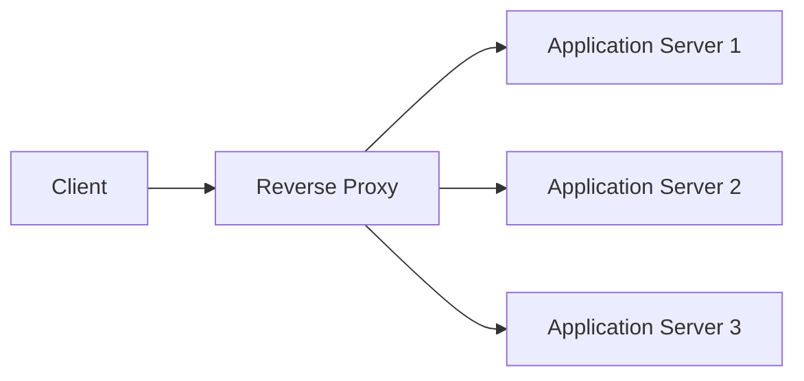
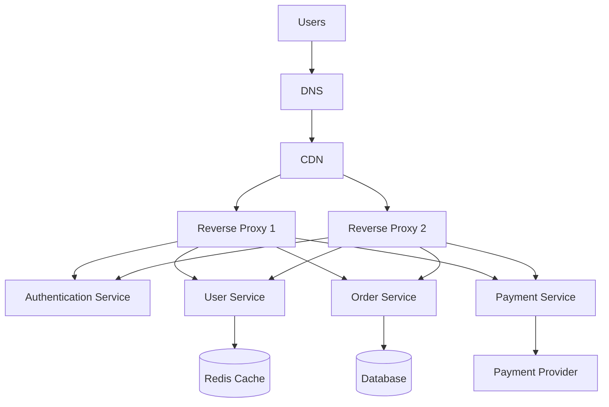
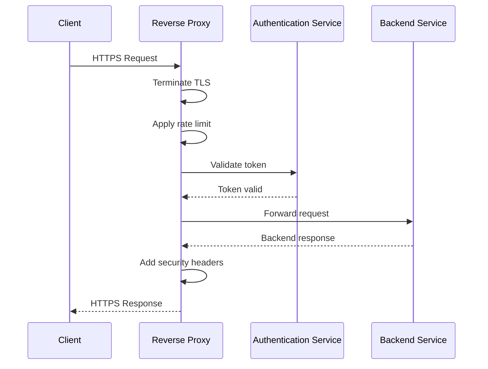
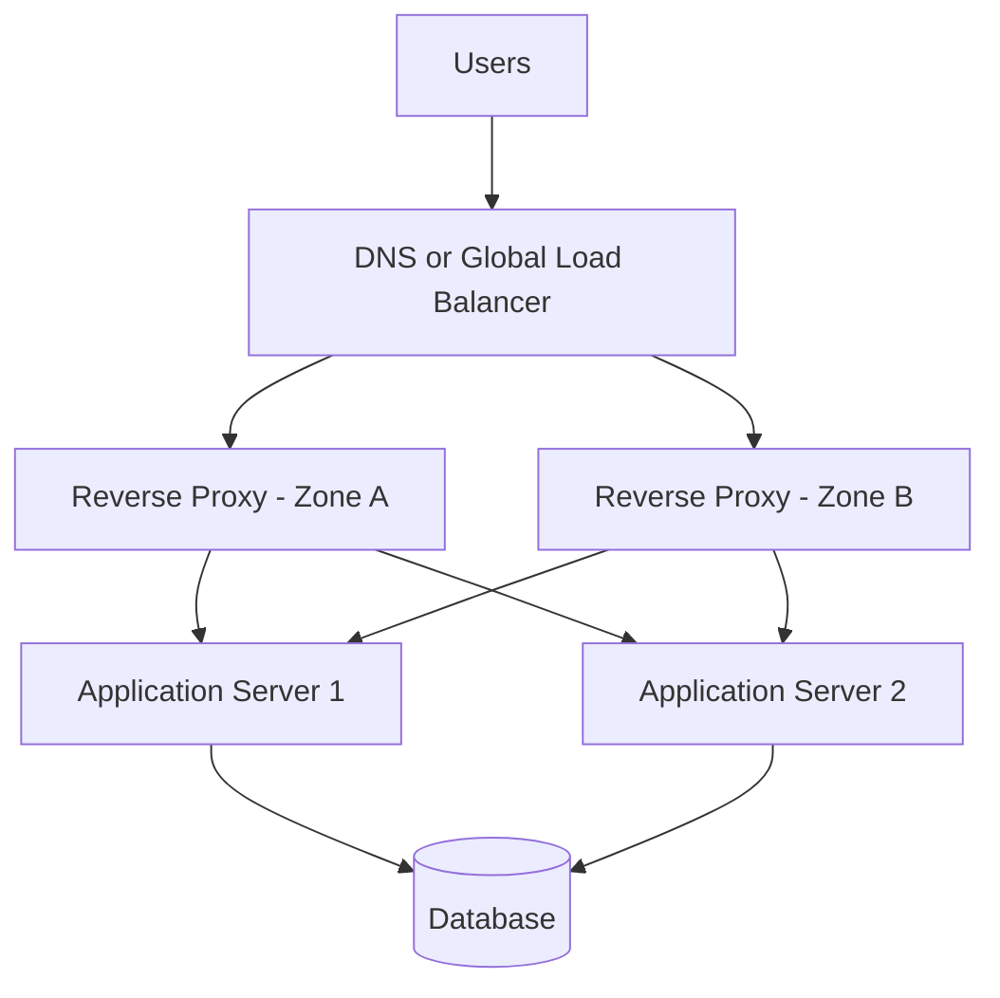
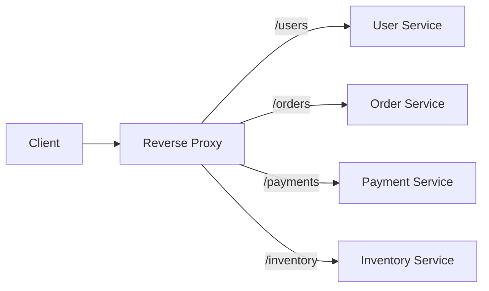
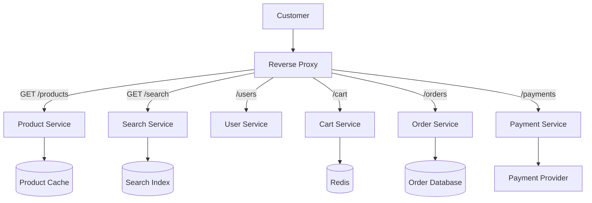

# Reverse Proxy

A **reverse proxy** is a server that sits between clients and backend servers.

Clients communicate with the reverse proxy instead of connecting directly to application servers.

It acts as the entry point to your system, receives requests from clients, and forwards them to the appropriate backend service.


```text
Client → Reverse Proxy → Backend Server
```

The client usually does not know:

* Which backend server processed the request
* Where the backend server is located
* How many backend servers exist
* Whether the request was cached
* Whether the response came from a primary or fallback server

The reverse proxy hides the internal architecture and provides a single public entry point.

### Without a Reverse Proxy

```text
Client ───────────────→ Application Server
```

The application server is directly exposed to the internet.

### With a Reverse Proxy

```text
                         ┌──→ Application Server 1
Client → Reverse Proxy ──┼──→ Application Server 2
                         └──→ Application Server 3
```

The reverse proxy receives the request, applies routing rules, selects a backend server, and returns the response to the client.

Popular reverse-proxy technologies include **Nginx, HAProxy, Envoy, Traefik, Apache HTTP Server, and cloud-managed load balancers**.

---

## Why Reverse Proxy?

### 1. Hide Backend Infrastructure

Clients only see the reverse proxy's public address.

Internal information such as backend IP addresses, ports, and service topology remains hidden.

```text
Public Internet
      ↓
Reverse Proxy
      ↓
Private Backend Network
```

This reduces direct exposure of application servers.

---

### 2. Load Distribution

A reverse proxy can distribute incoming traffic across multiple backend servers.

```text
                       ┌──→ Server A
User Requests → Proxy ─┼──→ Server B
                       └──→ Server C
```

Common load-balancing algorithms include:

* Round robin
* Weighted round robin
* Least connections
* Least response time
* IP hash
* Consistent hashing
* Random selection

---

### 3. SSL/TLS Termination

The reverse proxy can handle HTTPS connections on behalf of backend services.

```text
Client
  ↓ HTTPS
Reverse Proxy
  ↓ HTTP or HTTPS
Backend Service
```

This centralizes:

* Certificate management
* TLS configuration
* Certificate renewal
* Cipher configuration
* HTTPS redirects

Backend services can remain focused on application logic.

---

### 4. Centralized Routing

A reverse proxy can route requests according to the URL, hostname, headers, or other request properties.

```text
/api/users      → User Service
/api/orders     → Order Service
/api/payments   → Payment Service
/static         → Object Storage
admin.example.com → Admin Service
```

This makes reverse proxies especially useful in microservice architectures.

---

### 5. Improved Security

A reverse proxy can provide security controls before requests reach the application.

Common controls include:

* Rate limiting
* Request-size limits
* IP filtering
* Authentication
* Web Application Firewall integration
* Bot protection
* Header validation
* DDoS mitigation
* Removal of sensitive response headers

---

### 6. Better Reliability

Unhealthy servers can be removed from the request-routing pool.

```text
Server A → Healthy
Server B → Unhealthy
Server C → Healthy
```

The proxy sends new traffic only to healthy servers.

---

### 7. Response Caching

A reverse proxy may cache responses and serve them without contacting the backend.

```text
Request → Reverse Proxy Cache

Cache hit  → Return cached response
Cache miss → Request backend response
```

Caching can reduce latency and backend load.

---

### 8. Protocol Translation

A reverse proxy may accept one protocol and communicate with backend services using another.

Examples:

```text
HTTP/2 → HTTP/1.1
HTTPS  → HTTP
HTTP   → gRPC
WebSocket → Internal WebSocket Service
```

---

## Core Concepts

## Forward Proxy vs Reverse Proxy

A forward proxy represents the client.

A reverse proxy represents the server.

```text
Forward Proxy:

Client → Forward Proxy → Internet


Reverse Proxy:

Internet → Reverse Proxy → Backend Servers
```

The client intentionally connects through a forward proxy.

With a reverse proxy, the client may not know that a proxy exists.

---

## Upstream Server

An **upstream server** is a backend server that receives requests from the reverse proxy.

Examples include:

* Application servers
* Microservices
* API services
* Authentication servers
* Object storage
* Legacy applications

```text
Reverse Proxy → Upstream Server
```

A group of upstream servers is often called an **upstream pool** or **backend pool**.

---

## Routing

Routing determines which backend service should receive a request.

### Path-Based Routing

```text
/users     → User Service
/orders    → Order Service
/payments  → Payment Service
```

### Host-Based Routing

```text
api.example.com   → API Service
admin.example.com → Admin Dashboard
media.example.com → Media Service
```

### Header-Based Routing

```text
X-API-Version: 1 → API Version 1
X-API-Version: 2 → API Version 2
```

### Method-Based Routing

```text
GET /reports  → Read Service
POST /reports → Write Service
```

---

## Load Balancing

Load balancing distributes requests across multiple upstream servers.

### Round Robin

Requests are distributed sequentially.

```text
Request 1 → Server A
Request 2 → Server B
Request 3 → Server C
Request 4 → Server A
```

It is simple and works well when servers have similar capacity.

### Weighted Round Robin

Servers receive traffic according to assigned weights.

```text
Server A → Weight 5
Server B → Weight 3
Server C → Weight 2
```

Server A receives more requests because it has more capacity.

### Least Connections

The request is sent to the server with the fewest active connections.

This can work well for long-running requests.

### IP Hash

The client's IP address is used to select a backend server.

This can provide basic session affinity, but it may create uneven traffic distribution.

### Consistent Hashing

Requests with the same key are routed to the same backend when possible.

Common keys include:

* User ID
* Session ID
* Tenant ID
* Cache key
* Request path

Consistent hashing reduces request movement when servers are added or removed.

---

## Health Checks

A reverse proxy should determine whether an upstream server is healthy.

### Active Health Check

The proxy sends periodic requests to a health endpoint.

```http
GET /health
```

Example response:

```http
HTTP/1.1 200 OK
```

### Passive Health Check

The proxy observes real traffic.

If a server repeatedly times out or returns errors, it may be temporarily removed from rotation.

### Readiness vs Liveness

* **Liveness** checks whether the application is running.
* **Readiness** checks whether the application can safely receive traffic.

A server may be alive but not ready because it is warming caches, running migrations, or waiting for a dependency.

---

## TLS Termination

TLS termination means the reverse proxy decrypts HTTPS traffic.

```text
Client
  ↓ Encrypted HTTPS
Reverse Proxy
  ↓ Decrypted HTTP or Re-encrypted HTTPS
Backend
```

Benefits include:

* Centralized certificate management
* Reduced TLS work on application servers
* Consistent security policies
* Easier HTTPS enforcement

For sensitive environments, traffic between the proxy and backend should also be encrypted.

---

## Connection Pooling

The reverse proxy can reuse backend connections instead of creating a new connection for every request.

```text
Many Client Connections
          ↓
    Reverse Proxy
          ↓
Smaller Pool of Reused Backend Connections
```

Connection pooling reduces:

* TCP handshake overhead
* TLS handshake overhead
* Backend connection pressure
* Request latency

---

## Timeouts

Timeouts protect the system from slow or unresponsive connections.

Important timeout types include:

* Connection timeout
* Read timeout
* Write timeout
* Idle timeout
* Request timeout
* Upstream response timeout

Timeouts should be configured deliberately instead of relying on overly large defaults.

---

## Retries

A reverse proxy can retry failed requests on another backend server.

```text
Request
  ↓
Server A → Failure
  ↓ Retry
Server B → Success
```

Retries are safer for idempotent operations such as:

```http
GET /products/123
```

Retries may be dangerous for operations such as:

```http
POST /payments
```

A repeated non-idempotent request could create duplicate side effects.

---

## Circuit Breaking

Circuit breaking temporarily stops requests from being sent to an unhealthy or overloaded service.

```text
Closed    → Requests are allowed
Open      → Requests are rejected or redirected
Half-open → Limited requests test recovery
```

Circuit breakers prevent repeated failures from spreading through the system.

---

## Rate Limiting

Rate limiting controls how many requests a client can send during a specific period.

```text
100 requests per minute per user
1,000 requests per minute per API key
10 login attempts per minute per IP
```

Common algorithms include:

* Token bucket
* Leaky bucket
* Fixed window
* Sliding window
* Sliding-window log

---

## Sticky Sessions

Sticky sessions route the same user to the same backend server.

```text
User A → Server 1
User A → Server 1
User A → Server 1
```

They may be implemented using:

* Cookies
* Client IP
* Session identifiers
* Consistent hashing

Sticky sessions can simplify stateful applications, but they reduce flexibility and may create uneven server load.

A more scalable approach is to store session state in a shared system such as Redis or a database.

---

## Buffering

A reverse proxy can buffer client requests or backend responses.

For example, the proxy may receive a large upload before forwarding it to the application server.

Benefits include:

* Protecting slow backend services
* Handling slow clients efficiently
* Reducing connection duration on application servers
* Applying request-size limits

Buffering should be configured carefully for streaming and real-time applications.

---

## Architecture

## Basic Reverse Proxy Architecture



The reverse proxy:

1. Receives the client request
2. Applies security rules
3. Selects a backend server
4. Forwards the request
5. Receives the backend response
6. Returns the response to the client

---

## Production Architecture



Multiple reverse proxies should be deployed to avoid creating a single point of failure.

---

## Request Flow



### Step-by-Step Flow

1. The client resolves the domain name.
2. The request reaches the reverse proxy.
3. The proxy terminates the TLS connection.
4. Security and rate-limiting rules are applied.
5. The proxy evaluates routing rules.
6. A healthy backend server is selected.
7. The request is forwarded to the backend.
8. The backend processes the request.
9. The proxy receives the response.
10. Response headers, compression, or caching rules are applied.
11. The response is returned to the client.

---

## High-Availability Architecture



To improve availability:

* Run multiple proxy instances
* Deploy across multiple availability zones
* Use health checks
* Automate configuration deployment
* Monitor proxy capacity
* Keep backend servers private
* Test failover regularly

---

## Microservices Architecture



The reverse proxy provides one public endpoint while internal services remain independently deployable.

---

## Example Nginx Configuration

```nginx
upstream backend_servers {
    least_conn;

    server app-1:8080;
    server app-2:8080;
    server app-3:8080;
}

server {
    listen 443 ssl;
    server_name api.example.com;

    ssl_certificate     /etc/ssl/cert.pem;
    ssl_certificate_key /etc/ssl/key.pem;

    location /api/ {
        proxy_pass http://backend_servers;

        proxy_set_header Host $host;
        proxy_set_header X-Real-IP $remote_addr;
        proxy_set_header X-Forwarded-For $proxy_add_x_forwarded_for;
        proxy_set_header X-Forwarded-Proto $scheme;

        proxy_connect_timeout 3s;
        proxy_read_timeout 30s;
    }
}
```

This example:

* Accepts HTTPS traffic
* Uses least-connections load balancing
* Routes requests to three backend servers
* Preserves important client information
* Configures upstream timeouts

The configuration is intentionally simplified. Production settings should include stronger TLS policies, health checks, observability, request limits, and secure network controls.

---

## Important Proxy Headers

A reverse proxy often adds headers that preserve information about the original request.

### `X-Forwarded-For`

Contains the originating client IP address and possibly a chain of proxies.

```http
X-Forwarded-For: 203.0.113.10, 10.0.0.5
```

### `X-Forwarded-Proto`

Identifies the protocol used by the client.

```http
X-Forwarded-Proto: https
```

### `X-Forwarded-Host`

Preserves the original host requested by the client.

```http
X-Forwarded-Host: api.example.com
```

### `X-Real-IP`

Often contains the original client IP address.

```http
X-Real-IP: 203.0.113.10
```

Applications should trust these headers only when they come from known proxy infrastructure.

---

## Comparisons

## Reverse Proxy vs Forward Proxy

| Reverse Proxy                       | Forward Proxy                                    |
| ----------------------------------- | ------------------------------------------------ |
| Represents backend servers          | Represents clients                               |
| Hides internal servers              | Hides client identity or location                |
| Used for routing and load balancing | Used for filtering or controlled internet access |
| Deployed by service owners          | Deployed by clients or organizations             |
| Receives public application traffic | Sends client traffic to external services        |

```text
Forward Proxy:
Client → Proxy → Internet

Reverse Proxy:
Internet → Proxy → Backend
```

---

## Reverse Proxy vs Load Balancer

| Reverse Proxy                           | Load Balancer                                 |
| --------------------------------------- | --------------------------------------------- |
| Proxies requests to backend services    | Distributes traffic across servers            |
| Can route by path, host, or headers     | Primarily balances traffic                    |
| May provide caching and TLS termination | May operate at Layer 4 or Layer 7             |
| Can modify requests and responses       | May perform minimal request modification      |
| Often includes load-balancing features  | May have a narrower traffic-distribution role |

A reverse proxy can act as a load balancer, but load balancing is only one of its possible responsibilities.

---

## Reverse Proxy vs API Gateway

| Reverse Proxy                           | API Gateway                                            |
| --------------------------------------- | ------------------------------------------------------ |
| General traffic-routing component       | API-focused management layer                           |
| Routes requests to backend services     | Manages API consumers and policies                     |
| Commonly handles TLS and load balancing | Commonly handles quotas, API keys, and transformations |
| Usually simpler                         | Usually provides more API-specific features            |
| Suitable for websites and APIs          | Primarily designed for APIs                            |

An API gateway often behaves like a specialized reverse proxy.

---

## Reverse Proxy vs CDN

| Reverse Proxy                            | CDN                                             |
| ---------------------------------------- | ----------------------------------------------- |
| Usually runs near backend infrastructure | Runs across globally distributed edge locations |
| Routes requests to application servers   | Delivers content close to users                 |
| Handles application-level traffic        | Optimized for caching and global delivery       |
| Protects internal services               | Reduces distance and origin traffic             |
| May cache responses                      | Caching is a primary capability                 |

A common architecture uses both:

```text
User → CDN → Reverse Proxy → Backend Services
```

---

## Reverse Proxy vs Service Mesh

| Reverse Proxy                       | Service Mesh                             |
| ----------------------------------- | ---------------------------------------- |
| Usually handles north-south traffic | Commonly handles east-west traffic       |
| Sits at the system boundary         | Operates between internal services       |
| Provides public request routing     | Provides service-to-service policies     |
| Usually uses a shared gateway       | Often uses sidecar or node-level proxies |
| Protects backend entry points       | Manages internal communication           |

### North-South Traffic

Traffic entering or leaving the system:

```text
User → Reverse Proxy → Service
```

### East-West Traffic

Traffic between internal services:

```text
Order Service → Payment Service
```

---

## Reverse Proxy vs Web Server

| Reverse Proxy                         | Web Server                                  |
| ------------------------------------- | ------------------------------------------- |
| Forwards requests to another service  | Serves content directly                     |
| Hides backend servers                 | Hosts files or application responses        |
| Can balance traffic                   | May handle requests locally                 |
| Often acts as an infrastructure layer | Often acts as an application delivery layer |

The same software can sometimes perform both roles.

---

## Layer 4 vs Layer 7 Proxying

| Layer 4 Proxy                    | Layer 7 Proxy                                   |
| -------------------------------- | ----------------------------------------------- |
| Operates at TCP or UDP level     | Operates at HTTP or application level           |
| Routes based on IP and port      | Routes based on path, host, headers, or cookies |
| Lower processing overhead        | More advanced routing capabilities              |
| Does not need to understand HTTP | Understands request semantics                   |
| Useful for databases and raw TCP | Useful for web applications and APIs            |

---

## Real-World Example: E-Commerce Platform

Consider an online store with the following services:

* Product service
* Search service
* User service
* Cart service
* Order service
* Payment service
* Admin dashboard

### Without a Reverse Proxy

Clients may need to know multiple service addresses.

```text
products.example.com → Product Service
search.example.com   → Search Service
users.example.com    → User Service
orders.example.com   → Order Service
```

This creates several challenges:

* Complex client configuration
* Direct backend exposure
* Repeated TLS configuration
* Inconsistent security rules
* Difficult service migrations
* Limited centralized traffic control

---

### With a Reverse Proxy



The customer uses one domain:

```text
https://api.store.example
```

The proxy routes requests internally:

```text
GET  /products/123 → Product Service
GET  /search?q=bag → Search Service
POST /cart/items   → Cart Service
POST /orders       → Order Service
POST /payments     → Payment Service
```

---

### Flash-Sale Scenario

During a flash sale, thousands of users request the same product page.

The reverse proxy can:

* Rate-limit abusive clients
* Cache public product responses
* Balance requests across product servers
* Reject oversized requests
* Remove unhealthy servers
* Enforce request timeouts
* Preserve backend capacity for checkout traffic

```text
                        ┌──→ Product Server 1
Users → Reverse Proxy ──┼──→ Product Server 2
                        └──→ Product Server 3
```

---

### Payment Request Scenario

A payment request should be handled differently from a product-page request.

```text
Product GET request:
May be cached and safely retried

Payment POST request:
Should not be cached and should not be blindly retried
```

Suggested rules:

| Request          | Proxy Behavior                 |
| ---------------- | ------------------------------ |
| Product image    | Cache aggressively             |
| Product details  | Cache briefly                  |
| Search request   | Apply rate limiting            |
| Login request    | Strict rate limiting           |
| Cart update      | Do not use shared cache        |
| Order creation   | Use request identifiers        |
| Payment creation | Avoid unsafe automatic retries |
| Health check     | Route only for monitoring      |

---

## Best Practices

### 1. Deploy Multiple Proxy Instances

A single reverse proxy becomes a single point of failure.

```text
                  ┌──→ Reverse Proxy A
Users → DNS or LB ┤
                  └──→ Reverse Proxy B
```

Deploy proxies across multiple zones or machines.

---

### 2. Keep Backend Servers Private

Application servers should not normally be directly reachable from the public internet.

Use:

* Private subnets
* Firewall rules
* Security groups
* Network access controls
* Mutual TLS
* Proxy authentication

Allow backend traffic only from trusted infrastructure.

---

### 3. Configure Health Checks

Route traffic only to healthy and ready servers.

Health checks should verify important dependencies without performing expensive operations.

A readiness endpoint might validate:

* Database connectivity
* Cache availability
* Required configuration
* Startup completion

Avoid returning healthy simply because the process is running.

---

### 4. Use Sensible Timeouts

Never allow requests to remain open indefinitely.

Example starting points:

```text
Connection timeout: Short
Read timeout: Based on expected operation time
Idle timeout: Based on client behavior
Long-running jobs: Use asynchronous processing
```

Timeouts should be based on real latency measurements.

---

### 5. Retry Carefully

Retry only when the operation is safe.

Good retry candidates:

* Idempotent reads
* Temporary connection failures
* Selected upstream errors
* Requests with idempotency protection

Risky retry candidates:

* Payments
* Order creation
* Email sending
* Inventory reduction
* Any request with side effects

Use:

* Retry limits
* Exponential backoff
* Retry budgets
* Idempotency keys
* Per-request deadlines

---

### 6. Preserve Client Information Securely

Forward required client information through trusted headers.

```http
X-Forwarded-For
X-Forwarded-Proto
X-Request-ID
```

Remove untrusted versions of these headers from public requests before adding trusted values.

Otherwise, clients may spoof their IP address or protocol.

---

### 7. Add Request IDs

Assign a unique ID to every request.

```http
X-Request-ID: 7dc2c608-7090-4adc-a531-5db3cf247af4
```

Pass the same ID through:

* Reverse proxy logs
* Application logs
* Service-to-service requests
* Distributed traces
* Error responses

This makes debugging much easier.

---

### 8. Centralize TLS Management

Use the reverse proxy to:

* Enforce HTTPS
* Redirect HTTP to HTTPS
* Manage certificates
* Disable weak protocols
* Rotate certificates
* Configure secure ciphers

Automate certificate renewal wherever possible.

---

### 9. Apply Rate Limits at Multiple Levels

Different endpoints require different limits.

```text
Public product API → High limit
Search API         → Medium limit
Login endpoint     → Low limit
Password reset     → Very low limit
Admin API          → Strict authenticated limit
```

Rate limits may be based on:

* IP address
* User ID
* API key
* Tenant
* Route
* Geographic region

---

### 10. Limit Request Size

Large requests can consume memory, bandwidth, and backend connections.

Set limits for:

* Request body size
* Header size
* URL length
* File uploads
* Concurrent connections

Reject invalid requests before they reach backend services.

---

### 11. Use Graceful Draining

When removing a backend server, stop sending it new requests while allowing active requests to complete.

```text
Active → Draining → Removed
```

Graceful draining prevents abrupt connection failures during deployments.

---

### 12. Make Configuration Changes Safely

Proxy configuration errors can affect the entire application.

Recommended practices:

* Validate configuration before reload
* Use version control
* Test changes in staging
* Roll out gradually
* Support fast rollback
* Use automated configuration checks
* Avoid manual production-only changes

---

### 13. Monitor the Proxy Layer

Important metrics include:

* Request rate
* Error rate
* Response latency
* Upstream latency
* Active connections
* Queue length
* Timeout count
* Retry count
* Rejected requests
* Rate-limit events
* Backend health
* Response-size distribution
* TLS handshake latency

Important log fields include:

```text
Request ID
Client IP
HTTP method
Request path
Status code
Selected upstream
Total response time
Upstream response time
Bytes transferred
User agent
```

---

### 14. Separate Static and Dynamic Traffic

Static content may be cached or routed to object storage.

Dynamic traffic should be routed to application services.

```text
/static/* → CDN or Object Storage
/api/*    → Application Services
```

This reduces unnecessary backend work.

---

### 15. Use Compression Carefully

Compress text-based responses such as:

* HTML
* CSS
* JavaScript
* JSON
* XML
* SVG

Avoid compressing files that are already compressed, such as:

* JPEG
* PNG
* MP4
* ZIP

Disable compression for sensitive responses when compression-related side-channel risks are relevant.

---

### 16. Set Resource Limits

Protect the proxy from resource exhaustion.

Limit:

* Worker processes
* Memory usage
* Open connections
* Request queues
* Header sizes
* Buffer sizes
* Per-client connections

Capacity planning should include peak traffic, retries, slow clients, and backend degradation.

---

### 17. Use Progressive Delivery

The reverse proxy can support safer releases.

#### Canary Release

```text
95% traffic → Version 1
5% traffic  → Version 2
```

#### Blue-Green Deployment

```text
Current traffic → Blue Environment
New version     → Green Environment
```

After validation, traffic is switched to green.

#### Header-Based Testing

```text
X-Beta-User: true → New Backend Version
```

---

### 18. Fail Closed for Sensitive Operations

For authentication, authorization, and payment-related checks, avoid silently allowing traffic when a required security dependency fails.

Example:

```text
Authentication service unavailable
          ↓
Reject protected request
```

Do not bypass required security checks merely to preserve availability.

---

## Common Mistakes

### 1. Creating a Single Point of Failure

Running only one reverse-proxy instance can make the entire application unavailable if it fails.

Use multiple instances with health-based failover.

---

### 2. Trusting Client-Supplied Proxy Headers

A client may send a fake header:

```http
X-Forwarded-For: 127.0.0.1
```

If the application trusts it blindly, attackers may bypass IP-based controls.

The proxy should remove untrusted forwarding headers and generate trusted values itself.

---

### 3. Using Unlimited Timeouts

Very large or unlimited timeouts allow slow requests to consume connections and memory.

Use appropriate deadlines and move long-running work to background-processing systems.

---

### 4. Retrying Every Failed Request

Blind retries can duplicate:

* Payments
* Orders
* Emails
* Account changes
* Inventory updates

Retry policies must consider HTTP method, failure type, idempotency, and remaining request deadline.

---

### 5. Incorrect Health Checks

A weak health check may report success even when the service cannot process requests.

A health endpoint should reflect the server's ability to serve traffic.

It should not be so expensive that the health check itself overloads the application.

---

### 6. Exposing Backend Servers

If backend IP addresses remain publicly reachable, attackers can bypass:

* Rate limits
* Web Application Firewalls
* Authentication rules
* DDoS protections
* Request validation

Restrict backend access to trusted proxy infrastructure.

---

### 7. Logging Sensitive Data

Proxy logs should not expose:

* Passwords
* Access tokens
* Session cookies
* Credit-card data
* Private request bodies
* Personal information

Redact or exclude sensitive headers and parameters.

---

### 8. Ignoring WebSocket and Streaming Traffic

Default proxy settings may buffer or terminate long-lived connections.

WebSocket, Server-Sent Events, video streaming, and large uploads often need dedicated timeout and buffering rules.

---

### 9. Using Sticky Sessions Without a Recovery Plan

When a sticky-session server fails, its users may lose their session state.

Prefer shared session storage when possible.

---

### 10. Caching Private Responses

Incorrect caching may expose one user's information to another user.

Avoid shared caching for:

* Account pages
* Shopping carts
* Payment responses
* Personalized dashboards
* Authentication endpoints

Use correct cache headers and include only necessary values in cache keys.

---

### 11. Applying One Rate Limit to Every Endpoint

A login endpoint and a product catalog have different abuse risks.

Use route-specific and identity-aware rate limits.

---

### 12. Not Accounting for Proxy Capacity

A reverse proxy can become a bottleneck due to:

* CPU-intensive TLS processing
* Too many open connections
* Insufficient memory
* Large buffers
* Excessive logging
* Slow backend services
* Poor connection limits

Monitor capacity and scale the proxy tier independently.

---

### 13. Misconfiguring Client IP Handling

When several proxies exist, the client IP may appear in a chain.

```http
X-Forwarded-For: client, proxy-1, proxy-2
```

The application must know which proxies are trusted and which address represents the actual client.

---

### 14. Reloading Configuration Unsafely

An invalid configuration can interrupt all incoming traffic.

Always validate configuration before deployment or reload.

---

### 15. Treating a Reverse Proxy as a Complete Security Solution

A reverse proxy improves security, but it does not replace:

* Secure application code
* Authentication
* Authorization
* Input validation
* Secret management
* Database security
* Dependency patching
* Network segmentation

Security must exist at multiple layers.

---

## Interview Questions

### 1. What is a reverse proxy?

A reverse proxy is a server that receives client requests and forwards them to backend servers. It hides the backend infrastructure and can provide routing, load balancing, TLS termination, caching, and security controls.

---

### 2. What is the difference between a forward proxy and a reverse proxy?

A forward proxy represents clients when accessing external systems. A reverse proxy represents backend servers and receives requests from external clients.

---

### 3. How does a reverse proxy improve system reliability?

It distributes traffic across healthy servers, removes unhealthy servers from rotation, applies timeouts, supports retries, and allows backend servers to be replaced without changing the public endpoint.

---

### 4. Why can retries be dangerous at a reverse proxy?

Retries can duplicate side effects for non-idempotent operations such as payments or order creation. They should be limited to safe operations or protected using idempotency keys.

---

### 5. How do you prevent a reverse proxy from becoming a single point of failure?

Run multiple proxy instances across separate machines or availability zones, use health-based traffic routing, automate configuration deployment, monitor capacity, and regularly test failover.

---

## Key Takeaways

### 1. A reverse proxy is the controlled entry point to backend services

It hides internal servers and centralizes routing, TLS, security, and traffic management.

### 2. Reliability depends on careful configuration

Health checks, retries, timeouts, connection pooling, rate limits, and graceful draining must be designed intentionally.

### 3. The proxy layer must also be highly available

A reverse proxy protects backend services only when the proxy itself is redundant, observable, secure, and correctly scaled.

---

## Final Architecture Summary

```text
Users
  ↓
DNS or Global Traffic Manager
  ↓
CDN
  ↓
Reverse Proxy Cluster
  ├── TLS Termination
  ├── Authentication
  ├── Rate Limiting
  ├── Request Routing
  ├── Load Balancing
  ├── Health Checks
  └── Response Caching
          ↓
     Backend Services
          ↓
Cache / Database / Queue / External APIs
```

> A well-designed reverse proxy does more than forward traffic. It creates a secure, reliable, and observable boundary between users and backend services.

---

⭐ **Star this repository** if this guide helped you understand reverse-proxy system design.

👀 **Follow for more practical backend architecture, scalability, and system design guides.**
