# Sidecar Pattern

The **Sidecar Pattern** deploys a supporting component alongside an application instance.

The application and its sidecar run as separate processes but share the same lifecycle, network environment, and deployment boundary.

```text
Application Instance
├── Main Application
└── Sidecar
```

The main application handles business logic.

The sidecar handles supporting responsibilities such as:

* Service-to-service communication
* Logging
* Metrics collection
* Distributed tracing
* Authentication
* TLS encryption
* Configuration synchronization
* Secret delivery
* Retry and timeout policies
* Traffic routing

The pattern is common in containerized systems, Kubernetes environments, service meshes, and distributed applications.

Popular technologies that use or support sidecars include:

* Envoy
* Istio
* Linkerd
* HashiCorp Vault Agent
* Fluent Bit
* Fluentd
* OpenTelemetry Collector
* Dapr

---

## Core Concepts

### Main Application

The main application contains the business logic.

Examples include:

* Order processing
* Payment handling
* User management
* Inventory updates
* Notification delivery

The application should remain focused on its primary responsibility.

```text
Order Service
├── Create orders
├── Validate order data
└── Update order status
```

Supporting infrastructure concerns can be delegated to the sidecar.

---

### Sidecar

A sidecar is a separate process or container deployed next to the main application.

```text
Pod or Deployment Unit
├── Application Container
└── Sidecar Container
```

The sidecar may:

* Intercept network traffic
* Forward logs
* Collect metrics
* Refresh secrets
* Apply security policies
* Manage retries
* Handle protocol translation

The application and sidecar are independently implemented but operationally connected.

---

### Shared Lifecycle

The sidecar usually starts, runs, scales, and stops with the main application.

```text
Application starts → Sidecar starts
Application scales → Sidecar scales
Application stops  → Sidecar stops
```

If five application instances are deployed, five sidecar instances are usually deployed as well.

```text
Application 1 + Sidecar 1
Application 2 + Sidecar 2
Application 3 + Sidecar 3
```

This provides local and isolated support for every application instance.

---

### Shared Network

In container platforms such as Kubernetes, containers inside the same pod commonly share a network namespace.

This means the application can communicate with its sidecar through `localhost`.

```text
Application → localhost:15001 → Sidecar Proxy
```

The sidecar can then forward the request to another service.

```text
Application
    ↓ localhost
Sidecar Proxy
    ↓ network
Remote Service
```

The application does not need to know the remote service's exact network configuration.

---

### Shared Storage

The application and sidecar may share a volume.

```text
Application → Shared Log File
                   ↓
              Log Sidecar
                   ↓
          Central Log Platform
```

Shared storage is useful for:

* Log forwarding
* Configuration files
* Generated certificates
* Temporary files
* Secrets
* Application artifacts

Shared volumes should be protected with appropriate file permissions.

---

### Separation of Concerns

The Sidecar Pattern separates business logic from infrastructure logic.

```text
Application Responsibilities:
- Business rules
- Domain validation
- Data processing

Sidecar Responsibilities:
- Networking
- Security
- Observability
- Configuration
```

This reduces duplicated infrastructure code across services.

---

### Language Independence

A sidecar communicates with the application through standard interfaces such as:

* HTTP
* gRPC
* TCP
* Unix domain sockets
* Shared files
* Environment variables

Therefore, the application and sidecar can use different programming languages.

```text
Java Application
      ↓ HTTP
Go Sidecar
```

This allows infrastructure capabilities to be reused across Java, Python, Go, Node.js, and other services.

---

### Traffic Interception

A network sidecar can intercept incoming and outgoing traffic.

```text
Outgoing Traffic:

Application → Sidecar → Remote Service


Incoming Traffic:

Client → Sidecar → Application
```

Traffic interception can be implemented through:

* Proxy configuration
* Network rules
* Service-mesh injection
* Local ports
* Operating-system routing rules

This enables the sidecar to apply policies without changing the application code.

---

### Service Mesh Sidecar

A service mesh commonly deploys a proxy sidecar beside every service instance.

```text
Service A                    Service B
├── Application A           ├── Application B
└── Proxy Sidecar A         └── Proxy Sidecar B
```

Communication becomes:

```text
Application A
      ↓
Sidecar A
      ↓ Encrypted network
Sidecar B
      ↓
Application B
```

The sidecars may handle:

* Mutual TLS
* Service discovery
* Load balancing
* Retries
* Circuit breaking
* Traffic splitting
* Metrics
* Distributed tracing

---

### Observability Sidecar

An observability sidecar collects application telemetry.

```text
Application
   ├── Logs
   ├── Metrics
   └── Traces
        ↓
Observability Sidecar
        ↓
Monitoring Platform
```

This avoids embedding a separate monitoring integration into every application.

---

### Security Sidecar

A security sidecar may provide:

* Certificate rotation
* Secret retrieval
* Token exchange
* Request signing
* Local authentication
* Encryption
* Policy enforcement

Example:

```text
Application
     ↓ Request secret
Vault Agent Sidecar
     ↓
Secret Management System
```

The sidecar can write short-lived credentials into a shared volume for the application.

---

### Configuration Sidecar

A configuration sidecar watches a centralized configuration source and updates local files.

```text
Configuration Service
        ↓
Configuration Sidecar
        ↓
Shared Configuration File
        ↓
Application
```

This can support dynamic configuration updates without rebuilding the application image.

---

### Adapter Sidecar

An adapter converts one interface or format into another.

Examples:

```text
Application Logs → Adapter → Standard Log Format
```

```text
Legacy Protocol → Adapter → HTTP API
```

```text
Custom Metrics → Adapter → Prometheus Format
```

Adapters help older or specialized applications integrate with modern infrastructure.

---

### Ambassador Sidecar

An ambassador sidecar manages communication with external services.

```text
Application
    ↓ Local connection
Ambassador Sidecar
    ↓
External Database or API
```

It may handle:

* Connection pooling
* Retries
* Service discovery
* Authentication
* Failover
* Protocol conversion

The application communicates with a simple local endpoint while the sidecar manages remote complexity.

---

## Architecture

### Basic Sidecar Architecture

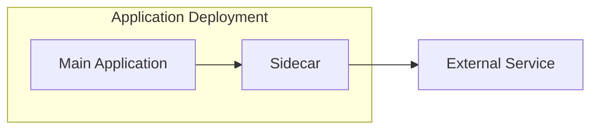

The application delegates a supporting responsibility to the sidecar.

---

### Incoming and Outgoing Traffic

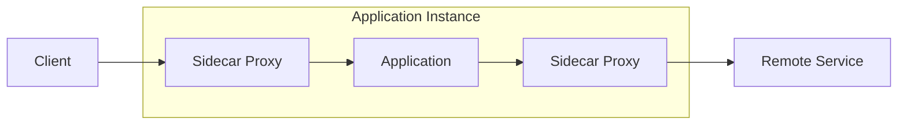

The sidecar can control both inbound and outbound communication.

---

### Service Mesh Architecture

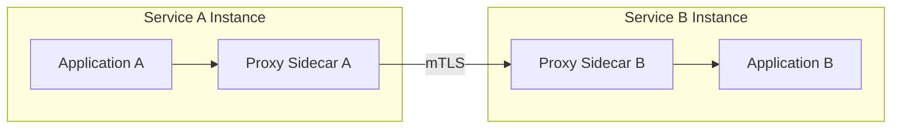

The applications communicate through local proxies.

The proxy layer manages networking and security policies.

---

### Kubernetes Sidecar Architecture

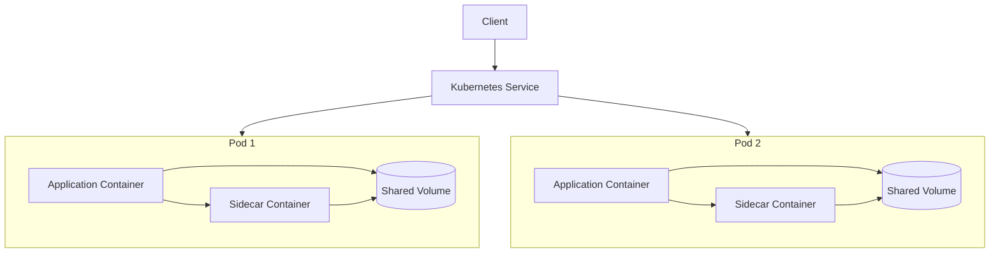

Each pod contains an application container and its own sidecar.

---

### Log Collection Architecture

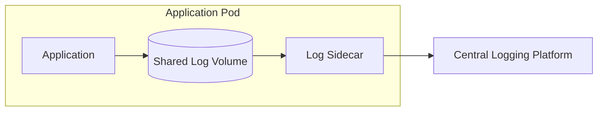

The application writes logs locally.

The sidecar reads, transforms, enriches, and forwards them.

---

### Secret Management Architecture

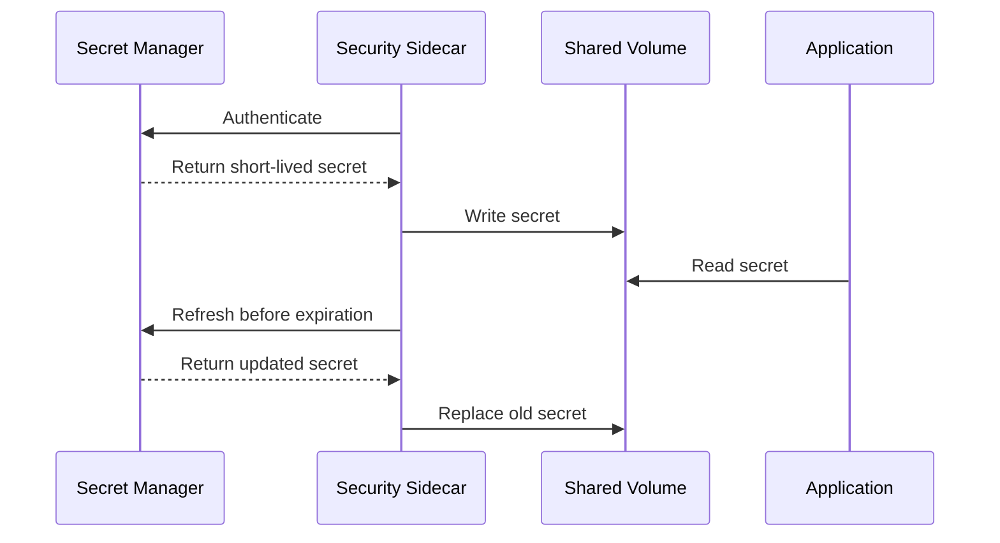

The application does not need to directly implement secret-manager authentication or refresh logic.

---

### Request Flow

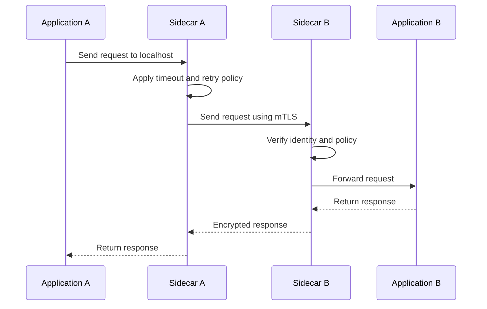

### Step-by-Step Flow

1. Application A sends a request to its local sidecar.
2. Sidecar A resolves the destination service.
3. The sidecar applies routing, timeout, and security policies.
4. Sidecar A connects to Sidecar B.
5. The sidecars establish an encrypted connection.
6. Sidecar B validates the source identity.
7. Sidecar B forwards the request to Application B.
8. Application B processes the request.
9. The response returns through both sidecars.
10. Metrics, logs, and traces are recorded.

---

### High-Level Production Architecture

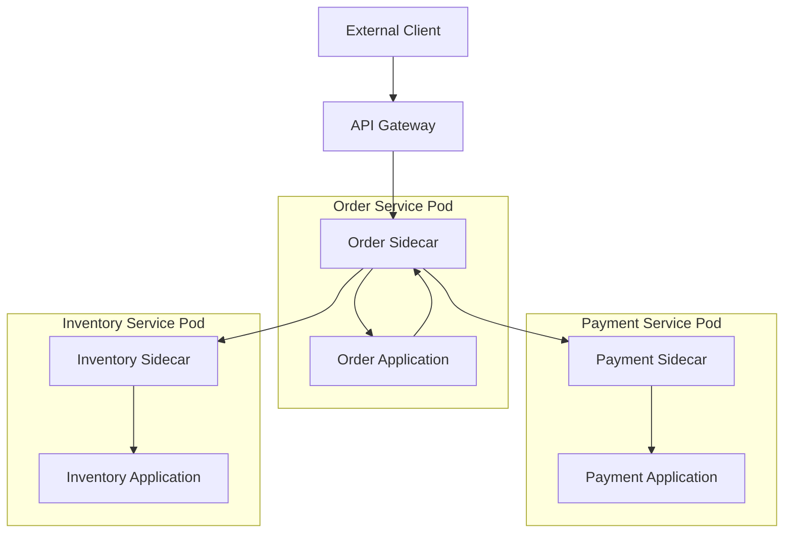

The API Gateway manages external traffic.

Sidecars manage communication between internal services.

---

## Comparisons

### Sidecar vs Library

| Sidecar                            | Shared Library                                 |
| ---------------------------------- | ---------------------------------------------- |
| Runs as a separate process         | Runs inside the application process            |
| Language-independent               | Usually language-specific                      |
| Can be updated separately          | Requires application rebuild or redeployment   |
| Communicates over local interfaces | Uses in-process function calls                 |
| Adds network and resource overhead | Has lower communication overhead               |
| Isolates infrastructure logic      | Couples infrastructure code to the application |

A library is usually faster, while a sidecar provides stronger separation and broader language support.

---

### Sidecar vs API Gateway

| Sidecar                                      | API Gateway                          |
| -------------------------------------------- | ------------------------------------ |
| Runs beside each application instance        | Runs at the system boundary          |
| Handles local or service-to-service concerns | Handles external client traffic      |
| Commonly manages east-west traffic           | Commonly manages north-south traffic |
| Scales with every application replica        | Scales as a shared gateway tier      |
| Has local application context                | Has public API context               |

```text
External Traffic:
Client → API Gateway → Service

Internal Traffic:
Service → Sidecar → Sidecar → Service
```

Many architectures use both.

---

### Sidecar vs Reverse Proxy

| Sidecar                                     | Reverse Proxy                         |
| ------------------------------------------- | ------------------------------------- |
| Deployment pattern                          | Traffic-management component          |
| Runs beside an application instance         | May run as shared infrastructure      |
| Can handle logs, secrets, and configuration | Primarily handles network traffic     |
| Shares the application's lifecycle          | May have an independent lifecycle     |
| One sidecar commonly exists per replica     | One proxy may serve many applications |

A reverse proxy can be deployed as a sidecar, but not every sidecar is a reverse proxy.

---

### Sidecar vs Service Mesh

| Sidecar                                    | Service Mesh                                    |
| ------------------------------------------ | ----------------------------------------------- |
| A deployment pattern                       | A complete service-communication platform       |
| Can support one application concern        | Manages communication across many services      |
| May be manually configured                 | Usually centrally controlled                    |
| Can handle logging, secrets, or networking | Focuses mainly on service-to-service networking |
| Does not require a control plane           | Usually includes a control plane                |

A service mesh often uses sidecar proxies as its data plane.

---

### Sidecar vs DaemonSet

| Sidecar                                    | DaemonSet                           |
| ------------------------------------------ | ----------------------------------- |
| Runs once per application pod              | Usually runs once per cluster node  |
| Shares the application's lifecycle         | Shares the node's lifecycle         |
| Has direct local access to the application | Serves multiple pods on the node    |
| Consumes resources per replica             | Consumes resources per node         |
| Provides strong application isolation      | Provides better resource efficiency |

A logging agent may be deployed as a sidecar or as a node-level DaemonSet.

---

### Sidecar vs Init Container

| Sidecar                                    | Init Container                     |
| ------------------------------------------ | ---------------------------------- |
| Runs alongside the application             | Runs before the application starts |
| Usually remains active                     | Exits after initialization         |
| Handles continuous work                    | Handles startup tasks              |
| Can refresh secrets or collect logs        | Can download initial configuration |
| Shares the application's runtime lifecycle | Controls startup preparation       |

Example:

```text
Init Container:
Download configuration → Exit → Start application

Sidecar:
Start with application → Run continuously
```

---

### Sidecar vs Ambassador Pattern

| Sidecar Pattern                          | Ambassador Pattern                               |
| ---------------------------------------- | ------------------------------------------------ |
| General deployment pattern               | Specialized communication pattern                |
| Handles many supporting responsibilities | Focuses on external communication                |
| May collect logs or manage secrets       | Commonly manages retries, routing, and discovery |
| Describes where the component runs       | Describes what the component does                |

An ambassador is commonly implemented as a sidecar.

---

### Sidecar vs Adapter Pattern

| Sidecar Pattern                          | Adapter Pattern                              |
| ---------------------------------------- | -------------------------------------------- |
| Defines deployment beside an application | Converts interfaces or formats               |
| Can perform networking or security       | Focuses on compatibility                     |
| May or may not transform data            | Transformation is its primary responsibility |
| Infrastructure-oriented                  | Integration-oriented                         |

An adapter can also be deployed as a sidecar.

---

### Sidecar vs Backend for Frontend

| Sidecar                                  | Backend for Frontend                  |
| ---------------------------------------- | ------------------------------------- |
| Supports one application instance        | Supports one client type              |
| Usually internal infrastructure          | Usually client-facing                 |
| Handles cross-cutting technical concerns | Shapes APIs for web or mobile clients |
| Runs locally beside an application       | Runs as an independent backend        |
| Scales with service replicas             | Scales with client traffic            |

---

## Real-World Example: E-Commerce Microservices

Consider an e-commerce platform with:

* Product service
* Cart service
* Order service
* Inventory service
* Payment service
* Notification service

Each service is written by a different team.

Some services use Java, while others use Go, Python, or Node.js.

The platform requires:

* Encrypted service communication
* Distributed tracing
* Request retries
* Circuit breaking
* Traffic metrics
* Consistent access logs

### Without Sidecars

Each team adds these capabilities directly into its application.

```text
Order Service
├── Business logic
├── TLS configuration
├── Retry code
├── Metrics code
├── Tracing code
└── Service-discovery code
```

This creates several problems:

* Infrastructure code is duplicated
* Implementations differ between languages
* Policies are difficult to update
* Services require frequent rebuilds
* Security configuration becomes inconsistent

---

### With Sidecars

Every service receives a local proxy sidecar.

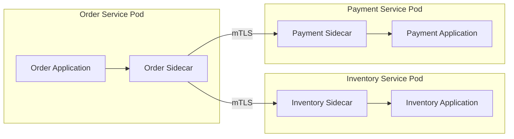

The applications use simple local connections.

```text
Order Application → localhost → Order Sidecar
```

The sidecars handle:

* Service discovery
* Mutual TLS
* Timeouts
* Retries
* Circuit breaking
* Traffic metrics
* Trace propagation

---

### Order Creation Flow

A customer creates an order.

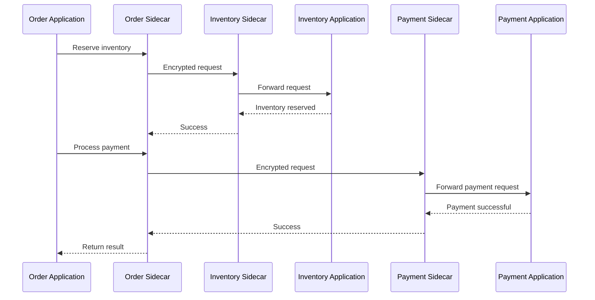

The Order application does not directly manage certificates, service locations, or network retries.

---

### Failure Scenario

Suppose the Payment service becomes slow.

The Order sidecar may:

1. Apply a request timeout.
2. Stop waiting after the deadline.
3. Open a circuit breaker after repeated failures.
4. Reject new payment requests quickly.
5. Record failure metrics.
6. Add trace information for debugging.

```text
Order Application
      ↓
Order Sidecar
      ↓
Circuit Open
      ↓
Fast Failure
```

This prevents slow payment requests from consuming all Order service connections.

---

### Canary Deployment

A new version of the Inventory service is released.

The sidecar layer can split traffic:

```text
95% → Inventory Version 1
5%  → Inventory Version 2
```

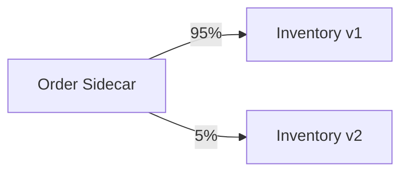

If error rates increase, traffic can be returned to Version 1 without changing the Order application.

---

### Observability Flow

Every sidecar records:

* Source service
* Destination service
* Request count
* Response status
* Request latency
* Retry count
* Connection failures
* Trace identifiers

```text
Order Sidecar
Inventory Sidecar
Payment Sidecar
        ↓
Metrics and Tracing Platform
```

This produces a consistent view of communication across all services.

---

## Best Practices

### 1. Keep Sidecars Focused

A sidecar should have a clear responsibility.

Good examples include:

* Network proxy
* Log forwarder
* Secret agent
* Metrics collector
* Configuration watcher

Avoid placing unrelated responsibilities into one large sidecar.

```text
Preferred:
Application + Network Sidecar + Log Sidecar

Avoid:
Application + One Sidecar Handling Everything
```

Focused components are easier to test, secure, and replace.

---

### 2. Measure Resource Overhead

Every sidecar consumes:

* CPU
* Memory
* Network connections
* File descriptors
* Storage
* Startup time

Suppose a system runs 1,000 application replicas and each sidecar uses 100 MB of memory.

```text
1,000 × 100 MB = 100,000 MB
```

That is approximately 100 GB of additional memory.

Sidecar overhead must be included in capacity planning.

---

### 3. Set CPU and Memory Limits

Configure resource requests and limits.

```yaml
resources:
  requests:
    cpu: 100m
    memory: 128Mi
  limits:
    cpu: 500m
    memory: 256Mi
```

Limits prevent a sidecar from consuming all resources assigned to the application unit.

Requests help the scheduler place workloads correctly.

---

### 4. Configure Health Checks

The sidecar and application should expose separate health states.

```text
Application healthy + Sidecar unhealthy = Instance not ready
```

Check:

* Sidecar process health
* Local proxy readiness
* Required configuration
* Certificate availability
* Connection to control systems
* Shared-volume access

Do not route traffic until both application and sidecar are ready.

---

### 5. Coordinate Startup Order

Some applications depend on the sidecar being ready before starting network operations.

Possible strategies include:

* Readiness probes
* Startup probes
* Retry loops
* Local health endpoints
* Init containers
* Platform-native sidecar lifecycle controls

The application should not assume the sidecar is immediately available.

---

### 6. Handle Shutdown Gracefully

During shutdown:

1. Stop accepting new traffic.
2. Drain existing connections.
3. Allow active requests to complete.
4. Flush logs and telemetry.
5. Stop the application and sidecar safely.

```text
Ready → Draining → Terminated
```

Abrupt sidecar termination may interrupt active application requests.

---

### 7. Avoid Hidden Retry Multiplication

Retries may occur at several layers.

```text
Client retries
    ↓
API Gateway retries
    ↓
Sidecar retries
    ↓
Application retries
```

Three retries at each layer can produce many backend attempts from one original request.

Choose one layer to own retries whenever possible.

Use:

* Retry budgets
* Attempt limits
* Per-request deadlines
* Exponential backoff
* Jitter

---

### 8. Retry Only Safe Operations

Retries are safer for idempotent operations.

```http
GET /products/123
```

Retries can be dangerous for operations with side effects.

```http
POST /payments
```

For sensitive operations, use idempotency keys.

```http
Idempotency-Key: order-83921-payment-1
```

---

### 9. Use End-to-End Deadlines

A sidecar should respect the total request deadline.

```text
Client deadline: 3 seconds

Gateway processing: 300 ms
Sidecar routing: 100 ms
Backend time remaining: 2.6 seconds
```

Retries should not continue after the client deadline has expired.

---

### 10. Secure Local Communication

Local communication is not automatically safe.

Protect local interfaces with:

* Restricted ports
* Unix domain sockets
* File permissions
* Process identities
* Authentication tokens
* Network policies

Do not assume every process sharing a host or pod is trusted.

---

### 11. Use Mutual TLS Carefully

When sidecars manage mutual TLS:

* Rotate certificates automatically
* Use short-lived identities
* Validate service names
* Protect private keys
* Monitor expiration
* Reject invalid certificates
* Keep certificate authorities secure

Encryption without identity verification is not enough.

---

### 12. Keep Business Logic Out of the Sidecar

The sidecar should not decide:

* Product pricing
* Payment approval
* Inventory rules
* Order eligibility
* Customer permissions

These decisions belong to the application.

The sidecar may enforce technical policies, but business rules should remain in domain services.

---

### 13. Standardize Configuration

Use centrally managed and version-controlled sidecar configuration.

Recommended practices:

* Store configuration in version control
* Validate changes automatically
* Test in staging
* Roll out gradually
* Maintain rollback support
* Audit configuration changes
* Avoid manual production edits

A sidecar configuration mistake can affect every service.

---

### 14. Roll Out Sidecar Updates Gradually

Updating a sidecar may change networking behavior across the system.

Use:

* Canary deployment
* Percentage-based rollout
* Environment-by-environment rollout
* Automatic rollback
* Compatibility testing

Do not update every service instance simultaneously without validation.

---

### 15. Maintain Version Compatibility

Applications and sidecars may be updated independently.

Test compatibility between:

* Current application and current sidecar
* Current application and new sidecar
* New application and current sidecar
* New application and new sidecar

Define supported version ranges.

---

### 16. Expose Sidecar Metrics

Important metrics include:

* Request rate
* Error rate
* Request latency
* Retry count
* Timeout count
* Circuit-breaker state
* Active connections
* Connection failures
* Certificate expiration
* CPU usage
* Memory usage
* Configuration reload failures

Monitor sidecar latency separately from application latency.

---

### 17. Preserve Trace Context

The sidecar should forward distributed-tracing headers.

Common examples include:

```http
traceparent
tracestate
baggage
```

The same trace should connect:

```text
Client
  ↓
API Gateway
  ↓
Sidecar A
  ↓
Application A
  ↓
Sidecar B
  ↓
Application B
```

Do not generate unrelated trace identifiers at every layer.

---

### 18. Protect Sensitive Logs

Sidecars may observe all application traffic.

Do not log:

* Passwords
* Access tokens
* Session cookies
* Payment details
* Personal information
* Secret values
* Full private request bodies

Use structured logging and field redaction.

---

### 19. Avoid Unnecessary Sidecars

A sidecar is not always the best solution.

Consider alternatives when:

* The feature is simple
* Only one application needs it
* In-process performance is critical
* The platform already provides the capability
* A node-level agent would be more efficient
* Operational complexity outweighs the benefit

Use sidecars when separation, reuse, or language independence provides real value.

---

### 20. Design for Partial Failure

The application and sidecar can fail independently.

Possible states include:

```text
Application healthy, sidecar healthy
Application healthy, sidecar unhealthy
Application unhealthy, sidecar healthy
Application unhealthy, sidecar unhealthy
```

Readiness and routing decisions should account for both components.

---

### 21. Limit Sidecar Privileges

Follow the principle of least privilege.

Avoid:

* Root execution
* Unnecessary host access
* Broad file permissions
* Unrestricted network access
* Excessive Linux capabilities
* Shared administrative credentials

A compromised sidecar may have visibility into sensitive application traffic.

---

### 22. Test Failure Scenarios

Test how the system behaves when:

* The sidecar crashes
* The application crashes
* Configuration becomes invalid
* Certificates expire
* The control plane is unavailable
* The destination service is slow
* Shared storage becomes unavailable
* The sidecar reaches memory limits
* Network connections are interrupted

Failure testing should be part of deployment validation.

---

## Common Mistakes

### 1. Adding a Sidecar Without a Clear Need

Sidecars add operational and resource costs.

Do not use the pattern simply because it is popular.

First identify the responsibility that must be separated from the application.

---

### 2. Ignoring Resource Consumption

One small sidecar may appear inexpensive.

Thousands of replicas can make the total overhead significant.

Always calculate aggregate CPU and memory use.

---

### 3. Treating Localhost as Fully Trusted

Other containers or processes may access local ports.

Sensitive sidecar endpoints should still require proper access controls.

---

### 4. Putting Business Logic in the Sidecar

Business logic inside a sidecar becomes difficult to test, version, and understand.

Keep domain decisions inside the main application.

---

### 5. Retrying Non-Idempotent Requests

Automatic retries can duplicate:

* Payments
* Orders
* Messages
* Inventory changes
* Account updates

Retry only safe operations or use idempotency protection.

---

### 6. Creating Retry Storms

Multiple sidecars may retry requests against an already overloaded service.

```text
Service slows down
      ↓
Sidecars retry
      ↓
Traffic increases
      ↓
Service becomes slower
```

Use retry budgets, exponential backoff, jitter, and circuit breakers.

---

### 7. Using Long or Unlimited Timeouts

Long timeouts consume connections and delay failure detection.

Use realistic deadlines based on the operation.

---

### 8. Ignoring Startup Dependencies

An application may begin sending traffic before the sidecar is ready.

Use readiness checks and retry logic instead of assuming startup order.

---

### 9. Stopping the Sidecar Too Early

If the sidecar exits before the application finishes active requests, those requests may fail.

Use graceful draining and coordinated shutdown.

---

### 10. Deploying Sidecar Changes Everywhere at Once

A faulty proxy or logging configuration can affect the entire platform.

Roll out changes gradually and maintain rollback capability.

---

### 11. Failing to Monitor the Sidecar

Application metrics may look healthy while the sidecar introduces latency, errors, or connection failures.

Monitor both layers independently.

---

### 12. Giving the Sidecar Excessive Permissions

A sidecar often sees sensitive traffic and files.

Running it with broad privileges increases the impact of a compromise.

---

### 13. Using Sidecars for Every Shared Capability

Some capabilities are better implemented through:

* Shared libraries
* Platform services
* Node-level agents
* API Gateways
* Managed cloud services

Choose the deployment model based on isolation, performance, and operational cost.

---

### 14. Creating Too Many Sidecars

A pod containing many sidecars may become difficult to operate.

```text
Application
├── Proxy Sidecar
├── Logging Sidecar
├── Metrics Sidecar
├── Secret Sidecar
└── Configuration Sidecar
```

This increases:

* Resource use
* Startup complexity
* Failure modes
* Deployment time
* Debugging difficulty

Consolidate responsibilities only when the security and operational tradeoffs are acceptable.

---

### 15. Assuming the Sidecar Solves Application Problems

A sidecar cannot fix:

* Slow database queries
* Incorrect business logic
* Poor data modeling
* Memory leaks in the application
* Inefficient algorithms
* Incorrect authorization rules

It supports the application but does not replace good application design.

---

## Interview Questions

### 1. What is the Sidecar Pattern?

The Sidecar Pattern deploys a supporting process or container beside an application instance. The sidecar handles cross-cutting concerns such as networking, logging, security, or configuration while the application focuses on business logic.

---

### 2. Why are sidecars common in service meshes?

Service meshes use proxy sidecars to intercept service-to-service traffic. The proxies provide mutual TLS, load balancing, retries, traffic policies, metrics, and tracing without requiring every application to implement those features.

---

### 3. What is the main disadvantage of using sidecars?

The main disadvantage is operational and resource overhead. Every application replica may require another process that consumes CPU, memory, connections, and deployment capacity.

---

### 4. How is a sidecar different from a shared library?

A sidecar runs as a separate process and is language-independent. A shared library runs inside the application process, has lower communication overhead, and is usually tied to a specific programming language.

---

### 5. When should you avoid the Sidecar Pattern?

Avoid it when the requirement is simple, performance requires in-process execution, the platform already provides the capability, or the additional deployment and resource complexity provides little benefit.

---

## Key Takeaways

### 1. Sidecars separate business logic from infrastructure concerns

They allow applications to focus on domain behavior while supporting components handle networking, security, telemetry, configuration, or integration.

### 2. Sidecars improve consistency but add operational cost

A shared sidecar implementation can standardize policies across multiple languages, but every replica adds CPU, memory, startup, and debugging overhead.

### 3. Sidecars must be treated as part of the application

Their health, security, lifecycle, capacity, version compatibility, and failure behavior directly affect application reliability.

---

## Final Architecture Summary

```text
External Client
      ↓
API Gateway
      ↓
Application Pod
├── Main Application
│     └── Business Logic
│
└── Sidecar
      ├── Traffic Management
      ├── Mutual TLS
      ├── Retries and Timeouts
      ├── Metrics and Tracing
      ├── Secret Management
      └── Configuration
              ↓
       Other Services
```

> A well-designed sidecar removes infrastructure complexity from application code without hiding the operational cost of running an additional component beside every service instance.

---

⭐ **Star this repository** if this guide made the Sidecar Pattern easier to understand.

👀 **Follow for more practical backend architecture, scalability, distributed systems, and system design guides.**
