# SSL/TLS

**SSL/TLS** secures communication between clients, servers, APIs, databases, and internal services.

Although the term **SSL** is still widely used, modern systems use **TLS — Transport Layer Security**. SSL is outdated and should not be enabled in production.

```text
Without TLS:

Client ───── Plaintext Data ─────> Server


With TLS:

Client ───── Encrypted Data ─────> Server
```

TLS provides three essential protections:

* **Confidentiality:** Other parties cannot easily read the data.
* **Integrity:** Data cannot be silently modified in transit.
* **Authentication:** Clients can verify the identity of the server.

TLS is used by:

* HTTPS websites
* REST and GraphQL APIs
* Microservices
* Databases
* Message brokers
* Email systems
* Mobile applications
* Cloud infrastructure

---

## Core Concepts

### SSL vs TLS

**SSL — Secure Sockets Layer** was the original protocol used to secure network communication.

TLS replaced SSL with stronger security and improved cryptographic design.

```text
SSL 2.0 → Deprecated
SSL 3.0 → Deprecated
TLS 1.0 → Deprecated
TLS 1.1 → Deprecated
TLS 1.2 → Widely supported
TLS 1.3 → Modern and preferred
```

In everyday conversation, people often say “SSL certificate,” but the certificate is normally used with TLS.

---

### Encryption

Encryption converts readable data into an unreadable form.

```text
Plaintext:
password=hello123

Encrypted:
8f7a2d9c4e...
```

Only a party with the correct cryptographic key can recover the original data.

TLS uses both:

* **Asymmetric cryptography**
* **Symmetric cryptography**

---

### Symmetric Encryption

Symmetric encryption uses the same secret key to encrypt and decrypt data.

```text
Shared Secret Key
      ↓
Encrypt Data
      ↓
Encrypted Data
      ↓
Decrypt with Same Key
```

Symmetric encryption is fast, making it suitable for protecting application traffic after a secure connection has been established.

Examples include:

* AES
* ChaCha20

---

### Asymmetric Encryption

Asymmetric encryption uses a key pair:

* **Public key:** Can be shared
* **Private key:** Must remain secret

```text
Public Key  → Shared openly
Private Key → Stored securely
```

Data or signatures created using one key can be verified or processed using the corresponding key.

TLS uses asymmetric cryptography primarily for:

* Identity verification
* Digital signatures
* Secure key exchange

It is slower than symmetric encryption, so it is not normally used to encrypt all application data.

---

### Public Key

A public key can be distributed to clients.

It may be used to:

* Verify digital signatures
* Participate in secure key exchange
* Confirm that a certificate matches a private key

The public key is included in the server's certificate.

---

### Private Key

The private key proves control of the server identity.

It must never be:

* Committed to Git
* Included in a container image
* Shared through email or chat
* Stored in a public object-storage bucket
* Exposed in application logs

A compromised private key may allow an attacker to impersonate the server.

---

### Digital Certificate

A digital certificate connects a public key to an identity.

A certificate commonly contains:

* Domain name
* Public key
* Certificate issuer
* Validity period
* Serial number
* Signature algorithm
* Subject Alternative Names
* Certificate Authority signature

Example identity:

```text
api.example.com
```

The certificate tells the client:

> This public key belongs to `api.example.com`, and a trusted authority has verified it.

---

### Certificate Authority

A **Certificate Authority**, or **CA**, issues and signs digital certificates.

Examples include:

* Let's Encrypt
* DigiCert
* GlobalSign
* Google Trust Services
* Sectigo

The operating system or browser contains a list of trusted root Certificate Authorities.

```text
Trusted Root CA
      ↓
Intermediate CA
      ↓
Server Certificate
```

This structure is called the **certificate chain**.

---

### Root Certificate

A root certificate belongs to a trusted Root Certificate Authority.

Root certificates are typically stored in:

* Operating systems
* Browsers
* Mobile devices
* Application trust stores
* Server trust stores

Root private keys are highly protected because they form the foundation of the trust system.

---

### Intermediate Certificate

Certificate Authorities usually sign server certificates using an intermediate CA rather than directly using the root CA.

```text
Root CA
   ↓ signs
Intermediate CA
   ↓ signs
Server Certificate
```

This limits damage if an intermediate key is compromised.

A server should provide the required intermediate certificates during the TLS handshake.

---

### Certificate Chain

The client validates the server certificate by building a chain to a trusted root.

```text
Server Certificate
        ↓
Intermediate Certificate
        ↓
Trusted Root Certificate
```

If the chain is incomplete or untrusted, the client may reject the connection.

---

### Subject Alternative Name

The **Subject Alternative Name**, or **SAN**, lists the hostnames covered by a certificate.

Example:

```text
api.example.com
www.example.com
admin.example.com
```

Modern clients validate hostnames using SAN entries.

---

### Wildcard Certificate

A wildcard certificate covers multiple subdomains at one level.

```text
*.example.com
```

It may cover:

```text
api.example.com
shop.example.com
admin.example.com
```

It usually does not cover:

```text
example.com
v2.api.example.com
```

Wildcard certificates simplify certificate management but increase the impact of a private-key compromise.

---

### Self-Signed Certificate

A self-signed certificate is signed using its own private key instead of a publicly trusted Certificate Authority.

It can be useful for:

* Local development
* Internal test systems
* Private infrastructure with a custom trust store

Public clients will not trust it automatically.

---

### Domain Validation

A Certificate Authority must verify control over a domain before issuing a certificate.

Common validation methods include:

* DNS records
* HTTP challenge files
* TLS-based challenges

Automated protocols such as ACME make certificate issuance and renewal easier.

---

### TLS Handshake

The TLS handshake establishes a secure session before application data is exchanged.

A simplified TLS 1.3 handshake looks like this:

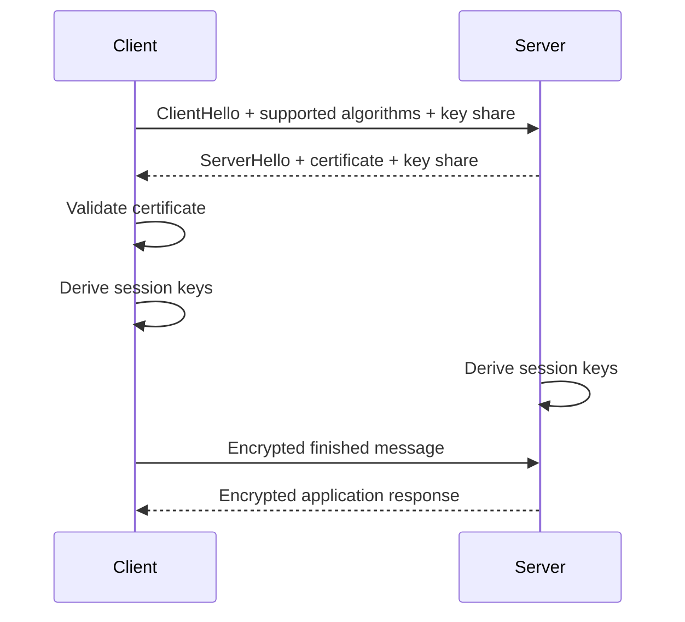

During the handshake:

1. The client sends supported TLS versions and cipher suites.
2. The server selects compatible options.
3. The server sends its certificate.
4. The client validates the certificate.
5. Both parties derive shared session keys.
6. Encrypted application communication begins.

---

### ClientHello

The client starts the TLS handshake with a `ClientHello`.

It commonly includes:

* Supported TLS versions
* Supported cipher suites
* Random data
* Key-share information
* Server Name Indication
* Supported application protocols

---

### ServerHello

The server responds with a `ServerHello`.

It selects:

* TLS version
* Cipher suite
* Key-share parameters
* Other connection settings

The server also provides its certificate and proof that it controls the associated private key.

---

### Server Name Indication

**Server Name Indication**, or **SNI**, allows the client to tell the server which hostname it wants to reach.

```text
Client connects to shared IP
          ↓
SNI: api.example.com
          ↓
Server selects api.example.com certificate
```

SNI allows multiple HTTPS websites to share the same IP address.

---

### Cipher Suite

A cipher suite defines the cryptographic algorithms used by a TLS connection.

It may specify:

* Key exchange
* Authentication
* Symmetric encryption
* Integrity protection

Modern systems should use strong, well-supported cipher suites instead of manually enabling outdated algorithms.

---

### Key Exchange

Key exchange allows the client and server to establish a shared secret.

Modern TLS commonly uses ephemeral Diffie-Hellman key exchange.

Examples include:

* ECDHE
* X25519

This supports **forward secrecy**.

---

### Forward Secrecy

Forward secrecy protects past sessions even if the server's long-term private key is compromised later.

```text
Private key compromised today
          ↓
Previously recorded sessions remain protected
```

This works because each connection uses temporary session keys that are not derived only from the certificate's private key.

---

### Session Key

After the handshake, both parties derive symmetric session keys.

```text
TLS Handshake
     ↓
Shared Session Keys
     ↓
Fast Symmetric Encryption
```

These keys protect the actual HTTP, API, or service traffic.

---

### Certificate Validation

A client should validate:

* The certificate is not expired
* The hostname matches
* The issuing CA is trusted
* The certificate signature is valid
* The certificate chain is complete
* The certificate is allowed for server authentication
* Revocation information, when applicable

Skipping certificate validation defeats much of the security provided by TLS.

---

### Certificate Expiration

Certificates are valid only for a specific period.

```text
Valid From: January 1
Valid Until: March 31
```

After expiration, clients may reject the connection.

Certificates should be renewed automatically and monitored before expiration.

---

### Certificate Revocation

A certificate may need to be revoked before it expires.

Reasons include:

* Private-key compromise
* Incorrect certificate issuance
* Domain ownership change
* Organization security incident

Revocation mechanisms include:

* Certificate Revocation Lists
* Online Certificate Status Protocol
* OCSP stapling

---

### OCSP Stapling

With OCSP stapling, the server periodically retrieves a signed certificate-status response and sends it to the client during the handshake.

```text
Certificate Authority
        ↓ Status response
Server
        ↓ Stapled response
Client
```

This can reduce client latency and limit direct client queries to the Certificate Authority.

---

### TLS Termination

TLS termination occurs when a component decrypts incoming TLS traffic.

```text
Client
  ↓ HTTPS
Load Balancer
  ↓ HTTP or HTTPS
Application Server
```

TLS may terminate at:

* CDN
* Load balancer
* Reverse proxy
* API Gateway
* Application server
* Service-mesh sidecar

Termination centralizes certificate management and reduces cryptographic work on backend applications.

---

### TLS Passthrough

With TLS passthrough, an intermediary forwards encrypted traffic without decrypting it.

```text
Client
  ↓ Encrypted TLS
Layer 4 Load Balancer
  ↓ Encrypted TLS
Application Server
```

The backend server performs the TLS handshake and owns the certificate.

Benefits include end-to-end encryption and reduced certificate exposure at the intermediary.

The tradeoff is that the intermediary cannot inspect HTTP paths, headers, or content.

---

### TLS Re-Encryption

TLS re-encryption uses one TLS connection from the client to the proxy and another TLS connection from the proxy to the backend.

```text
Client
  ↓ TLS Connection 1
Load Balancer
  ↓ TLS Connection 2
Backend Server
```

This protects traffic on both network segments while allowing the proxy to inspect and route requests.

---

### Mutual TLS

Standard TLS usually authenticates the server to the client.

**Mutual TLS**, or **mTLS**, authenticates both sides.

```text
Client Certificate → Server verifies client
Server Certificate → Client verifies server
```

mTLS is common in:

* Service-to-service communication
* Zero-trust networks
* Financial systems
* Partner APIs
* Internal administrative systems
* Service meshes

---

### One-Way TLS vs Mutual TLS

```text
One-Way TLS:
Client verifies server

Mutual TLS:
Client verifies server
Server verifies client
```

mTLS provides stronger identity verification but requires more certificate-management infrastructure.

---

### ALPN

**Application-Layer Protocol Negotiation**, or **ALPN**, allows the client and server to select an application protocol during the TLS handshake.

Examples include:

```text
HTTP/1.1
HTTP/2
HTTP/3
```

This lets a server support multiple protocols on the same port.

---

### TLS Session Resumption

TLS session resumption allows returning clients to reuse previously established session information.

Benefits include:

* Fewer handshake operations
* Lower latency
* Reduced CPU usage

Common techniques include:

* Session IDs
* Session tickets
* TLS 1.3 pre-shared keys

Session-ticket encryption keys must be protected and rotated securely.

---

### Zero-Round-Trip Data

TLS 1.3 supports optional **0-RTT** data for resumed sessions.

It can reduce latency but introduces replay risk.

```text
Client sends early data
        ↓
Attacker replays early data
```

0-RTT should not be used for operations such as:

* Payments
* Order creation
* Password changes
* Inventory updates
* Other non-idempotent actions

---

### HTTPS

HTTPS is HTTP transported over TLS.

```text
HTTPS = HTTP + TLS
```

TLS protects the connection, while HTTP defines the application request and response format.

Example:

```text
https://api.example.com/orders
```

---

### HTTP Strict Transport Security

**HTTP Strict Transport Security**, or **HSTS**, tells browsers to use HTTPS for a domain.

```http
Strict-Transport-Security: max-age=31536000; includeSubDomains
```

Once the browser receives this policy, it avoids insecure HTTP connections during the configured period.

HSTS should be introduced carefully because configuration errors can make a site unreachable.

---

## Architecture

### Basic HTTPS Architecture

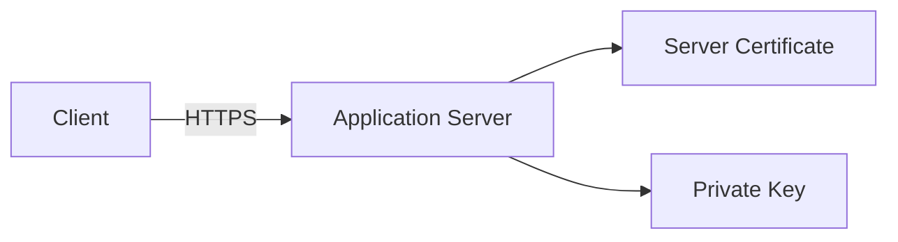

The application server performs the TLS handshake and handles encrypted traffic directly.

---

### TLS Termination at a Load Balancer

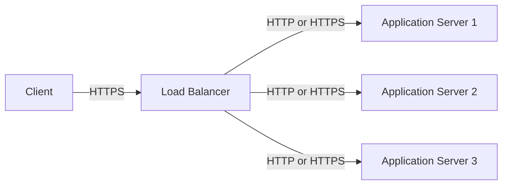

The load balancer:

* Stores the certificate
* Performs TLS handshakes
* Decrypts requests
* Selects a backend
* Optionally re-encrypts backend traffic

---

### Production Web Architecture

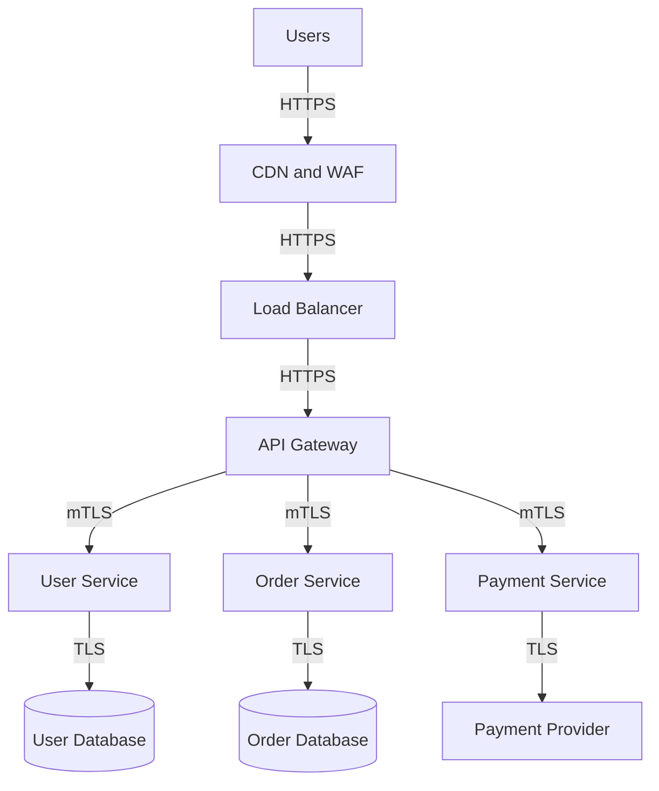

This architecture uses TLS across multiple boundaries:

* User to CDN
* CDN to load balancer
* Load balancer to API Gateway
* Gateway to internal services
* Services to databases
* Services to external providers

---

### TLS Passthrough Architecture

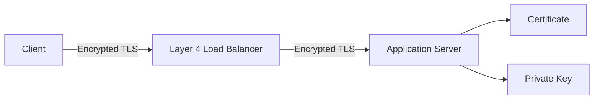

The load balancer forwards encrypted connections without inspecting application data.

---

### TLS Re-Encryption Architecture

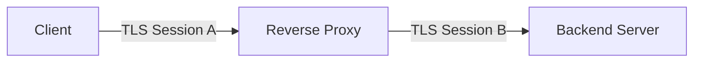

The proxy decrypts the request, applies routing or security rules, and establishes a separate secure connection to the backend.

---

### Mutual TLS Between Services

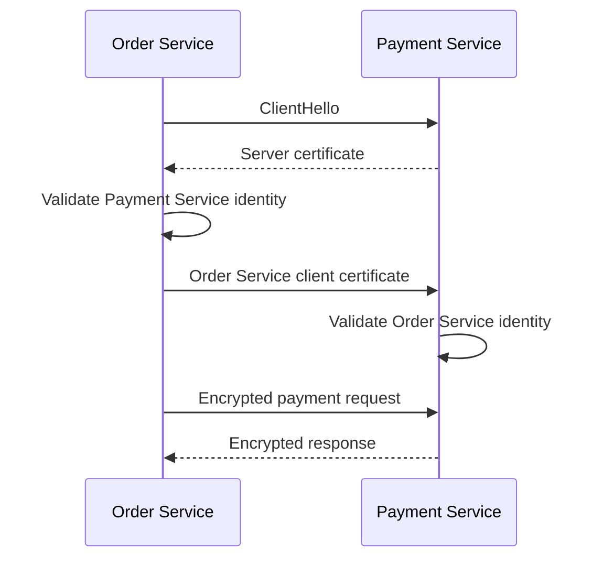

Both services validate each other's identities before exchanging application data.

---

### Service Mesh TLS Architecture

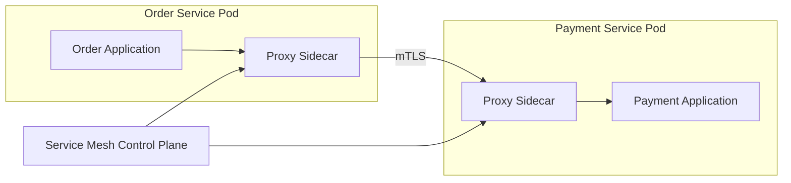

The service-mesh proxies may handle:

* Certificate issuance
* Certificate rotation
* Service identity
* Mutual TLS
* Authorization policies
* Encryption
* Telemetry

The applications can communicate locally while the sidecars secure network traffic.

---

### Certificate Issuance Flow

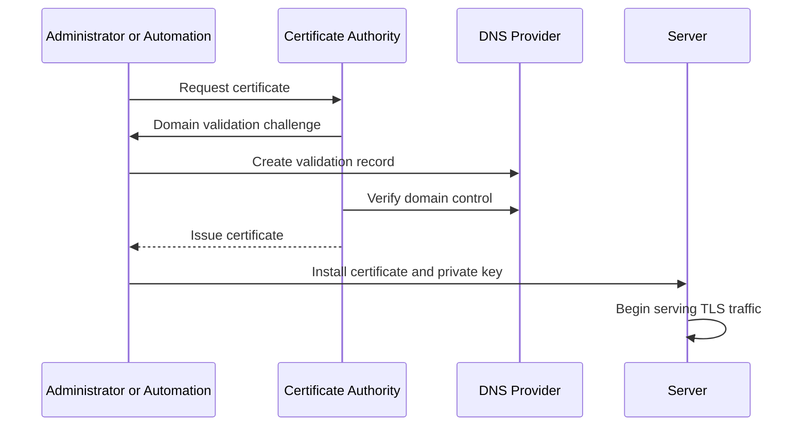

In production, this process should normally be automated.

---

### Certificate Renewal Flow

```text
Monitor expiration date
        ↓
Request renewed certificate
        ↓
Complete domain validation
        ↓
Install new certificate
        ↓
Reload service safely
        ↓
Verify connection
```

Renewal should happen well before the existing certificate expires.

---

## Comparisons

### SSL vs TLS

| SSL                               | TLS                               |
| --------------------------------- | --------------------------------- |
| Older security protocol           | Modern successor to SSL           |
| SSL 2.0 and 3.0 are insecure      | TLS 1.2 and 1.3 are widely used   |
| Should not be enabled             | Should protect production traffic |
| Commonly used as an informal term | Technically correct modern term   |

Use TLS in technical designs, even when a provider uses the phrase “SSL certificate.”

---

### TLS 1.2 vs TLS 1.3

| TLS 1.2                                   | TLS 1.3                           |
| ----------------------------------------- | --------------------------------- |
| Widely supported                          | Modern and preferred              |
| More configurable cipher choices          | Removes many weak options         |
| Usually requires more handshake steps     | Uses a faster handshake           |
| Supports older compatibility requirements | Provides stronger modern defaults |
| More opportunity for unsafe configuration | Simpler secure configuration      |

TLS 1.2 may still be required for older clients, while TLS 1.3 should be preferred when supported.

---

### HTTP vs HTTPS

| HTTP                                    | HTTPS                                 |
| --------------------------------------- | ------------------------------------- |
| Sends data without TLS protection       | Sends HTTP traffic over TLS           |
| Vulnerable to interception              | Encrypts data in transit              |
| Does not authenticate the server        | Uses certificates for server identity |
| Usually uses port 80                    | Usually uses port 443                 |
| Unsafe for credentials and private data | Required for secure web applications  |

---

### Symmetric vs Asymmetric Cryptography

| Symmetric                    | Asymmetric                                    |
| ---------------------------- | --------------------------------------------- |
| Uses one shared key          | Uses a public and private key pair            |
| Fast                         | Slower                                        |
| Protects application data    | Supports authentication and key exchange      |
| Requires secure key sharing  | Public key can be distributed                 |
| Used after the TLS handshake | Used during identity and handshake operations |

TLS combines both approaches.

---

### TLS Termination vs TLS Passthrough

| TLS Termination                           | TLS Passthrough                          |
| ----------------------------------------- | ---------------------------------------- |
| Proxy decrypts traffic                    | Proxy forwards encrypted traffic         |
| Supports Layer 7 routing                  | Usually limited to Layer 4 routing       |
| Centralizes certificate management        | Backend owns certificates                |
| Proxy can inspect requests                | Proxy cannot inspect application content |
| Backend traffic may require re-encryption | Encryption continues to backend          |

---

### One-Way TLS vs Mutual TLS

| One-Way TLS                            | Mutual TLS                               |
| -------------------------------------- | ---------------------------------------- |
| Client verifies server                 | Client and server verify each other      |
| Common for public websites             | Common for internal and partner systems  |
| Simpler certificate management         | Requires certificates for both sides     |
| User authentication happens separately | Client identity can be certificate-based |
| Lower operational complexity           | Stronger machine-to-machine identity     |

---

### Public CA vs Private CA

| Public CA                                     | Private CA                                    |
| --------------------------------------------- | --------------------------------------------- |
| Trusted by public browsers and devices        | Trusted only by configured internal systems   |
| Used for public websites and APIs             | Used for internal services and devices        |
| Public domain validation required             | Organization controls issuance policies       |
| Broad compatibility                           | Greater internal control                      |
| Certificate details may appear in public logs | Usually managed within private infrastructure |

---

### Wildcard vs Individual Certificates

| Wildcard Certificate                    | Individual Certificate            |
| --------------------------------------- | --------------------------------- |
| Covers multiple subdomains              | Covers specific hostnames         |
| Easier certificate management           | Smaller compromise scope          |
| Shared private key may be reused widely | Private keys can remain isolated  |
| Useful for many similar subdomains      | Better separation between systems |
| Compromise affects more services        | Compromise affects fewer names    |

---

### Self-Signed vs CA-Signed Certificate

| Self-Signed                                | CA-Signed                                 |
| ------------------------------------------ | ----------------------------------------- |
| Signed by its own private key              | Signed by a trusted CA                    |
| Not publicly trusted by default            | Automatically trusted when chain is valid |
| Useful for testing or private trust models | Suitable for public production systems    |
| Requires manual trust configuration        | Uses established certificate trust        |
| Easier to create                           | Easier for clients to validate            |

---

### TLS vs VPN

| TLS                                      | VPN                                               |
| ---------------------------------------- | ------------------------------------------------- |
| Secures specific application connections | Secures broader network traffic                   |
| Commonly works per hostname or service   | Creates a protected network tunnel                |
| Used by HTTPS, APIs, and databases       | Used for remote or site-to-site connectivity      |
| Application-aware                        | Network-level                                     |
| Can authenticate services directly       | Often authenticates users or devices to a network |

TLS and VPNs can be used together.

---

### TLS vs Encryption at Rest

| TLS                                     | Encryption at Rest                             |
| --------------------------------------- | ---------------------------------------------- |
| Protects data while moving              | Protects stored data                           |
| Secures network connections             | Secures disks, files, backups, or databases    |
| Does not protect stored copies          | Does not protect data traveling over a network |
| Requires certificate and key management | Requires storage-key management                |

Secure systems normally use both.

---

## Real-World Example: E-Commerce Checkout

Consider an e-commerce platform with:

* Web and mobile clients
* API Gateway
* Order service
* Payment service
* User service
* Database
* External payment provider

The platform processes sensitive information, including:

* Login credentials
* Addresses
* Session tokens
* Order information
* Payment-related data

---

### Without TLS

```text
Customer
   ↓ Plaintext credentials
Application
   ↓ Plaintext payment request
Payment Provider
```

An attacker positioned on the network may be able to:

* Read credentials
* Steal session tokens
* Modify requests
* Redirect traffic
* Capture personal information

---

### With TLS

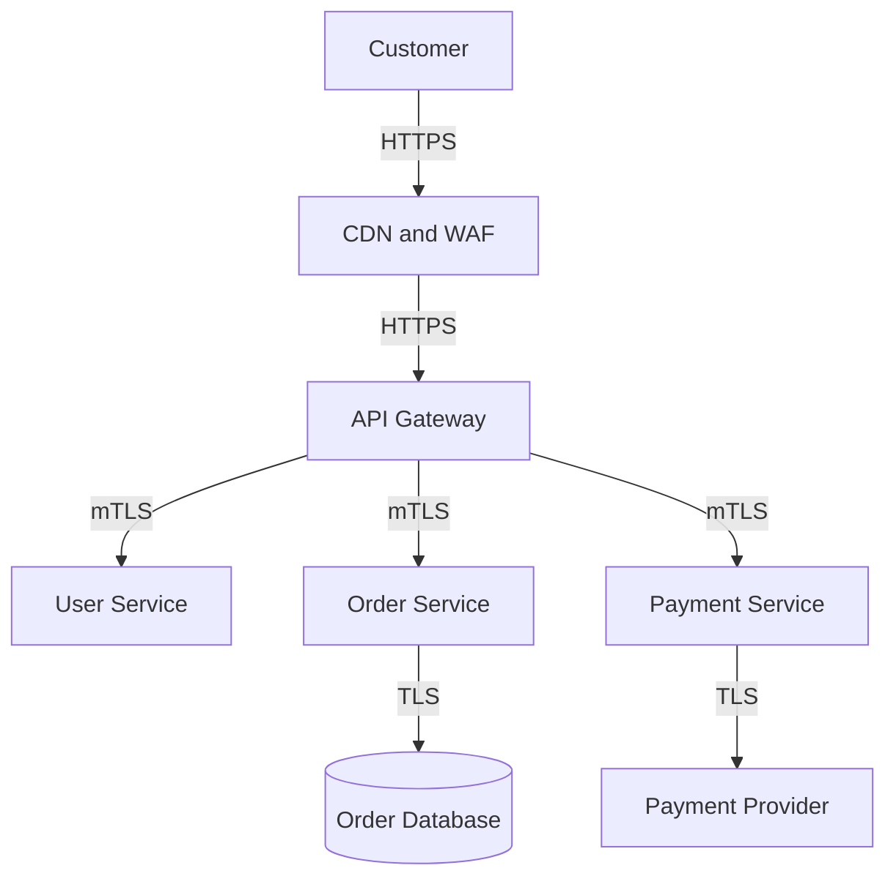

Every important network boundary is protected.

---

### Customer Login

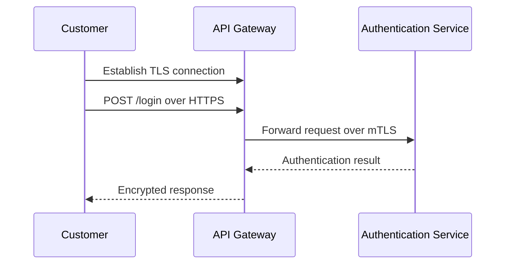

TLS protects credentials from being exposed during transmission.

The authentication service must still:

* Hash passwords securely
* Validate credentials
* Apply rate limits
* Protect sessions
* Enforce multi-factor authentication where required

TLS does not replace application security.

---

### Checkout Request

```http
POST /checkout HTTP/1.1
Host: api.store.example
Authorization: Bearer <token>
Content-Type: application/json
Idempotency-Key: order-9281-checkout-1
```

TLS protects the request while it travels across the network.

The API Gateway validates the public certificate connection, and internal services use mTLS for service identity.

---

### Payment Service Identity

The Payment service should accept requests only from approved internal identities.

```text
Order Service certificate:
Identity = order-service

Payment Service policy:
Allow order-service
Deny unknown-service
```

mTLS provides the service identity, while authorization rules decide whether that identity may perform the requested action.

---

### Certificate Renewal Incident

Imagine the public API certificate expires during a major sale.

Possible consequences include:

* Browsers showing security warnings
* Mobile applications rejecting API calls
* Checkout failures
* Monitoring alerts
* Lost revenue

A safer design includes:

```text
Automated certificate renewal
          +
Expiration monitoring
          +
Safe certificate reload
          +
Post-renewal validation
```

Automation should renew certificates before expiration and verify that the correct certificate is being served.

---

### Private-Key Compromise

If the API private key is exposed:

1. Revoke or replace the affected certificate.
2. Generate a new private key.
3. Install the replacement certificate.
4. Investigate how the key was exposed.
5. Rotate related credentials.
6. Review logs and certificate usage.
7. prevent the same storage or access issue from recurring.

Simply renewing the certificate while reusing the exposed key does not fully resolve the incident.

---

## Best Practices

### 1. Prefer TLS 1.3

Enable TLS 1.3 where clients support it.

Keep TLS 1.2 only when required for compatibility.

Disable:

* SSL 2.0
* SSL 3.0
* TLS 1.0
* TLS 1.1

---

### 2. Use Trusted Certificates

Use certificates issued by a trusted Certificate Authority for public systems.

For internal systems, use a properly managed private CA rather than untracked self-signed certificates.

---

### 3. Automate Certificate Issuance and Renewal

Manual certificate renewal is error-prone.

Automate:

* Domain validation
* Certificate issuance
* Certificate installation
* Service reload
* Renewal verification
* Expiration monitoring

---

### 4. Monitor Certificate Expiration

Create alerts well before expiration.

Example alert stages:

```text
30 days remaining → Warning
14 days remaining → High priority
7 days remaining  → Critical
```

Do not rely only on the renewal automation succeeding silently.

---

### 5. Protect Private Keys

Store private keys using:

* Hardware Security Modules
* Cloud key-management services
* Secret managers
* Encrypted files with strict permissions
* Dedicated certificate-management systems

Restrict access to the smallest possible set of identities.

---

### 6. Never Commit Private Keys to Git

Do not store private keys in:

* Public repositories
* Private repositories
* Git history
* Example configuration files
* Container build contexts

Even deleting a key in a later commit does not remove it from repository history.

Treat a committed private key as compromised.

---

### 7. Use Short-Lived Certificates

Short-lived certificates reduce the amount of time a compromised certificate remains valid.

They are especially useful for:

* Internal services
* Containers
* Service meshes
* Automated workloads

Short validity periods require reliable automation.

---

### 8. Rotate Keys

Certificate renewal does not always mean key rotation.

Generate new private keys periodically and after any suspected compromise.

Avoid reusing one private key across many unrelated services.

---

### 9. Use End-to-End Encryption

Do not assume that private-network traffic is automatically safe.

Use TLS between:

* CDN and origin
* Load balancer and application
* API Gateway and services
* Services and databases
* Services and message brokers
* Applications and external providers

---

### 10. Validate Backend Certificates

When a proxy connects to a backend over TLS, it should verify:

* The backend certificate
* The certificate chain
* The expected hostname or service identity
* Certificate validity

Encryption without validation can still allow machine-in-the-middle attacks.

---

### 11. Use mTLS for Sensitive Internal Communication

mTLS can strengthen machine-to-machine identity.

Good candidates include:

* Payment services
* Administrative APIs
* Database proxies
* Partner integrations
* Service-mesh traffic
* High-trust internal systems

Avoid introducing mTLS without planning certificate issuance, rotation, revocation, and observability.

---

### 12. Keep TLS Configuration Simple

Prefer secure platform defaults instead of creating large custom cipher lists.

Custom cryptographic configuration can accidentally:

* Enable weak algorithms
* Disable modern clients
* Create compatibility failures
* Prevent future upgrades

Use maintained security profiles from trusted platforms when possible.

---

### 13. Enable HSTS Carefully

HSTS prevents browsers from falling back to HTTP.

```http
Strict-Transport-Security: max-age=31536000; includeSubDomains
```

Before enabling a long duration:

* Confirm all required subdomains support HTTPS
* Test with a shorter duration
* Verify certificate automation
* Ensure HTTP redirects correctly
* Understand the impact of `includeSubDomains`

---

### 14. Redirect HTTP to HTTPS

Public web traffic arriving over HTTP should normally be redirected to HTTPS.

```http
HTTP/1.1 301 Moved Permanently
Location: https://example.com/
```

Sensitive information should never be accepted over the insecure HTTP connection before the redirect.

---

### 15. Use Secure Cookies

Authentication cookies should normally use:

```http
Set-Cookie: session=<value>; Secure; HttpOnly; SameSite=Lax
```

The `Secure` attribute ensures the browser sends the cookie only over HTTPS.

TLS alone does not prevent insecure cookie configuration.

---

### 16. Preserve the Original Protocol Safely

When TLS terminates at a proxy, the backend may need to know that the original client connection used HTTPS.

Example:

```http
X-Forwarded-Proto: https
```

Backends should trust this header only from approved proxy infrastructure.

---

### 17. Use Forward Secrecy

Use modern ephemeral key exchange such as ECDHE.

Forward secrecy reduces the impact of future private-key compromise on previously recorded traffic.

---

### 18. Configure Certificate Chains Correctly

Serve the complete chain required by clients.

A server should usually provide:

* Server certificate
* Required intermediate certificates

It should not depend on clients already having the intermediate certificate cached.

---

### 19. Test Multiple Client Types

Validate TLS behavior using:

* Modern browsers
* Mobile applications
* API clients
* Java applications
* Older supported devices
* Monitoring agents
* Partner systems

A configuration may work in one browser and fail in another client environment.

---

### 20. Use Secure Time Synchronization

Certificate validation depends on accurate system time.

Incorrect clocks can make valid certificates appear:

* Expired
* Not yet valid
* Invalid during verification

Monitor time synchronization across servers and devices.

---

### 21. Protect TLS Administration

Restrict access to:

* Certificate-management APIs
* DNS validation credentials
* Private CA systems
* Load-balancer configuration
* Secret stores
* Key-management systems

Use strong authentication, least privilege, and audit logs.

---

### 22. Separate Environments

Do not reuse production certificates and private keys in development or staging.

Use separate:

* Certificates
* Private keys
* Certificate Authorities
* Trust stores
* DNS validation credentials

This limits the impact of lower-environment compromise.

---

### 23. Audit Certificate Inventory

Maintain visibility into:

* Certificate hostname
* Owner
* Issuer
* Expiration date
* Deployment location
* Renewal mechanism
* Private-key location
* Environment
* Contact team

Unknown certificates are difficult to renew and secure.

---

### 24. Plan for Emergency Rotation

Document how to:

1. Revoke a certificate.
2. Generate a new key.
3. Issue a replacement certificate.
4. Deploy the replacement.
5. Reload affected services.
6. Verify all endpoints.
7. Roll back safely if needed.

Emergency procedures should be tested before an incident.

---

### 25. Measure TLS Performance

Monitor:

* Handshake latency
* Handshake failure rate
* TLS version usage
* Cipher usage
* Certificate-validation failures
* Session resumption rate
* CPU usage
* Connection count
* Certificate expiration

TLS performance problems should be separated from application latency.

---

## Common Mistakes

### 1. Using SSL or Deprecated TLS Versions

Enabling SSL 3.0, TLS 1.0, or TLS 1.1 exposes systems to known weaknesses and outdated cryptography.

Use modern TLS versions.

---

### 2. Disabling Certificate Validation

Some developers disable certificate checks to fix development errors.

Examples include:

```text
verify=false
rejectUnauthorized=false
insecureSkipVerify=true
```

This can allow an attacker to impersonate the destination server.

Fix the certificate or trust configuration instead.

---

### 3. Ignoring Hostname Validation

A certificate may be valid but issued for a different hostname.

The client must confirm that the requested hostname appears in the certificate's SAN list.

---

### 4. Using Self-Signed Certificates Without a Trust Model

Self-signed certificates are not automatically secure.

If clients do not securely receive and validate the correct certificate or CA, an attacker may substitute another certificate.

---

### 5. Committing Private Keys to Git

Removing the key from the latest version does not remove it from Git history.

Revoke or replace the certificate and generate a new key immediately.

---

### 6. Forgetting Intermediate Certificates

An incomplete certificate chain may work for some clients and fail for others.

Configure the full required certificate chain.

---

### 7. Allowing Certificates to Expire

Expired certificates can cause complete application outages.

Use automation, monitoring, and ownership alerts.

---

### 8. Renewing Certificates Without Reloading Services

The certificate file may be updated while the running server continues using the old certificate.

Ensure the application or proxy safely reloads the new certificate.

---

### 9. Reusing One Private Key Everywhere

A shared key across many services creates a large security impact if compromised.

Use separate keys based on system boundaries and risk.

---

### 10. Encrypting Only Public Traffic

Traffic inside a private network can still be exposed through:

* Misconfiguration
* Compromised workloads
* Insider threats
* Shared infrastructure
* Incorrect routing

Protect sensitive internal traffic with TLS.

---

### 11. Using TLS Without Authentication

Encrypting traffic while accepting any certificate protects against passive observation but not active impersonation.

Always validate the peer's identity.

---

### 12. Trusting Every Internal Certificate

A certificate proving that a service belongs to the organization does not mean the service should access every resource.

Combine identity with authorization policies.

---

### 13. Treating TLS as Complete Application Security

TLS does not prevent:

* SQL injection
* Broken authorization
* Cross-site scripting
* Weak passwords
* Malware
* Insecure business logic
* Data leaks after decryption

TLS protects data in transit, not the entire application.

---

### 14. Sending Sensitive Data in URLs

TLS encrypts URLs while in transit, but URLs may still appear in:

* Browser history
* Application logs
* Proxy logs
* Analytics platforms
* Monitoring tools

Avoid putting passwords, tokens, or personal data in query parameters.

---

### 15. Logging Decrypted Sensitive Data

TLS protects network traffic, but proxies and applications can see decrypted requests.

Do not log:

* Passwords
* Authorization tokens
* Session cookies
* Private keys
* Payment information
* Sensitive request bodies

---

### 16. Using 0-RTT for Unsafe Operations

TLS 1.3 early data may be replayed.

Do not use it for non-idempotent actions such as payments or order creation.

---

### 17. Ignoring Clock Problems

Incorrect system time can cause certificate validation and renewal failures.

Monitor time synchronization.

---

### 18. Terminating TLS and Sending Plaintext Across Untrusted Networks

TLS termination at the edge does not protect backend traffic.

Re-encrypt traffic when the network segment is not fully trusted.

---

### 19. Failing to Validate Backend Identity

A proxy may encrypt traffic to whichever backend answers without confirming its identity.

Validate the hostname, service name, or certificate identity.

---

### 20. Sharing Wildcard Certificates Too Broadly

Distributing one wildcard private key across many teams and servers increases the risk of exposure.

Prefer narrower certificates when isolation is important.

---

## Interview Questions

### 1. What does TLS provide?

TLS provides confidentiality, data integrity, and peer authentication for network communication.

---

### 2. Why does TLS use both asymmetric and symmetric encryption?

Asymmetric cryptography establishes identity and secure session keys. Symmetric encryption then protects application data efficiently.

---

### 3. What is the difference between TLS termination and TLS passthrough?

With termination, the proxy decrypts traffic and can inspect requests. With passthrough, the proxy forwards encrypted traffic and the backend performs the TLS handshake.

---

### 4. What is mutual TLS?

Mutual TLS requires both the client and server to present and validate certificates, providing two-way identity verification.

---

### 5. What happens during certificate validation?

The client checks the hostname, expiration date, signature, certificate chain, trusted issuer, and permitted certificate usage before trusting the server.

---

## Key Takeaways

### 1. TLS protects data while it travels

It encrypts communication, detects tampering, and helps clients verify that they are connected to the intended server.

### 2. Certificate management is an operational responsibility

Secure systems automate certificate issuance, renewal, rotation, monitoring, and emergency replacement.

### 3. Encryption without identity validation is incomplete

Clients, proxies, and services must verify certificates and combine TLS identity with appropriate authorization rules.

---

## Final Architecture Summary

```text
Users
  ↓ HTTPS
CDN / WAF
  ↓ HTTPS
Load Balancer
  ├── Certificate Management
  ├── TLS Termination
  ├── Secure Cipher Selection
  └── HTTP Routing
          ↓ HTTPS
      API Gateway
          ↓ mTLS
   Backend Services
          ↓ TLS
Database / Queue / External APIs
```

> TLS is not only about displaying a padlock in the browser. It is a core trust layer that protects communication between users, applications, services, and infrastructure.

---

⭐ **Star this repository** if this guide made SSL/TLS system design easier to understand.

👀 **Follow for more practical backend architecture, scalability, security, distributed systems, and system design guides.**
